# Agent Memory Breaks at the Boundaries

*Six places memory goes wrong, how FastAIAgent holds each one, and a proof you can run for every claim.*

*Part of the Agent Debugging Manifesto · the sequel to "Give Your Agent Memory It Won't Lie to You About" · requires FastAIAgent 1.82.0+*

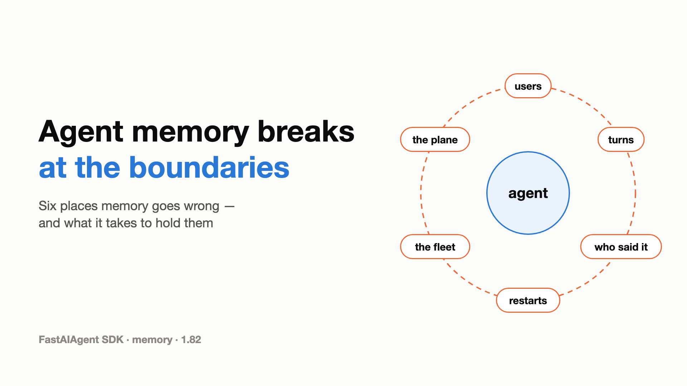

---

The last memory article was about seeing memory. Every recall and every write became a span in the trace, and every learned fact got a link back to the run that taught it.

Seeing memory is not the same as trusting it. Memory is the one part of an agent that edits every prompt, so it has to hold wherever two things meet:

- two users on one agent;
- one turn and the next;
- what the user said and what the model said;
- one process and the process that replaces it;
- a laptop and a fleet;
- your agent and a central plane.

Those six boundaries are where agent memory goes wrong.

This article explains how FastAIAgent's memory works, one boundary at a time. Each section has a diagram, the rule the SDK follows, and a proof script that runs against the published SDK: real models, real SQLite, Postgres and Redis, and a live plane. Every output and number below came out of one of those runs.

---

## First: memory is four things

"Memory" is four different things, and each lives somewhere different.

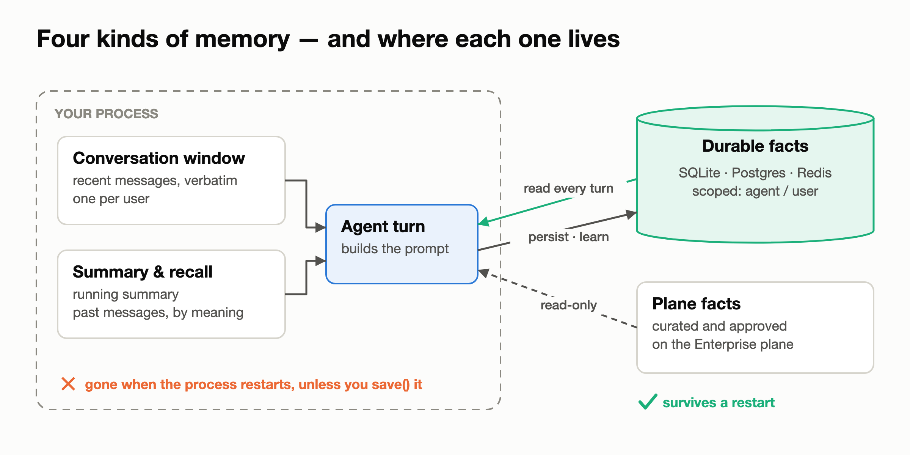
*The window and the in-conversation blocks live inside your process. Durable facts and plane facts live outside it, and they are the only ones that survive a restart.*

- **The conversation window**: the recent messages, verbatim, one window per user.
- **In-conversation blocks**: a running summary, and recall of past messages by meaning.
- **Durable facts**: short statements such as "Alice is on the Pro plan", kept in a fact store (SQLite by default, Postgres or Redis in production) and scoped to an agent or a user.
- **Plane facts**: facts a person curated and approved on the Enterprise plane. The SDK reads them and never writes them.

You declare all of it on one object:

```python
@dataclass
class Session:          # whatever your app keeps per run; the resolver reads it
    user_id: str

memory = Memory(
    agent_id="pet-shop",                    # the agent's own facts, shared by every user
    user_id=lambda ctx: ctx.state.user_id,  # a separate compartment per user
    learn=LLMClient(provider="openai", model="gpt-4.1-mini"),  # facts users state
)
agent = Agent(name="pet-shop", llm=llm, memory=memory)
agent.run("Biscuit is allergic to chicken.",
          context=RunContext(state=Session("dana@example.com")))
```

The rest of this article is what that object has to get right.

---

## 1 · Between turns: what one turn writes

Every turn has three steps. First, memory is read into the prompt. Then the model and its tools run. Last, the turn is written back to memory.

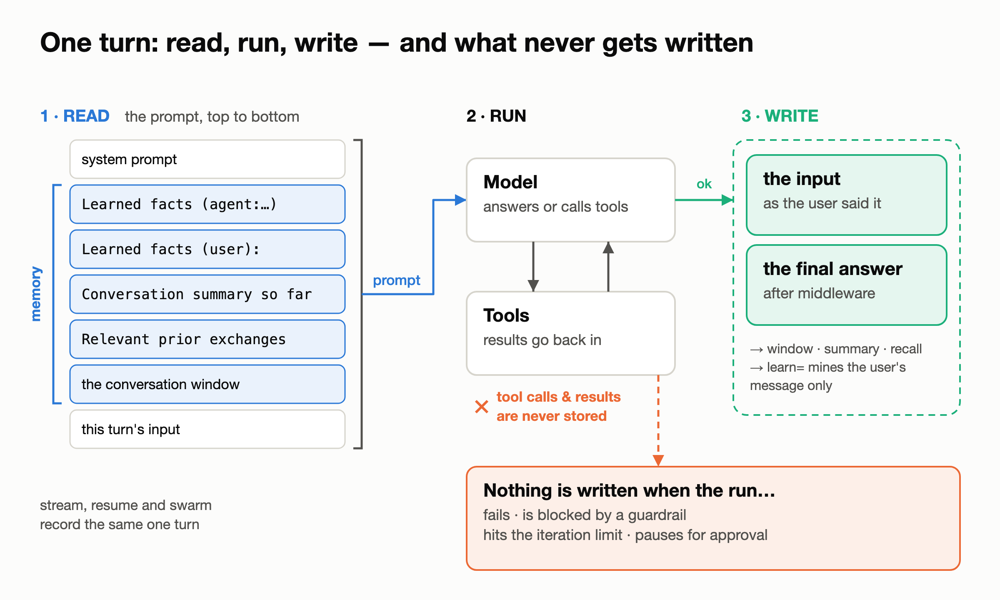
*The prompt is built top to bottom, with memory between the system prompt and the new input. The write happens only if the run succeeded, and tool traffic is never stored.*

**Read.** The prompt is assembled in a fixed order: the system prompt, the agent's facts, the user's facts, the summary, recalled messages, the conversation window, and finally this turn's input.

**Write.** The write happens once, at the end, and only if the run succeeded. Two messages are stored: the user's input and the final answer. Nothing is written when the run fails, is blocked by a guardrail, hits the iteration limit, or pauses for approval. Tool calls and tool results are never stored.

That rule has to hold on every path that reaches the write, not just `run()`:

- A resumed or forked run records the question it resumed.
- A swarm run is recorded once, however many hand-offs it took: the user's request and the final answer, with no hand-off text.
- `RedactPII` changes what the model is sent, not the user's words in memory. The stored reply is the one after middleware.
- A streamed turn stores exactly what `run()` would: the final reply, not text the model said before calling a tool.

Proof 1 runs a support agent against a real model:

```
turn 1 answer: 'Order 1042 was shipped on 12 September via DHL.'
memory after turn 1:
  user       Where is order 1042?
  assistant  Order 1042 was shipped on 12 September via DHL.
turn 2: blocked by no_refund_promises
✓ the blocked turn wrote nothing  — 2 messages, unchanged

a swarm run, one hand-off — memory:
  user       How much is my invoice INV-7?
  assistant  Invoice INV-7 is $42 and is due on 30 September.

sent to the model:  My email is [REDACTED]. Repeat my email address back to me exactly.
stored (run):       My email is jane.doe@example.com. Repeat my email address back…
stored (astream):   My email is jane.doe@example.com. Repeat my email address back…
```

The tool ran, and memory holds only the question and the answer. The blocked turn left memory unchanged. The swarm run is stored as one turn: the original request and the final answer. With `RedactPII`, the model is sent `[REDACTED]`, while memory keeps the user's words exactly as they were said. `run` and `astream` store the same thing.

---

## 2 · Between users: whose memory is it?

One agent serves many people. Each run carries a context, and a resolver reads the user from it. The resolver then routes the turn to that user's own compartment: their window, their summary, their facts, and their recall namespace.

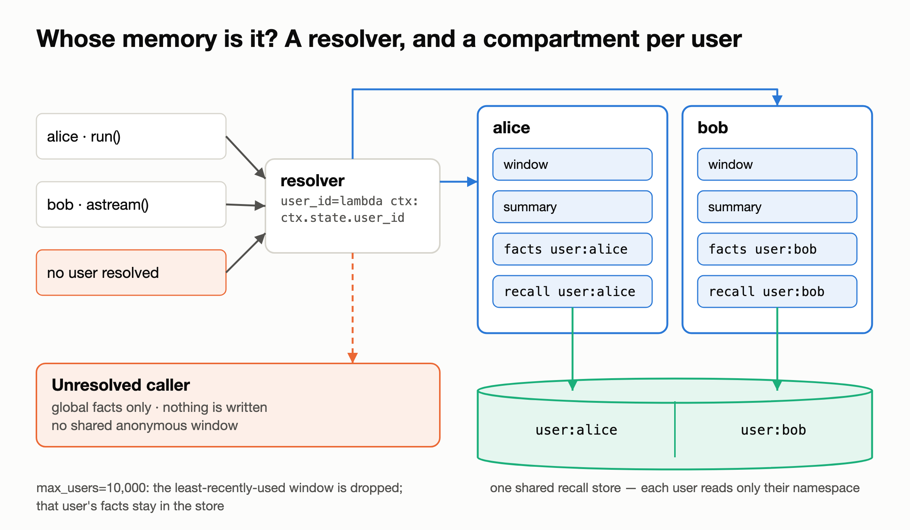
*One resolver sends each caller to their own compartment. Recall for every user can live in one shared store, split by namespace. A caller with no resolvable user gets the agent's global facts and nothing else.*

Three rules keep users apart:

- **An unresolved caller gets no conversation memory.** That covers no context, a `None` id, or a resolver that raises. The caller sees only the agent's global facts, and nothing it says is written. Anonymous callers never share a window.
- **A shared recall store is split by namespace.** Each user's recall lives under `user:<id>`, and the search over-fetches so that one busy user can't crowd out a quiet one.
- **Windows are bounded.** `max_users=10_000` keeps the most recently active users' windows and drops the least recently used. A dropped user keeps their durable facts and starts a fresh conversation.

Proof 2 puts Alice (streaming) and Bob (`run()`) on one agent with one shared recall store. The window is set to hold a single turn, so each member's class can only come back through recall:

```python
shared_recall = FaissVectorStore(dimension=384)
mem = Memory(
    agent_id="support-bot",
    user_id=lambda ctx: ctx.state.user_id,
    window=2,               # one turn verbatim; older turns only via recall
    recall=shared_recall,
)
```

```
shared recall store: 8 chunks, namespaces ['user:alice', 'user:bob']
alice → "You usually take the Tuesday 7am spin class, and you're on the Pro plan."
bob   → 'You usually take the Thursday evening yoga class and you are on the Free plan.'
✓ nothing of Bob's reached Alice's prompt
✓ nothing of Alice's reached Bob's prompt
no context  → "I don't have that information. You can check your class schedule…"
✓ no context: memory put no one's class in the prompt
✓ unresolved callers write nothing  — recall store still 12 chunks
```

One lesson from building this proof applies to every memory test you write. On an early run, the anonymous caller answered "You usually take the yoga class." That looks like a leak. The trace showed it wasn't: the prompt was only the system prompt and the question, and memory had injected nothing. The model guessed. **Test isolation on the prompt, not the answer.** The trace records exactly what the model was sent (`gen_ai.request.messages` on the `llm` span), so assert on that.

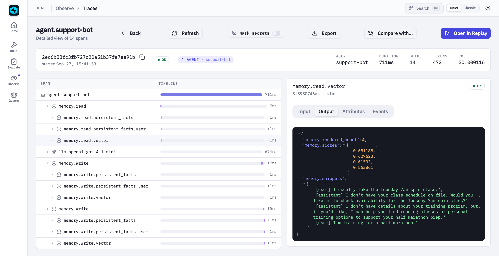
*Alice's streamed turn in the Local UI. Recall pulled four snippets from the shared store, all of them Alice's, with their scores. Her facts come from the `memory.read.persistent_facts.user` child just above it.*

---

## 3 · Between the user's words and the model's: what gets learned

Durable facts come from three places. The first is your code, through `persist()` and `update()`. The second is `learn=`, which extracts facts from each conversation as it happens. The third is `fastaiagent learn`, which mines past traces offline.

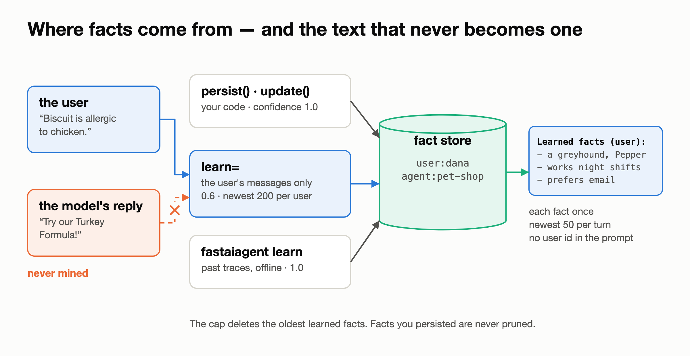
*Three producers write to one fact store. The model's replies are never mined. Each fact reaches the prompt once, under a heading that carries no user id.*

The boundary here is who said what. A model's reply is full of claims: suggestions, recommendations, guesses. None of them is a fact about the user. So:

- `learn=` reads only the user's messages; the model's replies are never mined. Each fact it stores is filed under that user at confidence 0.6, marked `learned`, and linked to the run that taught it.
- Each fact reaches the prompt once, under the heading `Learned facts (user):`. The heading carries no user id, so an email address used as an id never reaches the model provider.
- At most 10 facts are stored per message.
- A cap keeps each user's newest learned facts (200 by default) and deletes the rest. Facts you persisted yourself are never pruned, and the cap holds even with tracing off.

Proof 3 uses a deliberately chatty pet-shop agent that recommends a product and adds a fun fact in every reply:

```
what the extractor was shown
  • I have a beagle named Biscuit.
  • Biscuit is allergic to chicken.
  • I live in Lisbon and I work night shifts.
  • We just adopted a second dog, a greyhound called Pepper.
✓ the extractor never saw an assistant reply

the next turn's prompt:
  Learned facts (user):
  - The greyhound's name is Pepper.
  - The second dog is a greyhound.
  - User has adopted a second dog.
  - User works night shifts.
  - Dana prefers email over phone.
```

Four user messages produced four extractions. None of the assistant's product pitches, such as the "Beagle Buddy Chew Toy", became facts.

The proof set the cap to 4 to show it working, and it also shows the trade-off: **the cap keeps the newest facts, not the most important ones.** "Biscuit is allergic to chicken" was among the facts deleted. The default of 200 makes that unlikely, but keep facts that must never be forgotten as `persist()`ed facts.

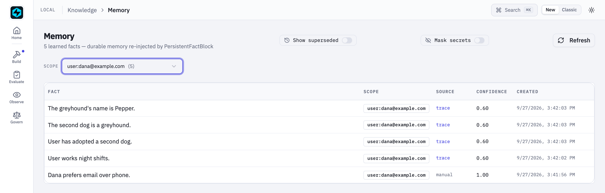
*The Local UI's Memory page, filtered to Dana. Four learned facts at 0.60, each linking back to the run that taught it. The fact persisted by hand is at 1.00, marked manual.*

---

## 4 · Between processes: restart and delete

Processes restart. The window and the `recall="auto"` index live in the process, so they go with it. Durable facts don't. The design rule behind this boundary: **the store is the source of truth, and every index is rebuilt from it.**

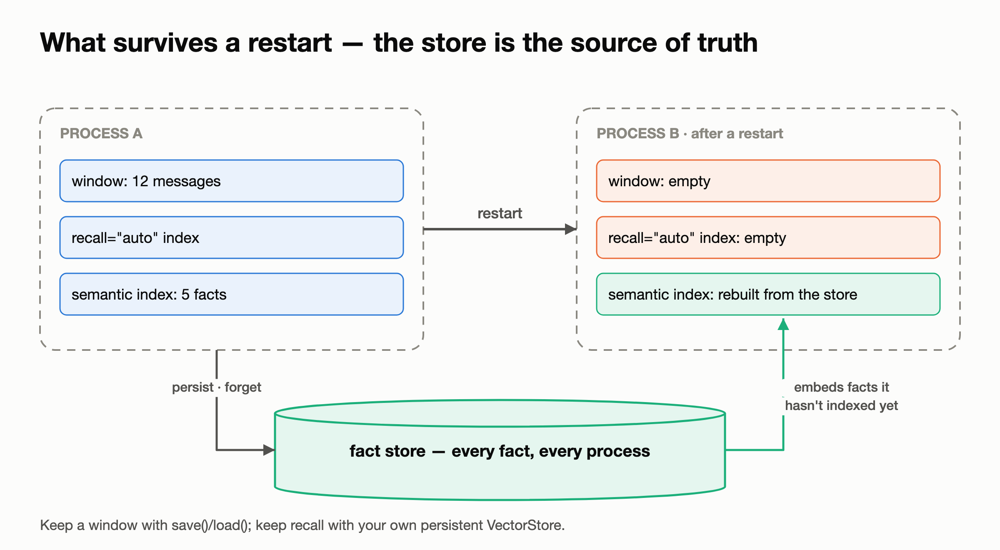
*After a restart, each semantic search first embeds any facts the new process hasn't indexed yet, straight from the store.*

Proof 4 needs no model. One process stores Alice's and Bob's facts, searches by meaning, deletes Bob, and searches again. A second, fresh process then searches the same store with an empty index:

```
writer · "What music does she like?"          → Alice plays saxophone in a jazz quartet.
forget(tier='user', id='bob')                 → 2 facts removed
writer · "What music does she like?"          → Alice plays saxophone in a jazz quartet.
reader · "What music does she like?"          → Alice plays saxophone in a jazz quartet.
reader · "Is there anything she can't eat?"   → Alice is allergic to peanuts.
```

Deleting Bob's facts rebuilt the index from the facts that remained, so Alice's search still finds the right fact. The fresh process found facts by meaning straight away, because each search first embeds whatever the store holds that its index doesn't.

If you need a window to survive a restart, `save()` and `load()` it. If you need recall to survive, pass your own persistent `VectorStore`.

---

## 5 · Between one laptop and a fleet

The same `Memory` API runs on SQLite, Postgres or Redis. Only `location=` changes. All three stores implement one contract, and a conformance suite checks it against real instances of each.

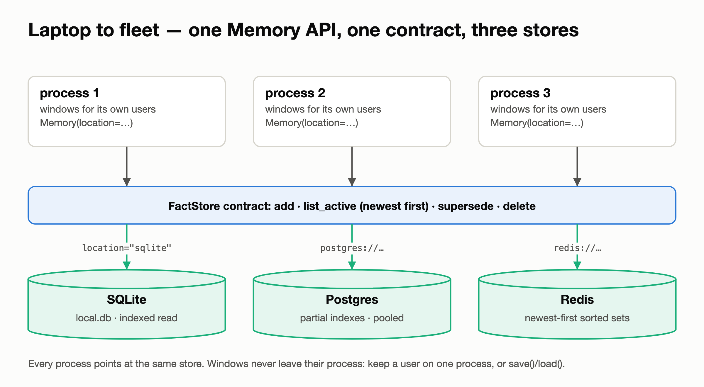
*Every process points at the same store. Conversation windows never leave their process.*

The boundary here is scale. Every turn reads a user's newest 50 facts. That read should cost what it returns, not what is stored. Proof 5 timed exactly that call, with 50, 500 and 5,000 facts stored for one user:

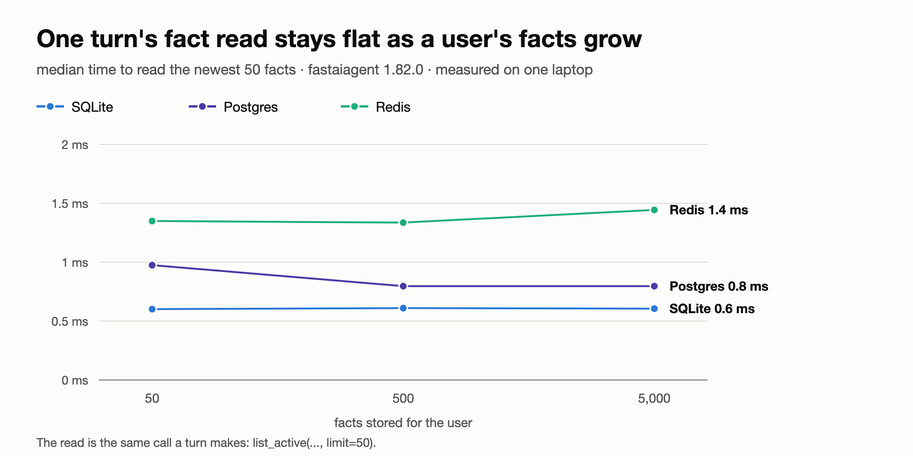
*A hundred times the facts, the same read: about 0.6 ms on SQLite, 0.8 ms on Postgres and 1.4 ms on Redis.*

How each store keeps the read bounded:

- **Redis** reads newest-first sorted indexes: one range read, then one pipelined fetch of just those facts.
- **Postgres** uses partial indexes that match the read, and a connection pool per process that is safe across forks such as `gunicorn --preload`.
- **SQLite** has an index that matches the read, so it stops after the newest 50.

The same proof runs the full lifecycle on all three stores: persist, update (the old fact is kept, marked superseded), retrieve, forget, and isolation. The code is identical for each:

```
✓ sqlite   persist → update → retrieve → forget, isolated
✓ postgres persist → update → retrieve → forget, isolated
✓ redis    persist → update → retrieve → forget, isolated
```

One thing doesn't scale out: the conversation window lives in one process. Keep a user on one process, or `save()` and `load()` their window.

---

## 6 · Between your agent and the plane

Some facts shouldn't come from one conversation. Refund policy and support hours are examples. On the Enterprise plane, a person curates and approves those facts centrally, and every connected agent reads them.

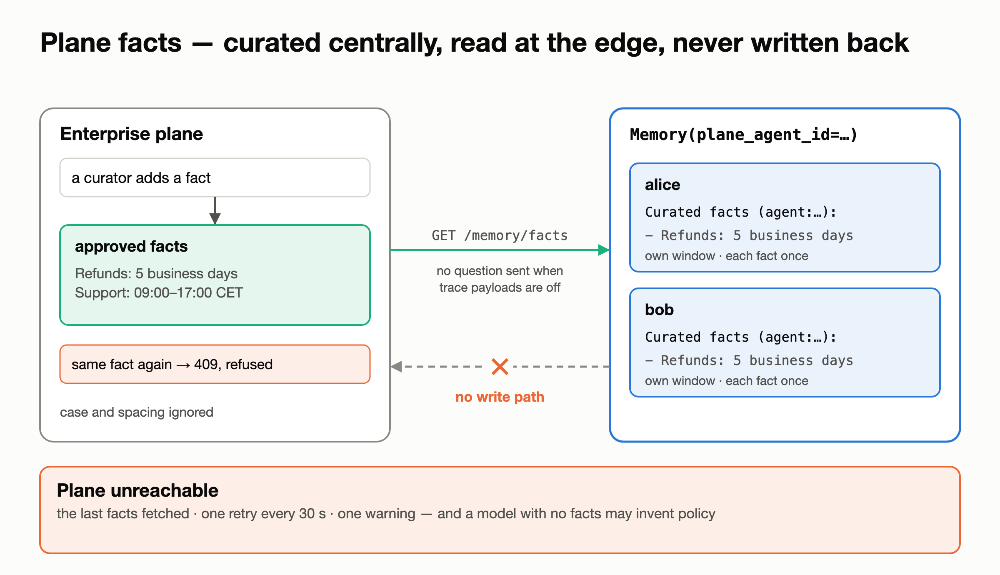
*Facts are curated on the plane and read at the edge. There is no path to write them back.*

One keyword gives every user the plane's facts while each user keeps their own window:

```python
memory = fa.Memory(user_id=lambda ctx: ctx.state.user_id, plane_agent_id=agent_id)
```

The read path is deliberately narrow:

- It's a read. The SDK has no call that writes a fact to the plane.
- With `FASTAIAGENT_TRACE_PAYLOADS=0`, the user's question is not sent with the read.
- Each fact is injected once, even if the plane serves a duplicate.
- If the plane is unreachable, the SDK serves the last facts it fetched, retries every 30 seconds, and logs one warning per outage rather than one per turn.

Proof 6 runs against a live plane:

```
the plane serves 2 approved facts
maria  How long do refunds take?
       → Refunds are processed within 5 business days.
tom    When can I reach support?
       → You can reach support Monday to Friday from 09:00 to 17:00 CET.
✓ the plane holds exactly what the curator added  — 2 facts before and after the runs
```

Then the same agent runs with the plane unreachable, in a fresh process that never fetched anything:

```
maria  How long do refunds take?
       → Refunds typically take 5-7 business days to process.
tom    When can I reach support?
       → You can reach support 24/7 for assistance.
maria  And when is support open?
       → Support is open Monday to Friday, 9 AM to 6 PM local time.
one warning for the outage:
  PlaneFactBlock refresh failed: … serving the last facts fetched and retrying every 30s
```

The agent answered every turn and logged one warning, which is what "degradable" promises. But look at the answers: it invented a refund window, then told Tom support is 24/7 and told Maria it closes at 6 PM. **Degradable means the agent keeps running. It does not mean the agent stays right.** If a fact is policy, tell the model to say it doesn't know when curated facts are missing, or treat a missing plane as a reason to hand the question to a person.

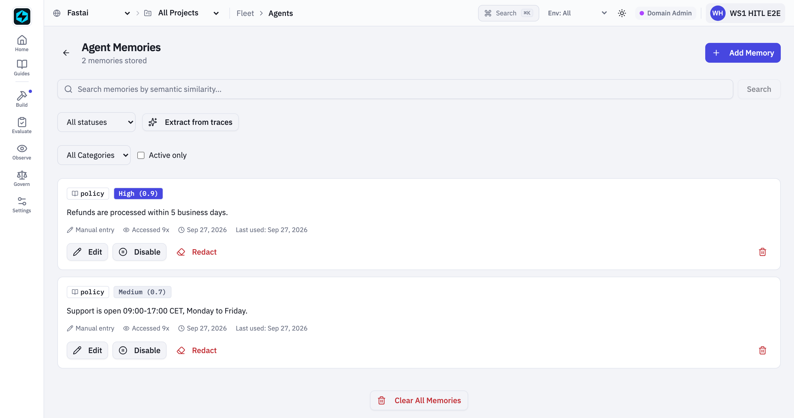
*On the plane: the two policy facts a curator approved for this agent.*

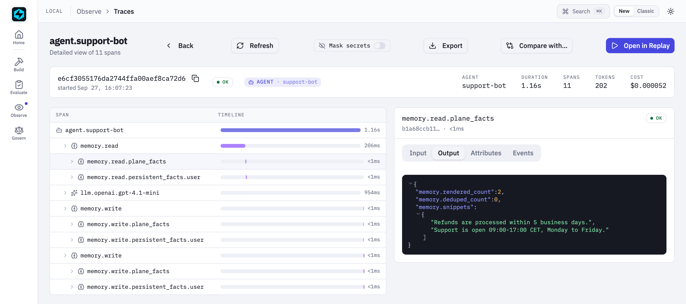
*At the edge: the same two facts in the turn's `memory.read.plane_facts` span, with `rendered_count` 2 and `deduped_count` 0.*

---

## Where memory bugs hide

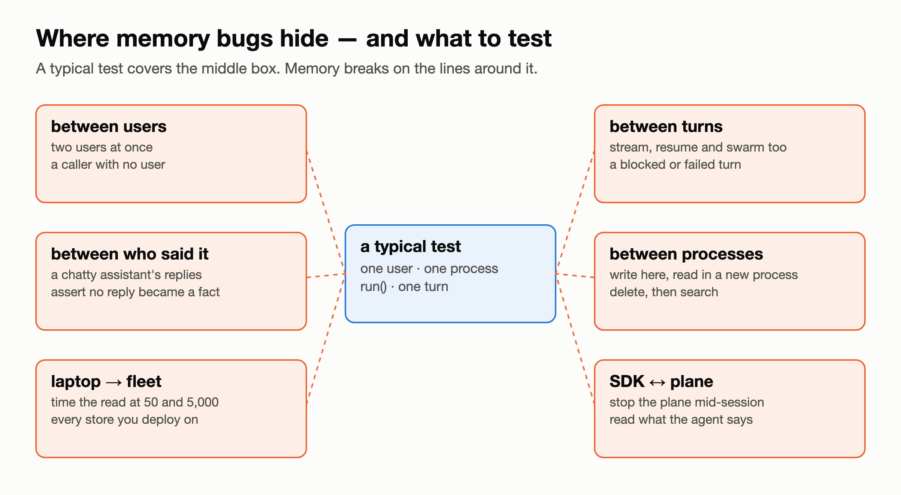
*A typical test covers one user, in one process, through `run()`, for one turn. Memory breaks on the lines around that box.*

Most memory tests exercise one thing in isolation: one user, one process, `run()`, one turn. Memory breaks between those things. If you build or buy agent memory, test the boundaries:

1. **Two users at once, through every entry point**: `run`, streaming, resume and swarm. Include a caller with no user at all.
2. **Assert on the prompt, not the answer.** A model with an empty prompt will still guess.
3. **Look at who said it.** Feed a chatty assistant and check that no reply becomes a fact.
4. **Cross a process.** Write in one process and read in another. Delete, then search.
5. **Grow the data.** Time the read at 50 facts and at 5,000.
6. **Take the dependency away.** Stop the plane, stop the store, and read what the agent says.

Each of those checks is a script in this article's companion folder.

---

## What memory still won't do for you

- **Windows live in one process.** Keep a user on one process, or `save()` and `load()` their window. `recall="auto"` is in-process too; pass your own `VectorStore` to keep recall across restarts.
- **The learned-fact cap keeps the newest facts, not the most important.** Persist what must never be forgotten.
- **User facts belong to the user, not to an agent.** Two agents on the same store and project see the same user facts. If they shouldn't, give each its own `project_id`.
- **`learn=` has no PII filter.** It stores what users say about themselves. If that matters, redact before the input reaches the agent.
- **A missing plane means missing facts.** As proof 6 showed, the model may fill the gap by inventing.
- **Memory blocks run synchronously inside a run.** An extraction call holds the turn while it runs.

---

## The point of all of it

Memory is the one part of an agent that edits every prompt. That's why it has to be both visible and trustworthy. The last article made it visible. This one walked the six boundaries where it has to hold.

The split between the SDK and the plane stays the same. The SDK runs your agent's memory, in your process, on your database. The plane curates the facts a person should approve and serves them read-only. Everything in this article, except the plane itself, is in the open-source SDK.

Test your own memory the same way. The bugs aren't where your unit tests look; they're on the boundaries.

---

*FastAIAgent is an open-source agent harness with Agent Replay, crash-proof durability, and a local-first UI. `pip install fastaiagent` → [github.com/fastaifoundry/fastaiagent-sdk](https://github.com/fastaifoundry/fastaiagent-sdk)*
