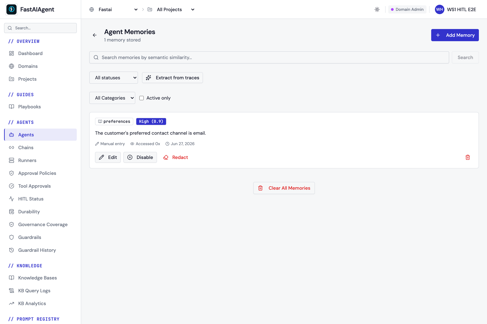
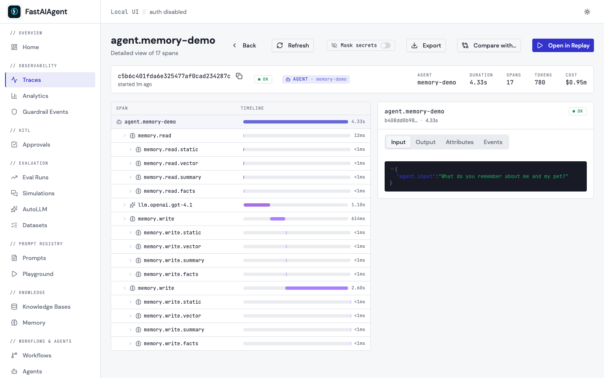
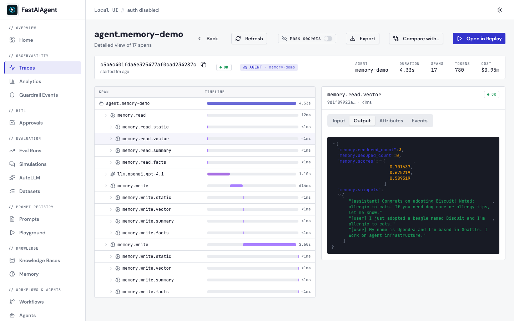
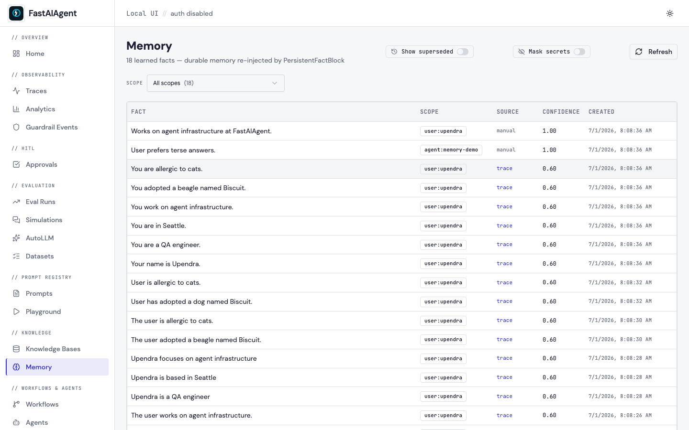
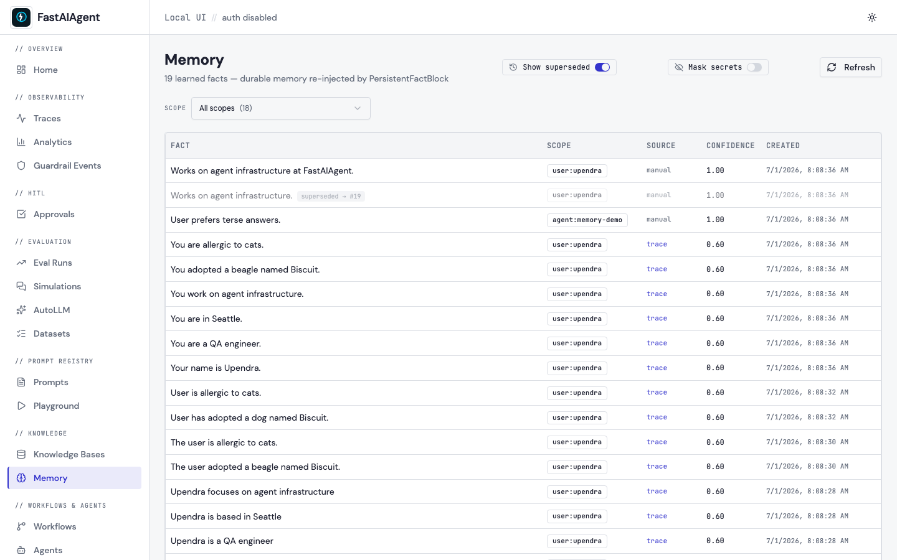

# Agent Memory

Memory lets agents remember previous conversations across multiple `run()` calls. Two flavors ship in the SDK:

| | `AgentMemory` | `ComposableMemory` |
|---|---|---|
| Since | 0.1.x | 0.4.0 |
| Stores | Sliding window of raw messages | Sliding window **plus** any number of long-term blocks |
| Best for | Chatbots, short sessions | Long-running assistants, personal memory, fact tracking |
| Drop-in replacement | — | Yes — `Agent(memory=...)` accepts either |

If you were using `AgentMemory` before, no code changes are needed. Swap to `ComposableMemory` when a sliding window is no longer enough.

## Sliding-window memory: `AgentMemory`

```python
from fastaiagent import Agent, LLMClient
from fastaiagent.agent import AgentMemory

memory = AgentMemory(max_messages=20)

agent = Agent(
    name="assistant",
    system_prompt="Remember what users tell you. Be brief.",
    llm=LLMClient(provider="openai", model="gpt-4.1"),
    memory=memory,
)

agent.run("My name is Alice.")
result = agent.run("What's my name?")
print(result.output)  # "Your name is Alice."
```

### How it works

1. On each `run()` call, the agent prepends stored messages to the conversation.
2. After the agent responds, the new user message and assistant response are added to memory.
3. If `max_messages` is reached, the oldest messages are dropped (FIFO).

### Persistence

```python
memory.save("memory.json")

new_memory = AgentMemory()
new_memory.load("memory.json")

agent = Agent(name="assistant", llm=..., memory=new_memory)
result = agent.run("What's my name?")  # "Your name is Alice."
```

### Configuration

| Parameter | Type | Default | Description |
|-----------|------|---------|-------------|
| `max_messages` | `int` | `20` | Maximum number of messages to retain |

---

## Long-term memory: `ComposableMemory` + blocks

`ComposableMemory` wraps a primary `AgentMemory` sliding window with a list of **memory blocks** that contribute SystemMessage fragments to every turn:

```
┌───────────────────────────────────────────────┐
│  ComposableMemory.get_context(query)          │
│                                               │
│    ← SystemMessage(s) from block[0].render    │
│    ← SystemMessage(s) from block[1].render    │
│    ← SystemMessage(s) from block[n].render    │
│    ← primary window (last N messages)         │
└───────────────────────────────────────────────┘
```

### Quick start

```python
from fastaiagent import Agent, LLMClient
from fastaiagent.agent import (
    ComposableMemory, AgentMemory,
    StaticBlock, SummaryBlock, VectorBlock, FactExtractionBlock,
)
from fastaiagent.kb.backends.faiss import FaissVectorStore

llm = LLMClient(provider="openai", model="gpt-4o-mini")

memory = ComposableMemory(
    blocks=[
        StaticBlock("The user's name is Upendra and they prefer terse answers."),
        SummaryBlock(llm=llm, keep_last=10, summarize_every=5),
        VectorBlock(store=FaissVectorStore(dimension=384, index_type="flat")),
        FactExtractionBlock(llm=llm, max_facts=100),
    ],
    primary=AgentMemory(max_messages=20),
)

agent = Agent(name="assistant", llm=llm, memory=memory)
```

Each block is optional and independently useful. Use only what you need.

## Built-in blocks

### `StaticBlock`

A fixed system-level fact, injected on every turn. Zero state, zero LLM calls.

```python
StaticBlock("The user's timezone is UTC+1. Today's date is 2026-04-18.")
```

### `SummaryBlock`

Maintains a rolling LLM-generated summary of older turns. Refreshes every `summarize_every` messages, summarizing everything older than `keep_last`.

```python
SummaryBlock(
    llm=llm,
    keep_last=10,       # never summarize the N most recent messages
    summarize_every=5,  # refresh cadence
    max_chars=800,      # soft cap on summary length
)
```

**When to use**: long conversations that otherwise blow the context window. Cheaper than re-embedding everything, but introduces one extra LLM call every `summarize_every` turns.

### `VectorBlock`

Semantic recall over past messages. Each incoming message (above `min_content_chars`) is embedded and stored in a [`VectorStore`](../knowledge-base/backends.md). On each turn, the query is embedded and the top-k most similar past messages are surfaced.

```python
from fastaiagent.kb.backends.faiss import FaissVectorStore

VectorBlock(
    store=FaissVectorStore(dimension=384, index_type="flat"),
    top_k=5,
    namespace="default",       # tag so multiple blocks can share a store
    min_content_chars=10,      # skip trivial messages ("ok", "yes")
)
```

Any backend implementing the `VectorStore` protocol works — `FaissVectorStore` (default), `QdrantVectorStore`, `ChromaVectorStore`, your own. See [KB Backends](../knowledge-base/backends.md).

**When to use**: conversations that span days or sessions, where long-ago facts should be retrievable by meaning, not just recency.

`VectorBlock` also accepts `dedupe_against_upstream=True` — see [Shared memory context](#shared-memory-context) — to skip recalling anything an earlier block already put in the prompt.

#### Memory scoring (recency + importance) — v1.9.0 { #memory-scoring }

By default `VectorBlock` ranks retrieval results by cosine similarity
alone. That works fine for short sessions but breaks in two recurring
ways for long-running agents:

1. **Old correct answer drowns out new correct answer.** The user said
   in turn 5 *"my email is alice@old.com"*. In turn 50 they corrected
   themselves: *"actually, alice@new.com"*. Both messages are about
   email — both score high on similarity to *"what's my email?"*. The
   older one wins half the time because there's nothing differentiating
   them.
2. **Trivial chatter outranks load-bearing facts.** The user said *"I'm
   a vegetarian"* once. They've then said *"ok"*, *"thanks"*, *"yes"*
   twenty times. A query like *"what should I order for dinner?"* has
   higher similarity to the *"ok"* / *"thanks"* cluster than to that one
   important fact, and the agent forgets the constraint.

Three optional knobs fix both. Defaults are zero, so existing
`VectorBlock(store=...)` calls keep their current behaviour byte-for-byte:

```python
VectorBlock(
    store=...,
    top_k=5,
    recency_weight=0.3,                 # 0.0–1.0
    importance_weight=0.2,              # 0.0–1.0
    recency_half_life_seconds=3600.0,   # 1 hour, exponential decay
)
```

Retrieval becomes a weighted sum of three signals:

```
final_score = (1 - recency_weight - importance_weight) * cosine_similarity
            + recency_weight    * exp(-age_seconds / half_life)
            + importance_weight * importance
```

- **`cosine_similarity`** — what's there today. Range ~0–1.
- **`recency`** — exponential decay from the chunk's `created_at`. With
  `half_life=3600s`, a message 1 hour old contributes 0.5; 2 hours old,
  0.25; a week old, ~0.
- **`importance`** — read from the chunk's `metadata['importance']`
  (default `1.0` if not set). For `PersistentFactBlock`, this is sourced
  from the `confidence` column on `learned_memory`, so facts the LLM
  extracted with high confidence outrank uncertain ones.

##### Worked example

Three stored messages, all matching *"what's my email?"*:

| Message | similarity | age | importance |
|---|---|---|---|
| A: "my email is alice@old.com" | 0.85 | 7 days | 0.5 (likely superseded) |
| B: "actually it's alice@new.com" | 0.80 | 1 hour | 1.0 |
| C: "thanks!" | 0.30 | 5 min | 1.0 |

**Today** (similarity-only, both new weights = 0): A wins (0.85 > 0.80 > 0.30). Wrong answer.

**With `recency_weight=0.3, importance_weight=0.2`** and a 1-hour
half-life:

```
A:  0.5*0.85 + 0.3*exp(-604800/3600) + 0.2*0.5  ≈ 0.425 + ~0.000 + 0.10 = 0.525
B:  0.5*0.80 + 0.3*exp(-3600/3600)   + 0.2*1.0  ≈ 0.400 + 0.110  + 0.20 = 0.710
C:  0.5*0.30 + 0.3*exp(-300/3600)    + 0.2*1.0  ≈ 0.150 + 0.276  + 0.20 = 0.626
```

B wins — the right answer surfaces. C ranks high on recency but its low
similarity prevents it from outranking B.

##### Tuning

- **Customer-support bot, current state matters most**: `recency_weight=0.4`,
  `recency_half_life_seconds=1800` (30 min). The most recent user message
  almost always reflects current intent.
- **Research assistant, old facts still relevant**: `recency_weight=0`,
  `importance_weight=0.3`. Don't decay; let importance differentiate.
- **Long-running personal assistant**: `recency_weight=0.2`,
  `importance_weight=0.3`, `recency_half_life_seconds=86400` (1 day).
  Slow decay, importance-aware.

##### Where `importance` comes from

- `VectorBlock` reads `chunk.metadata['importance']` if set, defaults to
  `1.0`. To stamp it, attach `importance` to your `Message` before
  feeding it through memory (the block reads `getattr(message,
  "importance", None)` in `_make_chunk`).
- `PersistentFactBlock` reads the existing `confidence` column on
  `learned_memory` rows. Facts produced by `fastaiagent learn` carry an
  LLM-judged confidence; high-confidence facts naturally rank higher.

**Backward compatibility**: with both weights at zero (the default),
behaviour is byte-identical to v1.8.x — the scorer short-circuits and
returns the input order unchanged.

### `FactExtractionBlock`

Uses a cheap LLM to extract durable facts from each user/assistant message and stores them as a dedup'd list. Renders as a bullet-point `Known facts: …` SystemMessage.

```python
FactExtractionBlock(
    llm=llm,            # use a fast model (gpt-4o-mini, claude-haiku)
    max_facts=200,      # cap; oldest drop on overflow
    extract_every=1,    # run extraction every N messages
)
```

**When to use**: user-focused assistants where you want stable facts ("user is allergic to peanuts", "user's kids are named Maya and Omar") to persist independently from the conversation log.

#### Persisting facts across runs (`persist=True`)

By default `FactExtractionBlock` holds facts only for the current conversation. Set `persist=True` to also write each **newly extracted** fact to the durable `learned_memory` table *during the run* — so it survives restarts and can be read back later by [`PersistentFactBlock`](#persistentfactblock). This closes the loop without needing the offline [`fastaiagent learn`](../cli/learn.md) job.

```python
FactExtractionBlock(
    llm=llm,
    persist=True,           # write new facts to learned_memory during the run
    scope="user",           # 'user' | 'project' | 'agent'
    scope_id="upendra",     # REQUIRED when persist=True
    confidence=0.6,         # stamped on auto-facts; below curated 1.0 so they sort lower
)
```

Each persisted fact is stamped with the **current trace id** as `source_trace_id`, so the [Memory page](#the-memory-page) shows a clickable link back to the run that produced it. Writes are idempotent (the store's uniqueness constraint dedupes) and failure-isolated (a store error logs and the run continues). Because it now writes an external store mid-run, `isolated_copy()` raises `MemoryIsolationError` when `persist=True` — the same guard as `VectorBlock` — so `fastaiagent.optimize` candidates don't bleed writes.

This is the runtime-write counterpart to the read-only `PersistentFactBlock`: extract-and-persist on the way in, read-back on future runs. You can still write facts directly with `MemoryStore.add(Fact(...))` (source stays `NULL` / "manual").

### `PersistentFactBlock`

Read-only block that loads facts from the `learned_memory` table — populated offline by [`fastaiagent learn`](../cli/learn.md), the [Trace Learning Loop](../learning/memory-loop.md). Carries durable facts **across runs**, where `FactExtractionBlock` only carries them within a single conversation.

```python
from fastaiagent.agent.memory_blocks import PersistentFactBlock

PersistentFactBlock(
    scope="agent",                # 'user' | 'project' | 'agent'
    scope_id="my-agent",          # identifier within scope
    project_id="",                # optional project filter
    max_facts=50,                 # newest-first cap
    refresh_every=1,              # re-query store every N renders (1 = always)
    # v1.9.0: optional scoring on top of `list_active`'s newest-first order.
    # Defaults are 0.0 — historical behaviour preserved.
    recency_weight=0.0,           # 0.0–1.0
    importance_weight=0.0,        # 0.0–1.0; importance ← learned_memory.confidence
    recency_half_life_seconds=86400.0,  # 1 day; facts decay slower than messages
)
```

`PersistentFactBlock` honours the same `recency_weight` /
`importance_weight` model documented under [`VectorBlock` →
Memory scoring](#memory-scoring). Importance is sourced from the
existing `confidence` column on `learned_memory`.

**When to use**: long-running agents that should accumulate operational knowledge across sessions ("the writer should always cite token-cost claims", "this user prefers reports under 800 words"). Pair with `fastaiagent learn` to populate the underlying table from past traces.

**Pairs with**: `FactExtractionBlock` for the in-conversation extraction; `PersistentFactBlock` for the cross-conversation re-injection. Both can live in the same `ComposableMemory`.

### `PlaneFactBlock` (connected central memory)

Read-only block that reads **curated, human-approved** facts from a connected [Enterprise plane](../platform/index.md) via `GET /public/v1/memory/facts`, and injects them at the start of each turn. Where `PersistentFactBlock` reads facts from the **local** `learned_memory` table, `PlaneFactBlock` reads the **governed/curated** facts the plane serves — the read side of central governed memory. The plane extracts durable facts from already-ingested traces and a human curates them; the SDK only **reads** (there is no SDK fact-push path).

```python
import fastaiagent as fa
from fastaiagent import Agent, AgentMemory, ComposableMemory
from fastaiagent.agent.memory_blocks import PlaneFactBlock, PersistentFactBlock

fa.connect(api_key="fa-...", target="https://your-plane.example.com")

memory = ComposableMemory(
    primary=AgentMemory(),
    blocks=[
        PlaneFactBlock(
            agent_id="my-agent-id",   # the agent's id on the plane (required)
            category=None,            # optional category filter
            max_facts=50,             # cap per turn (1..200)
            query_conditioned=True,   # pass the user input for semantic recall
            score_threshold=0.0,      # min similarity for query-conditioned recall
            refresh_every=1,          # re-read the plane every N renders (raise to cache)
        ),
        PersistentFactBlock(scope="agent", scope_id="my-agent"),  # local facts too (optional)
    ],
)
agent = Agent(name="support", system_prompt="...", llm=llm, memory=memory)
```

**Read-only and degradable.** When the SDK is not connected, the plane is unreachable, or the domain isn't entitled (`403`), `PlaneFactBlock` injects nothing and the agent runs normally — central facts are an enhancement, never a dependency. The read is a bounded start-of-run network GET (like `VectorBlock`'s search), cached per `refresh_every`; it never pushes anything. The plane runs no agent code — it serves facts; recall and injection happen locally.

**When to use**: connected (Enterprise) deployments that want a single governed, curated knowledge base shared across a fleet of agents, with central redaction / right-to-be-forgotten. See [Connected central memory](../platform/index.md) and the [memory loop](../learning/memory-loop.md).

**Pairs with**: `PersistentFactBlock` (local facts) — compose both to merge local + central knowledge in one `ComposableMemory`.

The curated facts the block reads are managed on the plane's **Agent Memories** page — created or approved by a human (or extracted from traces), with redaction / right-to-be-forgotten:



A runnable end-to-end example is in `examples/87_connected_memory.py`.

## Composing blocks

Block order matters — they render in declaration order, and the resulting SystemMessages appear in the prompt in that order. Typical ordering:

1. `StaticBlock` — hard facts that never change
2. `SummaryBlock` — what has happened so far
3. `FactExtractionBlock` — what we know about the user
4. `VectorBlock` — relevant past exchanges

Followed by the primary sliding window's recent messages.

## Shared memory context

Blocks render in declaration order, and each block can optionally read **what the earlier blocks already produced this turn**. `ComposableMemory` passes a `SharedMemoryContext` down the chain — a minimal one-directional pipe (not a full graph): block N sees the output of blocks 1..N-1, never the reverse.

Sharing is **opt-in and backward-compatible**. The base method delegates to `render`, so blocks that only implement `render(query)` — including custom and third-party blocks — are unaffected:

```python
class MemoryBlock:
    def render_with_context(self, query, shared):
        return self.render(query)          # default: ignore upstream
```

A block that wants upstream output overrides `render_with_context` and reads from `shared`:

```python
shared.upstream_text()          # concatenated content of all earlier blocks
shared.by_block("static")       # messages from a specific earlier block
shared.upstream_messages()      # everything upstream, in order
```

**Shipped consumer — `VectorBlock(dedupe_against_upstream=True)`.** When enabled, `VectorBlock` drops any recalled message whose content an earlier block already injected (e.g. a `StaticBlock` pin or an extracted fact), so you don't spend tokens saying the same thing twice. Matching is a conservative normalized substring test — it only drops clear duplicates. The `memory.read.vector` span reports `deduped_count` so you can see how many were skipped. Off by default; `VectorBlock` behaviour is unchanged unless you set the flag.

Only block output flows through the pipe — the raw primary window is appended afterwards and is not shared.

## Persistence

`ComposableMemory.save(path)` writes to a directory:

```
path/
  ├── primary.json              # sliding window
  └── blocks/
      ├── summary.json          # SummaryBlock state
      ├── facts.json            # FactExtractionBlock state
      └── static.json           # (no-op for StaticBlock; file omitted)
```

`load(path)` restores into the same blocks, matched by `block.name`. You must reconstruct the blocks (with the same `llm` / `store` / `embedder`) before calling `load` — blocks that hold live resources (LLM clients, vector stores) are not themselves serialized.

```python
memory.save("/var/state/agent-alice")
# ... later, new process ...
memory = ComposableMemory(blocks=[SummaryBlock(llm=...), FactExtractionBlock(llm=...)])
memory.load("/var/state/agent-alice")
```

## Writing your own block

Subclass `MemoryBlock` and implement `on_message` and `render`:

```python
from fastaiagent.agent import MemoryBlock
from fastaiagent.llm.message import Message, SystemMessage


class MoodBlock(MemoryBlock):
    """Tracks the user's emoji reactions and pins the latest mood."""

    name = "mood"

    def __init__(self):
        self.latest_mood = ""

    def on_message(self, message: Message) -> None:
        content = message.content or ""
        for emoji in ("🎉", "😡", "😊", "😢"):
            if emoji in content:
                self.latest_mood = emoji

    def render(self, query: str):
        if not self.latest_mood:
            return []
        return [SystemMessage(f"User's latest mood: {self.latest_mood}")]
```

Then just drop it into `ComposableMemory(blocks=[MoodBlock(), ...])`.

If your block holds persistent state worth saving, override `save(path)` and `load(path)`. See [`fastaiagent/agent/memory_blocks.py`](https://github.com/fastaifoundry/fastaiagent-sdk/blob/main/fastaiagent/agent/memory_blocks.py) for the shipped implementations.

## Observability — seeing what the agent remembered

Memory is no longer a black box at runtime. Every turn, the read and write are wrapped in trace spans with a **child span per block**, so you can open a trace and see *which block recalled what, and why* — the same way you already read KB `retrieval.*` spans.

- **`memory.read`** (one per turn) — `memory.block_count`, `memory.message_count`, and the `memory.query`. One **`memory.read.<block>`** child per rendering block carries `memory.rendered_count`, bounded `memory.snippets` of what it injected, and — for `VectorBlock` — `memory.scores` (per-item similarity in rank order) plus `memory.deduped_count` when [upstream dedupe](#shared-memory-context) is on. This is the difference between "memory recalled something" and "memory recalled the *wrong* thing, score 0.71".
- **`memory.write`** (one per stored message) — one **`memory.write.<block>`** child per block with a `memory.action` (`embedded`, `summarized`, `extracted_facts`, `stored`, `noop`) and a `memory.detail` count (e.g. `facts_extracted`, and `persisted` when [`persist=True`](#persisting-facts-across-runs-persisttrue)).



Click the `memory.read.vector` child to see the recalled items and their scores:



These spans nest under the agent span automatically and are **no-ops when tracing is off** — memory behaves exactly as before, with no extra embedding or LLM calls. Snippets and query text honor `FASTAIAGENT_TRACE_PAYLOADS=0` and any installed [`RedactionPolicy`](../security.md) (the "Mask secrets" toggle), since memory content can contain PII.

### The Memory page

The Local UI (`fastaiagent ui`) has a **Memory** page (sidebar → Knowledge → Memory) that browses the `learned_memory` table — the durable facts [`PersistentFactBlock`](#persistentfactblock) reads back across runs. Filter by scope, trace a fact's source, and toggle masking:



Each row is one durable fact:

| Column | Meaning |
|---|---|
| **Fact** | The stored statement, e.g. *"Has a beagle named Biscuit; allergic to cats."* This is the `fact` text a `PersistentFactBlock` injects into a matching agent's prompt. |
| **Scope** | Rendered as `scope:scope_id` (e.g. `user:upendra`). `scope` is one of `user` / `project` / `agent`; `scope_id` is the identifier within it (a user id, a project key, or an agent name). A block reading `PersistentFactBlock(scope="user", scope_id="upendra")` will pick up exactly the `user:upendra` rows. |
| **Source** | Where the fact came from. A **`trace`** link jumps to the run that produced it (facts persisted by `FactExtractionBlock(persist=True)` carry the run's trace id as `source_trace_id`). **`manual`** = inserted directly via `MemoryStore.add`. |
| **Confidence** | The `confidence` column (0–1); also drives `importance_weight` ranking. Auto-extracted facts default to `0.6`, curated/manual to `1.0`, so provenance is visible at a glance. |
| **Created** | When the fact was written. |

**Scope filter** — the dropdown lists every `scope:scope_id` partition (users, projects, and agents — memory is not agent-only) with counts, plus "All scopes".

**History** — toggle **Show superseded** to include facts that a newer version replaced. Superseded rows render muted with a `superseded → #id` marker pointing at the row that replaced them (facts are versioned by append + `supersede(old, new)`, never overwritten).



**Where do these rows come from?** Three ways: (1) `FactExtractionBlock(persist=True)` writes them **during a run** (with a source trace); (2) the offline [`fastaiagent learn`](../cli/learn.md) [Trace Learning Loop](../learning/memory-loop.md) mines them from past traces; (3) you insert them directly with `MemoryStore.add(Fact(...))` (source = `manual`). The `scope`/`scope_id` values are whatever the producer assigned — they are not auto-detected from conversation.

Per-turn live memory (what a block recalled *this turn*, with scores) lives in the trace's `memory.read` spans above; the Memory page shows the durable facts that persist between runs.

Reproduce all three views with `examples/memory_observability/` (`companion.py` seeds a trace, `snapshot.py` captures the UI).

## Safety

Each block runs inside a try/except inside `ComposableMemory`. A failing block is logged and skipped — it cannot break the agent run. Individual block state survives across the failure.

## Future work

Async parallel methods (`aon_message`, `arender`) are planned as an additive 0.5.x feature. The sync API shipped in 0.4.0 will not break when the async methods are added — same pattern as `Agent.run` / `Agent.arun`.

---

## Next Steps

- [Agents](index.md) — Core agent documentation
- [KB Backends](../knowledge-base/backends.md) — `VectorStore` backends used by `VectorBlock`
- [Middleware](middleware.md) — Transform agent messages and responses (complements memory)
- [Tracing](../tracing/index.md) — Debug agent execution with traces
- `examples/customer-support-agent/` — `AgentMemory` wired into a REPL so support sessions retain context across turns.
