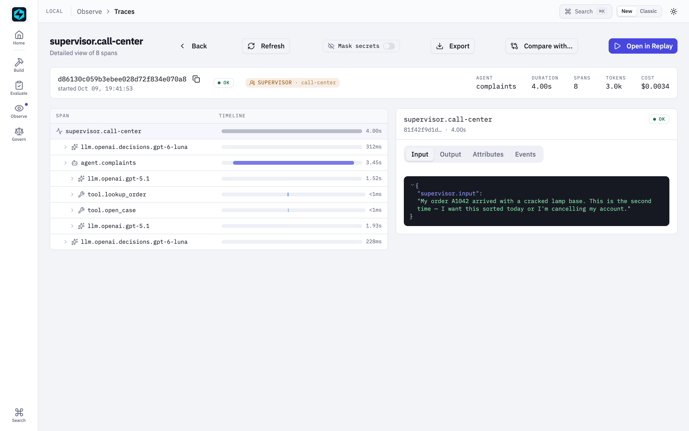
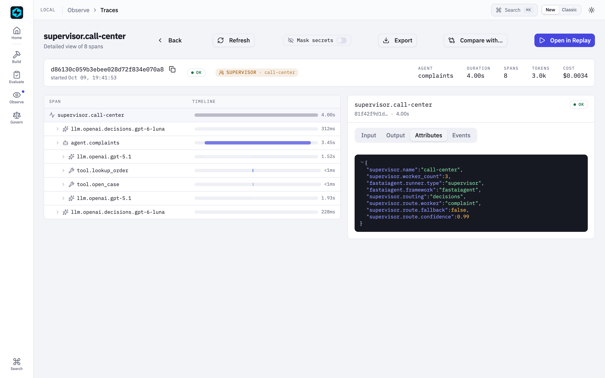

# Multi-Agent Teams

FastAIAgent ships two multi-agent topologies:

- **Supervisor / Worker** (this page) — a centralized LLM delegates to specialist workers and synthesizes their outputs. Hub-and-spoke.
- **[Swarm](swarm.md)** — peer-to-peer mesh where each agent decides when to hand off control to another. No coordinator.

Use **Supervisor** when a central LLM should orchestrate and synthesize results. Use **Swarm** when the routing decision belongs to the specialist itself, or when you want a looping workflow like `writer ↔ critic` without a hub in the middle. See the [Swarm vs Supervisor comparison](swarm.md#swarm-vs-supervisor-when-to-use-which) for a full decision matrix.

## Supervisor / Worker Pattern

A supervisor agent delegates tasks to specialized worker agents. This pattern is useful when different parts of a task require different expertise, models, or tool sets.

## Supervisor / Worker Pattern

```python
from fastaiagent import Agent, LLMClient, Supervisor, Worker

researcher = Agent(
    name="researcher",
    system_prompt="Research topics thoroughly. Return facts only.",
    llm=LLMClient(provider="openai", model="gpt-4.1"),
)

writer = Agent(
    name="writer",
    system_prompt="Write clear, concise content from research.",
    llm=LLMClient(provider="anthropic", model="claude-sonnet-4-6"),
)

supervisor = Supervisor(
    name="team-lead",
    llm=LLMClient(provider="openai", model="gpt-4.1"),
    workers=[
        Worker(agent=researcher, role="researcher", description="Finds facts"),
        Worker(agent=writer, role="writer", description="Writes content"),
    ],
)

result = supervisor.run("Write a summary of AI trends in 2025")
print(result.output)
```

## How It Works

1. The supervisor receives the user's request
2. It decides which worker(s) to delegate to, based on the task and worker descriptions
3. Each worker executes independently with its own tools, LLM, and guardrails
4. The supervisor combines worker outputs into a final response

## Worker Configuration

Each `Worker` wraps an agent with metadata that helps the supervisor decide when to use it:

| Parameter | Type | Description |
|-----------|------|-------------|
| `agent` | `Agent` | The worker agent instance |
| `role` | `str` | A short label (e.g., "researcher", "writer"). Used as tool name: `delegate_to_{role}` |
| `description` | `str` | What this worker does -- helps the supervisor route tasks. Defaults to first 200 chars of system prompt |

## Mixed Providers

Workers can use different LLM providers. The supervisor picks the right worker regardless of backend:

```python
supervisor = Supervisor(
    name="team-lead",
    llm=LLMClient(provider="openai", model="gpt-4.1"),
    workers=[
        Worker(
            agent=Agent(name="fast-agent", llm=LLMClient(provider="openai", model="gpt-4.1-mini"), system_prompt="Quick answers."),
            role="quick-responder",
            description="Handles simple, fast questions",
        ),
        Worker(
            agent=Agent(name="deep-agent", llm=LLMClient(provider="anthropic", model="claude-sonnet-4-6"), system_prompt="Thorough analysis."),
            role="analyst",
            description="Handles complex analysis tasks",
        ),
    ],
)
```

## Passing Context to Workers

`RunContext` flows from the supervisor through to all worker agents and their tools. This lets worker tools access shared runtime dependencies like database connections, user sessions, and configuration.

```python
from dataclasses import dataclass
from fastaiagent import Agent, LLMClient, RunContext, Supervisor, Worker, tool


@dataclass
class TeamState:
    db: DatabaseClient
    user_id: str
    company: str


@tool(name="get_user_tickets")
def get_user_tickets(ctx: RunContext[TeamState], status: str) -> str:
    """Get support tickets for the current user."""
    tickets = ctx.state.db.query("tickets", user_id=ctx.state.user_id, status=status)
    return str(tickets)


@tool(name="get_billing_info")
def get_billing_info(ctx: RunContext[TeamState], account_id: str) -> str:
    """Get billing details."""
    return ctx.state.db.query("billing", account_id=account_id)


support_agent = Agent(name="support", system_prompt="Handle support tickets.", llm=llm, tools=[get_user_tickets])
billing_agent = Agent(name="billing", system_prompt="Handle billing queries.", llm=llm, tools=[get_billing_info])

supervisor = Supervisor(
    name="customer-service",
    llm=llm,
    workers=[
        Worker(agent=support_agent, role="support", description="Manages support tickets"),
        Worker(agent=billing_agent, role="billing", description="Handles billing queries"),
    ],
)

# Context flows to both workers and their tools
ctx = RunContext(state=TeamState(db=get_db(), user_id="u-456", company="Acme"))
result = supervisor.run("Show my open tickets and latest invoice", context=ctx)
```

## Streaming

Stream the supervisor's output in real-time. Worker delegation appears as `ToolCallStart` / `ToolCallEnd` events, and the supervisor's synthesized response streams as `TextDelta` events.

### Async streaming

```python
from fastaiagent import TextDelta
from fastaiagent.llm.stream import ToolCallStart, ToolCallEnd

async for event in supervisor.astream("Help with my order", context=ctx):
    if isinstance(event, TextDelta):
        print(event.text, end="", flush=True)
    elif isinstance(event, ToolCallStart):
        print(f"\n  [Delegating to {event.tool_name}...]", end="")
    elif isinstance(event, ToolCallEnd):
        print(" [done]", end="")
```

### Sync streaming

Collects the full stream into an `AgentResult`:

```python
result = supervisor.stream("Help with my order", context=ctx)
print(result.output)
print(result.trace_id)   # the supervisor.<name> root span for this run
```

Since 1.67.0 `stream()` opens its own `supervisor.<name>` root span, so a
streamed run renders as one trace and its result carries a `trace_id` — `run()`
and `arun()` always had one by inheriting it from the inner agent, and the
stream path built its result by hand and inherited nothing.

Since 1.68.0 that hand-built result also carries `tokens_used`, `cost` and
`cost_known`. All three used to come back at their defaults, so a streamed
supervisor run looked free while the identical `arun()` reported real numbers.

!!! info "A supervisor's tokens and cost are the **supervisor's own** turns"
    A delegated worker runs through `Agent.arun()` inside a `delegate_to_<role>`
    tool. That call opens its own accumulator and reports its spend on its own
    `AgentResult` — so a worker's tokens are counted once, there, and are **not**
    re-counted on the supervisor's result.

    This is a scope boundary, not a missing number, and it is the same one `run()`
    and `arun()` have always had: `cost` took it in 1.67.0 and `tokens_used` takes
    it in 1.68.0. To get a team-wide total, sum the supervisor's figure with each
    worker's — do not expect the supervisor's alone to be it. (A `Swarm` differs:
    hops are peers of one run, so `Swarm` sums across them.)

## Dynamic Instructions

Customize the supervisor's behavior per request using callable prompts. The callable receives the `RunContext` (or `None` if no context is passed).

```python
supervisor = Supervisor(
    name="adaptive-lead",
    llm=llm,
    workers=[support_worker, billing_worker],
    system_prompt=lambda ctx: (
        f"You are the customer service lead for {ctx.state.company}. "
        f"The customer ({ctx.state.user_id}) has a {ctx.state.plan} plan.\n"
        + ("PRIORITY: This is an enterprise customer. Resolve quickly.\n"
           if ctx.state.plan == "enterprise" else "")
        + "Delegate to the appropriate worker and synthesize a helpful response."
    ),
)

ctx = RunContext(state=TeamState(company="Acme", user_id="u-1", plan="enterprise"))
result = supervisor.run("I need help with billing", context=ctx)
```

## Hierarchical process — manager validates worker outputs

By default the supervisor delegates to workers and synthesizes their
returns into a final answer, but it never re-checks the worker's output.
For tasks where worker quality varies — vague answers, missing details,
off-topic drift — pass `validate_outputs=True` and the supervisor LLM
will inspect each worker's output before accepting it. On rejection the
worker is re-invoked once with the manager's feedback appended to the
original task.

```python
supervisor = Supervisor(
    name="manager",
    llm=LLMClient(provider="openai", model="gpt-4o-mini"),
    workers=[researcher, writer],
    validate_outputs=True,                  # opt in
    max_validation_retries_per_worker=1,    # default
    # validation_prompt=...                  # optional custom template
)
```

How it works:

1. Worker runs as normal and returns its output.
2. Supervisor LLM is asked to review (cheap call — small JSON output):
   approve, or reject with feedback.
3. If approved, the worker's output is fed back into the supervisor's
   tool loop as today.
4. If rejected and a retry is available, the worker re-runs with the
   feedback appended to its task. Capped at
   `max_validation_retries_per_worker` retries (default `1`).
5. If still rejected after retries are exhausted, the supervisor proceeds
   with the worker's last output and writes a `guardrail_events` row
   tagged `supervisor.validate` / `outcome=warned` so the failure is
   auditable in the local UI's Guardrails page.

**Failure modes are fail-open**: a malformed validator response (unparseable
JSON), a network error, or any exception in the validation step is treated
as approval. The manager loop should not crash a working agent because the
validator misbehaved.

**Customizing the prompt**: the default validation prompt is suitable for
most tasks. To override, pass `validation_prompt` with two named
placeholders — `{task}` and `{output}`. The validator must return strict
JSON: `{"approved": true}` or `{"approved": false, "feedback": "..."}`.

### Reviewing workers with the Decisions API

*New in 1.84.0.* `validation_mode="decisions"` replaces the review chat call with
one [Decisions API](../llm/decisions.md) predicate: "the worker output is a
complete, correct, and on-topic answer to the original task". The task and output
are sent as evidence. The supervisor approves when the probability meets
`validation_threshold`. Otherwise the worker retries with feedback that names
the probability.

```python
supervisor = Supervisor(
    name="manager",
    llm=LLMClient(provider="openai", model="gpt-4o-mini"),
    workers=[researcher, writer],
    validate_outputs=True,
    validation_mode="decisions",
    validation_llm=LLMClient(model="gpt-6-luna"),   # the default
    validation_threshold=0.5,                        # the default
)
```

- **Same retry cap, audit row and fail-open behaviour** as the chat review. A
  failed call, or a refusal, approves the output with a warning.
- **Set the criterion with `validation_criteria=`**, a statement. The default is
  "the worker output directly addresses what the original task asks, stays on
  topic, and is a complete reply". `validation_prompt` is the chat-mode
  equivalent and isn't used here.
- **Ask what the reviewer can actually judge.** It sees the task and the output,
  not the worker's tool results. A criterion like "the facts are correct" scores
  good answers low and triggers needless retries, and a retry re-runs the
  worker's tools.
- **Bad settings fail at construction.** An unknown `validation_mode`, a blank
  `validation_criteria`, or a threshold outside 0..1 raises `ValueError`.

## Routing with the Decisions API — `routing="decisions"`

*New in 1.84.0.* A `Supervisor` picks workers in one of two ways:

| | `routing="tools"` (default) | `routing="decisions"` |
|---|---|---|
| Supervisor | a chat model (`llm=`) | OpenAI's [Decisions API](../llm/decisions.md) (`router_llm=`, default `gpt-6-luna`) |
| How it picks | calls `delegate_to_<role>` tools, possibly several, in any order | one `decide()` call picks **exactly one** worker |
| The answer | the supervisor's own synthesis of what the workers returned | the worker's reply, unchanged; no synthesis turn |
| Best for | multi-step work: decompose, call several workers, combine | single-hop routing: support queues, triage, intake |

Tool calls are the right mechanism when the supervisor has to *plan*. It writes
each worker's sub-task as the tool argument, then writes the final answer. When
the job is only "which queue owns this?", that's a classification. A chat model
answering it costs a full turn, plus a synthesis turn that rewrites the worker's
reply, and it can call no tool at all. `routing="decisions"` answers it with a
probability:

```python
from fastaiagent.agent import Supervisor, Worker
from fastaiagent.llm import LLMClient, Predicate, Score

desk = Supervisor(
    name="call-center",
    workers=[complaints, products, general],      # Worker(role=..., description=..., agent=...)
    routing="decisions",
    router_llm=LLMClient(model="gpt-6-luna"),     # the default
    fallback_worker="other",                      # where a refused / unsure route goes
    routing_min_confidence=0.6,
    routing_questions={                           # asked in the SAME request as the route
        "urgent": Predicate(instructions="The customer needs an answer today."),
        "mood": Score(instructions="How upset is the customer?", levels=["Calm", "Frustrated", "Angry"]),
    },
    validate_outputs=True,                        # optional review, as above
    validation_mode="decisions",
    validation_criteria="The agent's reply directly addresses what the customer asked and tells the customer the next step.",
)
result = desk.run("My order A1042 arrived broken — sort it out today!")
result.output                    # the complaints worker's reply
result.route.worker              # "complaint"
result.route.confidence          # 0.99
result.route.answers.predicates["urgent"].probability   # 0.99
```

- **The workers' `role`s and `description`s are the router's options.** Write
  each description the way you'd brief a colleague on which queue owns what.
- **A refusal, or a confidence below `routing_min_confidence`, goes to
  `fallback_worker`.** The router never guesses a specialist. `fallback_worker`
  is required, and the router needs at least two workers with distinct roles.
- **`routing_questions` ride along in the same `decide()` call.** The worker gets
  their answers as a short note after the task (`[Supervisor routing note]
  urgent: yes (p=0.99); mood: Angry`), and they're on `result.route.answers`.
- **`result.route`** is a `SupervisorRoute`: `worker`, `chosen`, `confidence`,
  `fallback`, `answers`, `latency_ms`, `cost_usd` and `reviews` (one review score
  per attempt). The routing call's cost and tokens are added to
  `result.cost` / `result.tokens_used`.
- **Streaming** opens with a `HandoffEvent` naming the worker, then streams the
  worker's own tokens. With `validate_outputs`, the reviewed reply arrives as one
  `TextDelta`, so a rejected draft is never streamed.
- **Resume continues the worker that paused, with no re-route.** Asking the router
  again could pick someone else.
- **Tracing**: one `supervisor.<name>` span carries `supervisor.routing`,
  `supervisor.route.worker`, `.confidence` and `.fallback`, with the
  `llm.openai.decisions.gpt-6-luna` and worker spans nested under it.
- **`llm=` isn't used for routing in this mode.**

In the Local UI, a routed run reads as route → worker → review:





See [`106_call_center_supervisor.py`](https://github.com/fastaifoundry/fastaiagent-sdk/blob/main/examples/106_call_center_supervisor.py).
Its `--compare` flag runs the same tickets through both modes. The same routing
as a Chain graph is in
[`107_call_center_chain.py`](https://github.com/fastaifoundry/fastaiagent-sdk/blob/main/examples/107_call_center_chain.py).

## API Reference

### `Supervisor`

```python
Supervisor(
    name: str,
    llm: LLMClient | None = None,
    workers: list[Worker] | None = None,
    system_prompt: str | Callable[[RunContext | None], str] = "",
    max_delegation_rounds: int = 3,
    checkpointer: Checkpointer | None = None,
    validate_outputs: bool = False,
    validation_prompt: str | None = None,
    max_validation_retries_per_worker: int = 1,
    validation_mode: str = "chat",          # "decisions" — 1.84.0
    validation_llm: LLMClient | None = None,  # decisions mode; default gpt-6-luna
    validation_threshold: float = 0.5,      # decisions mode
    validation_criteria: str | None = None, # decisions mode: the review statement
    routing: str = "tools",                 # "decisions" — 1.84.0
    router_llm: LLMClient | None = None,    # decisions routing; default gpt-6-luna
    fallback_worker: str | None = None,     # required with routing="decisions"
    routing_min_confidence: float = 0.0,
    routing_questions: dict[str, Predicate | Choice | Score] | None = None,
    routing_instructions: str | None = None,  # the routing Choice's question
)
```

| Parameter | Type | Required | Description |
|-----------|------|----------|-------------|
| `name` | `str` | Yes | Supervisor name |
| `llm` | `LLMClient \| None` | No | LLM for the supervisor (defaults to OpenAI gpt-4o-mini) |
| `workers` | `list[Worker] \| None` | No | Workers available for delegation |
| `system_prompt` | `str \| Callable` | No | Custom instructions. If omitted, auto-generates from worker descriptions |
| `max_delegation_rounds` | `int` | No | Max delegation rounds (default: 3, translates to `max_iterations * 2`) |
| `validate_outputs` | `bool` | No | (v1.9.0) When `True`, supervisor LLM reviews each worker output |
| `validation_prompt` | `str \| None` | No | (v1.9.0) Override the default validator prompt; must include `{task}` and `{output}` placeholders |
| `max_validation_retries_per_worker` | `int` | No | (v1.9.0) Max retries per delegate after rejection (default `1`) |

**Methods:**

| Method | Signature | Description |
|--------|-----------|-------------|
| `run()` | `(input, *, context=None) -> AgentResult` | Synchronous execution |
| `arun()` | `(input, *, context=None) -> AgentResult` | Async execution |
| `stream()` | `(input, *, context=None) -> AgentResult` | Sync streaming (collects result; carries `trace_id`, guardrail firings, and since 1.68.0 `tokens_used` / `cost` / `cost_known`) |
| `astream()` | `(input, *, context=None) -> AsyncGenerator[StreamEvent]` | Async streaming |
| `resume()` | `(execution_id, *, resume_value=None, context=None) -> AgentResult` | Resume a paused or crashed run |

All methods accept `context: RunContext | None` which is forwarded to all worker agents and their tools.

### `Worker`

```python
Worker(
    agent: Agent,
    role: str = "",
    description: str = "",
)
```

| Parameter | Type | Required | Description |
|-----------|------|----------|-------------|
| `agent` | `Agent` | Yes | The worker agent |
| `role` | `str` | No | Role name (defaults to `agent.name`). Used as tool name: `delegate_to_{role}` |
| `description` | `str` | No | What this worker does (defaults to first 200 chars of system prompt) |

---

## Next Steps

- [Agents](index.md) -- Core agent documentation
- [Context & Dependency Injection](../tools/context.md) -- RunContext details
- [Streaming](../streaming/index.md) -- Streaming architecture
- [Dynamic Instructions](dynamic-instructions.md) -- Callable system prompts
- [Chains](../chains/index.md) -- For more complex multi-step workflows beyond supervisor/worker
