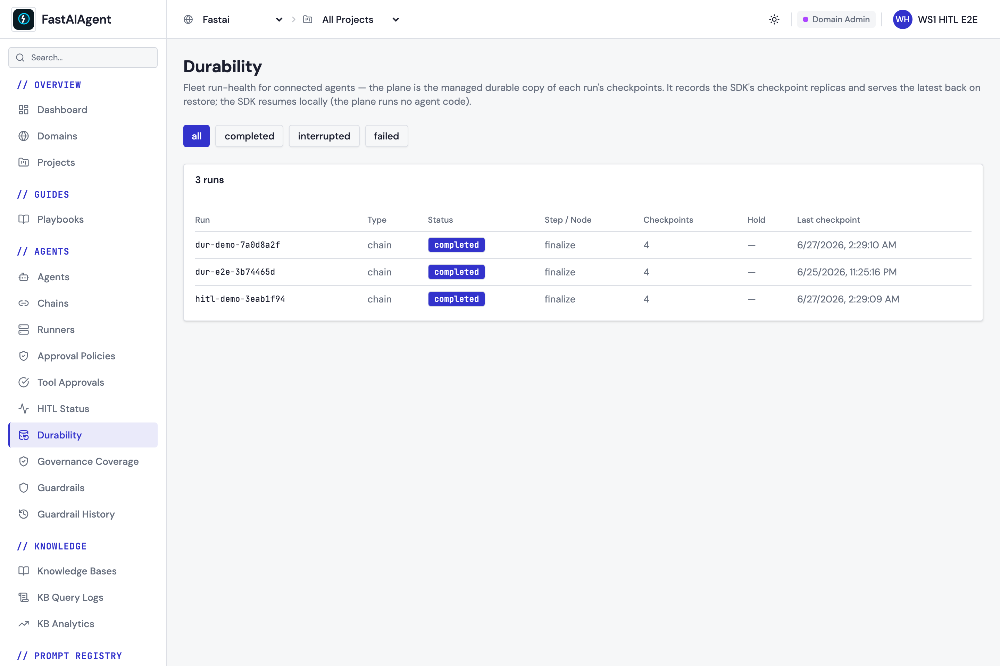

# Connected checkpoints (platform)

Checkpointing in the SDK is local-first: `SQLiteCheckpointer` (default) or
`PostgresCheckpointer` persists each step so a crashed or paused run can resume.
See [Checkpointers](checkpointers.md) and [Durability](index.md) — that works
fully standalone, with no platform dependency.

When you `fa.connect()` to an **Enterprise control plane**, the SDK additionally
**replicates** those checkpoints to the plane as a **managed durable copy**, and
can **restore a run from the plane** if the local store is lost. The local
checkpointer stays the hot-path source of truth; the plane is a passive replica
and system-of-record.

## Serve, don't execute

The plane **serves** a checkpoint back; the **SDK resumes locally**. The plane
never runs agent or chain code — restoring fetches the checkpoint and a normal
local `resume()` continues from it. This keeps the open/closed boundary intact.

## Local-first, non-blocking, one deliberate loss

Replication reuses the same durable outbox as
[trace export](../platform/index.md#durable-trace-buffering-retry), but it is
**write-driven** (checkpoints aren't tied to spans):

1. The checkpointer writes locally first (`synced=0`) — the durable source of truth.
2. On each write, when connected, it kicks a **background** drain that POSTs
   un-acked checkpoints to `/public/v1/checkpoints/ingest` (idempotent by
   `checkpoint_id`) and marks them `synced=1` **only after a 2xx**.
3. The agent hot path never blocks — the POST + retry run on a daemon thread.

Unlike traces (which abandon an old or oversized backlog), the checkpoint outbox
has **no age or count bound**: an un-acked checkpoint for an active or paused run
is never dropped just because it is old or the queue is deep. A transient
failure, a 5xx, a lapsed entitlement — all leave the row buffered to re-drain on
the next write, `connect()`, or `disconnect()`.

**The one exception is a poison row.** If the ingest door refuses a checkpoint on
*payload* grounds — a value longer than its column, a snapshot over the plane's
1 MB cap — it will refuse it identically every time. That used to stall the whole
outbox: the drain sends the oldest un-acked rows as one batch and stopped at the
first failure, so the next kick re-sent the same batch, got the same refusal, and
stopped again. One bad row stranded **every later checkpoint of every run** on
that checkpointer, permanently.

Now the batch is bisected until the offender stands alone, that row is
**quarantined** with the reason, and the drain moves on. One checkpoint missing
from the replica beats every later one stranded. A quarantined row is
`synced = 1` with a non-null `sync_error`, so it is distinguishable from one that
actually landed, and the local UI's execution inspector shows it as **not
replicated** with the plane's own explanation.

Only payload-shaped refusals (400, 409, 413, 422) qualify. A 401, 403 (domain not
entitled to `connected_state_plane`), 404, 408 or 429 is a condition of the
*connection*, not of any row — those stay buffered forever, because for them
"forever" is the correct answer: entitlement gets granted, proxies get fixed.

**When not connected, replication is a strict no-op** — nothing is sent.

## Restore-anywhere

**Resume does this for you.** When you are connected and the local store has no
record of `execution_id`, `Chain.resume` / `Agent.aresume` / `Swarm.aresume` /
`Supervisor.aresume` fetch the run from the plane first, then resume normally:

```python
import fastaiagent as fa

fa.connect(api_key="fa-...", target="https://your-plane.example.com")

# A different machine. This store has never heard of the run.
fresh = SQLiteCheckpointer(db_path="rebuilt.db")
chain = build_chain(checkpointer=fresh)          # same chain definition (code)
await chain.resume(execution_id, resume_value=Resume(approved=True))
```

Three rules worth knowing:

* **Only when missing.** If the local store already holds the run, the plane is
  not consulted at all — the local copy is the source of truth for a run on its
  own machine, and the plane is a replica.
* **Only when connected.** Disconnected, a resume fails exactly as it always
  did. Nothing about local durability depends on the plane.
* **`FASTAIAGENT_RESTORE_FROM_PLANE=0` turns it off.** The restore resurrects a
  run whose local checkpoints were deliberately deleted — right for disaster
  recovery, wrong for an erasure request. It is an environment switch rather
  than a per-call argument because it is a deployment-wide policy.

⚠ The **local UI's** resume button does not do this. It resolves the runner from
a local checkpoint row and returns 404 when there is none, so it can only resume
runs this machine already knows about. The **CLI** (`fastaiagent resume --runner
…`) calls `aresume` directly and does restore.

### Doing it by hand

`restore_from_plane` is still public if you want the checkpoint without
resuming — inspecting it, or restoring into a store you are not about to run:

```python
from fastaiagent.checkpointers.platform_replica import restore_from_plane

fresh = SQLiteCheckpointer(db_path="rebuilt.db")
ckpt = restore_from_plane(fresh, execution_id)   # GET …/latest → write locally
```

It returns the latest [`Checkpoint`](api-reference.md) the plane holds for
`execution_id` (or `None` if not connected / none found), and writes it into the
given checkpointer so a local resume can claim it. For a paused run it re-creates
the pending interrupt too.

## What is replicated

The full checkpoint needed to resume: `checkpoint_id`, `execution_id`,
agent/chain id, node + step index, `step_type`, status, the `state_snapshot`, and
the resume-critical fields (node I/O, iteration counters, interrupt
reason/context) — carried losslessly so the restored `Checkpoint` is identical.

`step_type` is what lets the plane tell a **run-end** row from an ordinary step,
and so a finished run from one that died right after its last step. Without it
the console can only report the status of the latest checkpoint, which is why it
renders "last step done" rather than "completed".

`resource_type` says what **topology** produced the run — `agent`, `chain`,
`swarm` or `supervisor` — read from the root of the run's `agent_path`, so every
checkpoint of one run reports the same value. It is read from the root rather
than from each row's own depth because the field describes the *run*, not the
checkpoint: a swarm writes its handoff rows under `swarm:<name>` while its child
agents write turn rows under `swarm:<name>/agent:<child>`, so asking per row used
to return `chain` for some and `agent` for others, and never `swarm`.

!!! note "`agent_id` is the agent's name, not the plane's agent UUID"
    So the Durability view cannot yet link a run to its entry in the Agents
    inventory. Sending the UUID is not a small change: only `Agent` registers
    with the plane at all — `Chain`, `Swarm` and `Supervisor` never do, so they
    have no id to send — registration races the first checkpoint of a run, and
    the restore path rebuilds the agent's name *from* this field. Registering the
    other three topologies is the prerequisite.

In this release `state_snapshot` is replicated **in clear**. A customer-held
encryption envelope (BYOK) for the payload is a documented future seam; metadata
stays clear regardless.

## Enablement

Connected durability is part of the Enterprise bundle, gated by the
`connected_state_plane` feature flag on your domain. If the domain is not
entitled, the ingest endpoint returns `403` — the SDK logs a warning, leaves the
checkpoints buffered (a terminal 4xx is not retried), and the run is unaffected.

> Upgrade note: the local `checkpoints.synced` column is added by an automatic,
> additive migration (local schema v13). Existing checkpoints are marked as
> already-synced on upgrade, so connecting an existing project does not
> retroactively back-push history — only checkpoints written afterwards replicate.
> Schema **v19** adds `sync_error` (poison-row quarantine) and **v20** adds
> `step_type`; both are additive with no backfill, and Postgres gets the same two
> columns via `ADD COLUMN IF NOT EXISTS` on the next `setup()`.

## In the console

The plane is the managed durable copy of each run's checkpoints. Its
**Durability** view shows fleet run-health — status, step / node, and checkpoint
count per run — and serves the latest checkpoint back on restore (the SDK resumes
locally; the plane runs no agent code):



A runnable end-to-end example is in `examples/86_connected_durability.py`.

## One tenant per runner

The drain is process-global, and that bounds what a single process can replicate:

* It runs on a **daemon thread** and always reads the **process-global**
  connection and project id. A `job_scope()` that overrides the project affects
  the writes, not the drain — the background thread cannot see a per-job
  ContextVar.
* `safe_get_project_id()` returns `""` rather than `None`, so
  `SQLiteCheckpointer.fetch_unsynced` always takes its **project-scoped** branch.
  A checkpoint written under a different project stamp is therefore never
  fetched by this process's drain, and sits `synced=0` indefinitely.
* `PostgresCheckpointer.fetch_unsynced` **ignores `project_id` entirely** — the
  Postgres schema is not project-scoped. It accepts the argument for protocol
  parity and drains every un-acked row in the schema.

In practice: **run one tenant (one API key, one project) per runner process.**
Serving several projects from one process will either strand rows the drain
never fetches (SQLite) or replicate them all under the connected project
(Postgres). Neither is a data-loss bug — local durability is unaffected either
way — but neither is what you want from a replica.

## Custom checkpointers

Replication uses an **optional** `ReplicatedCheckpointer` surface
(`fetch_unsynced` / `mark_synced`) — separate from the required `Checkpointer`
protocol. The built-in SQLite/Postgres backends implement it. A custom
checkpointer that doesn't is fully supported; it simply doesn't replicate (a
no-op, never an error).

## Next steps

- [Checkpointers](checkpointers.md) — the local backends and their API
- [Durability](index.md) — crash recovery and resume
- [Platform Connection](../platform/index.md) — `fa.connect()` and the other connected services
