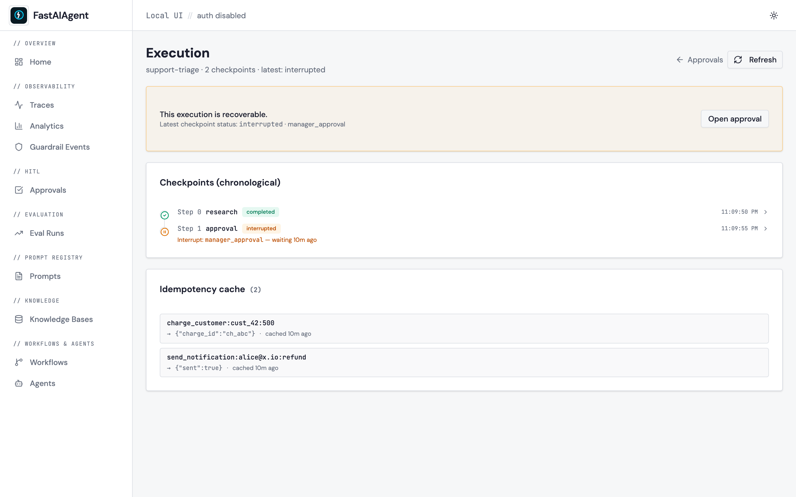

# A Durable Run Breaks at the Boundaries

*Six places a paused or crashed run goes wrong between one process and the next, how FastAIAgent holds each one, and a proof you can run for every claim.*

*Requires FastAIAgent 1.87.0+ · [Download this page as a PDF](img/boundaries/durability-at-the-boundaries.pdf)*

FastAIAgent already lets you *see* a run's progress: every turn and every tool call is a checkpoint row, and the Local UI's [checkpoint inspector](../ui/checkpoint-inspector.md) shows them as a timeline with a state diff between any two (see [Durability](index.md)).

Seeing the rows is not the same as trusting a resume. Durability is a promise: a process can die, or stop for a human, and another process can pick up exactly where it left off without repeating what was done. That promise has to hold wherever two things meet:

- one step and the next;
- the process that paused and the one that resumes;
- a crash and a rerun;
- a resume and a side effect;
- a run that ended and one that died;
- a laptop and a fleet, and the plane.

Those six boundaries are where durability goes wrong.

This page explains how FastAIAgent's durability works, one boundary at a time. Each section has a diagram, the rule the SDK follows, a proof, and the code: the SDK source that implements the rule and the script that proves it. The proofs are in [`examples/durability/proofs/`](https://github.com/fastaifoundry/fastaiagent-sdk/tree/main/examples/durability/proofs) and run against the published SDK: a real agent on the SDK's own offline model, real SQLite and Postgres, and real child processes that are killed where it matters. They run in CI, so what this page quotes can't drift from what the SDK does. Every output below came out of one of those runs, and so did the defect one of them turned up.

---

## First: a durable run is one id and a few kinds of row

Durability is not a feature of the agent loop; it is a few rows the loop writes, keyed by one id, that another process can read.


*One `execution_id` per run. A row before each model call and before each tool. One more row, plus a pending row, for a pause. One marker at the end. Resume reads the newest row.*

- **The id.** `execution_id` is minted once per run, or passed in, and placed in a context variable so every tool and every `@idempotent` function in the run reads the same one.
- **The rows.** `turn:N` before each model call; `turn:N/tool:X` before each tool, with the tool's arguments saved; `turn:N/tool:X` again, status `interrupted`, when a tool pauses; `run_end` when the run ends. Each carries the messages so far as `state_snapshot`.
- **The tables.** `checkpoints`, `pending_interrupts` and `idempotency_cache`, in SQLite by default or Postgres for a fleet.
- **The re-entry.** `resume(execution_id)` reads the newest row: its `status` says what to do, its `node_id` says where.

You opt in with one keyword:

```python
agent = Agent(name="refund-bot", llm=llm, tools=[refund], checkpointer=SQLiteCheckpointer())
result = agent.run("Refund order 1042", execution_id="refund-1042")
# result.status == "paused" if the tool called interrupt(); the process can exit now.

# later, anywhere with the same store and the same tools:
result = agent.resume("refund-1042", resume_value=Resume(approved=True, metadata={"approver": "alice"}))
```

The rest of this page is what those rows have to get right.

**Code:** the row is `Checkpoint` in [`chain/checkpoint.py`](https://github.com/fastaifoundry/fastaiagent-sdk/blob/main/fastaiagent/chain/checkpoint.py); the store contract is [`checkpointers/protocol.py`](https://github.com/fastaifoundry/fastaiagent-sdk/blob/main/fastaiagent/checkpointers/protocol.py); the context variables are in [`chain/interrupt.py`](https://github.com/fastaifoundry/fastaiagent-sdk/blob/main/fastaiagent/chain/interrupt.py) and [`chain/idempotent.py`](https://github.com/fastaifoundry/fastaiagent-sdk/blob/main/fastaiagent/chain/idempotent.py); the agent wires them in `_arun_core`, [`agent/agent.py`](https://github.com/fastaifoundry/fastaiagent-sdk/blob/main/fastaiagent/agent/agent.py). The example is [`examples/42_durability_hitl.py`](https://github.com/fastaifoundry/fastaiagent-sdk/blob/main/examples/42_durability_hitl.py).

---

## 1 · Between one step and the next: what one run writes

A row is only useful if it was written before the thing that might kill the process. Where the rows go, and when, decides whether a crash has a re-entry point.


*A run that completes and a run that pauses, row by row. The pause row and the pending row commit together. The paused run has no end marker.*

The rules:

- **A row is written before the step, not after.** The turn row goes down before the model is called; the tool row before the tool is dispatched, with its arguments. A crash inside either step still has a re-entry point.
- **A pause is two rows in one transaction**: the `interrupted` checkpoint and the `pending_interrupts` row the approvals UI reads. Nobody ever sees a half-suspended run.
- **A paused run has no `run_end`.** A pause is not an ending, and a marker written after an interrupted row would hide the pause from the guards that make a resume demand a `Resume` value.
- **Every row says who wrote it.** `agent_path` is `agent:<name>/tool:<tool>` for a plain agent and nests under a Swarm or Supervisor, so one `execution_id` can hold a whole topology.

Proof 1 runs a small refund that completes and a large one that pauses, on a scratch SQLite file:

```
── a run that completes: one small refund
status: completed · output: 'Refund for order 1042 is on its way.'
  #0 turn:0                 step=llm_call   status=completed
  #0 turn:0/tool:refund     step=tool_call  status=completed
  #1 turn:1                 step=llm_call   status=completed
  #2 run_end                step=run_end    status=completed

── a run that pauses: a large refund
status: paused · pending_interrupt: {'reason': 'manager_approval', 'node_id': 'turn:0/tool:refund', 'agent_path': 'agent:refund-bot/tool:refund'}
  #0 turn:0                 step=llm_call   status=completed
  #0 turn:0/tool:refund     step=tool_call  status=completed
  #0 turn:0/tool:refund     step=hitl_pause status=interrupted
pending_interrupts rows: [('run-large', 'manager_approval', {'order': '1042', 'amount': 50000, 'balance': 100})]
run-end rows for the paused run: []
```

Two model turns and one tool call became four rows and a marker. The pause became one more row and a pending entry, and no marker.


*The same rows in the Local UI: one per step, with its status, and the idempotency cache for the run.*

**Code:** `_put_turn_checkpoint`, `_put_tool_checkpoint` and `_record_agent_interrupt` in [`agent/executor.py`](https://github.com/fastaifoundry/fastaiagent-sdk/blob/main/fastaiagent/agent/executor.py); `record_interrupt` in [`checkpointers/sqlite.py`](https://github.com/fastaifoundry/fastaiagent-sdk/blob/main/fastaiagent/checkpointers/sqlite.py) and [`postgres.py`](https://github.com/fastaifoundry/fastaiagent-sdk/blob/main/fastaiagent/checkpointers/postgres.py). The proof is [`proof_1_rows.py`](https://github.com/fastaifoundry/fastaiagent-sdk/blob/main/examples/durability/proofs/proof_1_rows.py); [`tests/test_checkpointer_protocol.py`](https://github.com/fastaifoundry/fastaiagent-sdk/blob/main/tests/test_checkpointer_protocol.py) pins the store contract.

---

## 2 · Between the process that paused and the one that resumes

The whole point of a pause is that the process holding it can go away. The resume then happens somewhere else, later, from the rows alone, and it has to happen exactly once.

![Between the process that paused and the one that resumes: in process A a tool calls interrupt, the executor records the interrupted checkpoint and the pending row in one transaction and returns a paused result with the frozen context, and the process exits; in process B resume claims the pending row atomically, re-invokes the tool with the Resume value in scope so interrupt returns it, and the loop continues; a second resume finds no row and raises AlreadyResumed; five racing resumers produce exactly one winner](img/boundaries/d3-pause-resume.svg)
*Process A pauses and exits. Process B claims the pending row, re-invokes the tool with the decision in scope, and finishes. A second resumer finds nothing to claim.*

The rules:

- **`interrupt(reason, context)` raises on the first pass.** The executor records the pause and the run returns `status="paused"` with the context on it. The process can exit.
- **The context is frozen at the pause.** It is serialized into the row and never recomputed, so the approver's decision is about a snapshot, not about whatever the world looks like at resume time.
- **Resume claims the pending row atomically**, then re-invokes the suspended tool with the `Resume` in scope, so `interrupt()` returns it instead of raising. The loop continues to the answer.
- **A second resume finds no row** and raises `AlreadyResumed`. Under a race, exactly one caller claims the row; the others raise.
- **The tools must match.** Resume looks the suspended tool up by name on the agent it is called on; a missing tool raises `ChainCheckpointError` naming it.

Proof 2 pauses in a child process, resumes in the parent, resumes again, then races five threads for one pause:

```
── process A pauses and exits; process B resumes
child pid=43173 status=paused context={'order': '1042', 'amount': 50000, 'balance': 100}
this  pid=43168 resumes with Resume(approved=True, metadata={'approver': 'alice'})
status: completed · output: 'Refund for order 1042 is on its way.' · charges: [{'order': '1042', 'amount': 50000}]

── the approver's context was frozen at the pause
frozen in the checkpoint: {'order': '1042', 'amount': 50000, 'balance': 100} — JSON at pause time, never recomputed

── a second resume is refused
AlreadyResumed: Agent execution 'refund-1' has no pending interrupt to claim — either it was never suspended or anot …

── five resumers race for one pause
child pid=43178 status=paused context={'order': '1042', 'amount': 50000, 'balance': 100}
outcomes: ['AlreadyResumed', 'AlreadyResumed', 'AlreadyResumed', 'AlreadyResumed', "completed('Refund for o')"]
charges in this process: 2 — one per resumed run
```

Two processes, one SQLite file. Five threads, one claim, one charge.

**Code:** `interrupt`, `Resume` and `AlreadyResumed` in [`chain/interrupt.py`](https://github.com/fastaifoundry/fastaiagent-sdk/blob/main/fastaiagent/chain/interrupt.py); the claim is `delete_pending_interrupt_atomic` in [`checkpointers/sqlite.py`](https://github.com/fastaifoundry/fastaiagent-sdk/blob/main/fastaiagent/checkpointers/sqlite.py); `Agent.aresume` in [`agent/agent.py`](https://github.com/fastaifoundry/fastaiagent-sdk/blob/main/fastaiagent/agent/agent.py). The proof is [`proof_2_pause_resume.py`](https://github.com/fastaifoundry/fastaiagent-sdk/blob/main/examples/durability/proofs/proof_2_pause_resume.py); see [Suspending HITL](../chains/hitl.md#suspending-hitl-interrupt) and [`examples/customer-support-agent/`](https://github.com/fastaifoundry/fastaiagent-sdk/tree/main/examples/customer-support-agent).

---

## 3 · Between a crash and a rerun: resume re-enters at the newest row

A crash is a pause nobody asked for. The newest row says which step was in flight, and the rule is the same as for a pause: re-enter there, repeat nothing that was committed.

![Between a crash and a rerun: a process killed inside a tool leaves the pre-tool row as the newest, and resume re-invokes the tool with the saved arguments without calling the model; a process killed waiting on the model leaves the turn row, and resume re-issues the model without re-running the tool; when two tools were asked for in one turn and the first paused, the sibling is not re-dispatched on resume and the model is told it did not run; a tool re-invoked after a crash that then pauses raises InterruptSignal out of resume in 1.87.0](img/boundaries/d4-crash.svg)
*Killed inside the tool: the tool runs again from its saved arguments, the model is not called. Killed waiting on the model: the model is re-issued, the tool is not. A sibling tool call the pause left behind is not re-dispatched.*

The rules:

- **A tool-boundary crash re-invokes the tool** with the saved arguments. The model is not re-called: the assistant's tool calls are already in the saved history.
- **A turn-boundary crash re-issues the model** at that turn, with the saved history. The tool that ran before it is not run again.
- **Sibling tool calls are not re-dispatched.** When a model asked for two tools in one turn and the first paused, resume answers the one it suspended on and tells the model the other did not run. Firing it on resume would run a side effect the model never saw a result for.
- **The re-entered step runs from the top.** That is why side effects need `@idempotent`, the next section.

Proof 3 kills a real child process with `os._exit` inside the tool, then while waiting on the model, and resumes each run in the parent:

```
── killed inside the tool (exit code 2)
  #0 turn:0                 step=llm_call   status=completed
  #0 turn:0/tool:refund     step=tool_call  status=completed
resume → status=completed model calls=1 tool ran with saved args → charges=[{'order': '1042', 'amount': 20}]
  #1 turn:1                 step=llm_call   status=completed
  #2 run_end                step=run_end    status=completed

── killed waiting on the model (exit code 3)
  #0 turn:0                 step=llm_call   status=completed
  #0 turn:0/tool:refund     step=tool_call  status=completed
  #1 turn:1                 step=llm_call   status=completed
resume → status=completed model calls=1 charges=[] (the tool was not re-run)

── two tools in one turn; the first pauses
status: paused · notify ran during the first pass: []
resume → status: completed · notify ran on resume: []
tool results the model was shown at the next turn: ['{"approved": true, "charge": 1}', '[no result: the agent was interrupted before this tool ran; it w…']

── the edge: a tool re-invoked after a crash pauses
resume → InterruptSignal escaped resume(): manager_approval — not a paused result; nothing checkpointed (1.87.0)
```

The first resume made one model call, for the turn after the tool; the charge happened once. The second made one model call and no charge. The sibling `notify` never ran, and the model was told so in the tool result.

The last case is a real edge in 1.87.0: when crash recovery re-invokes a tool and that tool calls `interrupt()`, the signal escapes `resume()` instead of becoming a paused result, and nothing is checkpointed. The tool loop converts that signal; the resume path's direct re-invocation does not yet. It is listed as open.

**Code:** the three resume shapes are `Agent.aresume` in [`agent/agent.py`](https://github.com/fastaifoundry/fastaiagent-sdk/blob/main/fastaiagent/agent/agent.py); the sibling note is `balance_tool_messages` in [`llm/message.py`](https://github.com/fastaifoundry/fastaiagent-sdk/blob/main/fastaiagent/llm/message.py). The proof is [`proof_3_crash.py`](https://github.com/fastaifoundry/fastaiagent-sdk/blob/main/examples/durability/proofs/proof_3_crash.py); see [Resume shapes](../agents/durability.md#resume-shapes) and [Sibling tool calls](../chains/hitl.md#sibling-tool-calls-in-the-same-turn).

---

## 4 · Between a resume and a side effect: the re-executed step

A resumed step runs again from the top. Everything in it before the pause runs twice unless something remembers it already ran. That something is a cache keyed by the run.


*A charge before the pause fires on both passes. Wrapped in `@idempotent`, the second pass returns the cached result and the body never runs. The cache is per run.*

The rules:

- **A plain side effect fires again on resume.** The tool is re-invoked from the top, and nothing in the SDK knows which line is safe to repeat.
- **`@idempotent` caches by `(execution_id, key)`.** The key is a hash of the function's name and arguments, or your `key_fn`. A hit returns the stored result and never runs the body.
- **The cache is per run.** A new `execution_id` is a miss. Outside any run, there is no cache and the body runs every time, which is what makes wrapped functions safe to unit-test.
- **A result that cannot be stored is refused.** The value is stored as JSON; a return that cannot be serialized raises `IdempotencyError` rather than silently going uncached.

Proof 4 pauses and resumes the same tool, plain and wrapped:

```
── the same tool, paused and resumed
plain function         status=completed charge_card fired 2× → ['1042', '1042']
@idempotent            status=completed charge_card fired 1× → ['1042']

── the cache is per run
@idempotent, new run   status=completed charge_card fired 1× → ['1042']

── outside a run there is no cache
called twice outside any run → fired 2 ×

── a value that cannot be stored is refused
the tool raised inside the loop; the model was told: "Tool 'refund' failed: @idempotent function 'opaque' returned a non-JSON-serializable value of type 'object': Unable to s" …
```

Same tool, same pause, same resume. The card was charged twice without the decorator and once with it.

**Code:** [`chain/idempotent.py`](https://github.com/fastaifoundry/fastaiagent-sdk/blob/main/fastaiagent/chain/idempotent.py); the cache rows are `get_idempotent`/`put_idempotent` in each checkpointer. The proof is [`proof_4_side_effects.py`](https://github.com/fastaifoundry/fastaiagent-sdk/blob/main/examples/durability/proofs/proof_4_side_effects.py); [`tests/test_idempotent.py`](https://github.com/fastaifoundry/fastaiagent-sdk/blob/main/tests/test_idempotent.py) pins the scoping; see [Side effects & idempotency](side-effects.md).

---

## 5 · Between a run that ended and one that died: the marker

Until 1.65.0 a run that finished and a run that died the instant after its last step left the same rows: a `completed` checkpoint as the newest. Resuming a finished run re-ran it. The run-end marker is what tells the two apart, and it means the opposite thing to a resume and to a fork.


*`completed`: resume is refused, fork is the ordinary case. `failed`: resume steps over the marker. Paused: no marker, and prune leaves it alone.*

The rules:

- **A `completed` marker refuses a resume** with `AlreadyResumed`: there is nothing to continue, and continuing would re-fire every side effect.
- **A `failed` marker is stepped over.** Crash recovery is the feature; a run that raised stays resumable, and resume re-enters at the last real row.
- **A fork branches a finished run** under a new `execution_id`, leaving the original untouched. A fork from the marker itself is refused: it is a tombstone, not a step.
- **A tool that raises is not a failed run.** Its error becomes a tool result the model reads. Only an exception that escapes the run writes a `failed` marker.
- **Prune never deletes a pause.** `completed` and `failed` rows older than the cutoff go; an `interrupted` row stays, because deleting it would orphan a human.

Proof 5 finishes a run, fails one by making the provider raise once, forks the finished one, and prunes:

```
── a finished run refuses to resume
last row: #2 run_end                step=run_end    status=completed
resume → AlreadyResumed: Agent execution 'done-1' already finished (completed) — there is nothing to resu …

── a run that raised stays resumable
run raised: RuntimeError · provider returned 503
last row: #2 run_end                step=run_end    status=failed
resume → status: completed · charges: [{'order': '1042', 'amount': 20}] (the tool did not run again)

── a fork branches a finished run under a new id
fork → execution_id='40229800-d3c8-40f7-83fc-3706c4c6860c' status=completed · original rows: 4 → 4
fork from the marker → ChainCheckpointError: Checkpoint 'c9bab603-…' of execution 'done-1 …

── prune keeps every pause
prune(older_than=0s) deleted 17 rows · still stored: ['paused-1'] · pending: ['paused-1']
```

The failed run re-entered after the tool, so the charge stayed at one. The fork left the original's four rows exactly as they were.

**Code:** `write_run_end`, `latest_resumable` and `latest_forkable` in [`chain/checkpoint.py`](https://github.com/fastaifoundry/fastaiagent-sdk/blob/main/fastaiagent/chain/checkpoint.py); `prune` in each checkpointer; `Agent.afork` in [`agent/agent.py`](https://github.com/fastaifoundry/fastaiagent-sdk/blob/main/fastaiagent/agent/agent.py). The proof is [`proof_5_run_end.py`](https://github.com/fastaifoundry/fastaiagent-sdk/blob/main/examples/durability/proofs/proof_5_run_end.py); [`tests/test_run_end_checkpoint.py`](https://github.com/fastaifoundry/fastaiagent-sdk/blob/main/tests/test_run_end_checkpoint.py) pins the marker; see [When checkpoints are written](concepts.md#when-checkpoints-are-written).

---

## 6 · Between a laptop and a fleet, and the plane

The same `Agent` runs on SQLite or Postgres; only the checkpointer changes. Both implement one protocol, and the one operation that must be exactly-once is the claim. Connected, a checkpointer also keeps an outbox to the plane, and the plane never runs a step.

![Between a laptop and a fleet, and the plane: SQLite claims a pause with a select and delete under one lock, Postgres with delete returning under MVCC, and both give one winner among five racing resumers; a connected checkpointer keeps an outbox of un-acked rows, replicated to the plane in the background and marked synced only after a 2xx, with nothing sent while disconnected and a poison row quarantined rather than stranding the queue; the plane serves a checkpoint back and the SDK resumes locally](img/boundaries/d7-fleet.svg)
*Two backends, one protocol, one claim each. The outbox replicates rows in the background and marks them synced only when the plane confirms. Disconnected, nothing leaves.*

The rules:

- **SQLite claims under one lock** with a select and a delete in one transaction; one process at a time. **Postgres claims with `DELETE … RETURNING`** under MVCC, so many workers can race and exactly one wins.
- **The protocol is small and the replication surface is separate.** `Checkpointer` is what the agent needs; `ReplicatedCheckpointer` is optional, so a custom backend without it simply does not replicate.
- **The outbox is write-driven and non-blocking.** A row is written locally as `synced=0`; a background drain posts un-acked rows to the plane and marks them synced only after a 2xx. There is no age or count bound: a paused run's rows are never dropped for being old.
- **One deliberate loss.** A row the plane refuses on payload grounds is quarantined with its reason rather than left to strand every later row behind it.
- **Disconnected, nothing leaves.** The rows wait. `restore_from_plane()` pulls the latest row down so a resume can proceed on a machine that never ran the original.

Proof 6 runs the pause, the race and the outbox on both backends, offline:

```
── sqlite: pause, race, claim
  protocol: Checkpointer=True Replicated=True
  outcomes: ['AlreadyResumed', 'AlreadyResumed', 'AlreadyResumed', 'AlreadyResumed', 'completed']
  claim   : SELECT + DELETE under one lock

── sqlite: the outbox, disconnected
  un-acked rows for this run: 5 (synced only after the plane answers 2xx; none sent — not connected)
  after mark_synced: 0 waiting

── postgres: pause, race, claim
  protocol: Checkpointer=True Replicated=True
  outcomes: ['AlreadyResumed', 'AlreadyResumed', 'AlreadyResumed', 'AlreadyResumed', 'completed']
  claim   : DELETE … RETURNING

── postgres: the outbox, disconnected
  un-acked rows for this run: 5 (synced only after the plane answers 2xx; none sent — not connected)
  after mark_synced: 0 waiting
```

Same code, same outcome on both. Five rows waited un-acked on each backend and none was sent, because no plane was connected; that is the local-first half of the design, and the half this page could prove without one.

**Code:** [`checkpointers/sqlite.py`](https://github.com/fastaifoundry/fastaiagent-sdk/blob/main/fastaiagent/checkpointers/sqlite.py), [`checkpointers/postgres.py`](https://github.com/fastaifoundry/fastaiagent-sdk/blob/main/fastaiagent/checkpointers/postgres.py) and the outbox in [`checkpointers/platform_replica.py`](https://github.com/fastaifoundry/fastaiagent-sdk/blob/main/fastaiagent/checkpointers/platform_replica.py). The proof is [`proof_6_backends.py`](https://github.com/fastaifoundry/fastaiagent-sdk/blob/main/examples/durability/proofs/proof_6_backends.py) (Postgres when `PG_TEST_DSN` is set; `scripts/dev_backends.sh up` starts one); the backend suites are [`tests/integration/test_postgres_checkpointer.py`](https://github.com/fastaifoundry/fastaiagent-sdk/blob/main/tests/integration/test_postgres_checkpointer.py) and [`tests/test_checkpoint_quarantine.py`](https://github.com/fastaifoundry/fastaiagent-sdk/blob/main/tests/test_checkpoint_quarantine.py); see [Checkpointers](checkpointers.md), [Connected checkpoints](connected-checkpoints.md) and [`examples/86_connected_durability.py`](https://github.com/fastaifoundry/fastaiagent-sdk/blob/main/examples/86_connected_durability.py).

---

## Where durability bugs hide


*A typical test pauses once and resumes once, in one process, on SQLite, with a tool that does nothing. Durability breaks on the lines around that box.*

If you build or buy durability, test the boundaries:

1. **Pause in one process and resume in another**, from the rows alone. Then resume again.
2. **Kill the process inside a tool**, and again while it waits on the model. Count the model calls and the side effects on resume.
3. **Put a side effect before the pause** and resume. Did it fire twice?
4. **Race five resumers** for one pause, on every backend you ship.
5. **Resume a run that finished**, and one that raised. Which one re-runs?
6. **Disconnect** and write a few rows. What is waiting, and did anything leave?

The proof scripts behind this page run each of those checks.

---

## What durability still won't do for you

- **A re-invoked tool that pauses during crash recovery raises** `InterruptSignal` out of `resume()` in 1.87.0 instead of pausing. Open.
- **Writes are synchronous.** `aresume()` is async for symmetry; the store calls block.
- **Resume needs the same tools.** A fresh agent must register the tools the paused run used, by name.
- **A tool's error is not a failed run.** Only an exception that escapes the run writes a `failed` marker.
- **A re-entered step runs from the top.** `@idempotent` absorbs the side effects you wrap; it cannot find the ones you didn't.
- **`Resume` carries `approved` and `metadata`, nothing else.** A `data=` keyword is dropped silently; put payloads in `metadata`.
- **No watchdog, no auto-resume.** A pause waits for a human, or for your scheduler. It never expires on its own.
- **SQLite is one process at a time.** Two replicas need Postgres.
- **The plane serves and records.** It never executes a step and never resolves a pause; your application is the approver.

---

## The point of all of it

Durability is a promise about a process that is no longer there. That is why it has to be both visible and trustworthy: the rows make a run visible; this page walked the six boundaries where a resume has to hold.

The split between the SDK and the plane stays the same. The SDK writes the rows in your store, claims the pause in your process, and resumes on your machine. The plane keeps a durable copy and serves it back; it never runs a step. Everything on this page, except the plane itself, is in the open-source SDK.

Test your own durability the same way. The bugs aren't in the happy pause; they're on the boundaries.

## See also

- [Concepts & Mental Model](concepts.md): the checkpoint record, when it's written, how resume decides, the atomic claim.
- [Durability](index.md) and [Quickstart](quickstart.md).
- [Side effects & idempotency](side-effects.md), [Checkpointers](checkpointers.md), [Multi-agent](multi-agent.md), [Connected checkpoints](connected-checkpoints.md).
- [Agent Durability](../agents/durability.md) and [Human-in-the-Loop](../chains/hitl.md).
- [Checkpoint inspector](../ui/checkpoint-inspector.md): the timeline and state diff in the Local UI.
- [Agent Memory Breaks at the Boundaries](../agents/memory-boundaries.md): the same approach for memory.
