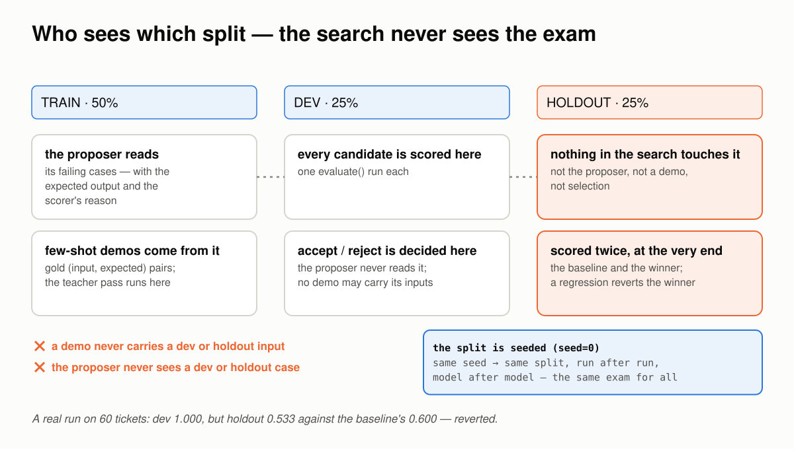
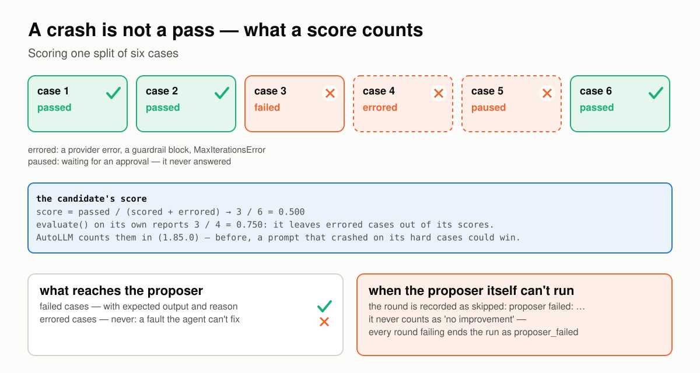
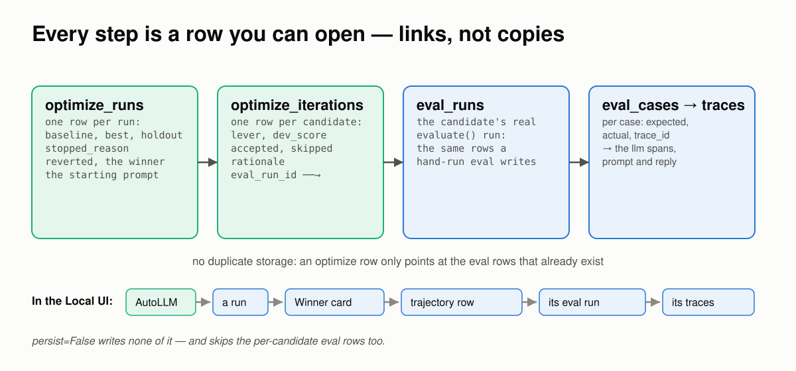

# Why AutoLLM's Number Holds

*Six ways a prompt optimizer fools itself, how AutoLLM holds each one, and a real run behind every claim.*

*Requires FastAIAgent 1.87.0+ · [Download this page as a PDF](img/autollm/how-autollm-works.pdf)*

[AutoLLM](optimization.md) already lets you *see* the search: every candidate it tried is a row, every row opens the eval run that scored it, and the winner sits next to the prompt you started with (see [Persistence & the UI](optimization.md#persistence-the-ui)).

Seeing the search is not the same as trusting its number. A prompt optimizer ends with one claim — *the winner scores X* — and that claim is only as good as what the optimizer was allowed to see, allowed to count, and allowed to spend. There are six ways it goes wrong:

- it tunes on the exam;
- it guesses instead of learning;
- candidates leak into each other, or into your agent;
- a crash reads as a pass;
- the judge grades its own homework;
- the bill has no ceiling.

This page explains how AutoLLM works, one of those at a time. Each section has a diagram, the rule the SDK follows, a proof, and the code: the SDK source that implements the rule, and the script or example that proves it. The proofs are either outputs from the published examples ([the triage loop](../flagships/autollm-closed-loop.md) and [judge calibration](../flagships/judge-calibration.md)), run against real models, or scripts in [`examples/autollm/proofs/`](https://github.com/fastaifoundry/fastaiagent-sdk/tree/main/examples/autollm/proofs) that run offline against the published SDK — and run in CI, so what this page quotes can't drift from what the SDK does. Every output and number below came out of one of those runs.

---

## First: one run is a split, a climb and a guard


*Rounds keep only what beats the best on dev. The holdout, locked until the search is over, decides whether to believe it.*

The vocabulary, in the order it happens:

- **The split.** Your dataset is shuffled with a seed and cut into **train** (50%), **dev** (25%) and **holdout** (25%). The same seed gives the same split, run after run.
- **The baseline.** Your agent, as you passed it in, scored on dev. Everything after is measured against this.
- **A lever** is one thing the search may move: the system prompt (`instructions`), the few-shot examples (`fewshot`), or which learned facts are injected (`memory`). Rounds cycle through the active levers, one per round.
- **A candidate** is the current best with one lever changed. Each round proposes a few, scores every one on dev, and keeps the best of them **only if** it beats the current best by at least `min_delta`. Otherwise the round counts toward `patience`.
- **The stops**: `patience` rounds without a gain, `max_iterations`, `target_score`, the budget, or a proposer that keeps failing.
- **The holdout guard.** When the search stops, the baseline and the winner are both scored on holdout — data nothing in the search touched. A winner that scores below the baseline there is thrown away.
- **The report**: the dev and holdout numbers, every candidate with its score and rationale, and `apply_to(agent)`, which returns a fresh agent with the winning levers applied.

You get all of it from one call:

```python
report = fa.optimize(
    agent,                                   # any Agent with a string system prompt
    "tickets.jsonl",                         # input + expected_output per case
    [TriageMatch()],                         # a scorer whose reason names the miss
    config=fa.OptimizeConfig(levers=("instructions", "fewshot"), max_eval_runs=40),
    proposer_llm=fa.LLMClient(model="gpt-5"),   # the model that writes prompts
)
print(report.summary())
better = report.apply_to(agent)
```

The rest of this page is what that loop has to get right.

**Code:** the loop is [`optimize/loop.py`](https://github.com/fastaifoundry/fastaiagent-sdk/blob/main/fastaiagent/optimize/loop.py) (`aoptimize`); the knobs are [`optimize/config.py`](https://github.com/fastaifoundry/fastaiagent-sdk/blob/main/fastaiagent/optimize/config.py) (`OptimizeConfig`); the call above is step 5 of the triage example, [`05_optimize.py`](https://github.com/fastaifoundry/fastaiagent-sdk/blob/main/examples/autollm-loop/05_optimize.py).

---

## 1 · The search never sees the exam

The oldest way to fool yourself with an optimizer is to tune on the data you then report. AutoLLM gives each split one job, and the jobs don't overlap.


*Train is what the proposer learns from. Dev is where candidates are selected. Holdout is the exam, and nothing in the search is allowed to open it.*

The rules:

- **The proposer reads train only.** Its failing train cases are what it rewrites the prompt from. It never sees a dev or holdout case.
- **Selection happens on dev.** A candidate wins a round by scoring higher on cases the proposer never read. It can't win by memorising the cases it was shown.
- **Holdout is scored twice, at the very end**: once for the baseline, once for the winner, both with the audit judge. If the winner is below the baseline by more than `holdout_regression_tol` (default 0), the run is marked `reverted` and you keep your original prompt.
- **A few-shot demo never carries a dev or holdout input** — not from train, and not from the favourite traces the lever can also draw on. Before 1.85.0 a dataset curated from favourites could hand the agent the answers it was then scored on.

Proof 1 is a real run of the triage example on an early, 60-ticket version of its dataset. On dev the search was perfect. On holdout it was worse than the prompt it started from:

```
Optimization — ticket-triage (stopped: patience+reverted)
============================================================
baseline   dev=0.600
 iter 1 [instructions]  dev=0.933 (+0.333)  ACCEPT  — … Specifically called out that minor
                                                       overage refunds and shipping delays are P3.
 iter 2 [fewshot]       dev=1.000 (+0.400)  ACCEPT  — few-shot k=4
 (rejected candidates omitted)
------------------------------------------------------------
best dev=0.600 REGRESSED on holdout → reverted to baseline
holdout     best=0.533 (baseline=0.600, Δ-0.067) → reverted
```

Read the accepted rationale: the proposer had learned, from the train failures it was shown, that *shipping delays are P3*. Dev agreed. Holdout held a ticket about security keys *7 working days* late, which the house rules make P2, and the winner got it wrong. A winner that looks perfect on the data it was tuned toward, and loses on data it never saw, is exactly the case the guard exists for. The run reported `reverted`, the agent kept v1, and the fix was more data: with 120 tickets in matched pairs the same loop reached [0.967 on holdout](../flagships/autollm-closed-loop.md#a-real-run).

**Code:** the split is `_split` and the guard is the end of `aoptimize`, both in [`optimize/loop.py`](https://github.com/fastaifoundry/fastaiagent-sdk/blob/main/fastaiagent/optimize/loop.py); demos are kept off dev and holdout by `exclude_inputs` in `bootstrap_demos`, [`optimize/proposers.py`](https://github.com/fastaifoundry/fastaiagent-sdk/blob/main/fastaiagent/optimize/proposers.py). The run above is [`examples/autollm-loop/`](https://github.com/fastaifoundry/fastaiagent-sdk/tree/main/examples/autollm-loop) on an early dataset; the leak that 1.85.0 closed is pinned in [`tests/test_optimize.py`](https://github.com/fastaifoundry/fastaiagent-sdk/blob/main/tests/test_optimize.py).

---

## 2 · The proposer learns from failures it can read

An optimizer that is told only *this case failed* has to guess what passing looks like. AutoLLM shows the proposer what correct looks like, and why the attempt wasn't.


*One request per round: the current prompt, the failures with their expected outputs and the scorer's reasons, and an ask for N complete prompts. The other two levers propose without a model.*

What the `instructions` proposer gets, each round:

- the agent's name and its **current** prompt, verbatim — the best so far, not the original;
- up to **40 failing train cases**, each with the input, the **expected output**, the actual output, and the **scorer's reason** — `priority P2, expected P1`, or `got 1120, expected 1120000`;
- an instruction to propose N *distinct, complete* prompts, each with a rationale, as JSON.

It never sees a passing case (nothing to learn from), an infra-errored case (a fault the agent can't fix), or anything from dev or holdout. The `fewshot` lever proposes without a model at all: gold `(input, expected)` pairs from train, filled out by a teacher pass only when there is no gold. The `memory` lever proposes subsets of the agent's existing facts, ranked by confidence then recency, and never creates, edits or deletes one.

Two things follow. **The scorer's reason is half the recipe**: a scorer that says only `failed` leaves the proposer guessing; one that names the miss hands it the rule. And **the proposer is where a reasoning model earns its cost**: working out *disputes over EUR 500 are urgent* from forty labelled failures is induction, and `gpt-5` did it in one round while `gpt-4.1-mini` ran the agent.

Proof 2 is the triage flagship's own trajectory. The rationales are the proposer's words; nobody told it the thresholds:

```
 iter 1 [instructions]  dev=0.767 (+0.200)  ACCEPT  — Adds explicit, concise priority rules to
     correct mis-prioritization: large billing disputes (>=500) → P1; tech outages/errors → P2 …
 iter 3 [instructions]  dev=0.933 (+0.367)  ACCEPT  — Introduces a brief 'Escalation overrides'
     section that cleanly captures the two needed exceptions without altering the base rules …
```

and the prompt it wrote carries the rules the labels had been hiding:

```
+- Billing monetary disputes or refund/charge >= 500 (EUR or equivalent) -> billing P1.
+- Other billing issues (price changes, late fees, small/incorrect charges, refunds < 500) -> billing P3.
+- Technical: Enterprise plan/contract/workspace + production-wide failure … -> technical P1.
+- Shipping: hardware security key shipment overdue by ≥5 business/working days … -> shipping P2.
```

The [judge-calibration example](../flagships/judge-calibration.md) is the same mechanism with a different scorer: its reason is `judge said pass; reviewers said fail: promises a refund`, and the judge the proposer wrote begins *"If the reply promises or claims that a refund/credit/compensation has been or will be granted, score 0. Do not penalize language that only defers the decision to Billing."*

**Code:** the request is `_arequest_rewrites` in [`optimize/proposers.py`](https://github.com/fastaifoundry/fastaiagent-sdk/blob/main/fastaiagent/optimize/proposers.py), and the failure block it sends is `_failures_text` in [`eval/harden.py`](https://github.com/fastaifoundry/fastaiagent-sdk/blob/main/fastaiagent/eval/harden.py) — the same text `harden()` shows its model. The scorers whose reasons you read above are `TriageMatch` in [`autollm-loop/triage.py`](https://github.com/fastaifoundry/fastaiagent-sdk/blob/main/examples/autollm-loop/triage.py) and `AgreesWithReviewers` in [`autollm/calibrate_judge.py`](https://github.com/fastaifoundry/fastaiagent-sdk/blob/main/examples/autollm/calibrate_judge.py).

---

## 3 · One candidate, one agent

A search that runs dozens of candidates on one agent object has dozens of ways to contaminate itself: a candidate's conversation leaking into the next, a lever leaving the original agent changed, a memory store shared by everyone. AutoLLM never touches your agent and gives every evaluation a fresh copy.


*Your agent is the template. Every candidate is a copy with one lever changed and its own memory; nothing a candidate does reaches the original or another candidate.*

The rules:

- **The original is never mutated.** `apply_candidate` copies your agent — same class, same tools, guardrails, middleware and agent path — and changes only the lever. `report.apply_to(agent)` does the same at the end and hands you the copy.
- **Memory is isolated per evaluation.** Each block gets an `isolated_copy()`: external handles such as the model and the fact store are shared, in-process state is reset, and the conversation window starts empty.
- **A stateless agent stays stateless.** The few-shot and memory levers carry their block in a memory wrapper. For an agent that had no memory, that wrapper keeps no conversation — before 1.87.0 it kept every earlier run, so eval cases bled into each other and a tuned winner could put one user's request into the next user's prompt.
- **Memory that writes mid-run is refused.** A `VectorBlock`, `learn=` or `recall=<store>` writes to an external store during a run, so sharing it would let candidates bleed into each other. `optimize()` raises unless you pass `allow_writable_memory=True` and accept that.
- **A changed prompt drops `prompt_slug`**: the registry prompt it named is no longer the prompt the agent runs. The flagship [registers the winner as a new version](../flagships/autollm-closed-loop.md#the-loop) for exactly that reason.
- **A `Supervisor`, `Swarm` or `Chain` is refused** with `TypeError`. Optimize the `Agent` behind each step.

Proof 3 runs offline, on the SDK's own `FunctionModel`. A candidate with a new prompt *and* few-shot demos is applied to an agent with no memory, then serves two customers in a row:

```python
tuned = apply_candidate(base, Candidate(system_prompt="You triage tickets by the house rules.",
                                        fewshot_demos=demos))
tuned.run("customer one: my card is 4111 1111 1111 1111")
tuned.run("customer two: hello")
```

```
original prompt : 'You triage tickets.'
original memory : None
tuned prompt    : 'You triage tickets by the house rules.'
demo in prompt  : True
customer two saw: ['customer two: hello']
```

The original kept its prompt and its lack of memory. The demos reached the prompt. Customer two's prompt carried nothing of customer one's card number.

**Code:** `apply_candidate` and `_clone_memory_blocks` in [`optimize/candidate.py`](https://github.com/fastaifoundry/fastaiagent-sdk/blob/main/fastaiagent/optimize/candidate.py). The proof is [`proofs/proof_isolation.py`](https://github.com/fastaifoundry/fastaiagent-sdk/blob/main/examples/autollm/proofs/proof_isolation.py); [`tests/test_optimize_stateless.py`](https://github.com/fastaifoundry/fastaiagent-sdk/blob/main/tests/test_optimize_stateless.py) runs the same check across every lever, every way a candidate is built, and `run` and `astream`.

---

## 4 · A crash is not a pass

The cheapest way for a candidate to score well is to not answer the hard cases. A prompt that triggers a guardrail block, or loops to `MaxIterationsError`, on exactly the cases it would have got wrong produces no scored failures — and if errored cases are simply left out, it looks perfect.


*A candidate's score counts every case in the split. An errored or paused case is a failure the agent didn't answer, not a case that didn't happen.*

The rules:

- **Errored cases count as failures.** `evaluate()` records a case that raised — a provider error, a guardrail block, `MaxIterationsError` — as errored and leaves it out of its own scores, which is right for a report. AutoLLM's candidate score puts it back: `passed / (scored + errored)`. A run paused for approval never answered, and counts the same way.
- **Errored cases never reach the proposer.** An infrastructure fault is not an agent-quality miss; showing it would send the proposer chasing something no prompt can fix. The case still counts against the candidate.
- **A proposer that can't run is reported, not counted.** An unknown model, an auth error or an unreadable reply records the round as skipped with the error, never as "no improvement". If every round since the last gain failed that way, the run ends as `proposer_failed`, so a quiet run with an empty winner says why.

Proof 4 runs offline. Two candidates face the same six cases. One answers three correctly and raises on the three hard ones; the other answers all six and gets four right:

```
crashes on 3 of 6, right on 3  evaluate() pass-rate 1.000  |  AutoLLM score 0.500  (3 errored of 6)
answers all 6, right on 4      evaluate() pass-rate 0.667  |  AutoLLM score 0.667  (0 errored of 6)
```

Under `evaluate()`'s own pass rate the crasher is the better candidate. Under AutoLLM's score the honest one is, which is what the 1.85.0 audit found and fixed: before it, a prompt that answered 3 of 6 and was blocked on the rest scored 1.000. In a real run of the triage flagship the same accounting shows up as `[1 errored]` on a rejected candidate's row: one ticket raised, and the candidate paid for it.

**Code:** `CandidateScore.from_eval` in [`optimize/candidate.py`](https://github.com/fastaifoundry/fastaiagent-sdk/blob/main/fastaiagent/optimize/candidate.py) does the counting; `_failures_text` in [`eval/harden.py`](https://github.com/fastaifoundry/fastaiagent-sdk/blob/main/fastaiagent/eval/harden.py) skips errored cases; the proposer-failure path is in `aoptimize`, [`optimize/loop.py`](https://github.com/fastaifoundry/fastaiagent-sdk/blob/main/fastaiagent/optimize/loop.py). The proof is [`proofs/proof_errors.py`](https://github.com/fastaifoundry/fastaiagent-sdk/blob/main/examples/autollm/proofs/proof_errors.py).

---

## 5 · The judge that picks doesn't grade

When the scorer is deterministic, selection is honest by construction. When the scorer is an LLM judge — a summariser, a support reply, anything with no single right answer — an optimizer that selects with a judge and then reports that judge's number has optimised for the judge's taste, blind spots included.


*The selection judge chooses. The audit judge, a different prompt and ideally a different model, scores the exam. The number you quote is the audit judge's.*

The rules:

- **`selection_judge` drives accept/reject** on dev. It is composed into the scorers and deduplicated by name, so a judge you also passed in `scorers` is not billed twice.
- **`audit_judge` scores the holdout guard only.** It is the number you report. Pass a different prompt, and ideally a different model.
- **Two judges with one name are refused** before anything runs. Results are keyed by name, and `LLMJudge` defaults to `llm_judge`, `GEval` to `g_eval`, so an unnamed audit judge would silently be replaced by the selection judge of the same name — which is what 1.85.0 found happening.
- **An unset `audit_judge` falls back to the selection judge, with a warning.** Fine for a first look; not a number to quote.
- **A deterministic scorer needs no judge.** Set `primary_metric` and select on it; reserve the judge, if any, for the audit.

Proof 5 runs offline; nothing is scored:

```
same name   → audit_judge is named 'g_eval', like a different scorer in scorers, so the holdout
              guard would score with that scorer instead of the audit judge. Give the audit judge
              its own name, e.g. name='audit'.

audit unset → audit_judge is None; falling back to selection_judge. Selection and the holdout
              audit now share a judge, so a reference-free agent is optimizing against its own
              reported metric. Pass a distinct audit_judge (different model or judge prompt) for
              a trustworthy holdout guard.
```

And the live case, from the [judge-calibration example](../flagships/judge-calibration.md): a support agent with no reference answers, selected by a judge calibrated on reviewer labels (`gpt-4.1-mini`) and audited by a `GEval` with the review policy as its steps, on `gpt-4.1`:

```
baseline   dev=0.900
 iter 1 [instructions]  dev=1.000 (+0.100)  ACCEPT  — Adds clear guardrails against committing to…
best        dev=1.000
holdout     best=1.000 (baseline=0.800, Δ+0.200) → winner kept
```

The agent couldn't win by learning the selection judge's blind spots, because a different judge graded the final exam.

**Code:** `resolve_audit_judge` in [`optimize/config.py`](https://github.com/fastaifoundry/fastaiagent-sdk/blob/main/fastaiagent/optimize/config.py) and `_check_audit_judge` in [`optimize/loop.py`](https://github.com/fastaifoundry/fastaiagent-sdk/blob/main/fastaiagent/optimize/loop.py). The proof is [`proofs/proof_judges.py`](https://github.com/fastaifoundry/fastaiagent-sdk/blob/main/examples/autollm/proofs/proof_judges.py); the live run is `tune_agent` in [`autollm/calibrate_judge.py`](https://github.com/fastaifoundry/fastaiagent-sdk/blob/main/examples/autollm/calibrate_judge.py).

---

## 6 · The bill has a ceiling

Every candidate is a full evaluation of a split, so the cost compounds: rounds × candidates × dev size × scorer calls. An optimizer without a hard ceiling is a bill you discover afterwards.


*Two caps, one ledger. The guard's cost is held back from the start, so the guard always runs and the totals never pass a cap.*

The rules:

- **`max_eval_runs` counts every evaluation pass**: the baseline, each train re-score, each candidate, the few-shot teacher pass, and the guard's two passes.
- **`max_judge_calls` counts one call per case for every model-backed scorer** in a pass — `LLMJudge`, `GEval`, `DecisionJudge`, the built-in RAG, agent, session and safety metrics — whether it came in `scorers` or as a judge.
- **The guard is reserved up front.** The loop holds back two passes and the holdout's judge calls, and a round starts only if it fits with the reserve. Caps that can't cover the baseline plus the guard raise `ValueError` before a single call.
- **Noise ends a run early.** `min_delta` says what counts as a gain; `patience` says how many rounds without one to tolerate.

Proof 6 runs offline. A cap too small is refused before anything runs; a cap of five ends the run as `budget`, and the number of evaluation passes actually written to `local.db` is five:

```
max_eval_runs=1 → max_eval_runs=1, max_judge_calls=None can't cover the baseline and the holdout
                  guard, which need 2 evaluations and 0 judge calls on this dataset. Raise the caps.

Optimization — decider (stopped: budget)
baseline   dev=0.000
 iter 1 [instructions]  dev=1.000 (+1.000)  ACCEPT  — be decisive
best        dev=1.000
holdout     best=1.000 (baseline=0.000, Δ+1.000) → winner kept

evaluation passes written to local.db: 5  (cap was 5)
```

The triage flagship ran under `max_eval_runs=40` with a deterministic scorer and no judge. The whole loop — serving the traffic twice, the baseline, the search, the gate — was 1,202 model calls for about $0.30.

**Code:** `_Budget` and its `reserve_*` in [`optimize/loop.py`](https://github.com/fastaifoundry/fastaiagent-sdk/blob/main/fastaiagent/optimize/loop.py). The proof is [`proofs/proof_budget.py`](https://github.com/fastaifoundry/fastaiagent-sdk/blob/main/examples/autollm/proofs/proof_budget.py).

---

## Every step is a row you can open

A number you can't take apart is a number you have to take on faith. AutoLLM has no scoring engine of its own: every candidate is scored by a real `evaluate()` run, and the optimize record only *points* at those runs.


*One row per run, one per candidate, each linking to the eval run that already exists. In the UI the same chain is a series of clicks.*

- **`optimize_runs`**: one row per run — baseline, best and holdout scores, why it stopped, whether it reverted, the winning candidate as JSON, and the prompt it started from.
- **`optimize_iterations`**: one row per candidate — lever, dev score, accepted or skipped, the proposer's rationale, and the `eval_run_id` of the evaluation that scored it.
- **`eval_runs` / `eval_cases`**: the candidate's real evaluation, per case, each with its `trace_id`. No duplicate copy of any of it.

In the Local UI that chain is **AutoLLM → a run → the Winner card → a trajectory row → its eval run → a trace**. The winner is plain text next to the prompt you started with:


*The flagship's run: the winning prompt, the original, and the two few-shot examples the search kept.*


*The trajectory. Every rejected candidate is here with its reason, and every row opens the eval that scored it.*

`persist=False` writes none of this — and, because the per-candidate evaluations are gated by the same flag, none of those either.

**Code:** `OptimizationReport.persist_local` in [`optimize/report.py`](https://github.com/fastaifoundry/fastaiagent-sdk/blob/main/fastaiagent/optimize/report.py) writes the rows; [`ui/routes/optimizes.py`](https://github.com/fastaifoundry/fastaiagent-sdk/blob/main/fastaiagent/ui/routes/optimizes.py) serves them to the page above. The screenshots come from a live run of [`examples/autollm-loop/`](https://github.com/fastaifoundry/fastaiagent-sdk/tree/main/examples/autollm-loop).

---

## If you build or buy a prompt optimizer, ask

1. **Which split does the proposer read, and which split is reported?** If they are the same split, the number is an exam the student wrote.
2. **What is the proposer shown?** Inputs and "wrong" only, or the expected output and the reason?
3. **Where does a candidate run?** On your agent object, or on a copy? With whose memory?
4. **What happens to a case that raised?** Dropped, or counted?
5. **Who scores the final number** — the judge that selected, or a different one?
6. **What stops it?** A cap it enforces, or a bill you read later?

AutoLLM's answers are the six sections above, and each has a run behind it.

---

## What AutoLLM still won't do

- **It optimizes prompts, not models.** No candidate model pool, no cost or latency signal; the only thing it climbs is your scorer's number. To move models, re-tune per model — [`switch_models.py`](../flagships/autollm-closed-loop.md#run-it-on-a-cheaper-model) does that on the same holdout.
- **One search strategy.** Greedy coordinate ascent, one lever per round. The joint search (DSPy's MIPRO) is a documented upgrade path, not something that ships.
- **A round with nothing to show the proposer leaves no row.** When the current best already passes every train case, the `instructions` lever has nothing to rewrite from; the round counts toward `patience` and records nothing. In the flagship's trajectory, iteration 5 is missing for exactly that reason. Known, and open.
- **The guard measures regression, not perfection.** With the default tolerance a winner that *equals* the baseline on holdout is kept. Read the holdout number, not just the verdict.
- **It can't fix a scorer.** A scorer bug looks exactly like an agent failure, and the proposer will happily "fix" it. Debug the scorer against real outputs before optimizing against it.
- **Fewer than about 15 cases** can't form a meaningful split: `optimize()` warns below 15 and refuses below 3. Run [`harden()`](agent-hardening.md) once instead.
- **If the tools are wrong, the prompt won't save them.** Fix the tools first.
- **The UI shows runs; it doesn't start them.** You launch from code or the CLI.
- **The winner is handed to you, not published.** `apply_to(agent)` returns an agent; registering the prompt as a version is your step, deliberately.

---

## The point of all of it

An optimizer's output is a claim about data it never saw, made by a process that was never shown that data, scored by something that wasn't rooting for it, under a bill with a ceiling, with every step on the record. That is the whole design: not a smarter search, but a search that can't fool you.

The split between the SDK and the plane stays the same. The loop, the levers, the guard and the rows are all in the open-source SDK, scored cold against your own dataset. Replay-grounded scoring — forking a production trace and rerunning a candidate from real operational state — is the platform's job, and the loop exposes a single `score_candidate` seam for it.

Ask your own optimizer the six questions. The bugs aren't in the search; they're in what the search was allowed to see.

## See also

- [AutoLLM reference](optimization.md): every keyword, lever and knob.
- [AutoLLM Recipes](autollm-recipes.md): which situation calls for which setup.
- [AutoLLM Closed Loop](../flagships/autollm-closed-loop.md): the triage example, end to end.
- [Calibrate Your LLM Judge](../flagships/judge-calibration.md): the two-judge guard in practice.
