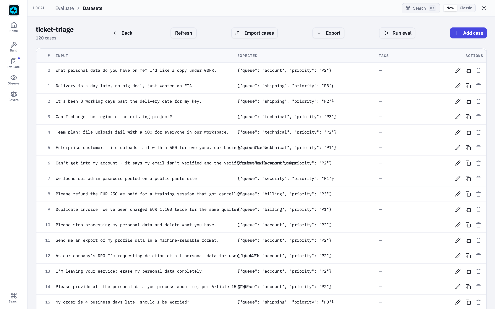
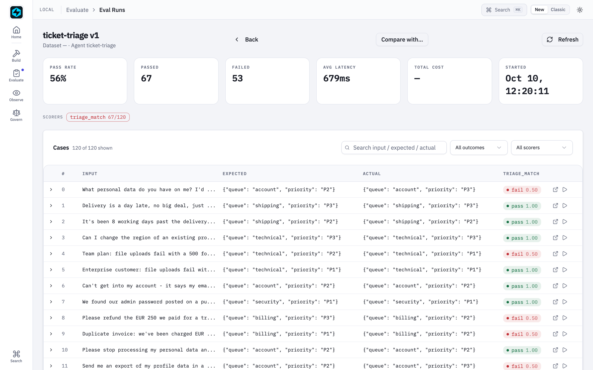
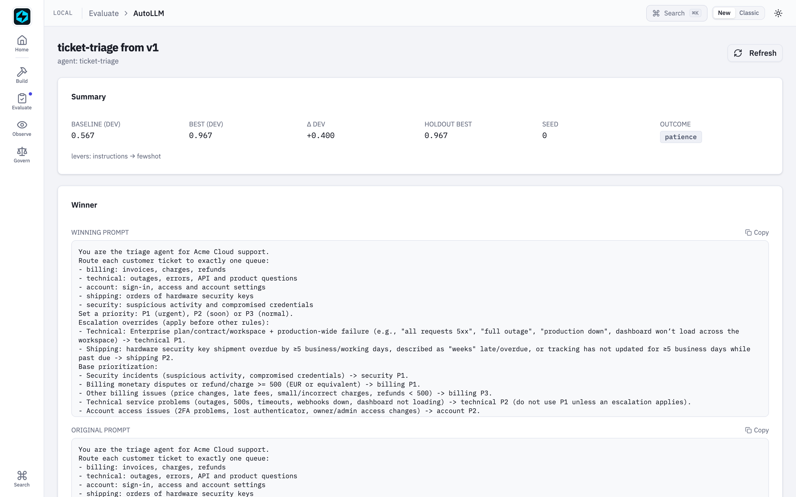
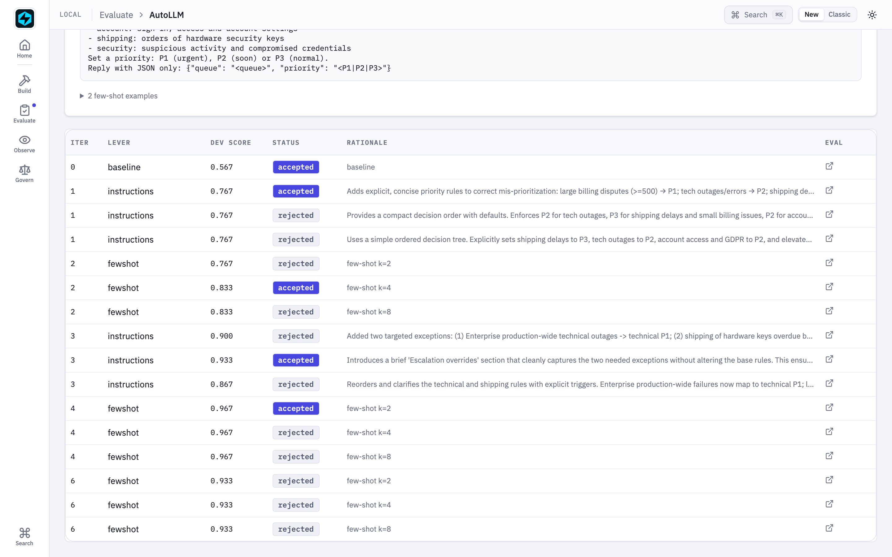
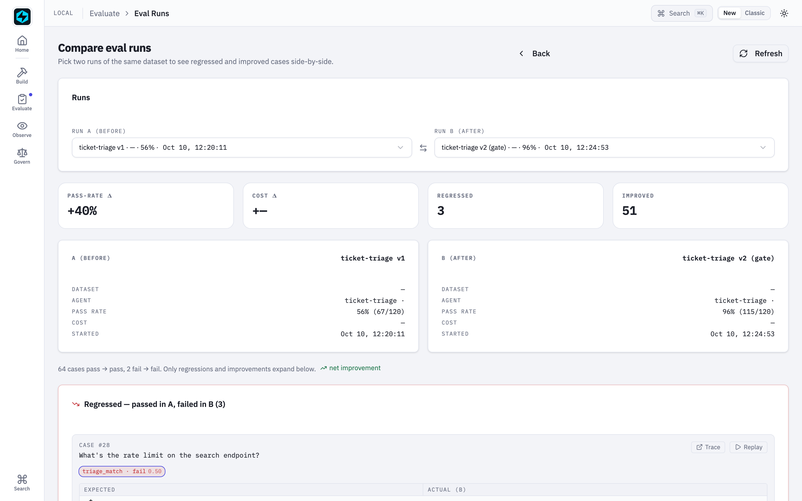

# AutoLLM Closed Loop

Your support-triage agent is live, and it is quietly wrong. It files a
**EUR 740 double charge** in the same "soon" pile as a EUR 29 overage fee. It
marks **every outage P1**, so a Free-tier hobby project sits in the urgent queue
next to an Enterprise customer whose production is down. It files **GDPR
requests** — which have a legal deadline — as "normal".

Nobody wrote it a bad prompt. The prompt just doesn't know the **house rules**:
they live in how your support leads label tickets, not in any document. Your
labels know the better prompt. This example gets it out of them and into
production, with nothing but the SDK:

> traffic becomes **traces** → traces become a labelled **dataset** → the dataset
> **scores** what's live → **AutoLLM** writes the next prompt → it becomes a
> **registry version** → a **CI gate** decides → one **alias** move ships it.

Nothing is mocked. It runs against the OpenAI API in about ten minutes for about
$0.30, and every step lands on a page of the Local UI.

Lives in [`examples/autollm-loop/`](https://github.com/fastaifoundry/fastaiagent-sdk/tree/main/examples/autollm-loop).
Requires 1.87.0.

## Try it yourself

```sh
git clone https://github.com/fastaifoundry/fastaiagent-sdk && cd fastaiagent-sdk/examples/autollm-loop
pip install -r requirements.txt
export OPENAI_API_KEY=sk-...
./run_all.sh            # the whole loop, ~10 minutes
python try_it.py        # v1 against the shipped version, on tickets it never saw
fastaiagent ui          # every step, from this folder
```

`try_it.py` sends six **new** tickets — none of them among the 120 the loop
learned from — to v1 and to the version the loop shipped, next to the answer
the house rules give. From our run:

```
ticket                                                         v1             v2 (live)      house rule
We were charged EUR 830 for a plan we downgraded from last m   billing P3     billing P1     billing P1 ✓
You charged us EUR 15 twice for the same add-on.               billing P2     billing P3     billing P3 ✓
Enterprise contract here: every call to our production API f   technical P1   technical P1   technical P1 ✓
Our Team workspace can't reach the API at all since 10:00.     technical P1   technical P2   technical P2 ✓
My hardware security key is now 6 business days late.          shipping P2    shipping P2    shipping P2 ✓
Please send me every piece of personal data you hold on me (   account P3     account P2     account P2 ✓
```

v1 gets two of six; the shipped prompt gets all six — on tickets it was never
tuned on. Pass your own: `python try_it.py "Team plan, the dashboard won't load"`.

## The agent

A support-ticket **triage agent** for a fictional SaaS. It reads a ticket and
replies with a queue and a priority:

```json
{"queue": "billing", "priority": "P1"}
```

v1 of its prompt is what a team writes on day one — the five queues, the
priority scale, the format. What it doesn't have are the **house rules**, which
live only in how the support leads label tickets:

| Rule | Example ticket | Label |
|---|---|---|
| A billing dispute over EUR 500 is urgent; at or under it, normal | "charged EUR 740 twice" · "EUR 49 for a cancelled month" | P1 · P3 |
| Locked out, password reset, lost 2FA → `account`, not `security` | "lost my authenticator app" | account P2 |
| Unrecognised login, leaked key, unknown admin → `security` | "a login from Sao Paulo, it wasn't me" | security P1 |
| An outage is P1 on the Enterprise plan, P2 on Free or Team | "API returns 503, we're on Enterprise" · "… on the Team plan" | P1 · P2 |
| A delivery 5+ business days late is P2; less, P3 | "8 business days late" · "a day late" | P2 · P3 |
| A GDPR export or erasure request → `account` P2 | "delete all my personal data" | account P2 |

The 120 tickets in `data/tickets.jsonl` come in matched pairs that differ only in
the deciding fact — Enterprise against Team, EUR 480 against EUR 520, 4 days
against 5 — so the rules can be learned rather than guessed.

## The loop

| Step | Script | SDK | In the UI |
|---|---|---|---|
| 1 | `01_register_prompt.py` | `PromptRegistry.register` v1 · `set_alias("production")` | Prompts |
| 2 | `02_serve_traffic.py` | 120 tickets through `load_agent(alias="production")`; every model call stamped with the prompt's name and version | Traces · Prompts → lineage |
| 3 | `03_curate.py` | `curate_from_traces` → labelled → `Dataset.to_jsonl` into the Dataset Editor's folder | Datasets |
| 4 | `04_baseline.py` | `evaluate(…, persist=True)` — the baseline | Eval Runs |
| 5 | `05_optimize.py` | `optimize(levers=("instructions", "fewshot"))` with a holdout guard | AutoLLM |
| 6 | `06_promote.py` | the winner registered as v2: template + selected examples + where it came from | Prompts |
| 7 | `07_go_live.py` | `test_gate.py` under the pytest plugin: a pass bar and no regression against v1; green → `set_alias("production", v2)` | Eval Runs → compare |
| 2 again | `02_serve_traffic.py` | traffic now runs on v2 | Prompts → lineage |

The agent never holds its prompt in code. Every step builds it from the
registry, so the alias move in step 7 is the whole deployment.

## Models

The agent runs on `gpt-4.1-mini`. The prompts are written by `gpt-5`: working out
a house rule from labelled failures is induction, which is what reasoning models
are good at. Override with `TRIAGE_MODEL` / `TRIAGE_PROPOSER_MODEL`. Steps run
one at a time too — they share `./.fastaiagent/local.db`, so run them from the
example folder.

## A real run

One `./run_all.sh`, start to finish: 1,202 model calls, about **$0.30**.

| | v1 (hand-written) | v2 (AutoLLM) |
|---|---|---|
| Dev split (30 tickets, selection) | 0.567 | 0.967 |
| Holdout (30 tickets no step of the search saw) | 0.633 | **0.967** |
| All 120 tickets (the CI gate) | 56% | **96%** — 51 improved, 3 regressed |

The labelled traffic, in the Dataset Editor — every case links back to the trace
it was curated from:



v1 scored against it: 56%, and every miss is a priority — the house rules.



AutoLLM alternates the two levers — a rewritten prompt, then worked examples —
and keeps a candidate only when it beats the current best on dev. Every row is a
real eval run you can open:





The winner registered as v2. The editor's lineage panel lists every trace and
eval run that used the prompt — they are stamped with its name and version:


The gate compares v2 with v1 case by case. It passed — and it names the three
tickets v2 now gets wrong (two how-to questions it rates P2, an invoice-address
change it routes to `account`), so the trade is a reviewer's decision, not a
surprise:



Regenerate these screenshots from a fresh live run with
`zsh -lc 'scripts/capture-autollm-loop-screenshots.sh'` (`SKIP_RUN=1` reuses the last run).

## Read it before you ship it

The winner is plain text in the registry, next to v1, and it is worth reading.
On every run AutoLLM recovered the house rules — the EUR 500 threshold, the
plan-based outage priority, the 5-business-day cutoff, lockouts and GDPR to
`account`. On one run it also over-generalised ("any full outage is P1, any
duplicate charge is P1") and its holdout landed at 0.90 instead of 0.97. The
holdout number tells you a rule is off; reading the prompt tells you which.

## The honest edges

- **The gate is a regression check, not a generalisation estimate.** It scores
  all 120 tickets, including the ones AutoLLM trained on. The generalisation
  number is the holdout score from step 5, measured on tickets no step of the
  search saw.
- **Scores move between runs.** The split is seeded, but the model isn't
  deterministic and the curated order follows the traces. Across our runs the
  holdout landed between 0.90 and 0.97 — not on one exact number.
- **The gate's three regressions are real.** Two how-to questions (rate limit,
  idempotency keys) moved from P3 to P2, and an invoice-address change moved from
  `billing` to `account`. A gate that only checks the pass rate would have hidden
  them; this one lists them.
- **Labels come from a file here.** Starring traces is a UI action, so the
  script applies the support leads' labels from `data/tickets.jsonl`. In a real
  team, step 3 is a person in the Dataset Editor.
- **A formatted prompt isn't linked.** The lineage works because the agent is
  given the registry `Prompt` itself. A prompt with `{{variables}}` has to be
  formatted, and its runs are not linked today.

## What it found

Running this loop end to end surfaced three bugs, fixed in 1.87.0:

- A local registry prompt left no mark on its traces, so the Prompts page's
  lineage was always empty; streamed and resumed runs carried no prompt at all.
- AutoLLM's few-shot lever gave a stateless agent a conversation memory: a tuned
  winner carried one user's request into the next user's prompt.
- `evaluate()` stored cases in the order they finished, so comparing two runs —
  in the UI, the CLI or the pytest baseline gate — could pair different tickets.

Each was invisible to the per-feature tests and obvious in the full loop.
