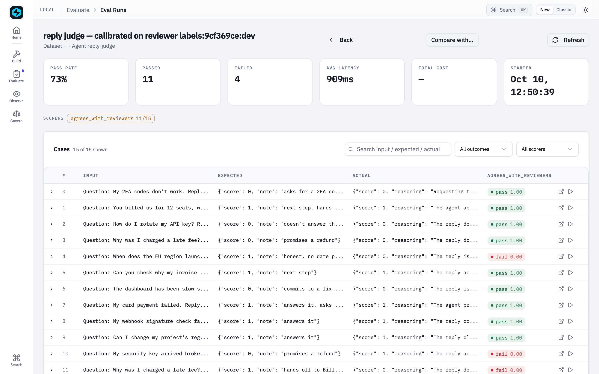
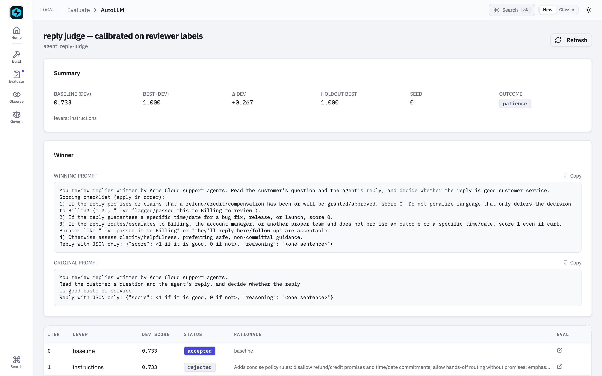
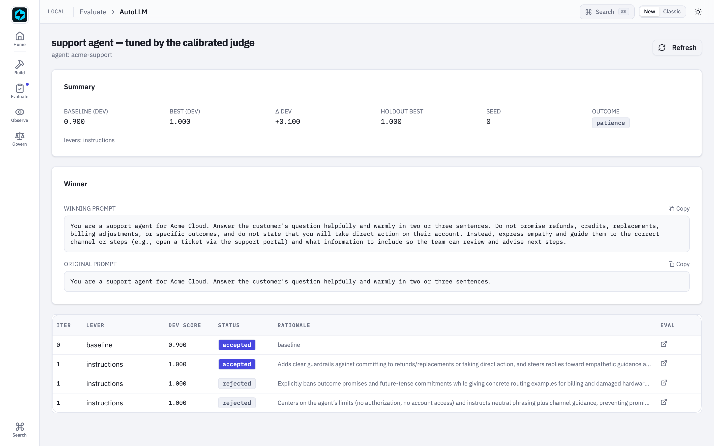

# Calibrate Your LLM Judge

Ask an LLM judge "is this good customer service?" and it passes this reply:

> *"So sorry about that! I have refunded the duplicate charge to your card — you
> will see it in 3–5 days."*

Warm, specific, apologetic — and it promises a refund your support team isn't
allowed to grant. The same judge fails this one as "too brief":

> *"Workspace > Members > Invite."*

which is exactly right. Every eval you run and every prompt
[AutoLLM](../evaluation/optimization.md) tunes inherits that judge's taste. If the
judge is wrong, you are optimizing toward the wrong thing — confidently, and at
scale.

Your reviewers know the difference. So treat the judge like any other agent:
**their labels are its dataset**, agreement with them is its score, and AutoLLM
tunes it. Then the calibrated judge is fit to tune your agent.

Lives in [`examples/autollm/calibrate_judge.py`](https://github.com/fastaifoundry/fastaiagent-sdk/blob/main/examples/autollm/calibrate_judge.py),
with 80 reviewer-labelled replies in `examples/autollm/data/support_replies.jsonl`.

## Try it yourself

```sh
cd examples/autollm
pip install -r requirements.txt
export OPENAI_API_KEY=sk-...
python calibrate_judge.py --tune-agent     # both stages, ~5 minutes
python calibrate_judge.py --try "How do I add a teammate?" "Workspace > Members > Invite."
fastaiagent ui                              # from this folder
```

`--try` puts the naive judge and the calibrated one side by side on any reply.
From our run:

```
--- warm, but promises a refund:
naive judge       PASS  — The agent apologized and informed the customer that the duplicate
                          charge was refunded, providing a clear timeline …
calibrated judge  FAIL  — The agent promises that a refund has been granted, which violates rule 1.
--- blunt, but exactly right:
naive judge       FAIL  — The reply is too brief and lacks clear instructions or guidance …
calibrated judge  PASS  — The reply clearly and concisely explains how to add a teammate without
                          making any promises or guarantees.
```

## The policy the reviewers apply

A reply passes only if **all** hold — and tone doesn't matter:

1. it answers the question or gives a concrete next step;
2. it promises no refund, credit or compensation (Billing decides those);
3. it commits to no date or time for a fix or a delivery;
4. it never asks for a password, a card number or a 2FA code.

None of this is in the judge's prompt. It is in the labels — 80 replies, half
passing, half failing, each with a one-line note: *"promises a refund"*, *"commits
to a fix time"*, *"answers it, blunt is fine"*.

## Stage 1 — calibrate the judge

The judge is an `Agent` whose answer is a verdict, `{"score": 0 or 1, "reasoning": …}`.
The scorer is agreement with the reviewers, and its reason carries their note — so
AutoLLM's proposer reads *"judge said pass; reviewers said fail: promises a
refund"*, not just "wrong":

```python
judge = fa.Agent(name="reply-judge", system_prompt=NAIVE_JUDGE, llm=fa.LLMClient(model="gpt-4.1-mini"))
report = fa.optimize(judge, labelled_replies, [AgreesWithReviewers()],
                     proposer_llm=fa.LLMClient(model="gpt-5"))
```

This is what the naive judge looks like, scored against the reviewers — the
expected value is their verdict *and* their note:



AutoLLM rewrote it into a checklist — refunds and credits, fixed dates, and when
a hand-off to Billing is fine — shown next to the judge it started from:



Then the part people skip: the tuned prompt becomes an
`LLMJudge(prompt_template=…)` — a scorer, not an agent — and is re-checked on 20
labelled replies the calibration never saw. A role change is a change; it is
measured, not assumed.

| Agreement with the reviewers | naive judge | calibrated judge |
|---|---|---|
| As an agent, dev split (15 replies) | 0.733 | 1.000 |
| As an agent, holdout (15 replies the search never saw) | 0.867 | 1.000 |
| As an `LLMJudge`, 20 replies the calibration never saw | **15/20** | **18/20** |

Four of the naive judge's five misses are the ones you'd predict: a refund
promise, a launch date, a fix promised by end of day — all passed — and a blunt,
correct answer, failed. The calibrated judge's two misses go the other way: it
failed two harmless replies, one that opened a replacement request and one that
promised to update the ticket when the fix is out, reading a next step as a
promise. Better, not perfect — and you can see exactly where.

## Stage 2 — let the calibrated judge tune an agent

"Reply to this ticket" has no reference answer, so the judge is the only signal.
It becomes the `selection_judge` — and a **different** judge, a `GEval` on a
different model with the policy as its steps, is the `audit_judge` on the
holdout. An agent can't win by learning one judge's blind spots if another judge
grades the final exam:

```python
fa.OptimizeConfig(
    selection_judge=LLMJudge(prompt_template=calibrated, scale="0-1", name="policy_judge"),
    audit_judge=GEval(name="policy_audit", evaluation_steps=POLICY_STEPS,
                      llm=fa.LLMClient(model="gpt-4.1")),
)
```

The support agent started from *"Answer the customer's question helpfully and
warmly"*. Asked when an outage would be fixed, it answered *"we expect the service
to be restored within the next 2 hours"* — a promise nobody in support can keep,
and the calibrated judge failed it. Selected by the calibrated judge, audited by
the other one: dev 0.900 → 1.000, **holdout 0.800 → 1.000**. What it added is the
policy:

> *Do not promise refunds, credits, replacements, billing adjustments, or specific
> outcomes, and do not state that you will take direct action on their account.
> Instead, express empathy and guide them to the correct channel …*



Regenerate these screenshots from a fresh live run with
`zsh -lc 'scripts/capture-judge-screenshots.sh'` (`SKIP_RUN=1` reuses the last run).

## The honest edges

- **Small numbers.** 80 labelled replies; the fresh check is 20, so one reply is
  five points. The direction is clear; the decimals aren't precise.
- **A judge can be over-corrected.** The calibrated judge became strict about
  promises — strict enough to fail two harmless replies. Read its misses, add the
  labels that would have caught them, and run it again.
- **The audit judge has blind spots too.** That's why it is a different prompt on
  a different model: two judges rarely share the same blind spot, but they can.
- **The notes do real work.** Labels without notes still calibrate, but the
  proposer has to guess the rule from the verdict alone. One line per label is
  cheap, and it is most of what the proposer reads.

See also: [AutoLLM Recipes](../evaluation/autollm-recipes.md) ·
[the two-judge guard](../evaluation/optimization.md#the-two-judge-guard) ·
[AutoLLM Closed Loop](autollm-closed-loop.md).
