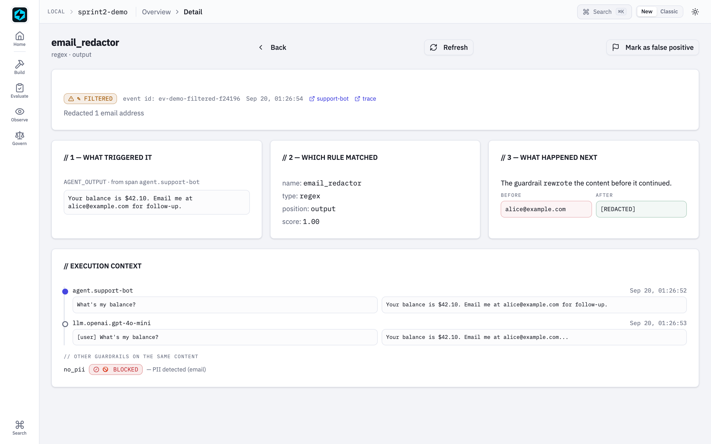
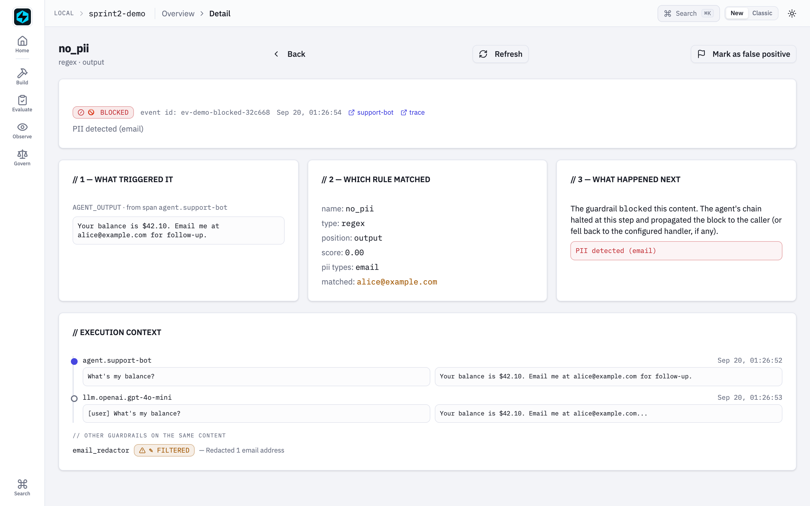

# A Guardrail Breaks at the Boundaries

*Six places a safety control goes wrong between the data and the verdict, how FastAIAgent holds each one, and a proof you can run for every claim.*

*Requires FastAIAgent 1.87.0+ · [Download this page as a PDF](img/boundaries/guardrails-at-the-boundaries.pdf)*

FastAIAgent already lets you *see* a guardrail fire: every check leaves a span, on a pass as well as a block, with its verdict and what it cost, and the Local UI's [Guardrails page](../ui/guardrail-events.md) shows what triggered it, which rule matched, and what happened next (see [Guardrails](index.md)).

Seeing a verdict is not the same as trusting it. A guardrail is a safety control, and a control that fails open is worse than none: it reports green over a payload nobody inspected. So it has to hold wherever two things meet:

- the gate and the run it sits in;
- a failure and what it costs;
- "could not run" and "found nothing";
- the verdict and the trace;
- your code and the plane's rule;
- the agent loop and everything outside it.

Those six boundaries are where guardrails go wrong.

This page explains how FastAIAgent's guardrails work, one boundary at a time. Each section has a diagram, the rule the SDK follows, a proof, and the code: the SDK source that implements the rule and the script that proves it. The proofs are in [`examples/guardrails/proofs/`](https://github.com/fastaifoundry/fastaiagent-sdk/tree/main/examples/guardrails/proofs) and run against the published SDK: real agents on the SDK's own offline models, real rules, real spans. Six run offline and run in CI, so what this page quotes can't drift from what the SDK does; one calls `gpt-4.1-mini` for the model-backed judges. Every output below came out of one of those runs.

---

## First: a guardrail is a position and three questions

A guardrail is an assertion at one of four gates on the run loop. What makes it hard is not the assertion; it is the three questions every rule has to answer about itself, and the one object every answer has to fit in.


*Four gates on the loop. Three independent fields. One result object, and one span per rule that ran.*

- **The position** is where the rule sits: `input` before the model sees the user, `tool_call` on a tool's arguments, `tool_result` on what the tool returned, `output` on the final answer. A tool call fires two gates per call, every time round the loop.
- **`blocking`** is scheduling: does the rule run inline and can it halt? An observer (`blocking=False`) runs after, in parallel, and never halts.
- **`on_error`** is degradation: what does a check that *could not run* mean? `block` fails closed, `allow` fails open.
- **`action`** is consequence: what does a genuine failure cost? `block`, `warn`, `mask`, `override` or `reask`.
- **The result** is one `GuardrailResult`: `passed`, `errored`, `action`, `action_taken`, `modified_data`. Every caller branches on `action_taken`, what the rule did, never on `action`, what it was told.

You declare all of it on one object:

```python
Guardrail(
    name="no-ssn",
    guardrail_type=GuardrailType.regex,       # how it decides: code, regex, schema, llm_judge, …
    position=GuardrailPosition.output,         # which gate
    config={"pattern": r"\b\d{3}-\d{2}-\d{4}\b"},
    blocking=True,                              # inline, can halt
    on_error="block",                           # an un-runnable check fails closed
    action="mask",                              # a failure redacts rather than refuses
)
agent = Agent(name="support", llm=llm, guardrails=[no_pii(), rule])
```

The rest of this page is what that object has to get right.

**Code:** the object is [`guardrail/guardrail.py`](https://github.com/fastaifoundry/fastaiagent-sdk/blob/main/fastaiagent/guardrail/guardrail.py) (`Guardrail`, `GuardrailResult`); the executor is [`guardrail/executor.py`](https://github.com/fastaifoundry/fastaiagent-sdk/blob/main/fastaiagent/guardrail/executor.py); the ten deciders are [`guardrail/implementations.py`](https://github.com/fastaifoundry/fastaiagent-sdk/blob/main/fastaiagent/guardrail/implementations.py); the gates are called from [`agent/agent.py`](https://github.com/fastaifoundry/fastaiagent-sdk/blob/main/fastaiagent/agent/agent.py) and [`agent/executor.py`](https://github.com/fastaifoundry/fastaiagent-sdk/blob/main/fastaiagent/agent/executor.py). The builtins are [`examples/03_guardrails.py`](https://github.com/fastaifoundry/fastaiagent-sdk/blob/main/examples/03_guardrails.py).

---

## 1 · Between the gate and the run: the blocking rules first, the observers after

Several rules at one gate are not a set; they are a sequence and then a group. The order decides what a later rule sees and what runs at all.


*Blocking rules run one after another and the first failure stops everything after it. Observers run in parallel afterwards; one that fails, or crashes, is a failure on the record that cannot halt.*

The rules:

- **Blocking rules run first, sequentially, fail-fast.** The first one whose action halts raises `GuardrailBlockedError`; nothing after it runs, observers included.
- **Observers run after, in parallel**, on the payload as the blocking rules left it. An observer's failure is recorded with `action_taken="blocked"`; one that raises is recorded as `errored=True, passed=False`. Neither stops the run. "Does not stop the run" and "passes the payload" are different claims, and only the first is true.
- **Every firing lands on `AgentResult.guardrails`**, name, position, passed, errored and what it did, so a `warn` or an observer's failure is visible with no UI and no plane.
- **A tool call fires `tool_call` before the tool and `tool_result` after it**, for every call in the loop; `input` fires once before the model and `output` once on the answer.

Proof 1 puts one gate and two observers at `input`, then makes the gate fail, then runs a tool call through all four positions:

```
── one gate, two observers
ran, in order : ['input:gate', 'input:watch-a', 'input:watch-b']
run status    : completed · output: 'ok'
firings       : [('gate', True, False, 'none'), ('watch-a', False, False, 'blocked'), ('watch-b', False, True, 'blocked')]

── the gate fails: the observers never run
raised        : GuardrailBlockedError('gate'): gate: fail
ran, in order : ['input:gate']

── four positions, one tool call
ran, in order : ['input', 'tool_call', 'tool_result', 'output']
  input        judged str: 'Where is order 1042?'
  tool_call    judged str: '{"tool": "lookup", "arguments": {"order": "1042"'
  tool_result  judged str: 'order 1042: shipped'
  output       judged str: 'Order 1042 shipped.'
```

`watch-a` failed and `watch-b` crashed; the run completed and both are on the record as failures. When the gate failed, neither ran. A `tool_call` rule judges the tool name and its arguments as one JSON object; a `tool_result` rule judges what the tool returned.

**Code:** `execute_guardrails` in [`guardrail/executor.py`](https://github.com/fastaifoundry/fastaiagent-sdk/blob/main/fastaiagent/guardrail/executor.py); the firing collector is `start_firing_collection` in [`guardrail/guardrail.py`](https://github.com/fastaifoundry/fastaiagent-sdk/blob/main/fastaiagent/guardrail/guardrail.py); the tool gates are `_invoke_tool_with_span` in [`agent/executor.py`](https://github.com/fastaifoundry/fastaiagent-sdk/blob/main/fastaiagent/agent/executor.py). The proof is [`proof_1_positions.py`](https://github.com/fastaifoundry/fastaiagent-sdk/blob/main/examples/guardrails/proofs/proof_1_positions.py); [`tests/test_tool_guardrails.py`](https://github.com/fastaifoundry/fastaiagent-sdk/blob/main/tests/test_tool_guardrails.py) pins the tool positions and [`examples/23_tool_guardrails.py`](https://github.com/fastaifoundry/fastaiagent-sdk/blob/main/examples/23_tool_guardrails.py) shows them live.

---

## 2 · Between a failure and what it costs: the cost travels forward

Until 1.57.0 a guardrail had one consequence: raise. A rule an operator authored as "mask PII" blocked instead of redacting. The action axis is what a failure costs, and because two of the costs rewrite the payload, the rewrite has to travel to everything downstream.


*Five costs for the same failure. A mask's output is what the next rule judges and what the model, or the caller, receives. Where the rewrite cannot be applied, the run blocks rather than letting the payload through.*

The rules:

- **`block`** raises. **`warn`** records `warned` and continues untouched. **`mask`** redacts the offending spans and continues with the redacted payload. **`override`** replaces the payload with the operator's copy. **`reask`** re-drives the model, at `output` only, up to `guardrail_retries`; exhausting the cap blocks.
- **A rewrite travels forward.** The next blocking rule judges the rewritten text; at `input` the model is sent it; at `output` the caller receives it, with `parsed` re-derived.
- **An observer's rewrite is evidence, never applied.** The firing says `masked`; the payload is unchanged.
- **Where a rewrite cannot be applied faithfully, the run blocks.** A streamed reply has already left; multimodal input is judged as a summary of its parts; a tool-call rewrite that no longer parses as arguments; a tool result carrying image parts. Passing the payload through would defeat the control.
- **A mask that finds nothing to redact blocks**, and so does an errored check whatever its action: nothing is known about the payload, so nothing can be masked.

Proof 2 sends the same reply, with a social-security number in it, through all five costs:

```
── the same failure, five costs (output position)
block     → GuardrailBlockedError: Pattern matched: \b\d{3}-\d{2}-\d{4}\b
warn      → output="The customer's SSN is 123-45-6789."  firing=('ssn', False, False, 'warned')
mask      → output="The customer's SSN is [REDACTED]."  firing=('ssn', False, False, 'masked')
override  → output="I can't share that."  firing=('ssn', False, False, 'overridden')
reask     → output="The customer's SSN is on file."  model calls=2
            second call's last message: 'Your previous response was rejected: Pattern matched: …'

── a mask at input: what the model is sent
the model received: 'My SSN is [REDACTED], please update it.'

── a mask feeds the next rule
output : "The customer's SSN is [REDACTED]."
firings: [('mask-ssn', False, False, 'masked'), ('block-ssn', True, False, 'none')] — block-ssn judged the masked text

── an observer's rewrite is evidence, never applied
output : "The customer's SSN is 123-45-6789." · firing: ('watch-ssn', False, False, 'masked')

── where a rewrite cannot be applied: a streamed reply
already streamed: "The customer's SSN is 123-45-6789."
then            : A guardrail asked to rewrite this reply, but it has already been streamed to the caller and cannot be taken back; blocked instead. Use run()/arun() if this rule must rewrite the output.

── an errored check blocks whatever the action says
passed=False errored=True action='mask' action_taken='blocked'
```

Read the stream case: the text was already in the caller's hands when the output rule ran, so the rule could not un-send it, and the run was blocked after the fact. If a rewriting rule matters to you, don't stream that agent.


*A `mask` in the Local UI: what triggered it, which rule, and the before and after of the rewrite.*

**Code:** the five costs and `halts` are [`guardrail/actions.py`](https://github.com/fastaifoundry/fastaiagent-sdk/blob/main/fastaiagent/guardrail/actions.py) (`apply_action`, `mask_payload`, `degrade_to_block`); the rewrite lands through `GuardrailOutcome.data` in [`guardrail/executor.py`](https://github.com/fastaifoundry/fastaiagent-sdk/blob/main/fastaiagent/guardrail/executor.py); the re-ask loop and the stream refusal are in [`agent/agent.py`](https://github.com/fastaifoundry/fastaiagent-sdk/blob/main/fastaiagent/agent/agent.py). The proof is [`proof_2_actions.py`](https://github.com/fastaifoundry/fastaiagent-sdk/blob/main/examples/guardrails/proofs/proof_2_actions.py); [`tests/test_guardrail_action_paths.py`](https://github.com/fastaifoundry/fastaiagent-sdk/blob/main/tests/test_guardrail_action_paths.py) drives every position; see [Actions, severity & floor](actions.md) and [`examples/97_guardrail_actions.py`](https://github.com/fastaifoundry/fastaiagent-sdk/blob/main/examples/97_guardrail_actions.py).

---

## 3 · Between "could not run" and "found nothing"

A check can fail in two ways that look alike from outside: it ran and found something wrong, or it never ran at all. A safety control that reports the second as a clean pass has failed open while looking green.


*Two kinds of failure. The second carries `errored=True` and is decided by `on_error`, not by the verdict. A configuration that cannot check anything is the second kind.*

The rules:

- **A runner that raises becomes `errored=True`** at one choke point, and `on_error` decides: `allow` passes (fail open), `block` fails (fail closed). The result is never mistaken for a real verdict.
- **A configuration that cannot check anything errors.** An empty schema, an empty pattern, no entities, no topics, a mistyped mode, a backend that does not exist, a groundedness rule with no context: all report that they could not run, never "no PII found". This invariant was broken in three consecutive releases, once per type; the sweep that holds it fails when a new type ships without that case.
- **An errored check blocks whatever its action.** A `mask` with nothing known about the payload has nothing to mask.
- **A missing slot is not a pass.** A `groundedness` rule reads its context from the run-scoped slot `fa.guardrail_context(context=…)`; without it the rule errors.

Proof 3 runs a crashing check under both policies, then ten unusable configurations through the real runners:

```
── on_error: what an un-runnable check means
on_error=allow → run completed · firing=('moderation', True, True, 'none')
on_error=block → GuardrailBlockedError: moderation errored (on_error=block): moderation API timed out

── a configuration that cannot check anything
type            config                           passed errored  message
schema          {}                               False  True     u-schema errored (on_error=block): schema guardrail
schema          {'schema': {}}                   False  True     u-schema errored (on_error=block): schema guardrail
regex           {'pattern': ''}                  False  True     u-regex errored (on_error=block): regex guardrail 'u
classifier      {'categories': {}}               False  True     u-classifier errored (on_error=block): classifier gu
pii             {'entities': []}                 False  True     u-pii errored (on_error=block): pii guardrail names
pii             {'backend': 'presidoo'}          False  True     u-pii errored (on_error=block): pii guardrail backen
topic           {'topics': []}                   False  True     u-topic errored (on_error=block): topic guardrail na
topic           {'topics': ['ok'], 'mode': 'denyy'} False  True     u-topic errored (on_error=block): topic guardrail mo
content_safety  {'categories': ['S99']}          False  True     u-content_safety errored (on_error=block): content_s
groundedness    {}                               False  True     u-groundedness errored (on_error=block): groundednes

── errored always blocks, whatever the action
action='mask' → action_taken='blocked' errored=True

── a builtin that cannot price the run
cost_limit outside a run → passed=False errored=True: cost_limit errored (on_error=block): cost_limit(max_usd=1.0) cannot ch…
```

The fail-open firing says `passed=True, errored=True`: a degraded pass is visible as one. And `cost_limit` outside a run, where there is no spend to read, errors rather than certifying an unknown as under budget.

The model-backed judges keep the same rule. The live companion runs a `topic` rule and a `groundedness` rule on `gpt-4.1-mini`:

```
── topic, mode=deny: the judge names what it found
passed=True  matched=[]  ← 'Our Pro plan is $40 a month.'
passed=False matched=['competitor pricing']  ← 'Acme charges $35 for the same tier, so we are pricier.'

── groundedness: the context comes from the run-scoped slot
with context    → passed=False score=0.5 unsupported=['support is available on weekends']
without context → passed=False errored=True: grounded errored (on_error=block): groundedness has no context to judge against: set it wi…
```

The judge named the topic, and the groundedness judge quoted the unsupported claim. Take the context away and the rule did not pass: it reported that it could not run.

**Code:** the choke point is `run_guardrail` in [`guardrail/implementations.py`](https://github.com/fastaifoundry/fastaiagent-sdk/blob/main/fastaiagent/guardrail/implementations.py); the slot is [`guardrail/context.py`](https://github.com/fastaifoundry/fastaiagent-sdk/blob/main/fastaiagent/guardrail/context.py); the judges' prompts and parsers are [`guardrail/topics.py`](https://github.com/fastaifoundry/fastaiagent-sdk/blob/main/fastaiagent/guardrail/topics.py), [`grounding.py`](https://github.com/fastaifoundry/fastaiagent-sdk/blob/main/fastaiagent/guardrail/grounding.py) and [`hazard_taxonomy.py`](https://github.com/fastaifoundry/fastaiagent-sdk/blob/main/fastaiagent/guardrail/hazard_taxonomy.py), mirrored from the plane. The proofs are [`proof_3_could_not_run.py`](https://github.com/fastaifoundry/fastaiagent-sdk/blob/main/examples/guardrails/proofs/proof_3_could_not_run.py) and [`proof_3b_judges.py`](https://github.com/fastaifoundry/fastaiagent-sdk/blob/main/examples/guardrails/proofs/proof_3b_judges.py) (needs `OPENAI_API_KEY`); the invariant is swept by [`tests/test_guardrail_unusable_config_sweep.py`](https://github.com/fastaifoundry/fastaiagent-sdk/blob/main/tests/test_guardrail_unusable_config_sweep.py) and `on_error` by [`tests/test_guardrail_on_error.py`](https://github.com/fastaifoundry/fastaiagent-sdk/blob/main/tests/test_guardrail_on_error.py); see [`examples/91_guardrail_on_error.py`](https://github.com/fastaifoundry/fastaiagent-sdk/blob/main/examples/91_guardrail_on_error.py) and [`98_topic_guardrail.py`](https://github.com/fastaifoundry/fastaiagent-sdk/blob/main/examples/98_topic_guardrail.py).

---

## 4 · Between the verdict and the trace: one span per rule, an allowlist for the detail

A verdict nobody can see is not a control anyone can audit. A verdict that carries the payload it judged into a central database is a different problem. The span sits between those two.


*One span per rule, with the verdict and what it cost. The detail is an allowlist per type: counts, names, scores and thresholds, never the matched text. A type not on the list exports no detail at all.*

The rules:

- **Every rule that runs leaves one child span**, `guardrail.<name>`, on a pass as well as a block, with the OpenInference kind `GUARDRAIL` and the verdict under `fastaiagent.guardrail.*`: name, position, passed, errored, checks, action, action_taken, severity, floor.
- **`detail` is an allowlist, not a filter.** `EXPORTABLE_DETAIL_KEYS` names, per type, the keys the runtime will put on the span: for `pii` the backend, the entities scanned, the ones found and their counts; for `topic` the mode and the matched topics; for `groundedness` the score, the threshold and up to five clipped claims. A type absent from it exports nothing. A match's value, a regex fragment, a judge's raw reply never reach the span.
- **Local capture keeps the full result.** The Local UI reads `result.metadata` from `local.db`; the plane reads the span.
- **Export is filtered.** `fastaiagent.guardrail.detail` is in the egress registry, so with `FASTAIAGENT_TRACE_PAYLOADS=0` it is dropped on the way out and the verdict fields stay. The rule's message rides on the exception event and is gated separately.

Proof 4 runs a pass, a `pii` block and a `regex` observer and reads their spans:

```
── one span per rule, pass and block alike
run      : blocked by no-email
span     : {"name": "length", "position": "output", "passed": true, "errored": false, "checks": "[{\"name\": \"length\", \"result\": \"pass\"}]", "action": "block", "action_taken": "none", "floor": false}
span     : {"name": "no-email", "position": "output", "passed": false, "errored": false, "checks": "[{\"name\": \"no-email\", \"result\": \"block\"}]", "action": "block", "action_taken": "blocked", "floor": false, "detail": "{\"ba…

── what stays local vs what the span carries
no-email (pii)
  result.metadata, local : {"backend": "regex", "entities": ["email", "phone"], "found": ["email"], "counts": {"email": 1}, "total": 1}
  span detail, exported  : {"backend": "regex", "entities": ["email", "phone"], "found": ["email"], "counts": {"email": 1}, "total": 1}
no-ssn (regex)
  result.metadata, local : {}
  span detail, exported  : None

── the export policy with FASTAIAGENT_TRACE_PAYLOADS=0
kept   : ['action', 'action_taken', 'checks', 'errored', 'floor', 'name', 'passed', 'position']
dropped: ['detail']
```

The `pii` detector reports counts and never values, so its allowlisted detail is the whole of its metadata; the regex rule has no allowlist entry and its span carries no detail. With payloads off, the detail leaves and the verdict stays.


*The same verdict in the Local UI, read from the full local result: the span content it judged, the rule, and what the agent received.*

**Code:** `_emit_guardrail_span` and `EXPORTABLE_DETAIL_KEYS` in [`guardrail/executor.py`](https://github.com/fastaifoundry/fastaiagent-sdk/blob/main/fastaiagent/guardrail/executor.py); `emit_guardrail` and `set_guardrail_attributes` in [`trace/span.py`](https://github.com/fastaifoundry/fastaiagent-sdk/blob/main/fastaiagent/trace/span.py); the registries in [`trace/redaction.py`](https://github.com/fastaifoundry/fastaiagent-sdk/blob/main/fastaiagent/trace/redaction.py). The proof is [`proof_4_trace.py`](https://github.com/fastaifoundry/fastaiagent-sdk/blob/main/examples/guardrails/proofs/proof_4_trace.py); [`tests/test_guardrail_egress_and_containment.py`](https://github.com/fastaifoundry/fastaiagent-sdk/blob/main/tests/test_guardrail_egress_and_containment.py) pins the three egress channels and [`tests/test_guardrail_observability.py`](https://github.com/fastaifoundry/fastaiagent-sdk/blob/main/tests/test_guardrail_observability.py) the span; see [What lands on the trace](actions.md#what-lands-on-the-trace) and [`examples/51_guardrail_events.py`](https://github.com/fastaifoundry/fastaiagent-sdk/blob/main/examples/51_guardrail_events.py).

---

## 5 · Between your code and the plane's rule: authored centrally, enforced at the edge

The plane authors, distributes and records; the SDK executes. The one contract that binds them is that a rule the plane distributes is executed faithfully at the edge: the same verdict, the same outcome class. The boundary is the wire that carries the rule.


*A rule arrives as a dict and is rebuilt onto the same runners a local rule uses. What cannot be rebuilt is skipped and logged. What was rebuilt is never pushed back up as the agent's own.*

The rules:

- **A plane rule is rebuilt onto the SDK's own runners.** `regex`, `schema`, `classifier`, `llm_judge`, `content_safety`, `groundedness`, `topic`, `pii` and `secrets` are reconstructed from `config` alone and enforced beside the agent's local rules, by the same executor.
- **What cannot be rebuilt is skipped, never passed.** A `code` rule's logic is a server-side callable the SDK does not have; an unknown implementation type is one this build has never heard of. Both return `None` and are logged.
- **The wire is coerced on the way in.** The plane's single `tool` position means `tool_call`; an action this build cannot perform becomes `block`; `severity` and `floor` are carried for display.
- **A plane rule is never echoed back.** `to_dict()` lists the agent's local rules only, so a domain-wide rule is not narrowed to the agents that happened to carry it.
- **The detectors agree, case by case.** `tests/data/guardrail_conformance.json` is byte-identical in both repos; each side runs it through its own runners. A case marked `raises` must raise, never read as "found nothing".

Proof 5 builds a rule from the plane's own shape and runs the shared fixture, without contacting a plane:

```
── a plane rule becomes a runtime guardrail
type=regex position=tool_call blocking=True action='block' severity=high floor=True origin=plane
implementation_type='code'     → None
implementation_type='quantum'  → None

── a plane rule is enforced beside local rules, never pushed back as one
agent.to_dict()['guardrails'] → ['local-length']

── the shared conformance fixture, run through the SDK's detectors
fixture version 1: 26/26 cases agree (15 pii · 5 secrets · 6 mask)
cases that must raise, not pass: ["an empty entity list is refused, never read as 'found nothing'", 'an unknown entity is refused rather than silently dropped', …]
```

The rule arrived with an action the SDK does not know, `redact-and-notify`, and became `block`: the safe reading for a safety control. A managed approval policy is the other direction of the same wire: a policy-gated tool call pauses the run for your application to resolve; see [Managed governance](managed-governance.md).

**Code:** `guardrail_from_policy_rule` and `plane_guardrails_for_agent` in [`guardrail/from_policy.py`](https://github.com/fastaifoundry/fastaiagent-sdk/blob/main/fastaiagent/guardrail/from_policy.py); the coercions in [`guardrail/actions.py`](https://github.com/fastaifoundry/fastaiagent-sdk/blob/main/fastaiagent/guardrail/actions.py); the detectors in [`_internal/safety_detectors.py`](https://github.com/fastaifoundry/fastaiagent-sdk/blob/main/fastaiagent/_internal/safety_detectors.py), which the plane mirrors. The proof is [`proof_5_plane_rule.py`](https://github.com/fastaifoundry/fastaiagent-sdk/blob/main/examples/guardrails/proofs/proof_5_plane_rule.py); the fixture is [`tests/data/guardrail_conformance.json`](https://github.com/fastaifoundry/fastaiagent-sdk/blob/main/tests/data/guardrail_conformance.json) with [`tests/test_guardrail_conformance.py`](https://github.com/fastaifoundry/fastaiagent-sdk/blob/main/tests/test_guardrail_conformance.py) and [`tests/test_guardrail_from_policy.py`](https://github.com/fastaifoundry/fastaiagent-sdk/blob/main/tests/test_guardrail_from_policy.py); live: [`examples/92_plane_authored_guardrails.py`](https://github.com/fastaifoundry/fastaiagent-sdk/blob/main/examples/92_plane_authored_guardrails.py).

---

## 6 · Between the agent loop and everything outside it: a round-trip, a rerun, a foreign runtime

A rule does not only run inside `Agent.run()`. It leaves the process as a dict, to the plane, to `local.db`, to a replay. It comes back through `from_dict`. And it is borrowed by frameworks that own neither the payload nor the loop. Each crossing can disarm it quietly.


*What survives the dict depends on the type. What cannot travel errors when it runs. A proxy that cannot rewrite blocks instead.*

The rules:

- **Config-based types round-trip whole**: the same verdict before and after.
- **A builtin comes back armed by name.** `no_pii`, `no_secrets`, `toxicity_check`, `json_valid`, `no_prompt_injection` and `openai_moderation` are a closed set of zero-argument factories, so `from_dict` restores their callable. That is what makes a Replay rerun a reproduction rather than a rerun with the controls off.
- **A custom `fn` and a parameterised builtin cannot travel.** `to_dict()` never carries `fn=`, and `cost_limit(1.0)`'s budget lived in a constructor argument. The restored rule **errors at execution** (since 1.64.0) rather than reporting a clean pass over a payload nothing inspected.
- **A foreign-framework proxy can honour `block` and `warn`.** The LangChain, CrewAI and PydanticAI proxies own the verdict but not the payload or the loop, so `mask`, `override` and `reask` block there, and say why. `run_guardrail` computes; `emit_guardrail` reports on the framework's own tracer.

Proof 6 round-trips five rules and asks the harness helper what a proxy may do with each outcome:

```
── what survives a round-trip
rule                     before: passed  after: passed  errored  message
regex (config)           False           False          False    Pattern matched: \d{3}-\d{2}-\d{4}
pii (config)             False           False          False    Personal data detected: email
no_pii() builtin         False           False          False    PII detected: email, ssn
cost_limit(1.0) builtin  False           False          True     cost_limit errored (on_error=block): code guardrail 'cost_li…
custom fn                False           False          True     mine errored (on_error=block): code guardrail 'mine' has no …

── a foreign runtime: what a proxy can honour
action_taken=none     → continue
action_taken=warned   → continue
action_taken=blocked  → stop: ssn in output…
action_taken=masked   → stop: ssn in output (this guardrail rewrites the payload, which a framework …
action_taken=reask    → stop: ssn in output (this guardrail re-asks the model, which needs the fasta…
```

Every restored rule still said `passed=False` on the dirty text, but two of them said so by erroring: they could not check anything, and they refused to pretend otherwise.

**Code:** `to_dict` and `from_dict` in [`guardrail/guardrail.py`](https://github.com/fastaifoundry/fastaiagent-sdk/blob/main/fastaiagent/guardrail/guardrail.py); `restore_builtin_fn` in [`guardrail/builtins.py`](https://github.com/fastaifoundry/fastaiagent-sdk/blob/main/fastaiagent/guardrail/builtins.py); `harness_halts` in [`guardrail/actions.py`](https://github.com/fastaifoundry/fastaiagent-sdk/blob/main/fastaiagent/guardrail/actions.py). The proof is [`proof_6_roundtrip.py`](https://github.com/fastaifoundry/fastaiagent-sdk/blob/main/examples/guardrails/proofs/proof_6_roundtrip.py); [`tests/test_guardrail_audit_followups.py`](https://github.com/fastaifoundry/fastaiagent-sdk/blob/main/tests/test_guardrail_audit_followups.py) pins the re-arming; see [Guardrails and evals without the runtime](../integrations/primitives-without-the-runtime.md) and [`examples/58_guardrail_pydanticai.py`](https://github.com/fastaifoundry/fastaiagent-sdk/blob/main/examples/58_guardrail_pydanticai.py).

---

## Where guardrail bugs hide


*A typical test runs one blocking rule at one position on one dirty sample and one clean one. Guardrails break on the lines around that box.*

If you build or buy guardrails, test the boundaries:

1. **Stack a gate and two observers**, make one observer crash, and read what the run recorded.
2. **Give a failure every cost**, and read what the next rule and the model received. Then stream the same agent.
3. **Make the checker unreachable**, and give a rule an empty configuration. Is the answer `errored`, or a pass?
4. **Open the span** for a blocked `pii` rule. Is the matched value on it? Then turn payloads off and look again.
5. **Hand the executor a rule from the plane's shape**, with an action it has never heard of.
6. **Serialize a custom rule and run the restored copy** on a dirty sample. Did it pass?

The proof scripts behind this page run each of those checks.

---

## What guardrails still won't do for you

- **An observer cannot halt.** `blocking=False` is observe-only by definition; put policy you must enforce on a blocking rule.
- **A rewrite cannot reach a streamed reply, a multimodal input, a non-object tool argument or an image tool result.** Those cases block instead.
- **`reask` works at `output` only.** At any other gate it halts, because there is no model turn to redo.
- **A custom `fn` does not survive a round-trip.** Push config-based types to the plane, or expect the restored rule to error.
- **The metadata on the span is the allowlist's subset.** `unsupported_claims` is the one payload-derived entry, exported deliberately behind the payload gate.
- **A `code` rule authored on the plane is never enforced at the edge.** The SDK cannot run a server-side callable, and refuses config-embedded code.
- **The judges are models.** `topic`, `content_safety`, `groundedness` and `llm_judge` cost a call and can be wrong; `on_error` decides what their outage costs, not what their mistakes cost. Evaluate them.
- **`cost_limit` needs a priced model.** An unpriced run errors rather than passing.

---

## The point of all of it

A guardrail is the one part of an agent whose failure is designed to be silent: a control that fails open looks exactly like a control that found nothing. That is why it has to be both visible and trustworthy. The span makes every verdict visible; this page walked the six boundaries where the verdict has to hold.

The split between the SDK and the plane stays the same. The SDK executes every rule in your process, local or plane-authored, and writes the span. The plane authors, distributes, records and flags; it never runs your agent, and it never decides a tool call for you. Everything on this page, except the plane itself, is in the open-source SDK.

Test your own controls the same way. The bugs aren't in the rule that blocks; they're on the boundaries.

## See also

- [Concepts & Mental Model](concepts.md): the four positions, the execution model and the three axes, in prose.
- [Guardrails](index.md): every type, builtin and factory.
- [Actions, severity & floor](actions.md): what a failure costs, the model-backed and detector-backed types, and what lands on the trace.
- [Responsible AI](responsible-ai.md) and [Managed governance](managed-governance.md).
- [Guardrail events](../ui/guardrail-events.md): the three panels in the Local UI.
- [Agent Memory Breaks at the Boundaries](../agents/memory-boundaries.md): the same approach for memory.
