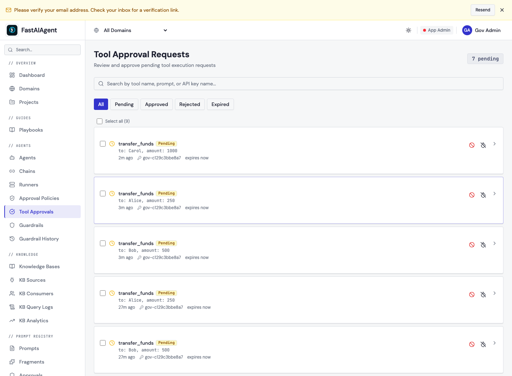
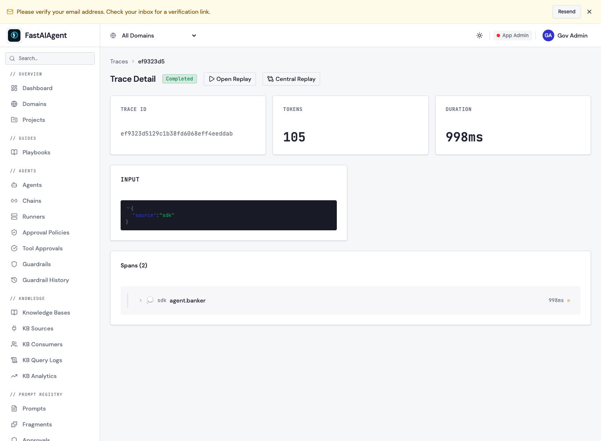

# Managed governance (approval policies)

A **connected** agent can honor governance the platform admin defines centrally —
no policy code in the agent. When the agent is about to call a tool the admin has
flagged, the SDK asks the platform whether it may proceed; a high-stakes call
**pauses for human approval** in the console and **resumes** once approved.

This builds on [guardrails](index.md) (local, in-process checks) by adding the
**managed policy + pause/resume over the wire**. It needs [`fa.connect()`](../platform/index.md).
For connect-time enrollment and the opt-in **fail-closed** posture (refuse rather
than run ungoverned when the plane is unreachable), see
[Connected governance](../platform/connected-governance.md).

## How it works

```
connect() ──▶ GET /policy (cache)
   tool call ──▶ matches a cached approval policy?
        │ no  ─▶ run normally
        │ yes ─▶ POST /policy/decide
                    ├─ allow            ─▶ run
                    ├─ deny             ─▶ refuse (tell the model why)
                    └─ require_approval ─▶ POST /runs/{id}/pending + PAUSE (checkpoint)
                                              console approves ─▶ resume ─▶ run
```

1. **`connect()`** pulls and caches the policy (`GET /policy`). On a pull failure
   it keeps the last-known cache.
2. Before a tool call whose name matches a cached approval policy's `tool_pattern`,
   the SDK calls **`POST /policy/decide`**.
3. **`deny`** → the call is refused and the model is told why (the run continues).
4. **`require_approval`** → the SDK posts **`POST /runs/{id}/pending`** and pauses
   the agent (a real checkpoint). It then polls **`GET /runs/{id}/pending`**; when
   the console flips the status to `approved`, the agent **resumes**. A `rejected`
   decision refuses the call.

Only tools that match a configured policy incur a `/policy/decide` round-trip;
everything else runs untouched.

## Enrolling an agent

Two things make an agent governable:

```python
import fastaiagent as fa
from fastaiagent import Agent, FunctionTool, LLMClient
from fastaiagent.checkpointers.sqlite import SQLiteCheckpointer

fa.connect(api_key="fa_k_...", target="https://app.fastaiagent.net")

agent = Agent(
    name="banker",
    agent_id="<platform agent uuid>",        # (1) enroll: the id /policy/decide matches on
    llm=LLMClient(provider="openai", model="gpt-4o-mini"),
    tools=[FunctionTool(name="transfer_funds", fn=transfer_funds)],
    checkpointer=SQLiteCheckpointer("agent.db"),  # (2) needed to pause/resume
)

# Blocking by default: arun() waits for the console decision and resumes.
result = await agent.arun("Transfer $500 to Bob.")
```

- **`agent_id`** is the agent's **platform UUID** — it's sent to `/policy/decide`
  so the plane can match approval policies (and it validates the id). Without it,
  the agent isn't enrolled and the gate is a no-op.
- A **`checkpointer`** is required so a paused run can be resumed.

### Blocking vs. non-blocking

`arun()` **blocks by default** (`wait_for_approval=True`): it waits for the console
decision and resumes for you. For your own control loop, pass
`wait_for_approval=False` to get the paused `AgentResult` and resume yourself once
the run is approved:

```python
res = await agent.arun("Transfer $500 to Bob.", wait_for_approval=False)
if res.status == "paused":               # res.pending_interrupt["reason"] == "policy_approval_required"
    # ... wait for the console to approve (GET /public/v1/runs/{id}/pending) ...
    res = await agent.aresume(res.execution_id, resume_value=Resume(approved=True))
```

A runnable end-to-end example is in `examples/84_governed_agent.py`.

## Verified end-to-end

Against a live plane, a connected agent pausing for approval and resuming once the
console approves (real `gpt-4o-mini`, both modes):

```text
connected. cached approval_policies: 1
=== NON-BLOCKING: arun(wait_for_approval=False) ===
  paused? paused | reason: policy_approval_required
  pending(before): pending | console approve -> 200 approved
  resumed: completed | output: 'I have successfully transferred $500 to Bob.'
=== BLOCKING: arun() auto-waits for approval + resumes ===
  pending appeared: pending | console approve -> 200 approved
  auto-resumed: completed | output: 'I have successfully transferred $250 to Alice.'
```

## In the console

A connected agent's high-stakes calls surface in the console for review. Here three
`transfer_funds` calls are **Pending** approval (one per paused run), under the
agent's API key:



Each paused run is also a normal trace — the connected agent's run pushed to the
platform (here `agent.banker`):



The admin manages the rules on the **Approval Policies** page (the `tool_pattern`
set) and resolves a connected run's pending approval via the Public API
(`POST /api/v1/pending-runs/{id}/approve`), which flips the status the SDK polls.
