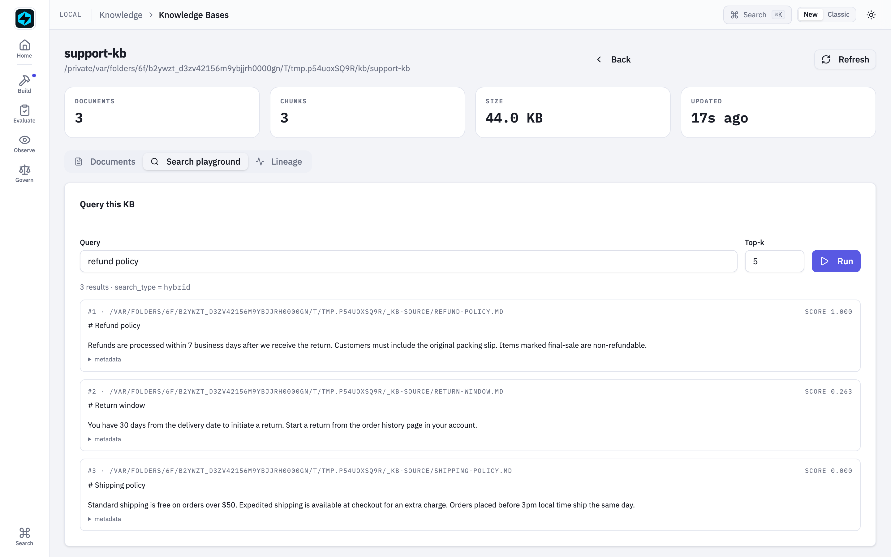
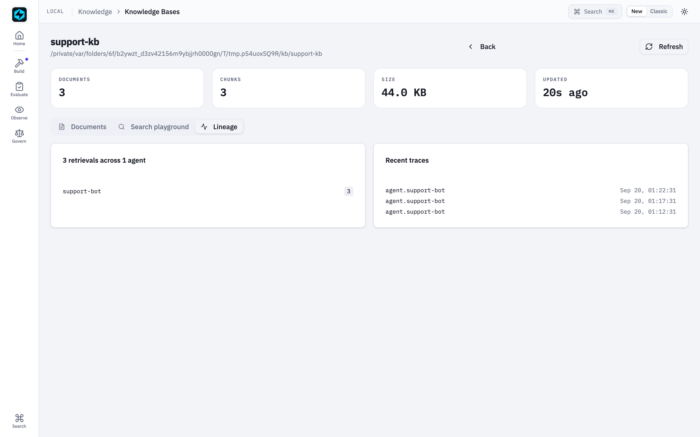

# Retrieval Breaks at the Boundaries

*Six places a knowledge base goes wrong between a document and the model's answer, how FastAIAgent holds each one, and a proof you can run for every claim.*

*Requires FastAIAgent 1.87.0+ · [Download this page as a PDF](img/boundaries/retrieval-at-the-boundaries.pdf)*

FastAIAgent already lets you *see* retrieval: every search is a `retrieval.<kb>` span with the query, the backend, the ids that came back and how long it took, and the Local UI's [Knowledge Bases browser](../ui/kb.md) shows which agents hit which KB (see [Knowledge Base](index.md)).

Seeing what was retrieved is not the same as trusting it. A knowledge base sits between your documents and the model's answer, so it has to hold wherever two things meet:

- a document and the chunks that stand for it;
- the text and the vector that stands for it;
- what a question means and the words it uses;
- the knowledge base and the model;
- one process and the next;
- one laptop and a fleet, or the plane.

Those six boundaries are where retrieval goes wrong.

This page explains how FastAIAgent's knowledge base works, one boundary at a time. Each section has a diagram, the rule the SDK follows, a proof, and the code: the SDK source that implements the rule and the script that proves it. The proofs are in [`examples/kb/proofs/`](https://github.com/fastaifoundry/fastaiagent-sdk/tree/main/examples/kb/proofs) and run against the published SDK: real FAISS, Chroma and Qdrant, the local FastEmbed model, and for one section a real model. The offline ones run in CI, so what this page quotes can't drift from what the SDK does. Every output and number below came out of one of those runs, and so did the two defects they turned up.

---

## First: a knowledge base is three stores behind one interface

"Search" is three stores, a chunker and an embedder, and the only one of them that is the source of truth is the plainest.


*Documents become chunks, chunks become vectors. Vectors go to FAISS, tokens to BM25, and everything, vectors included, to SQLite, which the other two are rebuilt from. One `search()` sits on top; `as_tool()` hands it to the model.*

- **The chunker** splits a document at its seams and keeps the source, index and character offsets on every chunk.
- **The embedder** turns each chunk, and later each query, into a vector. It is chosen once per KB and is part of the index.
- **The `VectorStore`** holds the vectors and answers by cosine: FAISS in-process by default, Qdrant or Chroma by swapping one argument.
- **The `KeywordStore`** is BM25 over the tokens, in memory. It finds exact terms the vector side is blind to.
- **The `MetadataStore`** is SQLite on disk: documents, chunks and their vectors. It is the source of truth; the other two stores are rebuilt from it on open.
- **`search()`** runs vector, keyword or hybrid (the default) and returns `SearchResult(chunk, score)`. **`as_tool()`** wraps it as a tool the model calls, and every search leaves a `retrieval.<kb>` span.

You declare all of it on one object:

```python
kb = LocalKB(name="support-kb")                 # FAISS + BM25 + SQLite under .fastaiagent/kb/support-kb/
kb.add("docs/")                                  # .md, .txt, .pdf — chunked, embedded, stored
kb.search("ERR-4012", top_k=3)                   # hybrid: meaning and exact tokens
agent = Agent(name="support-bot", llm=llm, tools=[kb.as_tool()])   # the model decides when to search
```

The rest of this page is what that object has to get right.

**Code:** `LocalKB` is [`kb/local.py`](https://github.com/fastaifoundry/fastaiagent-sdk/blob/main/fastaiagent/kb/local.py); the three store contracts are [`kb/protocols.py`](https://github.com/fastaifoundry/fastaiagent-sdk/blob/main/fastaiagent/kb/protocols.py); the defaults are under [`kb/backends/`](https://github.com/fastaifoundry/fastaiagent-sdk/tree/main/fastaiagent/kb/backends). The RAG agent end to end is [`examples/06_rag_agent.py`](https://github.com/fastaifoundry/fastaiagent-sdk/blob/main/examples/06_rag_agent.py).

---

## 1 · Between a document and its chunks: nothing crosses a seam

A vector stands for a span of text, and a whole document averages out to nothing in particular. So documents are cut into chunks, and where they are cut decides what can be found.


*The splitter tries the seams in order and merges pieces up to `chunk_size`. Every chunk keeps its offsets. Neighbours share nothing: a rule that straddles a seam lives in two chunks.*

The rules:

- **The splitter is recursive.** It tries paragraph breaks, then lines, then sentences, then words, and merges the pieces up to `chunk_size` (512 characters by default), so a chunk ends at the coarsest seam that fits.
- **Every chunk keeps its provenance**: `source`, its `index` in the document, and `start_char`/`end_char`.
- **Nothing is carried across a seam.** `chunk_overlap` is accepted and stored, and the chunk text does not change with it: neighbouring chunks share zero characters. A rule that straddles a seam is split in two, and a query that needs both halves gets one of them.

Proof 1 chunks a three-paragraph policy at 512 and at 120 characters and measures what neighbours share:

```
chunk_size=512, overlap=50 → 1 chunk(s)
  #0 [  0-428] 'Refund policy. Items can be sent back within 30 days of purcha'…
  characters shared between neighbours: n/a (one chunk)

chunk_size=120, overlap=50 → 5 chunk(s)
  #0 [  0- 82] 'Refund policy. Items can be sent back within 30 days of purcha'…
  #1 [ 84-164] 'They must be unused and in their original packaging. Digital p'…
  #2 [166-263] 'Shipping. Domestic orders ship in 3-5 business days. Internati'…
  #3 [265-325] 'Express shipping can be chosen at checkout for an extra fee.'
  #4 [327-428] 'Support. Email support@example.com or call 1-800-EXAMPLE. Hour'…
  characters shared between neighbours: [-2, -2, -2, -2]
  metadata on every chunk: {'source': 'policy.md'}

'within 30 days … full refund' lives in chunk [0] · 'unused … original packaging' lives in chunk [1]
```

The seams are where you'd want them: a paragraph break, then a sentence. The shared count is −2, the two characters of the seam itself. So the overlap the reference pages describe is not what the splitter does in 1.87.0; the honest lever is `chunk_size`. Pick it for the unit of meaning you want back: a rule, a paragraph, a page.

**Code:** `chunk_text` and `_recursive_split` in [`kb/chunking.py`](https://github.com/fastaifoundry/fastaiagent-sdk/blob/main/fastaiagent/kb/chunking.py); PDF pages become one `Document` each in [`kb/document.py`](https://github.com/fastaifoundry/fastaiagent-sdk/blob/main/fastaiagent/kb/document.py). The proof is [`proof_1_chunks.py`](https://github.com/fastaifoundry/fastaiagent-sdk/blob/main/examples/kb/proofs/proof_1_chunks.py).

---

## 2 · Between text and vector: the embedder is part of the index

A vector means nothing on its own; it means something next to vectors made the same way. That makes the embedder a part of the index, and its quality the ceiling of what retrieval can find.


*Chunks and queries go through the same embedder. Vectors are cached in SQLite, so a reopen embeds one probe word and nothing else. A different embedder on the same index is refused only if its dimension differs.*

The rules:

- **The query is embedded the same way as the chunks** and scored by cosine against them.
- **Vectors are cached in SQLite.** A reopen loads them and embeds exactly one word, `test`, to check the dimension. Keyword mode never builds an embedder at all.
- **A different dimension on reopen is refused** with `ValueError: Embedding dimension mismatch`. A different model of the same dimension is not detected: the query and the chunks then live in two spaces, and nothing says so.
- **The embedder is auto-selected**: FastEmbed if installed, else OpenAI if a key is set, else a character-count fallback that has no notion of meaning.
- **The model is the ceiling.** A small local model finds some paraphrases and misses others. Hybrid search and an eval are how you find out which.

Proof 2 runs the same two queries through the local 384-dimension FastEmbed model and the fallback embedder, then reopens the index:

```
── two queries, two embedders
FastEmbed (bge-small, 384-d)   'can I get my money back?'               → [0.710] Items can be sent back within 30 days of pur…
FastEmbed (bge-small, 384-d)   'how long is the reimbursement window?'  → [0.657] Support hours are Monday to Friday, 9am to 5…
SimpleEmbedder (char counts)   'can I get my money back?'               → [0.826] Items can be sent back within 30 days of pur…
SimpleEmbedder (char counts)   'how long is the reimbursement window?'  → [0.803] Error code ERR-4012 means the payment gatewa…

── the embedder is part of the index
indexing 4 documents embedded 4 texts
reopen with another embedder → Embedding dimension mismatch: stored=384, current embedder=128. Use the same embedder that created this KB.
reopen with the same embedder → 4 chunks back, 1 text embedded (a one-word dimension probe)
one search                    → 2 texts embedded in total: the probe and the query; [0.700] Items can be sent back within 30 days of…
```

The first query shares no word with the refund chunk and the local model found it anyway. The second asks about a "window" and the model reached for "hours". The fallback embedder got one right by luck of character counts. **A score is only as meaningful as the model behind it**, and nothing in the KB will tell you the second query missed; section 4 is where you find out.

**Code:** the three embedders and `get_default_embedder` in [`kb/embedding.py`](https://github.com/fastaifoundry/fastaiagent-sdk/blob/main/fastaiagent/kb/embedding.py); the dimension probe and the cache replay are `_load_from_metadata` in [`kb/local.py`](https://github.com/fastaifoundry/fastaiagent-sdk/blob/main/fastaiagent/kb/local.py); the cached vectors are [`kb/backends/sqlite.py`](https://github.com/fastaifoundry/fastaiagent-sdk/blob/main/fastaiagent/kb/backends/sqlite.py). The proof is [`proof_2_embedder.py`](https://github.com/fastaifoundry/fastaiagent-sdk/blob/main/examples/kb/proofs/proof_2_embedder.py).

---

## 3 · Between meaning and words: vector, keyword, and how hybrid fuses them

A question has a meaning and it has words, and the two matchers see one each. Hybrid, the default, runs both, and the way it combines them changes what the number means.


*Each side over-fetches, each list is min-max normalized so the two scales can be added, and the fused score is `0.7 · vector + 0.3 · keyword`. When one side is empty the other passes through untouched.*

The rules:

- **Vector** scores are cosines in `[-1, 1]`, on every backend. Good at meaning, blind to an exact code.
- **Keyword** scores are BM25 over `\w+` tokens, lowercased, no stopwords, no stemming. Good at an exact code, blind to a paraphrase.
- **Hybrid** fetches `3 × top_k` from each side, min-max normalizes each list to `[0, 1]`, and fuses per chunk as `alpha · vector + (1 − alpha) · keyword` with `alpha = 0.7`. The best vector hit is pinned to `1.0` whatever its cosine was.
- **When one side returns nothing, hybrid hands the other side back unnormalized.** A query with no lexical overlap returns raw cosines, the same numbers `search_type="vector"` gives.

Proof 3 sends three queries through all three modes over the same five chunks:

```
── an exact code: 'ERR-4012'
  vector   [0.806] Error code ERR-4012 means the paym… | [0.701] Error code ERR-5001 means authenti…
  keyword  [2.121] Error code ERR-4012 means the paym… | [0.916] Error code ERR-5001 means authenti…
  hybrid   [1.000] Error code ERR-4012 means the paym… | [0.511] Error code ERR-5001 means authenti…
── meaning, no shared words: 'reimbursement timeframe?'
  vector   [0.681] Support hours are Monday to Friday… | [0.669] Items can be sent back within 30 d…
  keyword  (nothing)
  hybrid   [0.681] Support hours are Monday to Friday… | [0.669] Items can be sent back within 30 d…
── both at once: 'ERR-4012 payment failed'
  vector   [0.880] Error code ERR-4012 means the paym… | [0.698] Error code ERR-5001 means authenti…
  keyword  [3.421] Error code ERR-4012 means the paym… | [2.367] Error code ERR-5001 means authenti…
  hybrid   [1.000] Error code ERR-4012 means the paym… | [0.409] Error code ERR-5001 means authenti…

── hybrid with an empty keyword side is the vector result, unnormalized
  identical: True
── hybrid with both sides: alpha · 1.0 pins the best vector hit
  top hybrid score 1.000 = 0.7 × 1.0 (vector) + 0.3 × 1.0 (keyword) when one chunk tops both
```

Read the second query: the keyword side found nothing, so hybrid returned the vector scores as they were, `0.681` and `0.669`, and the first hit is the wrong one by `0.012`. Read the first: the same chunk topped both sides, so its hybrid score is exactly `1.000`. **A hybrid score is a rank position, not a similarity, except when one side is empty, and then it is a cosine again.** Don't compare the number across two calls, and don't threshold on it.


*The same arithmetic in the Local UI's search playground: three chunks, hybrid, and the min-max artefact in plain sight: the best hit is `1.000`, the worst is `0.000`.*

**Code:** `_hybrid_search` and `_normalize` in [`kb/local.py`](https://github.com/fastaifoundry/fastaiagent-sdk/blob/main/fastaiagent/kb/local.py); the cosine index is `FaissIndex` in [`kb/search.py`](https://github.com/fastaifoundry/fastaiagent-sdk/blob/main/fastaiagent/kb/search.py); the tokenizer is [`kb/bm25.py`](https://github.com/fastaifoundry/fastaiagent-sdk/blob/main/fastaiagent/kb/bm25.py). The proof is [`proof_3_matchers.py`](https://github.com/fastaifoundry/fastaiagent-sdk/blob/main/examples/kb/proofs/proof_3_matchers.py); the score contract across backends is [`tests/test_kb_score_semantics_sweep.py`](https://github.com/fastaifoundry/fastaiagent-sdk/blob/main/tests/test_kb_score_semantics_sweep.py).

---

## 4 · Between the knowledge base and the model: retrieval is a tool call

A KB does not stuff text into the prompt. The model asks for it, in its own words, and what it gets back is text with a number in front of it.


*The model writes the query, not the user. The tool returns `[Score: …] text`. Two spans record it, and the export policy decides which of their keys leave the machine.*

The rules:

- **`as_tool()` is an ordinary `FunctionTool`** named `search_<kb>` with `origin="kb"`. The model decides when to call it and what to ask; it can call it again with a better query, and it pays only for the context it asked for.
- **The result is text**: each hit as `[Score: 0.700] <chunk>`, joined by blank lines. `LocalKB` sends whole chunks; `PlatformKB` cuts each to 200 characters.
- **Two spans per search.** `tool.search_<kb>` carries the arguments and the result; `retrieval.<kb>` carries the query, backend, search type, `top_k`, result count, latency and the ids that came back.
- **Local capture is full fidelity; the export policy filters.** With `FASTAIAGENT_TRACE_PAYLOADS=0` the query and `doc_ids` are dropped on the way out and the structural keys stay. A `PlatformKB`'s `kb_id` stays too: it is a routing key, not payload.
- **The KB cannot tell a stale document from a current one.** A perfectly retrieved out-of-date policy produces a confident, wrong answer with every model metric green. `doc_ids` is where you see it; the [RAG metrics](../evaluation/rag-metrics.md) are how you score it.

Proof 4 gives a support agent on `gpt-4.1-mini` the tool and asks about an error code:

```
── the tool the model sees
name='search_support-kb' origin='kb' description="Search the 'support-kb' knowledge base"

── what happened, from the spans
tool.search_support-kb: tool.name='search_support-kb'
tool.search_support-kb: tool.origin='kb'
tool.search_support-kb: tool.args='{"query": "ERR-4012 checkout"}'
tool.search_support-kb: tool.result='[Score: 0.700] Error code ERR-4012 means the payment gateway timed out. Retry after 30 seconds, then contact support wit'…
retrieval span: {"kb_name": "support-kb", "backend": "faiss", "top_k": 5, "search_type": "hybrid", "query": "ERR-4012 checkout", "latency_ms": 8, "result_count": 3, "doc_ids": "[\"a0516448-…\", \"8fdb5101-…\", \"e62aff41-…\"]"}
answer: The error code ERR-4012 means the payment gateway timed out. You should retry the checkout after 30 seconds. If the problem persists, contact support with the t…

── the export policy, with FASTAIAGENT_TRACE_PAYLOADS=0
kept   : ['retrieval.backend', 'retrieval.kb_name', 'retrieval.latency_ms', 'retrieval.result_count', 'retrieval.search_type', 'retrieval.top_k']
dropped: ['retrieval.doc_ids', 'retrieval.query']
```

The user asked "My checkout shows ERR-4012. What do I do?"; the model searched for `ERR-4012 checkout`. That is the query the KB scored, and it is the query in the trace. The Knowledge Bases browser reads those spans:


*The Lineage tab of a KB in the Local UI: which agents searched it, how often, and the traces to open.*

**Code:** `as_tool` in [`kb/local.py`](https://github.com/fastaifoundry/fastaiagent-sdk/blob/main/fastaiagent/kb/local.py) and [`kb/platform.py`](https://github.com/fastaifoundry/fastaiagent-sdk/blob/main/fastaiagent/kb/platform.py); the span is `retrieval_span` in [`kb/_tracing.py`](https://github.com/fastaifoundry/fastaiagent-sdk/blob/main/fastaiagent/kb/_tracing.py); the egress filter is `apply_export_policy` and `SENSITIVE_ATTR_KEYS` in [`trace/redaction.py`](https://github.com/fastaifoundry/fastaiagent-sdk/blob/main/fastaiagent/trace/redaction.py); the lineage query is [`ui/routes/kb.py`](https://github.com/fastaifoundry/fastaiagent-sdk/blob/main/fastaiagent/ui/routes/kb.py). The proof is [`proof_4_tool.py`](https://github.com/fastaifoundry/fastaiagent-sdk/blob/main/examples/kb/proofs/proof_4_tool.py) (needs `OPENAI_API_KEY`); the RAG scorers are in [`examples/24_rag_eval.py`](https://github.com/fastaifoundry/fastaiagent-sdk/blob/main/examples/24_rag_eval.py); [`tests/test_kb_tracing.py`](https://github.com/fastaifoundry/fastaiagent-sdk/blob/main/tests/test_kb_tracing.py) pins the span.

---

## 5 · Between one process and the next: the store is the source of truth

Processes restart. FAISS and BM25 live in memory and go with the process. The design rule behind this boundary: **SQLite is the source of truth, and every index is rebuilt from it, never re-embedded.**


*A writes; B rebuilds from the file with one probe embedding; B deletes; C sees it. The file is the only thing the three processes share.*

The rules:

- **`add()` writes chunks and vectors to `kb.sqlite`** and updates both in-memory indexes.
- **A new process rebuilds FAISS and BM25 from the file.** It embeds one word to check the dimension, and then only queries.
- **Deletes and updates persist** and rebuild the indexes. On FAISS, which has no per-id delete, a delete re-embeds every surviving chunk; Qdrant and Chroma delete in place.
- **`persist=False`** writes nothing: no folder, no file, gone with the process.

Proof 5 writes in one process, reads and deletes in a second, and reads again in a third, counting every text the embedder was asked for:

```
── process A writes
chunks=3 embedded_texts=3 files=['kb.sqlite', 'kb.sqlite-shm', 'kb.sqlite-wal']

── process B reads, then deletes a source
chunks=3 embedded_on_open=1 (the probe) embedded_by_search=1 top=[0.700] Items can be sent back within 30 days …
deleted 1 chunk(s) from errors.md

── process C reads what B left
chunks=2 embedded_on_open=1 (the probe) embedded_by_search=1 top=[0.700] Items can be sent back within 30 days …

── persist=False
on disk: ['policies']
```

Three chunks cost three embeddings once. Every process after that paid one probe and one per query. The scratch KB left nothing on disk beside the persisted one.

**Code:** `_load_from_metadata`, `delete_by_source` and `_rebuild_indexes_after_delete` in [`kb/local.py`](https://github.com/fastaifoundry/fastaiagent-sdk/blob/main/fastaiagent/kb/local.py); the file is [`kb/backends/sqlite.py`](https://github.com/fastaifoundry/fastaiagent-sdk/blob/main/fastaiagent/kb/backends/sqlite.py). The proof is [`proof_5_restart.py`](https://github.com/fastaifoundry/fastaiagent-sdk/blob/main/examples/kb/proofs/proof_5_restart.py); `test_localkb_persists_across_reopen` in [`tests/test_kb_backend_defaults.py`](https://github.com/fastaifoundry/fastaiagent-sdk/blob/main/tests/test_kb_backend_defaults.py) pins the reopen.

---

## 6 · Between a laptop and a fleet: one contract, three backends, and the plane

The same `LocalKB` runs on FAISS, Chroma or Qdrant. Only `vector_store=` changes. All three implement one protocol with one promise about the score, and a sweep checks it against real instances of each.


*One lifecycle over three backends. The score contract holds on all three. The Chroma edge is a real defect this page found; the plane keeps the same interface.*

The rules:

- **`VectorStore.search()` returns a cosine in `[-1, 1]` on every backend.** The same pair scores the same whether the index is FAISS, Chroma or Qdrant. That contract was implied everywhere and written down nowhere until 1.67.0, when Chroma turned out to be returning `2·cos − 1`.
- **The protocols are structural.** A backend implements the methods; there is no base class. A backend that cannot express a cosine should say so rather than return a different scale quietly.
- **`PlatformKB(kb_id)` has the same `search()`, `asearch()` and `as_tool()`.** Retrieval, reranking and the stores run on the plane; the SDK is a thin client, and `kb_id` rides on the span.

Proof 6 runs the three-vector contract and then the same lifecycle on each backend, FAISS and Chroma in-process and Qdrant in-memory:

```
── the score contract: one stored vector, three queries
  faiss   {'same': 1.0, 'orthogonal': 0.0, 'opposite': -1.0, 'cos=0.6': 0.6}
  chroma  {'same': 1.0, 'orthogonal': 0.0, 'opposite': -1.0, 'cos=0.6': 0.6}
  qdrant  {'same': 1.0, 'orthogonal': 0.0, 'opposite': -1.0, 'cos=0.6': 0.6}

── the same LocalKB lifecycle over each backend, FastEmbed vectors as they come
  faiss   FaissVectorStore  top before delete: refunds.md · removed 1 · top after: errors.md
  chroma  ValueError from the backend: Expected embeddings to be a list of floats or ints, a list of lists, a numpy array, or a list of…
  qdrant  QdrantVectorStore top before delete: refunds.md · removed 1 · top after: errors.md

── the same lifecycle, vectors converted to plain Python floats
  faiss   FaissVectorStore  top before delete: refunds.md · removed 1 · top after: errors.md
  chroma  ChromaVectorStore top before delete: refunds.md · removed 1 · top after: errors.md
  qdrant  QdrantVectorStore top before delete: refunds.md · removed 1 · top after: errors.md
```

The contract held on all three. The lifecycle did not: **in 1.87.0, `LocalKB` with the FastEmbed embedder and the Chroma backend fails on `add()`**, because FastEmbed returns `numpy.float32` values inside Python lists and Chroma's validation refuses them. FAISS and Qdrant accept the same vectors. Convert to plain floats and the three backends behave identically. The Chroma tests use the fallback embedder, which returns plain floats, which is why they never saw it.

**Code:** [`kb/backends/faiss.py`](https://github.com/fastaifoundry/fastaiagent-sdk/blob/main/fastaiagent/kb/backends/faiss.py), [`kb/backends/chroma.py`](https://github.com/fastaifoundry/fastaiagent-sdk/blob/main/fastaiagent/kb/backends/chroma.py) (the `upsert` in `add`) and [`kb/backends/qdrant.py`](https://github.com/fastaifoundry/fastaiagent-sdk/blob/main/fastaiagent/kb/backends/qdrant.py); the plane client is [`kb/platform.py`](https://github.com/fastaifoundry/fastaiagent-sdk/blob/main/fastaiagent/kb/platform.py). The proof is [`proof_6_backends.py`](https://github.com/fastaifoundry/fastaiagent-sdk/blob/main/examples/kb/proofs/proof_6_backends.py); the contract sweep is [`tests/test_kb_score_semantics_sweep.py`](https://github.com/fastaifoundry/fastaiagent-sdk/blob/main/tests/test_kb_score_semantics_sweep.py); [`examples/28_kb_chroma.py`](https://github.com/fastaifoundry/fastaiagent-sdk/blob/main/examples/28_kb_chroma.py), [`29_kb_qdrant.py`](https://github.com/fastaifoundry/fastaiagent-sdk/blob/main/examples/29_kb_qdrant.py) and [`34_platform_kb.py`](https://github.com/fastaifoundry/fastaiagent-sdk/blob/main/examples/34_platform_kb.py) wire each one up. See [Backends](backends.md), [Custom Backend](custom-backend.md) and [Platform KB](platform-kb.md).

---

## Where retrieval bugs hide


*A typical test adds one document, runs one query in one process on FAISS, and reads the top hit. Retrieval breaks on the lines around that box.*

If you build or buy retrieval, test the boundaries:

1. **Ask for a rule that spans a chunk boundary.** Which half comes back?
2. **Ask the same question in other words**, and with the exact code. Which matcher found it, and what did the fused number mean?
3. **Swap the embedder** on an existing index. Was it refused, and would it be if only the model changed?
4. **Open the trace and read `doc_ids`.** Is the document that was retrieved the one that is current?
5. **Cross a process.** Write in one, delete in another, read in a third, and count the embeddings.
6. **Change the backend**, and score the same three vectors. Do you get the same three numbers?

The proof scripts behind this page run each of those checks.

---

## What the knowledge base still won't do for you

- **`chunk_overlap` has no effect on the chunk text** in 1.87.0. Choose `chunk_size` for the unit you want back.
- **`search()` takes a query and `top_k`, nothing else.** There is no metadata filter; keep separate KBs for separate domains and give the agent one tool per KB.
- **A hybrid score is not a threshold.** It is a rank position when both sides return, and a cosine when one doesn't.
- **A reopen checks the dimension, not the model.** Record which embedder built an index, and rebuild when you change it.
- **A FAISS delete re-embeds the survivors.** Fine for a small corpus; use Qdrant or Chroma when deletes are frequent.
- **Chroma rejects FastEmbed's vectors in 1.87.0.** Convert to plain floats, or use FAISS or Qdrant, until the backend converts them itself.
- **No reranker locally.** `PlatformKB` runs the plane's reranking; `LocalKB` returns the fused order as is.
- **`LocalKB` is synchronous.** The store protocols are sync; `PlatformKB` has `asearch()`.
- **The KB does not know a document is stale.** That is what `doc_ids` in the trace and the [RAG metrics](../evaluation/rag-metrics.md) are for.

---

## The point of all of it

A knowledge base is the step between your documents and the model's answer, and the one where a wrong answer looks most like a right one: the reasoning is sound, the document was stale. That is why retrieval has to be both visible and trustworthy. The retrieval span makes it visible; this page walked the six boundaries where it has to hold.

The split between the SDK and the plane stays the same. The SDK retrieves in your process, on FAISS, BM25 and SQLite or on your own Qdrant or Chroma. The plane hosts knowledge bases centrally, with reranking, behind the same `search()` and `as_tool()`. Everything on this page, except the plane itself, is in the open-source SDK.

Test your own retrieval the same way. The bugs aren't in the ranking; they're on the boundaries.

## See also

- [Concepts & Mental Model](concepts.md): what a KB is, why, and how retrieval works, in prose.
- [Knowledge Base](index.md): every keyword, mode and CLI command.
- [Backends](backends.md), [Custom Backend](custom-backend.md) and [Platform KB](platform-kb.md).
- [Knowledge Bases browser](../ui/kb.md): documents, a search playground and lineage in the Local UI.
- [RAG metrics](../evaluation/rag-metrics.md): faithfulness, relevancy, context precision and recall.
- [Agent Memory Breaks at the Boundaries](../agents/memory-boundaries.md): the same approach for memory.
