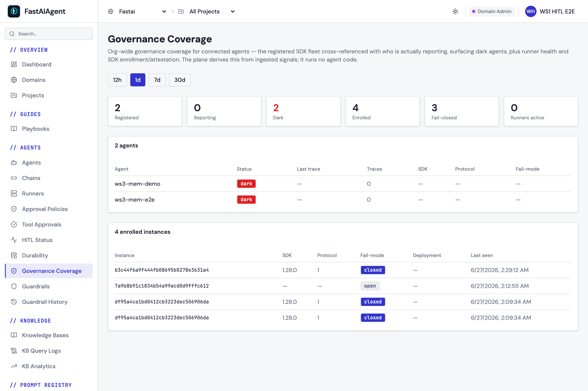

# Connected governance (enrollment + fail-closed)

When you `fa.connect()` to an **Enterprise control plane**, the SDK does two
governance things beyond the
[managed approval gate](../guardrails/managed-governance.md):

1. **Enrollment** — it announces its presence and its governance *posture* to the
   plane, so the console can tell *enrolled & reporting* agents apart from
   **dark** ones (running but never seen).
2. **Opt-in fail-closed** — you can make a governed agent **refuse to act
   ungoverned** when the plane is unreachable, instead of silently proceeding.

Both are additive. The default behavior is unchanged: the SDK still works fully
without a connection, and a connected agent still **fails open** unless you opt
in.

## Enrollment (attestation)

On `connect()`, the SDK sends a one-shot, **fire-and-forget** POST to
`/public/v1/governance/enroll` carrying *metadata only*:

| Field | Meaning |
|-------|---------|
| `instance_id` | a stable per-install id (a UUID minted once and reused) |
| `sdk_version` | the running `fastaiagent` version |
| `protocol_version` | the wire protocol the SDK speaks |
| `fail_mode` | the attested posture — `open` (default) or `closed` |
| `hostname` | the machine name (best-effort) |

The plane upserts on `(domain, project, instance_id)` — keeping the first-seen
timestamp and refreshing last-seen + posture — so re-connecting the same install
never creates duplicate coverage rows.

**It never blocks or fails `connect()`.** The push runs on a background daemon
thread; a 4xx (including `403` when the domain isn't entitled) is terminal and
dropped, and any transient error is ignored. Enrollment is best-effort
attestation, not durable state — a dropped push just means the plane refreshes
posture on the next connect. When you are not connected, nothing is sent.

## Opt-in fail-closed

By default a connected agent **fails open**: if the plane was unreachable at
`connect()` and no policy could be cached, the [managed
gate](../guardrails/managed-governance.md) is a no-op and governed tools run
ungoverned. Opt in to **fail-closed** to refuse instead:

```python
import fastaiagent as fa

# kwarg ...
fa.connect(
    api_key="fa_k_...",
    target="https://your-plane.example.com",
    governance_fail_mode="closed",
)
# ... or env var: FASTAIAGENT_GOVERNANCE_FAIL_MODE=closed
```

With `governance_fail_mode="closed"`, when the agent is **enrolled** (`agent_id`
set) and connected but the **policy cache is missing** (the plane was unreachable
at connect, so governance can't be evaluated), the SDK refuses the tool call:

```text
Refused: fail-closed mode — governance unavailable for this run
```

Scope and guarantees:

- **Default stays `open`** — only the literal value `closed` hardens the gate, so
  a typo can never silently fail-close. Everything below is unchanged unless you
  opt in.
- It fires **only when the policy cache is missing** (unreachable-at-connect).
  When the plane *was* reachable and a policy is cached, normal
  `policy_matches → /policy/decide` gating runs, and only policy-matched tools
  incur a round-trip — exactly as
  [managed governance](../guardrails/managed-governance.md) describes.
- In the missing-cache case the SDK can't tell "brokered" tools from ordinary
  ones (there is no policy to match against), so it refuses **all** of the
  enrolled agent's tool calls. This is strict only in the unreachable case.
- The existing fail-closed guarantee for a policy-matched tool whose
  `/policy/decide` call errors is **unchanged**.

The posture you choose is attested to the plane via `fail_mode` on enrollment, so
the console coverage view reflects whether each instance runs open or closed.

## Enablement

Connected governance is part of the Enterprise bundle, gated by the
`connected_state_plane` feature flag on your domain. If the domain isn't
entitled, the enroll endpoint returns `403` — the SDK drops the push (a terminal
4xx) and the agent runs unaffected.

> Upgrade note: the local `sdk_instance` table that holds the stable
> `instance_id` is created by an automatic, additive migration (local schema
> v14). Existing projects are unaffected.

## Verified end-to-end

`tests/e2e/test_connected_governance_e2e.py` connects a real SDK to a live plane
with `governance_fail_mode="closed"`, asserts the enroll response
(`enrolled: true`, the echoed `instance_id` + `fail_mode`), and re-POSTs to prove
the idempotent upsert (same first-seen, refreshed last-seen).

## In the console

The plane's **Governance Coverage** dashboard cross-references the registered SDK
fleet with who is actually reporting — surfacing **dark** agents — and lists every
enrolled instance with its attested SDK version, protocol, and fail-mode:



A runnable end-to-end example is in `examples/88_connected_governance.py`.

## Next steps

- [Managed governance (approvals)](../guardrails/managed-governance.md) — the policy-gated approval flow this complements
- [Platform Connection](index.md) — `fa.connect()` and the other connected services
- [Connected HITL (observer)](connected-hitl.md) — pause/resolution reporting to the plane
