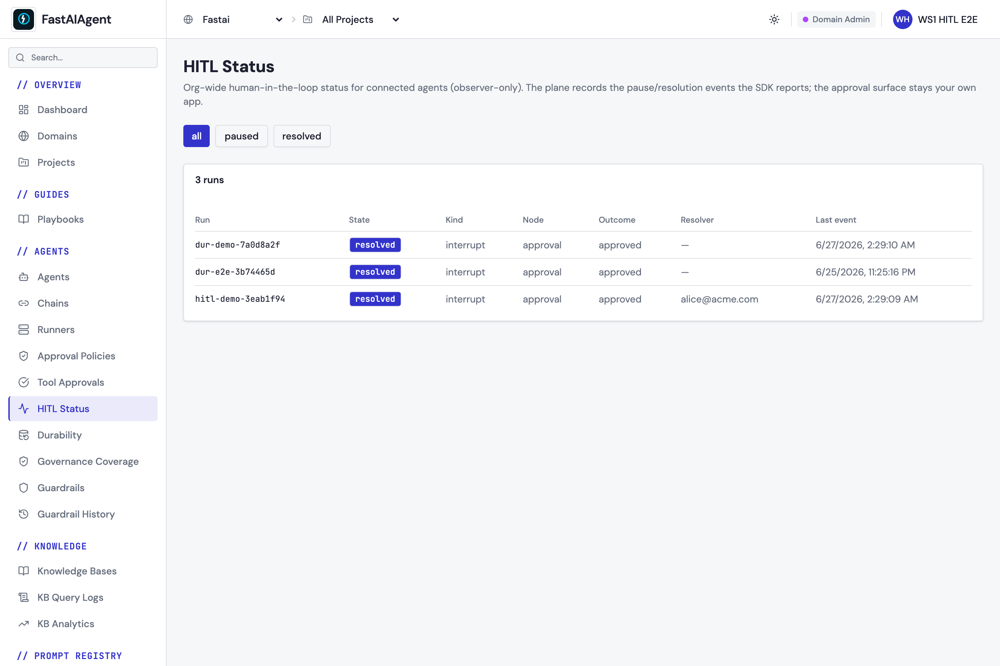

# Connected HITL (observer)

Human-in-the-loop **pauses and resolutions** in the SDK are local mechanisms:
`interrupt()` suspends a run, your own app approves or rejects it, and
`chain.resume()` / `agent.aresume()` continues. See
[Human-in-the-Loop](../chains/hitl.md) for that core flow — it works fully
standalone, with no platform dependency.

When you `fa.connect()` to an **Enterprise control plane**, the SDK additionally
**reports** those pauses and resolutions to the plane so it can serve an
org-wide pending/paused status view and a compliance ledger across every
connected agent.

## Observer model — the plane never approves

The plane is an **observer only**. It records *that* a run paused and *how* it
was resolved; it is **never** the approval surface. Approval always happens in
your own app (mobile / web / API / middleware), exactly as it does without a
connection. Nothing about how you resolve a pause changes when connected.

## What is reported

Reporting is **metadata only** — no interrupt payloads, no `RunContext`, no
user/business data ever leaves the process:

| Field | Pause | Resolution |
|-------|-------|------------|
| `run_id` | execution id | execution id |
| `event_type` | `paused` | `resolved` |
| `kind` | `interrupt` | `interrupt` |
| `agent_id` / `chain_id` | which agent/chain | which agent/chain |
| `node` | node / `turn:N/tool:name` | the resumed node |
| `reason` | the `interrupt()` reason label | the original reason |
| `status` | — | `approved` / `rejected` |
| `resolver` | — | `resume_value.metadata["resolver"]` if set |

The raw `interrupt(reason, context)` **context dict is never sent** — only the
short `reason` label. To attribute a resolution to an operator, pass a
`resolver` in the resume metadata:

```python
import fastaiagent as fa
from fastaiagent.chain.interrupt import Resume

fa.connect(api_key="fa-...", target="https://your-plane.example.com")

# ... agent/chain pauses on interrupt(); your app collects an approval ...

await chain.resume(
    execution_id,
    resume_value=Resume(approved=True, metadata={"resolver": "alice@acme.com"}),
)
# A `resolved` event (status=approved, resolver=alice@acme.com) is reported.
```

## Local-first, never blocks

Reporting reuses the same durable outbox as
[trace export](index.md#durable-trace-buffering--retry):

1. On a pause/resolution the event is written to a local `hitl_events` table
   (`synced=0`) — the durable source of truth.
2. A background drain POSTs un-acked events to `/public/v1/hitl/events` with
   bounded retry (transient/5xx retried, 4xx terminal), marking them `synced=1`
   only after a confirmed `2xx`.
3. Re-send is **idempotent by a SDK-generated `event_id`**, so an outage that
   overlaps a partial send never double-counts.

The agent hot path is never blocked: the local write is fast and the network
POST runs on a background thread. **When not connected, reporting is a strict
no-op** — nothing is written and nothing is sent.

**Bounded buffer.** The re-send queue is capped (~100,000 un-acked events or
~30 days — gentler than traces, since HITL events are rare and
audit-significant). Beyond that the oldest are dropped from the *re-send queue*
but kept in `local.db`; the dropped count is logged.

## Enablement

Connected HITL reporting is part of the Enterprise bundle, gated by the
`connected_state_plane` feature flag on your domain. If the domain is not
entitled, the ingest endpoint returns `403` — the SDK logs a warning, leaves the
events buffered (a terminal 4xx is not retried), and the agent runs unaffected.

> Upgrade note: the local `hitl_events` table is created by an automatic,
> additive migration (local schema v12). Existing projects are unaffected; only
> pauses/resolutions that occur while connected are reported.

## In the console

The plane records every pause and resolution the SDK reports and serves an
org-wide HITL status view across connected agents — paused / resolved, the node,
the outcome, and the resolver (the approval surface stays your own app):



A runnable end-to-end example is in `examples/85_connected_hitl.py`.

## Next steps

- [Human-in-the-Loop](../chains/hitl.md) — the core `interrupt()` / `resume()` flow
- [Platform Connection](index.md) — `fa.connect()` and the other connected services
- [Managed governance (approvals)](../guardrails/managed-governance.md) — policy-gated approvals
