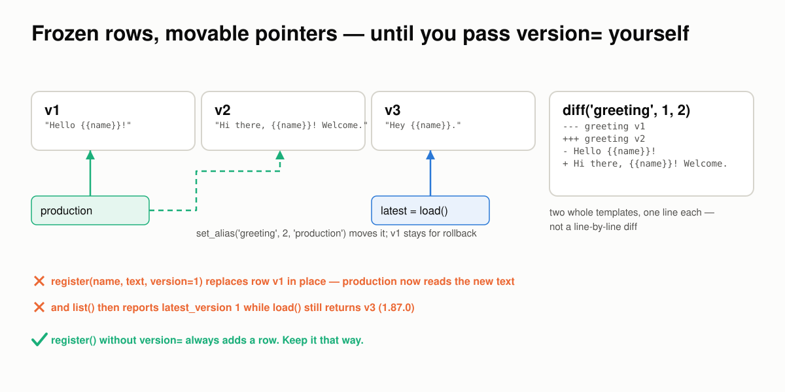
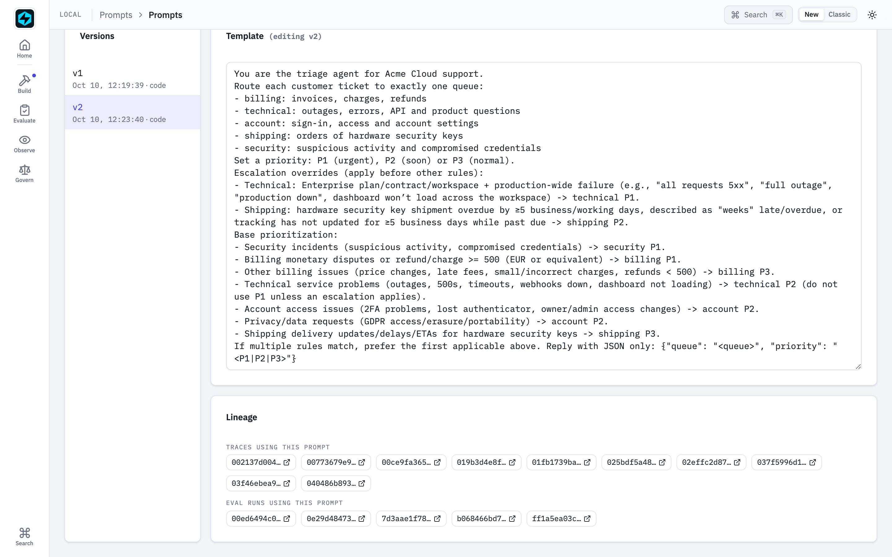
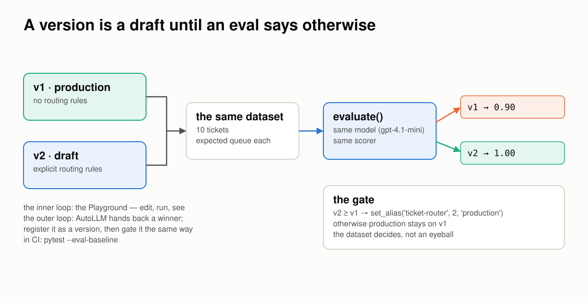

# A Prompt Breaks at the Boundaries

*Six places a prompt goes wrong between the text you wrote and the model that read it, how FastAIAgent holds each one, and a proof you can run for every claim.*

*Requires FastAIAgent 1.87.0+ · [Download this page as a PDF](img/boundaries/prompts-at-the-boundaries.pdf)*

FastAIAgent already lets you *see* a prompt's history: every `register()` is a version row, an alias is a pointer you can read, and the Local UI's Prompts page lists the traces and eval runs that used each prompt (see [Prompt Registry](index.md)).

Seeing the history is not the same as trusting what reached the model. A prompt is the one input every run starts from, so it has to hold wherever two things meet:

- the template and the text the model reads;
- one version and the next;
- a fragment and every prompt that uses it;
- the prompt and the run that used it;
- the prompt and the model it was tested on;
- your laptop and the control plane.

Those six boundaries are where prompts go wrong.

This page explains how FastAIAgent's prompt registry works, one boundary at a time. Each section has a diagram, the rule the SDK follows, a proof, and the code: the SDK source that implements the rule and the script that proves it. The proofs are in [`examples/prompts/proofs/`](https://github.com/fastaifoundry/fastaiagent-sdk/tree/main/examples/prompts/proofs) and run against the published SDK. Five run offline, on a scratch `local.db` and the SDK's own test models, and run in CI so what this page quotes can't drift from what the SDK does; one calls `gpt-4.1-mini`. Every output below came out of one of those runs.

---

## First: a prompt is four things

"A prompt" is four different things, and the one that links a run to its prompt is not the text.


*Rows in `local.db` become a `Prompt` at load, text at format. Pass the object to the agent, and every model call it makes is stamped with the prompt's name and version.*

- **The rows**: a prompt name, its versions, its aliases and the fragments, in four tables of the same `local.db` that holds your traces and eval runs. One file per project.
- **The `Prompt` object**: what `load()` returns. Fragments are already resolved into it; `{{variables}}` are still open, and `.variables` lists them.
- **The text**: what `format(**values)` returns. One string, the system prompt the model reads.
- **The link**: `Agent(system_prompt=prompt)` with the *object* runs its template and stamps `fastaiagent.prompt.name` and `.version` on every `llm.*` span. The formatted string carries nothing.

You declare all of it in a few lines:

```python
reg = PromptRegistry()                                       # the project's local.db
reg.register_fragment("tone", "Be professional and concise.")
reg.register(name="support", template="You help {{company}} customers. {{@tone}}")  # v1
reg.set_alias("support", version=1, alias="production")

prompt = reg.load("support", alias="production")            # fragments resolved, {{company}} open
agent = Agent(name="support", system_prompt=prompt, llm=llm) # the object: runs are linked
```

The rest of this page is what those four things have to get right.

**Code:** the registry is [`prompt/registry.py`](https://github.com/fastaifoundry/fastaiagent-sdk/blob/main/fastaiagent/prompt/registry.py), the rows are [`prompt/storage.py`](https://github.com/fastaifoundry/fastaiagent-sdk/blob/main/fastaiagent/prompt/storage.py), the object is [`prompt/prompt.py`](https://github.com/fastaifoundry/fastaiagent-sdk/blob/main/fastaiagent/prompt/prompt.py); the agent takes the object in [`agent/agent.py`](https://github.com/fastaifoundry/fastaiagent-sdk/blob/main/fastaiagent/agent/agent.py) (`Agent.__init__`).

---

## 1 · Between the template and the text: two placeholders, two moments

A template has two kinds of hole, and they are filled at two different times. Getting that wrong does not raise; it ships a prompt with holes in it.


*`{{@fragment}}` is resolved when the prompt is loaded, by regex, from the registry. `{{variable}}` is replaced when the prompt is formatted, literally, from your call. Anything unresolved stays in the text.*

The rules:

- **`{{@name}}` is a fragment** and resolves at `load()`: each reference is replaced with the fragment's text pulled from the store. A fragment may itself contain `{{variables}}`; because it is spliced in before formatting, they are filled in the same `format()` pass.
- **`{{name}}` is a variable** and resolves at `format()`, by literal string replacement of the keys you pass.
- **`.variables` is re-read after load**, so a variable that arrived inside a fragment is listed.
- **Nothing is checked.** An unknown fragment stays as `{{@legal}}` in the text, with a debug log and no error. A variable you don't pass stays as `{{tone}}`, with no error at all. The model reads both as written.

Proof 1 registers a fragment that carries a variable, and a prompt that references one fragment that exists and one that doesn't:

```
── what register() stored
template : 'Hello {{name}}, welcome to {{company}}. {{@tone}} {{@legal}}'
variables: ['company', 'name']

── what load() returns — fragments resolved, variables still open
template : 'Hello {{name}}, welcome to {{company}}. Be {{tone}} and concise. {{@legal}}'
variables: ['company', 'name', 'tone']

── what format() produces
format(name, company)      : 'Hello Dana, welcome to Acme. Be {{tone}} and concise. {{@legal}}'
left in the text, verbatim : ['{{tone}}', '{{@legal}}']
format(name, company, tone): 'Hello Dana, welcome to Acme. Be warm and concise. {{@legal}}'
left in the text, verbatim : ['{{@legal}}']
```

The fragment resolved at load and brought its own variable with it; the variable resolved at format. The missing fragment and the unpassed variable both reached the final text. **Compare `prompt.variables` with what you pass before you run**, or the model will be asked to be `{{tone}}`.

**Code:** `_resolve_fragments` and `load` in [`prompt/registry.py`](https://github.com/fastaifoundry/fastaiagent-sdk/blob/main/fastaiagent/prompt/registry.py); `format` and `_extract_variables` in [`prompt/prompt.py`](https://github.com/fastaifoundry/fastaiagent-sdk/blob/main/fastaiagent/prompt/prompt.py). The proof is [`proof_1_placeholders.py`](https://github.com/fastaifoundry/fastaiagent-sdk/blob/main/examples/prompts/proofs/proof_1_placeholders.py); `test_format_missing_variable` and `test_unresolved_fragment_stays` in [`tests/test_prompt.py`](https://github.com/fastaifoundry/fastaiagent-sdk/blob/main/tests/test_prompt.py) pin the two edges.

---

## 2 · Between one version and the next: frozen rows, movable pointers

A version is a row; an alias is a pointer. The registry never moves a row for you, and it never moves a pointer for you either.


*Each `register()` adds a row. `production` points where you last pointed it. `diff()` prints two whole templates. Pass `version=` for a version that exists, and that row is replaced.*

The rules:

- **`register()` without `version=` always adds a row**, numbered one above the highest. The rows before it are untouched.
- **An alias is a pointer you move**: `set_alias(name, version, "production")`. `load(name, alias="production")` follows it; `load(name)` returns the highest version. Registering v3 does not move `production` off v1.
- **`diff(name, a, b)`** prints the two templates whole, one line each, under `---`/`+++` headers. Fragments show unresolved, as `{{@tone}}`.
- **`register(name, text, version=1)` for an existing v1 replaces that row in place.** The storage writes with `INSERT OR REPLACE`. Whatever pointed at v1, now reads the new text, and `list()` reports the last version written as `latest_version` even when a higher one exists.

Proof 2 registers three versions, pins an alias, then re-registers v1 explicitly:

```
── versions accumulate, the alias stays put
load()                 → v 2
load(alias=production) → v 1
after a third register : latest v 3 · production still v 1
list()                 : [{'name': 'greeting', 'latest_version': 3, 'versions': 3}]

── diff(1, 2)
--- greeting v1
+++ greeting v2
- Hello {{name}}!
+ Hi there, {{name}}! Welcome.

── register(version=1) on an existing v1
v1 now reads           : 'REPLACED {{name}}'
production (→ v1) reads: 'REPLACED {{name}}'
load() latest          : v 3
list()                 : [{'name': 'greeting', 'latest_version': 1, 'versions': 3}]
```

Auto-numbered versions are immutable in practice, and the alias is a safe way to ship one while you work on the next. The explicit `version=` path is the edge: it is meant for seeding a known number, and it will overwrite a row you thought was frozen. Treat `version=` as *write this row*, not *add this row*.

**Code:** `register`, `set_alias` and `diff` in [`prompt/registry.py`](https://github.com/fastaifoundry/fastaiagent-sdk/blob/main/fastaiagent/prompt/registry.py); `save_prompt` (the `INSERT OR REPLACE`), `load_prompt` and `set_alias` in [`prompt/storage.py`](https://github.com/fastaifoundry/fastaiagent-sdk/blob/main/fastaiagent/prompt/storage.py). The proof is [`proof_2_versions.py`](https://github.com/fastaifoundry/fastaiagent-sdk/blob/main/examples/prompts/proofs/proof_2_versions.py).

---

## 3 · Between a fragment and the prompts that use it: a fragment is live, a version is frozen

Fragments exist so that one edit reaches every prompt. That is the feature, and it is also the boundary: the edit reaches prompts whose version numbers do not change.


*One fragment row, three prompts. Edit the row, and all three say something new on their next load, at the same version. The trace is the only record of which text the model was sent.*

The rules:

- **A fragment is one row, updated in place.** `register_fragment()` on an existing name upserts; there is no fragment version history in the store.
- **Every prompt that references it changes on its next `load()`.** The prompt's version does not change; `diff(name, 1, 1)` reports no change, because the stored template still says `{{@tone}}`.
- **The trace keeps the truth.** Each `llm.*` span records the messages actually sent in `gen_ai.request.messages`. Two runs at `prompt.version = 1` can carry two different system prompts, and the span shows which.

Proof 3 edits a fragment between two loads of the same v1, then runs both through an agent on the SDK's `TestModel` and reads the spans:

```
── one prompt version, two different texts
before the edit: v1  'You help customers. Be formal.'
after the edit : v1  'You help customers. Be casual and brief.'
diff(1, 1)     : (no template changes)
list()         : [{'name': 'support', 'latest_version': 1, 'versions': 1}]

── what each run's trace recorded
prompt.version=1  system prompt sent: ['You help customers. Be formal.']
prompt.version=1  system prompt sent: ['You help customers. Be casual and brief.']
```

A version pins the template, not the text. If you need to know exactly what a run was sent, read the span, not the version. Local capture is always full fidelity; the [export policy](#6-between-your-laptop-and-the-plane-local-rows-governed-slugs) decides what leaves the machine.

**Code:** `save_fragment` (`ON CONFLICT … DO UPDATE`) in [`prompt/storage.py`](https://github.com/fastaifoundry/fastaiagent-sdk/blob/main/fastaiagent/prompt/storage.py); `_resolve_fragments` in [`prompt/registry.py`](https://github.com/fastaifoundry/fastaiagent-sdk/blob/main/fastaiagent/prompt/registry.py); the span's request messages are set by `set_genai_attributes` in [`trace/span.py`](https://github.com/fastaifoundry/fastaiagent-sdk/blob/main/fastaiagent/trace/span.py). The proof is [`proof_3_fragments.py`](https://github.com/fastaifoundry/fastaiagent-sdk/blob/main/examples/prompts/proofs/proof_3_fragments.py); `test_fragment_overwrite` in [`tests/test_prompt.py`](https://github.com/fastaifoundry/fastaiagent-sdk/blob/main/tests/test_prompt.py) pins the upsert.

---

## 4 · Between the prompt and the run: who used what

"Which prompt produced this trace?" has an answer only if the run was linked to the prompt when it happened. The link is made by passing the object.


*The agent binds the prompt's name and version for the run; the LLM client stamps them on each span. The Prompts page counts and lists those spans. A string has nothing to bind.*

The rules:

- **Pass the `Prompt`, and every `llm.*` span is stamped** with `fastaiagent.prompt.name` and `.version`, on `run`/`arun`, `stream`/`astream`, `resume` and a fork, and on the offline `TestModel` and `FunctionModel` too. Before 1.87.0 only `arun` stamped, and only control-plane prompts, so the lineage panel for a local prompt was always empty.
- **A control-plane prompt adds `prompt.slug` and `prompt.environment`**, which the platform's Prompt Analytics reads.
- **A formatted string is not linked.** `system_prompt=prompt.format(...)` is text; the run carries no prompt name. A prompt with `{{variables}}` has to be formatted, so its runs are not linked today.
- **Only the agent's own calls.** An agent run inside another, as a tool or a worker, binds its own prompt for its own spans, or none; it never inherits its caller's.
- **A tuned prompt is a new version.** An [AutoLLM](../evaluation/optimization.md) winner applied with `report.apply_to(agent)` carries no prompt name and drops `prompt_slug`: it is no longer the registry's text. Register it as a version and load that.

Proof 4 runs on the SDK's offline models and reads the spans:

```
── the Prompt object: every path is stamped
run()    : ['triage v2']
astream(): ['triage v2']

── the formatted string: nothing to stamp
run()    : ['(no prompt)']

── an agent inside a tool stamps its own prompt
llm spans, in order: ['triage v2', 'summarizer v1', 'triage v2']
```

The outer agent called a tool that ran an inner agent with its own prompt; three spans, each with the prompt that produced it. That is what the Prompts page reads:


*The Prompts page after the [AutoLLM flagship](../flagships/autollm-closed-loop.md) ran: v2's template, and under it every trace and every eval run that used it. Each entry is a span with `fastaiagent.prompt.name = "ticket-triage"`.*

**Code:** `Agent.__init__` takes the object and `_arun_core`/`astream` bind it for the run, in [`agent/agent.py`](https://github.com/fastaifoundry/fastaiagent-sdk/blob/main/fastaiagent/agent/agent.py); the ContextVar and the stamp are [`prompt/provenance.py`](https://github.com/fastaifoundry/fastaiagent-sdk/blob/main/fastaiagent/prompt/provenance.py), called from `_set_prompt_provenance` in [`llm/client.py`](https://github.com/fastaifoundry/fastaiagent-sdk/blob/main/fastaiagent/llm/client.py) and from [`testing/models.py`](https://github.com/fastaifoundry/fastaiagent-sdk/blob/main/fastaiagent/testing/models.py); the lineage query is [`ui/routes/prompts.py`](https://github.com/fastaifoundry/fastaiagent-sdk/blob/main/fastaiagent/ui/routes/prompts.py). The proof is [`proof_4_lineage.py`](https://github.com/fastaifoundry/fastaiagent-sdk/blob/main/examples/prompts/proofs/proof_4_lineage.py); [`tests/test_prompt_provenance_sweep.py`](https://github.com/fastaifoundry/fastaiagent-sdk/blob/main/tests/test_prompt_provenance_sweep.py) runs the same check across every run path.

---

## 5 · Between the prompt and the model: a version is a draft until an eval says otherwise

A prompt edit has no compile step. One added sentence can change behaviour on queries the edit was not about, and nothing fails: the model just answers differently. The registry gives you versions and an alias; what moves the alias should be a number, not an eyeball.


*Two versions, one dataset, one model, one scorer. The alias moves when the number says so.*

The rules:

- **A new version is a draft.** `register()` does not move any alias. Production keeps running the version it pointed at.
- **The same dataset, model and scorer for both.** `evaluate()` on each version is what makes the two numbers comparable.
- **The alias moves in code, after the gate**, so the decision is on the record. In CI the same gate is `pytest --eval-baseline`.
- **The inner loop is the [Playground](../ui/playground.md)**: pick a prompt and a version, fill the variables, run, read. The outer loop is [AutoLLM](../evaluation/optimization.md): it hands back a winner, and the [flagship](../flagships/autollm-closed-loop.md#the-loop) registers it as a version and gates it exactly this way.

Proof 5 registers two versions of a ticket-routing prompt, v1 with no rules and v2 with explicit ones, and evaluates both on ten tickets with `gpt-4.1-mini`:

```
── v1 on 10 tickets (gpt-4.1-mini)
pass rate 0.90
  ✗ "I can't log in; the 2FA code never arrives.": got 'technical', expected 'account'

── v2 on 10 tickets (gpt-4.1-mini)
pass rate 1.00

── the gate
v2 (1.00) ≥ v1 (0.90): production moved to v2
production → v2
```

v1 read "2FA code never arrives" as a technical fault; v2's rule puts sign-in and 2FA under `account`. The alias moved because the dataset said so. Had v2 scored lower, the script would have left production on v1 and said why.

**Code:** `evaluate` in [`eval/evaluate.py`](https://github.com/fastaifoundry/fastaiagent-sdk/blob/main/fastaiagent/eval/evaluate.py). The proof is [`proof_5_eval_gate.py`](https://github.com/fastaifoundry/fastaiagent-sdk/blob/main/examples/prompts/proofs/proof_5_eval_gate.py) (needs `OPENAI_API_KEY`); the flagship's [`01_register_prompt.py`](https://github.com/fastaifoundry/fastaiagent-sdk/blob/main/examples/autollm-loop/01_register_prompt.py) and [`06_promote.py`](https://github.com/fastaifoundry/fastaiagent-sdk/blob/main/examples/autollm-loop/06_promote.py) do the same with a tuned winner, and [Eval gates in pytest](../evaluation/pytest.md) is the CI form.

---

## 6 · Between your laptop and the plane: local rows, governed slugs

On your laptop the registry is rows in a file. On the Enterprise plane a prompt is a governed slug with environments, drafts and analytics. The SDK speaks to both; the wire between them is narrow.


*Left: rows in `local.db`, per project. Right: slugs on the plane. `get()` reads platform-first when connected; `publish()` writes; `prompt_slug=` is how a pushed agent points at a governed prompt instead of carrying text.*

The rules:

- **A local registry is one `local.db`, per project.** Another folder is another registry. A new process on the same folder reads the same rows.
- **`get(slug)` with `source="auto"`** reads the platform first when connected, with a five-minute cache, and falls back to local. `source="platform"` and `publish()` refuse when not connected, with `PlatformNotConnectedError`.
- **A pushed agent built from a local `Prompt` sends its text.** `to_dict()` carries `system_prompt` and no `prompt_slug`; the console shows the prompt as "Inline". The plane has no slug for a prompt that lives in your file.
- **`Agent(prompt_slug="…")` sends the slug and an empty system prompt**, so the plane links the agent to the governed prompt. A `Prompt` fetched from the plane carries `slug`, `source="platform"` and `environment`, auto-links `prompt_slug`, and stamps `prompt.slug` and `prompt.environment` on every span.

No control plane was reachable when this page's proofs ran, so proof 6 shows what the SDK does on its side of the line: it never contacts a plane, and the last section builds a `Prompt` the way the registry builds one from the plane's reply:

```
── a local registry is rows in one local.db
registry A holds          : ['support-prompt']
registry B, another folder: Prompt 'support-prompt' not found
a new process, A's folder : v1 'You are the support agent for {{company}}.'

── not connected: get() is local, the plane paths refuse
get(slug)                 : 'You are the support agent for {{company}}.' · source = None
get(source='platform')    : PlatformNotConnectedError: Not connected to platform. Call fa.connect() first.
publish(...)              : PlatformNotConnectedError: Not connected to platform. Call fa.connect() first.

── what a pushed agent sends
local Prompt   → prompt_slug: None · system_prompt: 'You are the support agent for {{company}}.'
prompt_slug=   → prompt_slug: support-prompt · system_prompt: ''

── a plane prompt, as the registry builds one from the plane's reply
to_dict() prompt_slug     : support-prompt (auto-linked)
llm span                  : {'prompt.name': 'support-prompt', 'prompt.slug': 'support-prompt', 'prompt.version': 3, 'prompt.environment': 'production'}
```

The split holds: the SDK stores, resolves and links; the plane governs. For the plane's half, publishing, environments and the console, see [Platform Prompt Registry](index.md#platform-prompt-registry) and [Platform Connection](../platform/index.md#prompt-registry).

**Code:** `get`, `_fetch_from_platform` (the cache, `_DEFAULT_CACHE_TTL`) and `publish` in [`prompt/registry.py`](https://github.com/fastaifoundry/fastaiagent-sdk/blob/main/fastaiagent/prompt/registry.py); `Agent.to_dict` in [`agent/agent.py`](https://github.com/fastaifoundry/fastaiagent-sdk/blob/main/fastaiagent/agent/agent.py); the plane endpoints are in [Platform API Internals](../internals/platform-api.md#feature-prompt-registry-platform-path). The proof is [`proof_6_plane_side.py`](https://github.com/fastaifoundry/fastaiagent-sdk/blob/main/examples/prompts/proofs/proof_6_plane_side.py).

---

## Where prompt bugs hide


*A typical test loads one prompt at its latest version, formats it once with every variable, and reads three replies. Prompts break on the lines around that box.*

If you build or buy a prompt registry, test the boundaries:

1. **Format with a variable missing.** Does it raise, or does the model read `{{tone}}`?
2. **Edit a shared fragment**, then load a prompt that uses it. Did its version change? Does anything say it changed?
3. **Register a version with an explicit number that exists.** Was the old row kept?
4. **Run with the prompt object and with its formatted string.** Open the trace: which run names its prompt?
5. **Evaluate two versions on the same dataset** before moving an alias. Who moves the alias, and is it on the record?
6. **Push an agent built from a local prompt** and look at what was sent: text, or a reference?

The proof scripts behind this page run each of those checks.

---

## What the registry still won't do for you

- **`format()` does not validate.** Missing variables and unknown fragments stay in the text. Check `prompt.variables` against your call.
- **Fragments are not versioned.** A prompt version pins the template with its `{{@fragment}}` markers, not the fragment text. The span's `gen_ai.request.messages` is the record of what was sent.
- **`register(version=n)` overwrites an existing row n**, and `list()` then reports that number as the latest. Let versions auto-number.
- **`diff()` is two whole templates**, not a line-level diff. Pipe the templates through your own diff tool for a long prompt.
- **A formatted prompt is not linked to its runs.** A prompt with variables has to be formatted, so its lineage panel stays empty today.
- **The local registry has no environments, drafts or approvals.** An alias is the local stand-in for "production"; environments and governance are the plane's.
- **A local prompt never links a pushed agent.** Only a control-plane slug does.

---

## The point of all of it

A prompt is the one input every run starts from. That is why it has to be both visible and trustworthy: versions and lineage make it visible; this page walked the six boundaries where it has to hold.

The split between the SDK and the plane stays the same. The SDK stores your prompts in your `local.db`, resolves them in your process, and stamps every model call with the prompt that produced it. The plane governs: slugs, environments, publishing and analytics. Everything on this page, except the plane itself, is in the open-source SDK.

Test your own registry the same way. The bugs aren't in the template; they're on the boundaries.

## See also

- [Concepts & Mental Model](concepts.md): why a registry, when to use one, how a prompt resolves.
- [Prompt Registry](index.md): every method, the CLI, storage and the platform path.
- [Prompt Playground](../ui/playground.md): the inner loop.
- [AutoLLM Closed Loop](../flagships/autollm-closed-loop.md): traces to a better version, registered and gated.
- [Agent Memory Breaks at the Boundaries](../agents/memory-boundaries.md): the same approach for memory.
