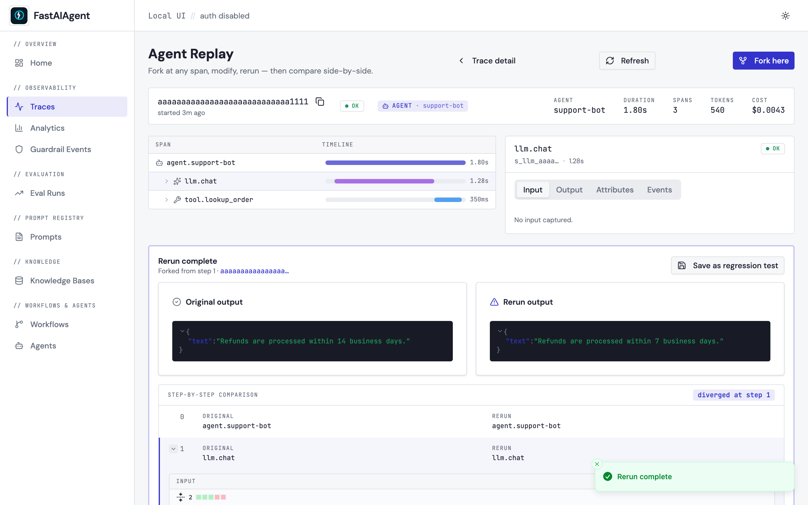

# Agent Replay

Agent Replay lets you load any past execution trace, step through it, inspect each step's input/output/attributes, fork at any point, modify the prompt or input, and rerun from that point. This is the SDK's unique debugging feature — no other framework offers fork-and-rerun.

!!! info "Fidelity guarantees"
    For per-mode behavior (live vs recorded vs deterministic), what's
    captured, what isn't, and per-provider seed support, see
    [Fidelity Guarantees](guarantees.md).

!!! tip "Production failure → regression test"
    The full **capture → analyze → fix → save → verify** loop, with
    a deliberately broken tool to demonstrate against, ships as
    [`examples/regression-from-trace/`](../flagships/regression-from-trace.md).
    Use it as the canonical pattern when a customer reports the agent
    did something wrong.

## Why Replay?

When an agent fails in production — hallucinates, calls the wrong tool, gives a bad answer — you need to understand **why** and test a fix **without re-running the entire pipeline**. Replay lets you:

1. Load the exact trace of the failure
2. Step through to find the problematic step
3. Fork at that step
4. Change the prompt, input, or state
5. Rerun from that point only
6. Compare the original vs fixed result

## Where Do Trace IDs Come From?

Every `agent.run()` automatically generates a trace. The trace ID is returned in the result:

```python
result = agent.run("Help me with my order")
print(result.trace_id)  # "b6acf1ef2c2779bbc2fcf80802ae0534"
```

You can also browse past traces programmatically or via CLI:

```python
from fastaiagent.trace import TraceStore
for t in TraceStore().list_traces(last_hours=24):
    print(f"{t.trace_id}  {t.name}  {t.status}")
```

```bash
fastaiagent traces list --last-hours 24
```

## Loading a Replay

### From Local Trace Storage

```python
from fastaiagent.trace.replay import Replay

# Load by trace ID (from result.trace_id or fastaiagent traces list)
replay = Replay.load("b6acf1ef2c2779bbc2fcf80802ae0534")
```

### From a TraceData Object

```python
from fastaiagent.trace.storage import TraceStore

store = TraceStore()
trace_data = store.get_trace("b6acf1ef2c2779bbc2fcf80802ae0534")
replay = Replay(trace_data)
```

## Viewing the Summary

```python
print(replay.summary())
```

Output:
```
Trace: b6acf1ef2c2779bbc2fcf80802ae0534
Name: agent.support-bot
Status: OK
Spans: 4
Duration: 2025-01-15T10:30:00Z → 2025-01-15T10:30:02.5Z

Steps:
  [0] agent.run
  [1] llm.chat_completion
  [2] tool.search_docs
  [3] llm.chat_completion
```

## Stepping Through

### All Steps

```python
steps = replay.step_through()
for step in steps:
    print(f"Step {step.step}: {step.span_name}")
    if step.attributes:
        print(f"  Attributes: {step.attributes}")
```

### Specific Step

```python
steps = replay.steps()
print(f"Total steps: {len(steps)}")

# Inspect a specific step
step = replay.inspect(2)
print(f"Name: {step.span_name}")
print(f"Span ID: {step.span_id}")
print(f"Timestamp: {step.timestamp}")
print(f"Attributes: {step.attributes}")
```

## ReplayStep

| Field | Type | Description |
|-------|------|-------------|
| `step` | `int` | Step index (0-based) |
| `span_name` | `str` | What happened (e.g., "llm.chat_completion", "tool.search") |
| `span_id` | `str` | Unique span identifier |
| `input` | `dict` | Input to this step |
| `output` | `dict` | Output from this step |
| `attributes` | `dict` | OTel attributes (model, tokens, tool name, etc.) |
| `timestamp` | `str` | When this step executed |

## Forking and Rerunning

The core debugging workflow — fork at the problem step, fix, rerun:

```python
# Step 3 is where the LLM hallucinated
forked = replay.fork_at(step=3)

# Modify what you want to fix
forked.modify_prompt("Always cite the exact policy section number. Never guess.")
forked.modify_input({"query": "refund policy section 4.2"})

# Rerun from that point
result = forked.rerun()
print(f"New output: {result.new_output}")
print(f"Steps executed: {result.steps_executed}")
```

### How `rerun()` reconstructs the agent

`ForkedReplay.rerun()` is a real re-execution, not a stub. Under the hood it:

1. Finds the root `agent.{name}` span in the loaded trace.
2. Reads the [Agent Reconstruction Attributes](../tracing/index.md#agent-reconstruction-attributes-used-by-replay) off that span — `agent.config`, `agent.tools`, `agent.guardrails`, `agent.llm.config`, `agent.system_prompt`, `agent.input` — and decodes them into the canonical `Agent.from_dict` payload.
3. Applies your `modify_prompt` / `modify_config` / `modify_input` modifications on top of that payload.
4. Rebinds tool callables by name via the [`ToolRegistry`](../tools/index.md#toolregistry). Tools created with `FunctionTool(name=..., fn=...)` or the `@tool` decorator auto-register at construction, so replay inside the same process picks them up automatically.
5. Builds a new `Agent` via `Agent.from_dict()` and calls `agent.arun(new_input)`. A new trace is emitted for the rerun, and its `trace_id` is returned on `ReplayResult.trace_id`.

**v1 scope.** The rerun re-executes the agent **from the top** with modifications applied — it does not literally resume the LLM loop at `fork_point` with prior messages pre-seeded. `fork_point` is still recorded and used by `compare()` to mark where divergence logically happened, so downstream tooling sees your intent. Mid-trace resume (replaying captured messages up to `fork_point` then continuing from there) requires a stable per-provider message-history representation and is planned as a follow-up.

**What you need for `rerun()` to work:**

- The SDK is at a version that captures `agent.*` reconstruction attributes (`0.1.7+`). Traces from older versions can still be loaded and stepped through, but `rerun()` will fail to reconstruct the agent — re-run the agent once on the new SDK to capture a rerun-capable trace.
- Any Python tool callables the agent used are registered in the [`ToolRegistry`](../tools/index.md#toolregistry) of the replay process. Importing the module that defines the tools is usually enough.
- `FASTAIAGENT_TRACE_PAYLOADS=0` was not set when the original trace was captured, *if* you want the resolved system prompt to round-trip. When payloads were off, modifications still work but the reconstructed agent uses whatever prompt your code supplies via `modify_prompt()`.

### Available Modifications

| Method | What it changes |
|--------|----------------|
| `modify_prompt(new_prompt)` | System prompt for the LLM call at the fork point |
| `modify_input(new_input)` | Input data passed to the step |
| `modify_config(**kwargs)` | Agent/LLM configuration (temperature, max_tokens, etc.) |
| `modify_state(new_state)` | Chain state (for chain replays) |

Methods return `self` for chaining:

```python
result = (
    replay.fork_at(step=3)
    .modify_prompt("Be more precise.")
    .modify_input({"context": "additional context"})
    .modify_config(temperature=0.2)
    .rerun()
)
```

## Comparing Results

After rerunning, compare the original and fixed execution:

```python
forked = replay.fork_at(step=3)
forked.modify_prompt("New instructions")
result = forked.rerun()

comparison = forked.compare(result)
print(f"Original steps: {len(comparison.original_steps)}")
print(f"Diverged at step: {comparison.diverged_at}")
```

### ComparisonResult

| Field | Type | Description |
|-------|------|-------------|
| `original_steps` | `list[ReplayStep]` | Steps from the original trace |
| `new_steps` | `list[ReplayStep]` | Steps from the rerun (if available) |
| `diverged_at` | `int \| None` | Step index where results diverged |

### ReplayResult

| Field | Type | Description |
|-------|------|-------------|
| `original_output` | `Any` | Output from the original execution |
| `new_output` | `Any` | Output from the rerun |
| `steps_executed` | `int` | Number of steps executed in the rerun |
| `trace_id` | `str \| None` | Trace ID of the original execution |

`ReplayResult` also exposes [`save_as_test()`](#from-a-rerun-to-a-regression-test) for turning a verified fix into a regression case.

## From a Rerun to a Regression Test

Once a `forked.rerun()` confirms the fix, append the case to a JSONL
dataset that the eval suite will replay on every future run. This
closes the loop: **every production failure becomes a permanent test
case**, captured at the exact step where it broke.

### Code path: `ReplayResult.save_as_test()`

```python
from fastaiagent.eval import evaluate
from fastaiagent.trace.replay import Replay

# 1. Reproduce the failure
failure = agent.run("What is our refund policy?")

# 2. Fork, fix, rerun
replay = Replay.load(failure.trace_id)
rerun = (
    replay.fork_at(step=0)
    .modify_prompt("Answer in exactly one sentence. Refund policy: 30 days.")
    .rerun()
)

# 3. Save the corrected behavior as a regression case
rerun.save_as_test(
    "regression_tests.jsonl",
    input="What is our refund policy?",
    expected_output=str(rerun.new_output),
    source_trace_id=failure.trace_id,  # provenance back to the original bug
)

# 4. Re-run the suite — string scorer or LLM-as-judge, your choice
results = evaluate(
    agent_fn=lambda text: agent.run(text).output,
    dataset="regression_tests.jsonl",
    scorers=["exact_match"],  # or [LLMJudge(criteria="correctness")]
)
```

### Saved JSONL schema

Each line is a self-contained record consumable by `evaluate()`:

```json
{
  "input": "What is our refund policy?",
  "expected_output": "Refund policy: 30 days, full refund.",
  "trace_id": "0aad0d1ef2ca859a0f1cc1a6aebb2bc7",
  "created_at": "2026-05-21T17:07:26.708546+00:00"
}
```

| Field | Source | Used by `evaluate()` |
|-------|--------|----------------------|
| `input` | Argument you pass to `save_as_test()` | Yes — fed to `agent_fn` |
| `expected_output` | Argument you pass | Yes — fed to the scorer |
| `trace_id` | `source_trace_id` arg, else `self.trace_id` | No — pure provenance |
| `created_at` | UTC ISO-8601 when saved | No — pure provenance |

The provenance fields are written for *humans* — both the Local UI and
the eval results page link them back to the originating failure trace.

### Works with any scorer (including LLM-as-Judge)

Because the JSONL schema is just `input`/`expected_output`, the same
dataset works with **any** scorer in the eval framework:

* `"exact_match"`, `"contains"` — fast deterministic string checks
* `LLMJudge(criteria="correctness")` — semantic equivalence via LLM
* Custom `@scorer` functions, trajectory scorers, safety scorers, RAG metrics

Pick the scorer that matches the kind of regression you're guarding
against. A worked example covering both string match and LLM-judge:
[`examples/62_replay_to_regression.py`](https://github.com/fastaifoundry/fastaiagent-sdk/blob/main/examples/62_replay_to_regression.py).

### UI path: "Save as regression test" button

The same workflow is available from the Local UI's Replay page — after
a rerun, the **Save as regression test** button calls
`POST /api/replay/forks/{fork_id}/save-as-test`, which appends an
**identical JSONL record** (same four fields) to
`./.fastaiagent/regression_tests.jsonl`. UI-saved and code-saved
records are interchangeable.

### Side-by-side comparison in the Local UI

Everything above is also available as a visual diff in the Local UI.
After running `fastaiagent ui`, open:

```
http://127.0.0.1:7842/traces/<trace_id>/replay
```

Click any span in the timeline → **Fork here** → pick one of the four
tabs (Prompt / Input / Tool response / LLM params) → edit → **Rerun
from this step**. The right pane fills with the forked run's spans as
they arrive.

Below, a **Rerun complete** card appears with three pieces:

1. **Side-by-side output cards** — the original final output and the
   rerun's final output, rendered through `JsonViewer`.
2. **Step-by-step comparison grid** — one row per step, with the
   original span name on the left and the rerun's on the right. Rows
   at or after `comparison.diverged_at` are highlighted with a left
   border bar and a "diverged at step N" badge at the top right.
3. **Expandable per-step diff** — click the chevron on any row whose
   inputs or outputs differ and a split-view diff
   (powered by [`react-diff-viewer-continued`](https://github.com/Aeolun/react-diff-viewer-continued))
   expands inline, showing exactly what changed on that step.

The diff respects your current theme (light/dark). **Save as
regression test** appends the case to
`./.fastaiagent/regression_tests.jsonl` — the same file you'd write to
from code.



The replay page itself and the fork dialog are captured separately:

- [`04-agent-replay.png`](../ui/screenshots/04-agent-replay.png) — the
  `/traces/:id/replay` page with span tree + inspector.
- [`05-replay-fork-dialog.png`](../ui/screenshots/05-replay-fork-dialog.png)
  — the Fork-and-rerun dialog with its four tabs.

### Clickable walkthrough

1. From any trace on `/traces`, click **Open in Replay** (or navigate
   directly to `/traces/<id>/replay`).
2. Click the span you want to branch from. The inspector on the right
   shows its inputs, outputs, attributes, and events.
3. Click **Fork here**. Pick the tab for the field you want to change
   (Prompt / Input / Tool response / LLM params).
4. Edit the field. Click **Rerun from this step**. The UI fires three
   sequential requests behind the scenes: `POST /api/replay/<id>/fork`
   → `PATCH /api/replay/forks/<fork_id>` → `POST /api/replay/forks/<fork_id>/rerun`.
5. When the rerun lands, the page auto-fetches the comparison and
   renders the card described above.
6. Click any row's chevron to see the per-step diff. Click **Save as
   regression test** to append the case to
   `./.fastaiagent/regression_tests.jsonl`.

### End-to-end bug-fix walkthrough

A full scripted example — buggy prompt → fork → fix → rerun → compare
→ assert → save-as-regression → UI deep links — lives at
[`examples/38_replay_comparison.py`](https://github.com/fastaifoundry/fastaiagent-sdk/blob/main/examples/38_replay_comparison.py).
Pair it with the Local UI page above for the visual side-by-side.

## CLI Commands

```bash
# Show replay steps for a trace
fastaiagent replay show <trace_id>

# Inspect a specific step
fastaiagent replay inspect <trace_id> 3
```

Example:
```bash
$ fastaiagent replay show b6acf1ef2c27

Trace: b6acf1ef2c2779bbc2fcf80802ae0534
Name: agent.support-bot
Status: OK
Spans: 4

Steps:
  [0] agent.run
  [1] llm.chat_completion
  [2] tool.search_docs
  [3] llm.chat_completion

$ fastaiagent replay inspect b6acf1ef2c27 2

Step 2: tool.search_docs
  Timestamp: 2025-01-15T10:30:01.300Z
  Attributes: {'fastaiagent.tool.name': 'search_docs'}
```

## Debugging Workflow

A typical debugging session:

```python
from fastaiagent.trace import TraceStore
from fastaiagent.trace.replay import Replay

# 1. Find the failing trace
store = TraceStore()
traces = store.search("support-bot")
# Or use: fastaiagent traces list

# 2. Load and inspect
replay = Replay.load(traces[0].trace_id)
print(replay.summary())

# 3. Step through to find the problem
for step in replay.step_through():
    print(f"[{step.step}] {step.span_name}: {step.attributes}")
# Step 3: LLM hallucinated the refund policy ← found it

# 4. Fork and fix
forked = replay.fork_at(step=3)
forked.modify_prompt("Always cite exact policy section numbers from the docs.")

# 5. Rerun and verify
result = forked.rerun()
print(f"Fixed output: {result.new_output}")

# 6. Compare
comparison = forked.compare(result)
print(f"Diverged at step {comparison.diverged_at}")
```

## Error Handling

```python
from fastaiagent._internal.errors import ReplayError

try:
    step = replay.inspect(99)
except ReplayError as e:
    print(f"Error: {e}")  # "Step 99 out of range (0-3)"

try:
    forked = replay.fork_at(-1)
except ReplayError as e:
    print(f"Error: {e}")  # "Step -1 out of range (0-3)"
```

---

## Platform Replay

When connected to the FastAIAgent Platform, you can pull any trace from the platform (including traces from other team members) and replay locally:

```python
import fastaiagent as fa

fa.connect(api_key="fa-...", project="my-project")

# Pull a platform trace and replay locally
replay = Replay.from_platform(trace_id="tr-abc123")
replay.step_through()

# Fork from a platform trace
forked = replay.fork_at(step=3)
forked.modify_prompt("Updated system prompt")
result = forked.rerun()
```

---

## Next Steps

- [Tracing](../tracing/index.md) — How traces are captured and stored
- [Chains Checkpointing](../chains/checkpointing.md) — Resume failed chains from checkpoints
- [Evaluation](../evaluation/index.md) — Systematically test agent quality
