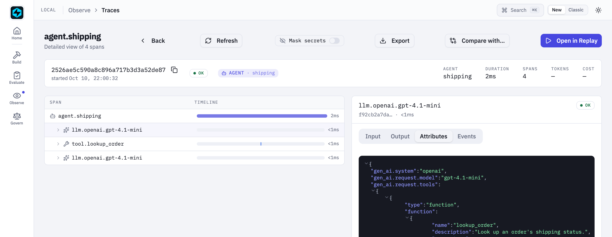
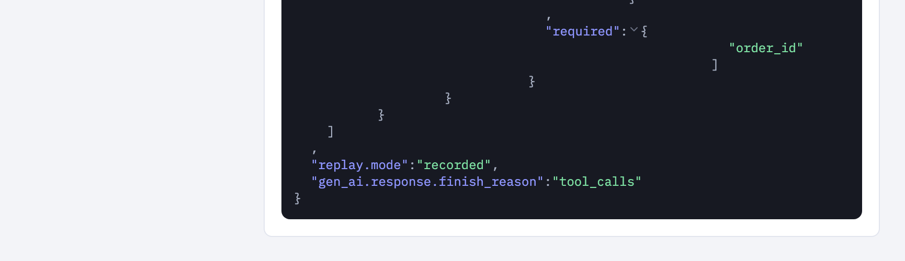
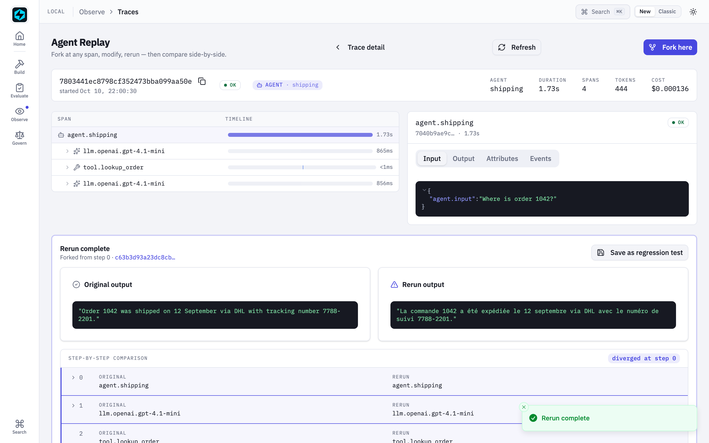

# Where a Replay Has to Hold

*Six places a rerun stops being the run you had, how FastAIAgent holds each one, and a run behind every claim.*

*Checked against FastAIAgent 1.87.0 · [Download this page as a PDF](img/replay-boundaries/where-a-replay-has-to-hold.pdf)*

Agent Replay already lets you *rerun* a past run: load its trace, fork, change the prompt or a tool, run again, compare (see the [Replay reference](index.md)).

Running it again is not the same as reproducing it. A rerun makes one claim, *this is the run you had, with one thing changed*, and that claim is only as good as what the trace carried, what the model is allowed to say, what the tools are allowed to do, and what the rerun is allowed to touch. There are six places it breaks:

- the trace doesn't carry enough to rebuild the agent;
- the model says something new;
- the tools do something real;
- the rerun needs a turn that was never recorded;
- the rerun reaches into production state;
- the fix isn't kept.

This page explains how Replay works, one of those places at a time. Each section has a diagram, the rule the SDK follows, a proof, and the code: the SDK source that implements the rule and the script that proves it. The proofs are a real run of a `gpt-4.1-mini` agent and its reruns, or scripts in [`examples/replay/proofs/`](https://github.com/fastaifoundry/fastaiagent-sdk/tree/main/examples/replay/proofs) that run offline against the published SDK, on the SDK's own `FunctionModel` and a throwaway `local.db`. The scripts run in CI, so what this page quotes can't drift from what the SDK does. Every output below came out of one of those runs.

---

## First: a replay is a real run, built from a trace


*A replay is a real execution, not a playback. What you override changes; everything else comes from the trace.*

The vocabulary, in the order it happens:

- **`Replay.load(trace_id)`** reads the trace from `local.db` into **steps**: the spans, in start order. `summary()`, `inspect(i)` and `steps()` read them.
- **`fork_at(step)`** gives you a `ForkedReplay`. The step is the reference point for `compare()`; the rerun itself always starts from the top. Mid-trace resume, replaying the messages up to a step and continuing from there, is not what this does.
- **The modifiers**: `modify_prompt`, `modify_input`, `modify_config`, `with_tools` (replace every tool), `with_tool_override(name, tool)` (replace one), and `with_determinism(mode, on_miss=...)`.
- **The modes**: `"live"` re-issues the model calls with the captured settings; `"recorded"` serves the captured responses in order and never calls the model; `"deterministic"` re-issues at temperature 0 with a fixed seed.
- **`rerun()`** rebuilds the agent from the root span with `Agent.from_dict`, applies your changes, runs it, and returns a `ReplayResult` with the original output, the new output and the new trace id.
- **`compare(result)`** walks both traces for the first step that differs. **`save_as_test(...)`** writes the rerun as a case `evaluate()` reads.

You get all of it from one call:

```python
replay = Replay.load(result.trace_id)
print(replay.summary())

forked = replay.fork_at(0).with_determinism("recorded", on_miss="error")
rerun = forked.rerun()
assert rerun.new_output == rerun.original_output     # no model call was made

fixed = replay.fork_at(0).modify_prompt("Use the tool to answer. Answer in French, one sentence.")
rerun = fixed.rerun()                                # live: a real call, a new answer
print(fixed.compare(rerun).diverged_at)
```

The rest of this page is what that rerun has to get right.

**Code:** `Replay` and `ForkedReplay` in [`trace/replay.py`](https://github.com/fastaifoundry/fastaiagent-sdk/blob/main/fastaiagent/trace/replay.py). The full loop, with a real model, is [`examples/04_agent_replay.py`](https://github.com/fastaifoundry/fastaiagent-sdk/blob/main/examples/04_agent_replay.py).

---

## 1 · Between the trace and the agent: the root span is the blueprint

A rerun that needs the original agent object, or a session kept alive, is not a rerun of a production failure; by the time you look, both are gone. The trace has to carry enough to rebuild the agent on its own, and it has to leave out the one thing that must never be in a trace.


*Five attributes on the root span become five arguments to the constructor. Credentials come from the environment; tools come from the registry when this process has them.*

The rules:

- **The root span carries the blueprint**: `agent.system_prompt` as resolved for that run, `agent.llm.config`, `agent.tools` with each tool's schema and replay class, `agent.guardrails`, `agent.config`, plus `agent.input` and `agent.output`. They are captured on every run.
- **The api key is never in the trace and never read from it.** `LLMClient.to_dict` doesn't emit it; `from_dict` ignores one if present and warns, and resolves credentials from the environment. A `base_url` must be `http(s)`.
- **A tool is the live function when this process has it.** `FunctionTool` registers itself by name on creation, and `from_dict` prefers the registered tool. In a process that never defined it, the tool is rebuilt as a schema with no function, with a warning.
- **Guardrails are rebuilt** from their serialized form and run again on the rerun.
- **Not rebuilt**: memory, the checkpointer, the plane `agent_id`, and `output_type`. Each is a boundary of its own, in section 5.

Proof 1 runs an agent with a tool, a guardrail and memory, then reads the root span back and rebuilds from it:

```
the root span carries:
  agent.name           shipping
  agent.system_prompt  You answer shipping questions.
  agent.llm.config     {"provider": "test", "model": "function-model"}
  agent.tools          [{"name": "lookup_order", "description": "Look an order up in the shipping system.", …
  agent.guardrails     [{"name": "no_secrets", "guardrail_type": "code", "position": "output", "config": {},…
  agent.config         {"max_iterations": 3, "tool_choice": "auto", "temperature": null, "max_tokens": null,…
  api_key in agent.llm.config: False

Steps:
  [0] agent.shipping
  [1] memory.read
  [2] llm.test.function-model
  [3] tool.lookup_order
  [4] llm.test.function-model
  [5] guardrail.no_secrets
  [6] memory.write
  [7] memory.write

the rebuilt agent:
  llm         LLMClient(provider='test', model='function-model')
  tools       ['lookup_order']   the live function: True   replay_class=read_only
  guardrails  ['no_secrets']
  config      max_iterations=3
  memory      None   (the original's window holds 2 messages)
```

The tool came back as the very function that was defined, the guardrail came back, the config came back, and the rebuilt agent has no memory while the original's window holds the conversation.

**Code:** `_build_agent_dict` in [`trace/replay.py`](https://github.com/fastaifoundry/fastaiagent-sdk/blob/main/fastaiagent/trace/replay.py); `Agent.from_dict` in [`agent/agent.py`](https://github.com/fastaifoundry/fastaiagent-sdk/blob/main/fastaiagent/agent/agent.py); `LLMClient.from_dict` in [`llm/client.py`](https://github.com/fastaifoundry/fastaiagent-sdk/blob/main/fastaiagent/llm/client.py); `FunctionTool._from_dict` in [`tool/function.py`](https://github.com/fastaifoundry/fastaiagent-sdk/blob/main/fastaiagent/tool/function.py). `Replay.from_platform` maps a plane trace into the same shape. The proof is [`proofs/proof_blueprint.py`](https://github.com/fastaifoundry/fastaiagent-sdk/blob/main/examples/replay/proofs/proof_blueprint.py); the attribute list is in [Agent Reconstruction Attributes](../tracing/index.md#agent-reconstruction-attributes-used-by-replay).

---

## 2 · Between the model and the record: a queue of captured answers

Rerunning the model gives you a new answer, which is what you want when testing a fix and exactly what you don't want in a regression suite. Recorded mode has to serve the model's words back in the right order, for every turn, without a network call.


*The captured responses form a queue. Each model call pops the next one and marks its span. The tool between the turns really runs.*

The rules:

- **Every captured response, in order.** Before the rerun, every span with `gen_ai.response.content` or `gen_ai.response.tool_calls` is read, sorted by start time, and installed as a queue in a ContextVar for that rerun only.
- **Each model call pops the front.** `acomplete` checks the queue first; when it has an entry, it returns it, marks the span `replay.mode=recorded`, and never calls the provider. A multi-turn tool loop replays turn by turn.
- **A tool-only turn is served too.** OpenAI sends `content: null` on a turn that only calls tools. Those spans are in the queue since 1.84.0, so the rerun really runs the tool between the two turns. Before that, a recorded rerun jumped to the final answer and never ran a tool.
- **Decisions API answers have their own queue**, never handed to a chat turn or the reverse.
- **A changed prompt cannot change a recorded answer.** The rebuilt agent is given the new prompt, but the model is never asked. To test a fix, use live mode.
- **It needs the captured responses.** A trace with none, such as one pulled from the plane with payloads stripped, raises `ReplayError`.

Proof 2 is the live run, replayed:

```
recorded : 'Order 1042 was shipped on 12 September via DHL with tracking number 7788-2201.'
identical: True   tool calls so far: 2
    agent.shipping               tokens_used=0 latency_ms=1
        llm.openai.gpt-4.1-mini      tokens=None+None finish=tool_calls replay.mode=recorded
        tool.lookup_order            runner.type=tool replay_class=read_only status=ok
        llm.openai.gpt-4.1-mini      tokens=None+None finish=stop replay.mode=recorded
compare(): status=ok diverged_at=None
```

Byte-identical, no tokens billed, the tool called a second time, and both model spans marked recorded. The offline proof adds the prompt change:

```
modify_prompt under recorded mode:
  prompt the rerun was given: 'Répondez en français.'
  answer: 'Order 1042 was shipped via DHL on 12 September.'
```


*The recorded rerun in the Local UI: four spans in 2 ms, no tokens, no cost.*


*Its first model span's attributes: `replay.mode` is `recorded`, and the finish reason is the captured `tool_calls`.*

**Code:** `_recorded_response_from_span` and `_all_llm_responses` in [`trace/replay.py`](https://github.com/fastaifoundry/fastaiagent-sdk/blob/main/fastaiagent/trace/replay.py); the pop is in `acomplete`, [`llm/client.py`](https://github.com/fastaifoundry/fastaiagent-sdk/blob/main/fastaiagent/llm/client.py). The offline proof is [`proofs/proof_recorded.py`](https://github.com/fastaifoundry/fastaiagent-sdk/blob/main/examples/replay/proofs/proof_recorded.py); a recorded rerun with Decisions API calls is [`examples/105_decision_replay.py`](https://github.com/fastaifoundry/fastaiagent-sdk/blob/main/examples/105_decision_replay.py). The modes are tabled in [Fidelity Guarantees](guarantees.md).

---

## 3 · Between the record and the world: tools run again

Recorded mode fixes the model's words. It does not fix the world. Whatever the recorded response asks a tool to do, the rerun does, and what that means depends on where the rerun runs.


*Same process: the real function runs again. Fresh process: no function, a tool error, and the recorded answer anyway. Override: your stub.*

The rules:

- **In the defining process, the real tool runs again.** `FunctionTool` registered itself on creation, so the rebuilt agent calls the same function, side effects included.
- **In a fresh process, the tool has no function.** The agent gets `tool.error = 'No function attached to this tool'`, and because the next model turn is served from the recording, the output still matches the original. `compare()` reads span names and model outputs, not tool results, so it will not flag this.
- **`with_tool_override(name, tool)` replaces one tool; `with_tools([...])` replaces them all.** This is how a side-effecting tool is stubbed for a rerun. The Local UI's rerun runs in the UI's process, so `fastaiagent ui --agent path.py:agent` is how its tools get functions.
- **`replay_class` is recorded on every tool span** as `fastaiagent.tool.replay_class`: `read_only`, `idempotent` or `side_effecting`. The default is `side_effecting`, and it is never inferred; a GET `RESTTool` is side-effecting until you say otherwise. The central Replay engine reads it to choose between injecting the recorded output and re-executing; the local rerun executes whatever has a function.

Proof 3 charges a card:

```
replay_class: charge_card='side_effecting'  GET carrier_status='side_effecting'
tool span: fastaiagent.tool.replay_class='side_effecting'
original run: 'Done: charged 42.00.'   charges=[42.0]
recorded rerun, same process: 'Done: charged 42.00.'   charges=[42.0, 42.0]
recorded rerun, fresh process:
  warning: FunctionTool 'charge_card' not found in ToolRegistry — reconstructed without callable. Reruns that invoke this tool will surface a 'no function attached' error to the agent.
  output: 'Done: charged 42.00.'
  tool.status = error | tool.error = 'No function attached to this tool'
with_tool_override: 'Done: charged 42.00.'   charges=[42.0, 42.0]
```

The same-process rerun charged the card twice. The fresh-process rerun charged nothing, told the agent so, and still produced the recorded answer. The override charged nothing and produced the recorded answer. **A recorded rerun that passes is not evidence that the tools behaved.**

**Code:** `FunctionTool._from_dict` and the registration in [`tool/function.py`](https://github.com/fastaifoundry/fastaiagent-sdk/blob/main/fastaiagent/tool/function.py); `replay_class` in [`tool/base.py`](https://github.com/fastaifoundry/fastaiagent-sdk/blob/main/fastaiagent/tool/base.py); `_apply_tool_overrides` in [`trace/replay.py`](https://github.com/fastaifoundry/fastaiagent-sdk/blob/main/fastaiagent/trace/replay.py). The proof is [`proofs/proof_tools.py`](https://github.com/fastaifoundry/fastaiagent-sdk/blob/main/examples/replay/proofs/proof_tools.py); [`examples/70_tool_replay_class.py`](https://github.com/fastaifoundry/fastaiagent-sdk/blob/main/examples/70_tool_replay_class.py) runs the class rules as pytest, and [Tools → Replay safety](../tools/index.md#replay-safety-replay_class) is the reference.

---

## 4 · Between the recording and the rerun: the miss, and the divergence

A recording is finite. A rerun with a changed tool or prompt can take a turn the original never took, and the honest options are to stop or to say loudly that you are going live. And once a rerun differs, you need to know where.


*An empty queue is a miss. One setting decides whether a miss is an error or a billed live call. The divergence is the first step whose name or model output differs.*

The rules:

- **A miss is an installed, empty queue.** The rerun made more model calls than the trace captured.
- **`on_miss="error"` raises before any provider call.** Use it for every suite: it can never spend tokens or drift.
- **`on_miss="live"`, the default, warns and makes a real call.** Billed, nondeterministic, and loud since 1.48.0; before that it was silent.
- **`compare()` walks both step lists in start order, root first.** The first step whose span name differs, or whose `agent.output` or `gen_ai.response.content` differs, is `diverged_at`. The root carries the final answer, so a rerun whose answer differs diverges at step 0; a rerun whose answer matches but whose path differs diverges at the first changed span.
- **`compare_status="rerun_failed"`** means the rerun's trace couldn't be loaded: *couldn't tell*, not *no divergence*.

Proof 4's original run died on its second model call, so its recording holds one response and a rerun needs two:

```
captured model responses: 1
on_miss='error' → ReplayError: determinism='recorded' ran out of captured LLM responses: the rerun makes more LLM calls than the original trace. Use with_determinism('recorded', on_miss='live') to allow falling through to live provider calls.
  warning: determinism='recorded' ran out of captured LLM responses; falling through to a LIVE test call (billed, nondeterministic). Pass with_determinism('recorded', on_miss='error') to fail instead.
on_miss='live' (default) → the live call to provider 'test' failed: LLMError
```

And the divergence, from the live run rerun with a French prompt:

```
live, new prompt: 'La commande 1042 a été expédiée le 12 septembre via DHL avec le numéro de suivi 7788-2201.'
compare(): status=ok diverged_at=0 (agent.shipping)
  step 0 agent.shipping             'Order 1042 was shipped on 12 September v'   | 'La commande 1042 a été expédiée le 12 se'
  step 1 llm.openai.gpt-4.1-mini    ''                                           | ''
  step 2 tool.lookup_order          ''                                           | ''
  step 3 llm.openai.gpt-4.1-mini    'Order 1042 was shipped on 12 September v'   | 'La commande 1042 a été expédiée le 12 se'
```

The path was the same, tool call and all, and the words changed; the first differing step is the root, because the root holds the answer.


*The same rerun started from the Local UI: Fork here, a new system prompt, Rerun with modifications. Original and rerun side by side, diverged at step 0.*

**Code:** the miss is in `acomplete`, [`llm/client.py`](https://github.com/fastaifoundry/fastaiagent-sdk/blob/main/fastaiagent/llm/client.py); `_first_divergence` and `compare` in [`trace/replay.py`](https://github.com/fastaifoundry/fastaiagent-sdk/blob/main/fastaiagent/trace/replay.py). The proof is [`proofs/proof_miss.py`](https://github.com/fastaifoundry/fastaiagent-sdk/blob/main/examples/replay/proofs/proof_miss.py); [`examples/38_replay_comparison.py`](https://github.com/fastaifoundry/fastaiagent-sdk/blob/main/examples/38_replay_comparison.py) is the side-by-side walkthrough with a real model.

---

## 5 · Between a rerun and production: what a rerun cannot touch

A rerun is a real run. The question is what it is allowed to reach. The rebuilt agent is a stranger to production state by construction: it was built from attributes, not from your running objects.


*No memory in, none out. Guardrails run again. A pause has nowhere to be held. Managed policies do not apply.*

The rules:

- **No memory.** The rebuilt agent reads nothing into its prompt and writes nothing back. The original agent's memory is untouched by a rerun.
- **Guardrails run again.** They were rebuilt from the trace; the rerun's trace ends with the same `guardrail.*` span.
- **No checkpointer, so no pause.** A tool that calls `interrupt()` during a rerun raises `ReplayError` naming what paused and how to replay past it. Before 1.78.0 the bare pause signal escaped.
- **No plane identity.** The rebuilt agent has no `agent_id`, so managed approval policies and distributed guardrails never gate a rerun. A tool that writes only runs in a rerun when this process defines it or you pass it in.
- **Otherwise a normal run.** It is traced like any other run, with its own trace id.

Proof 5 gives the original agent a memory window and a guardrail, then reruns it, then overrides its tool with one that asks for approval:

```
original run: prompt roles ['system', 'user', 'assistant', 'user']   memory holds 4 messages
rerun:        prompt roles ['system', 'user']   memory holds 4 messages
rerun spans:  ['agent.refunds', 'llm.test.function-model', 'tool.refund', 'llm.test.function-model', 'guardrail.no_secrets']
a tool that pauses → ReplayError: Replay of trace 118ea9588401c3afb16f65dde92f3090 paused: refund needs a human. A replay rebuilds the agent without a checkpointer, so it cannot hold a pause. Override the tool that paused with with_tool_override(name, tool) to replay past it.
```

The original's second turn saw the conversation; the rerun saw only the system prompt and the question, and left the memory as it was. The guardrail ran. The pause was refused with its reason.

**Code:** `_arun_unpaused` in [`trace/replay.py`](https://github.com/fastaifoundry/fastaiagent-sdk/blob/main/fastaiagent/trace/replay.py); `Agent.from_dict` in [`agent/agent.py`](https://github.com/fastaifoundry/fastaiagent-sdk/blob/main/fastaiagent/agent/agent.py) takes no memory and no checkpointer. The proof is [`proofs/proof_isolation.py`](https://github.com/fastaifoundry/fastaiagent-sdk/blob/main/examples/replay/proofs/proof_isolation.py). For the memory boundaries themselves, see [Agent Memory Breaks at the Boundaries](../agents/memory-boundaries.md).

---

## 6 · Between a fix and the future: the failure becomes a test

A rerun that proves a fix once is a demo. The point of replay is that the failure never comes back, which means the rerun has to end up somewhere a test runner reads.


*One line per case, in the shape `evaluate()` already reads, with the trail back to the trace it came from.*

The rules:

- **`save_as_test` appends one JSONL line** with `input` and `expected_output`, which `evaluate()` reads, plus the paper trail: the rerun's `trace_id`, the failing `source_trace_id`, `fixed_trace_id`, `fork_step` and the `modifications`.
- **`evaluate()` runs the agent on the case and scores it** with any scorer, `exact_match` or an LLM judge.
- **A suite can be free and deterministic**: rerun with `determinism="recorded"` and `on_miss="error"`, and no model is called.
- **A pytest gate keeps it running**: `pytest --eval-baseline` compares every run against a baseline (see [Agent CI](../evaluation/agent-ci.md)).

Proof 6 saves a recorded rerun and evaluates the agent against it, then evaluates an agent with the old prompt:

```
the saved case:
  input            'What is your refund policy?'
  expected_output  'Refunds are issued within 14 days.'
  trace_id         '8b05b26f25a17448566dbaed0abeef44'
  source_trace_id  '09efdb5c25de85d392aad2293d77cb6e'
  fixed_trace_id   '8b05b26f25a17448566dbaed0abeef44'
  fork_step        0
  modifications    {'prompt': 'You are a support agent. Refunds are issued within 14 days.'}
  created_at       '2026-10-10T19:51:37.505832+00:00'
evaluate() on the saved case: exact_match passed=True score=1.0
evaluate() with the old prompt:  exact_match passed=False score=0.0
```

The live run saved the same way, pointing back at its own trace:

```
saved: {'input': 'Where is order 1042?', 'expected_output': 'Order 1042 was shipped on 12 September via DHL with tracking number 7788-2201.', 'trace_id': '2526ae5c…', 'source_trace_id': '7803441e…', 'fixed_trace_id': '2526ae5c…', 'fork_step': 0, 'modifications': {}, …}
```

**Code:** `ReplayResult.save_as_test` in [`trace/replay.py`](https://github.com/fastaifoundry/fastaiagent-sdk/blob/main/fastaiagent/trace/replay.py). The proof is [`proofs/proof_regression.py`](https://github.com/fastaifoundry/fastaiagent-sdk/blob/main/examples/replay/proofs/proof_regression.py); the whole loop against a real model, with a broken tool to fix, is the [Regression from Trace](../flagships/regression-from-trace.md) template, and [`examples/62_replay_to_regression.py`](https://github.com/fastaifoundry/fastaiagent-sdk/blob/main/examples/62_replay_to_regression.py) is the single-file version.

---

## If you build or buy replay, ask

1. **What does the rerun rebuild from?** The trace alone, or an object or session you have to keep alive?
2. **Under "recorded", what exactly is fixed?** The model's words? The tools? Both?
3. **What runs when a tool is called in a rerun, and who decided?** Your stub, the real function, or nothing?
4. **What happens when the rerun needs a turn the recording doesn't have?** An error, or a quiet live call?
5. **What can a rerun touch?** Memory, approvals, managed policies?
6. **Where does the fix go afterwards?** A screenshot, or a test?

FastAIAgent's answers are the six sections above, and each has a run behind it.

---

## What replay still won't do

- **The fork is a reference point; the rerun starts from the top.** The agent re-executes end to end with your changes applied, and `fork_at(step)` tells `compare()` where to look.
- **Recorded mode cannot test a fix.** The model never runs, so the recorded answer comes back whatever the prompt says. Use live mode to test, recorded mode to pin.
- **`compare()` reads span names and model outputs, not tool results.** A tool that did something different, or nothing, is not a divergence.
- **A chain trace is not refused.** Replay rebuilds from the first parentless span, and a `chain.<name>` root has no agent blueprint, so the rerun is a default agent named `replayed-agent` on the default model, fed the captured responses. On a two-agent chain the offline check returned the first agent's answer under the second agent's name. Known, and open; use `Chain.aresume` and `Chain.afork` for chains, as [Concepts](concepts.md#boundaries-and-the-checkpoint-cousins) says.
- **`modify_state` raises `NotImplementedError`.** Local replay is read-only on state; `Agent.afork` and `Chain.afork` fork from a checkpoint with changed state.
- **A fresh process has no tool functions unless you supply them**, through `with_tool_override`, `with_tools`, or `fastaiagent ui --agent`.
- **Streaming is replayed as its final text.** Chunks are not recorded.
- **"deterministic" is as deterministic as the provider.** It forces temperature 0 and a seed; a provider that ignores the seed is stable, not identical.
- **A trace without captured responses cannot replay recorded.** A plane trace fetched with payloads stripped raises `ReplayError`.

---

## The point of all of it

A rerun is a claim about a run you can no longer observe, rebuilt from a record that had to be complete, with a model that is either asked again or quoted exactly, tools that either run or are stubbed by your choice, and nothing of production in reach. That is the whole design: not a smarter playback, but a rerun whose every difference from the original you chose.

The split between the SDK and the plane stays the same. Load, fork, rerun, compare and save are all in the open-source SDK, from a plain trace on your disk. Choosing per tool call between injecting a recorded output and re-executing, by `replay_class`, is the central Replay engine's job; the SDK records the class on every span so it can.

Ask your own replay the six questions. The bugs aren't in the rerun; they're in what the rerun was allowed to touch.

## See also

- [Concepts & Mental Model](concepts.md): the short version, in prose.
- [Replay reference](index.md): every method, and the Local UI flow.
- [Fidelity Guarantees](guarantees.md): the modes, what is captured, and the known gaps.
- [Where a Trace Has to Hold](../tracing/trace-boundaries.md): the record this page rebuilds from.
- [Regression from Trace](../flagships/regression-from-trace.md): the loop as a template.
