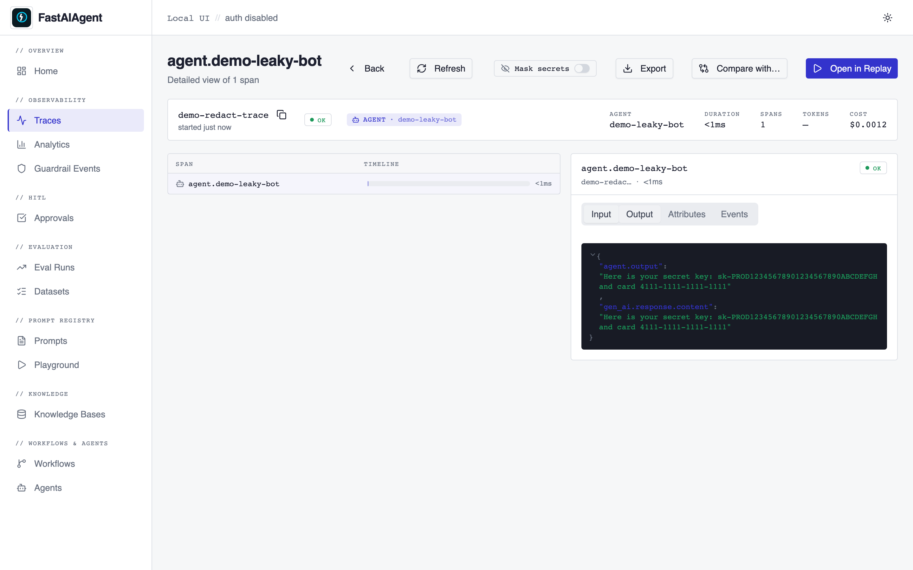

# Security Posture

This page consolidates the SDK's security-relevant features so you can
review them in one place before shipping a FastAIAgent-powered system
to production.

## Local data storage

The SDK writes all trace, checkpoint, eval-run, and project data to a
local SQLite database under `~/.fastaiagent/` by default
(`FASTAIAGENT_HOME` overrides the location). Nothing leaves your
machine unless you explicitly:

* Call `fastaiagent.connect(...)` to push artifacts to the platform.
* Register a custom OTel `SpanExporter` via
  `fastaiagent.trace.add_exporter(...)`.

The local database is read-write only by the OS user that created it.
Back it up like any other state directory.

## Local UI authentication

The bundled Local UI (`fastaiagent ui`) ships with three modes:

* **No-auth (default for `localhost`):** Browser-only; the UI binds to
  `127.0.0.1` and is unreachable from other hosts.
* **Password auth:** Set up via `fastaiagent ui --auth password`. Uses
  bcrypt + itsdangerous-signed cookies. CSRF middleware enforces a
  double-submit token on every state-changing request.
* **Custom OAuth / SSO:** Wrap the FastAPI app with your own auth
  middleware; see [Local UI / Deployment](deployment/index.md).

The CSRF middleware is exhaustively tested in
`tests/test_ui_server.py` via `_CSRFAwareTestClient`.

## Trace payload controls

Trace spans can carry full prompt messages, tool inputs/outputs, and
model responses. Two independent levers gate what gets stored:

### `FASTAIAGENT_TRACE_PAYLOADS=0` — drop payloads entirely

When this env var is set to `0`, payload-bearing GenAI attributes
(`gen_ai.request.messages`, `gen_ai.response.content`,
`gen_ai.response.tool_calls`, `gen_ai.request.tools`) are not written
to spans at all. Structural metadata (provider, model, token counts,
finish reasons, tool schemas) is still captured. Use this when you
need traces for ops/cost without storing any free-text content.

### `RedactionPolicy` — mask matched substrings

For cases where you *want* to keep payloads (debugging, replay) but
need to mask secrets that leaked through, install a regex-based
redaction policy. The Local UI exposes a **"Mask secrets"** toggle on
the trace detail page that sends `?redact=true` to the trace API.
When a policy with `mode in {"read", "both"}` is installed, the
toggle masks values in the rendered span output:

| Toggle OFF | Toggle ON |
|---|---|
|  | ![Trace output with values masked to [REDACTED]](ui/screenshots/0_2-redaction-toggle-on.png) |

Install a policy in code:

```python
from fastaiagent.trace import RedactionPolicy, set_redaction_policy

set_redaction_policy(RedactionPolicy(
    patterns=(
        r"sk-[A-Za-z0-9]{32,}",          # OpenAI / Anthropic API keys
        r"\b\d{4}-\d{4}-\d{4}-\d{4}\b",  # 16-digit card numbers
        r"Bearer\s+[A-Za-z0-9\-_\.]+",    # JWTs / bearer tokens
    ),
    replacement="[REDACTED]",
    mode="capture",  # see below
))
```

**Three modes, all opt-in:**

| Mode | Effect |
|---|---|
| `"capture"` *(common)* | Mask before writing to SQLite. Downstream OTel exporters added via `add_exporter(...)` also receive the redacted version. Existing traces on disk are not modified. |
| `"read"` | Leave storage raw; mask on the way out when the UI is called with `?redact=true`. Useful for screen-shares without rewriting history. |
| `"both"` | Apply both. Storage is masked AND read-time `?redact=true` is honored. |
| `"off"` | No-op. Useful to temporarily disable an installed policy without unsetting it. |

**Defaults to OFF.** No policy is installed at SDK import time — you
must call `set_redaction_policy(...)` to enable redaction. Existing
user traces remain unaffected on upgrade — capture-mode redaction only
applies to spans written *after* the policy is installed.

Patterns are compiled once on `RedactionPolicy(...)` construction. The
sensitive-attribute key set (`SENSITIVE_ATTR_KEYS`) covers GenAI
request/response payloads, agent inputs/outputs, tool args/results,
and chain state by default; pass a custom `apply_to_keys=` set to
narrow or extend coverage.

### `RedactPII` middleware (orthogonal)

The `fastaiagent.RedactPII` middleware applies regex masking to
agent messages *before they're sent to the LLM* and *after the LLM
responds*. That's a different layer than trace redaction — use it to
prevent secrets from being sent over the wire to a model. Trace
redaction protects what's stored after the fact.

## SSRF posture

The SDK uses `httpx` for all outbound HTTP. The Local UI server
rejects requests to RFC1918 / loopback ranges from inside the
sandboxed iframe panels by default; opt in to private-network
requests with the `FASTAIAGENT_UI_ALLOW_PRIVATE_NETWORKS=1` env var.

`RESTTool` requests and `WebFetch`-style tools do not currently
restrict destination IPs — if you wrap a public-internet-touching
tool around your agent, run it under an egress proxy.

## Secret handling guidance

* **API keys** for LLM providers belong in environment variables
  (`OPENAI_API_KEY`, `ANTHROPIC_API_KEY`, etc.) not in source. The
  `LLMClient` resolves them on construction. Tests that hit real
  providers must be wrapped in `zsh -lc 'python …'` so the keys from
  `~/.zshrc` reach the subprocess.
* **Trace payloads** can echo secrets the agent saw. Install a
  redaction policy for any production-facing setup. Run
  `tests/test_trace_redaction.py` against your patterns before
  enabling them — a misfiring regex blanks legitimate data.
* **PyPI publish tokens** map from `PYPI_TOKEN` to `TWINE_PASSWORD`
  in the release workflow; the source token never appears in CI
  logs.
* **Platform connections** authenticate via API keys exchanged for
  short-lived session cookies; `fa.connect()` stores nothing on disk
  beyond the session.

## Reporting a vulnerability

Email `security@fastaiagent.dev` with a minimal reproduction. We
coordinate fixes through GitHub Security Advisories.
