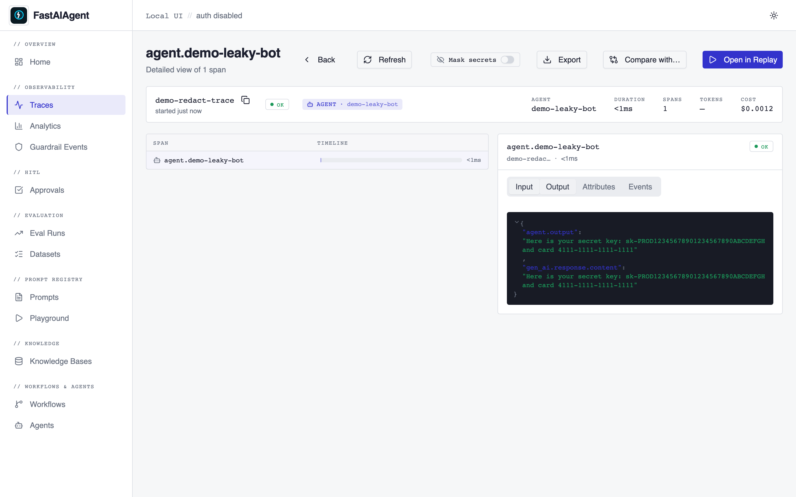

# Security Posture

This page consolidates the SDK's security-relevant features so you can
review them in one place before shipping a FastAIAgent-powered system
to production.

## Local data storage

The SDK writes all trace, checkpoint, eval-run, and project data to a
local SQLite database under `~/.fastaiagent/` by default
(`FASTAIAGENT_HOME` overrides the location). Nothing leaves your
machine unless you explicitly:

* Call `fastaiagent.connect(...)` to push artifacts to the platform.
* Register a custom OTel `SpanExporter` via
  `fastaiagent.trace.add_exporter(...)`.

The local database is kept readable and writable **only by the owning OS
user**: the SDK tightens `~/.fastaiagent/` to `0700` and `local.db` to
`0600` on every open, removing any group/other access (it never touches
owner bits, and never loosens perms that are already stricter). This also
repairs databases created by older versions that left them world-readable.
If you deliberately share the directory with a group, opt out with
`FASTAIAGENT_DB_KEEP_PERMS=1`. Back it up like any other state directory.

## Local UI authentication

The bundled Local UI (`fastaiagent ui`) ships with three modes:

* **No-auth (default for `localhost`):** Browser-only; the UI binds to
  `127.0.0.1` and is unreachable from other hosts.
* **Password auth:** Set up via `fastaiagent ui --auth password`. Uses
  bcrypt + itsdangerous-signed cookies. CSRF middleware enforces a
  double-submit token on every state-changing request.
* **Custom OAuth / SSO:** Wrap the FastAPI app with your own auth
  middleware; see [Local UI / Deployment](deployment/index.md).

The CSRF middleware is exhaustively tested in
`tests/test_ui_server.py` via `_CSRFAwareTestClient`.

**DNS-rebinding & cross-origin protection.** The server validates the `Host`
header against a loopback allowlist, so a page that rebinds its own domain to
`127.0.0.1` (arriving with `Host: evil.example`) is rejected with 400. It also
rejects state-changing requests carrying a cross-origin `Origin` header, which
protects the `--no-auth` API from CORS-simple writes a malicious page might
trigger. Set `FASTAIAGENT_UI_ALLOWED_HOSTS` (comma-separated) to permit a proxy
hostname. Non-browser clients (curl, scripts) send no `Origin` and are
unaffected.

**Brute-force / rate-limit keys.** The login lockout and the playground
LLM rate limiter are keyed on the client IP. By default this is the real
peer address, so a client can't rotate an `X-Forwarded-For` header to dodge
the limit. If you front the UI with a reverse proxy, set
`FASTAIAGENT_UI_TRUST_PROXY=1` so the first `X-Forwarded-For` hop is used
instead — do this **only** when a trusted proxy is actually in front, or
clients could spoof it again.

## Trace payload controls

Trace spans can carry full prompt messages, tool inputs/outputs, and
model responses. Two independent levers gate what gets stored:

### `FASTAIAGENT_TRACE_PAYLOADS=0` — keep payloads local, never export them

FastAIAgent is **local-first**: your local store (`local.db`) and the
tools that read it — the Local UI and Agent Replay — are always full
fidelity, because Replay reconstructs a run from the captured prompts and
outputs. So payload capture is controlled at the **export boundary**, not
at capture.

When `FASTAIAGENT_TRACE_PAYLOADS=0` is set, payload-bearing attributes
(`gen_ai.request.messages`, `gen_ai.response.content`,
`gen_ai.response.tool_calls`, `gen_ai.request.tools`, agent/chain
inputs and outputs, system prompts, tool args/results, retrieved
documents, and recalled memory) are **stripped before spans leave the
machine** — both when pushed to the control plane and when sent to any
exporter registered via `fastaiagent.trace.add_exporter(...)`. Structural
metadata (provider, model, token counts, finish reasons, tool schemas,
latencies) always flows. This is the setting to use for a connected /
enterprise deployment where sensitive content must not egress but you
still want full local debugging.

To capture *nothing at all* (not even locally), disable tracing entirely
with `FASTAIAGENT_TRACE_ENABLED=0`.

### `export_checkpoints=False` — keep durability state off the plane

When connected, checkpoint **state** (`state_snapshot`, `node_input`,
`node_output`, `interrupt_context`) is replicated to the plane by default —
this applies to **both** the SQLite and external-Postgres checkpointers.
`connect(export_checkpoints=False)` (or `FASTAIAGENT_EXPORT_CHECKPOINTS=0`)
suppresses that replication. It is independent of `export_traces`.

This gates **replication only**. Your local durability (SQLite/Postgres) is
untouched, so **same-machine crash/interrupt resume still works** with it off.
What the plane replica additionally provides — and what you lose by disabling
it — is **cross-machine / distributed-runner resume** (a runner resuming an
execution that began on another host reads the plane), **disaster recovery** if
the local store is lost, and **console visibility** of execution state. Keep it
on if you rely on any of those.

### `RedactionPolicy` — mask matched substrings

For cases where you *want* to keep payloads (debugging, replay) but
need to mask secrets that leaked through, install a regex-based
redaction policy. The Local UI exposes a **"Mask secrets"** toggle on
the trace detail page that sends `?redact=true` to the trace API.
When a policy with `mode in {"read", "both"}` is installed, the
toggle masks values in the rendered span output:

| Toggle OFF | Toggle ON |
|---|---|
|  | ![Trace output with values masked to [REDACTED]](ui/screenshots/0_2-redaction-toggle-on.png) |

Install a policy in code:

```python
from fastaiagent.trace import RedactionPolicy, set_redaction_policy

set_redaction_policy(RedactionPolicy(
    patterns=(
        r"sk-[A-Za-z0-9]{32,}",          # OpenAI / Anthropic API keys
        r"\b\d{4}-\d{4}-\d{4}-\d{4}\b",  # 16-digit card numbers
        r"Bearer\s+[A-Za-z0-9\-_\.]+",    # JWTs / bearer tokens
    ),
    replacement="[REDACTED]",
    mode="capture",  # see below
))
```

**Three modes, all opt-in:**

| Mode | Effect |
|---|---|
| `"capture"` *(common)* | Mask before writing to SQLite. Downstream OTel exporters added via `add_exporter(...)` also receive the redacted version. Existing traces on disk are not modified. |
| `"read"` | Leave storage raw; mask on the way out when the UI is called with `?redact=true`. Useful for screen-shares without rewriting history. |
| `"both"` | Apply both. Storage is masked AND read-time `?redact=true` is honored. |
| `"off"` | No-op. Useful to temporarily disable an installed policy without unsetting it. |

**Defaults to OFF.** No policy is installed at SDK import time — you
must call `set_redaction_policy(...)` to enable redaction. Existing
user traces remain unaffected on upgrade — capture-mode redaction only
applies to spans written *after* the policy is installed.

Patterns are compiled once on `RedactionPolicy(...)` construction. The
sensitive-attribute key set (`SENSITIVE_ATTR_KEYS`) covers GenAI
request/response payloads, agent inputs/outputs, tool args/results,
and chain state by default; pass a custom `apply_to_keys=` set to
narrow or extend coverage.

### `RedactPII` middleware (orthogonal)

The `fastaiagent.RedactPII` middleware applies regex masking to
agent messages *before they're sent to the LLM* and *after the LLM
responds*. That's a different layer than trace redaction — use it to
prevent secrets from being sent over the wire to a model. Trace
redaction protects what's stored after the fact.

## SSRF posture

The SDK uses `httpx` for all outbound HTTP. Fetches whose target can be
influenced by an LLM or by deserialized data — multimodal URL ingestion
(`Image.from_url` / `PDF.from_url`), `RESTTool`, and `MCPTool` — are routed
through a single SSRF-hardened helper that:

* allows only `http(s)` schemes;
* blocks private / loopback / link-local / reserved / multicast addresses
  (including cloud-metadata `169.254.169.254`), resolving hostnames first;
* re-validates the target on **every redirect hop**;
* drops credential/session headers (`Authorization`, `Cookie`, API-key
  headers) when a redirect crosses to a different origin, so a cooperating
  first hop can't bounce a bearer token to another host; and
* caps the response body size.

`MCPTool` is the one exception to the loopback block: local MCP servers
(`http://localhost:3000`) are a common, legitimate pattern, so loopback is
permitted for MCP by default while every other private range stays blocked.
For other intranet hosts, opt in with `FASTAIAGENT_ALLOW_PRIVATE_NETWORKS=1`.

## Governance (tool-approval egress)

When connected with a cached **approval policy**, a governed tool call sends the
tool name **and its arguments** (`tool_input`) to the plane's `/policy/decide`
so a value-based decision can be made (e.g. "approve refunds over $100" needs
the amount). This is intentional and only happens for tools whose name matches a
policy — unmanaged tools never egress their inputs, and the gate is fail-closed.
If a tool's arguments are too sensitive to leave the machine, do not place that
tool under a plane approval policy. Governance enrollment also reports the
machine hostname and a stable per-install id.

## Deserialization trust boundary (Replay & runners)

`Agent.from_dict` / `LLMClient.from_dict` reconstruct a live agent from a plain
dict. That dict can originate outside your code — a trace **replayed** from
`local.db`, or a job payload a **runner** receives from the control plane — so
the SDK hardens the reconstruction:

* A serialized `api_key` is **never** trusted. `to_dict` never emits it, so its
  presence signals a hand-crafted/tampered payload; it is ignored (credentials
  are resolved locally from the environment) and a warning is logged.
* `base_url` must be `http(s)`. Local endpoints (Ollama, a corporate proxy) are
  allowed; the tool-egress SSRF guards still apply to `RESTTool`/`MCPTool`.
* **Replay executes the trace's stored configuration** (its `base_url`, tools,
  system prompt). Only replay traces you trust — a `local.db` an attacker can
  write is a config-execution vector, the same as any local data store.

The **runner** additionally requires an `https://` `--connect` URL for any
non-loopback plane (it runs plane-dispatched work with your credentials). Dev
loopback http is allowed; `FASTAIAGENT_RUNNER_ALLOW_INSECURE=1` overrides for a
trusted-network http plane.

## Outbound TLS to model providers

All calls the SDK makes to model providers verify TLS by default. You can
point at a corporate gateway's CA bundle with `verify="/path/to/ca.pem"`
(per `LLMClient`) or `FASTAIAGENT_LLM_VERIFY=/path/to/ca.pem` (process-wide,
no code) — always prefer this over disabling verification. Setting
`FASTAIAGENT_LLM_VERIFY=false` disables verification for clients that didn't
specify `verify=` explicitly and logs a warning each time; an **explicit**
`verify=True` is never downgraded by the environment. Platform / control-plane
calls always verify and cannot be disabled.

`RESTTool` requests and `WebFetch`-style tools do not currently
restrict destination IPs — if you wrap a public-internet-touching
tool around your agent, run it under an egress proxy.

## Secret handling guidance

* **API keys** for LLM providers belong in environment variables
  (`OPENAI_API_KEY`, `ANTHROPIC_API_KEY`, etc.) not in source. The
  `LLMClient` resolves them on construction. Tests that hit real
  providers must be wrapped in `zsh -lc 'python …'` so the keys from
  `~/.zshrc` reach the subprocess.
* **Trace payloads** can echo secrets the agent saw. Install a
  redaction policy for any production-facing setup. Run
  `tests/test_trace_redaction.py` against your patterns before
  enabling them — a misfiring regex blanks legitimate data.
* **PyPI publish tokens** map from `PYPI_TOKEN` to `TWINE_PASSWORD`
  in the release workflow; the source token never appears in CI
  logs.
* **Platform connections** authenticate via API keys exchanged for
  short-lived session cookies; `fa.connect()` stores nothing on disk
  beyond the session.

## Reporting a vulnerability

Email `security@fastaiagent.dev` with a minimal reproduction. We
coordinate fixes through GitHub Security Advisories.
