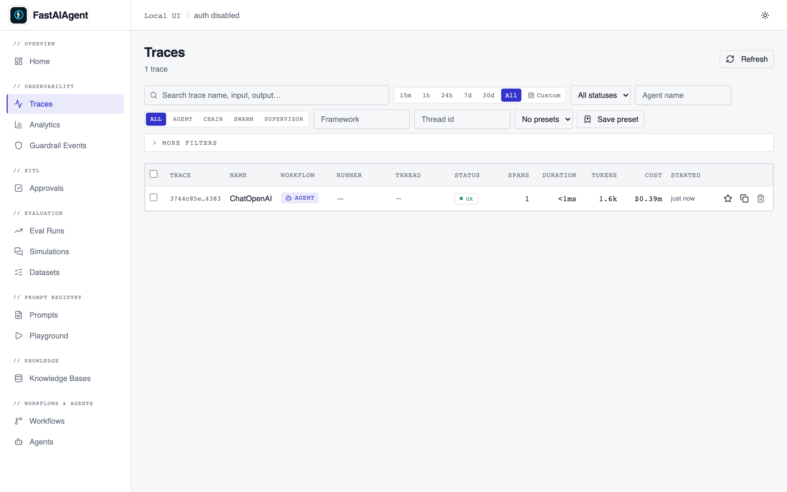
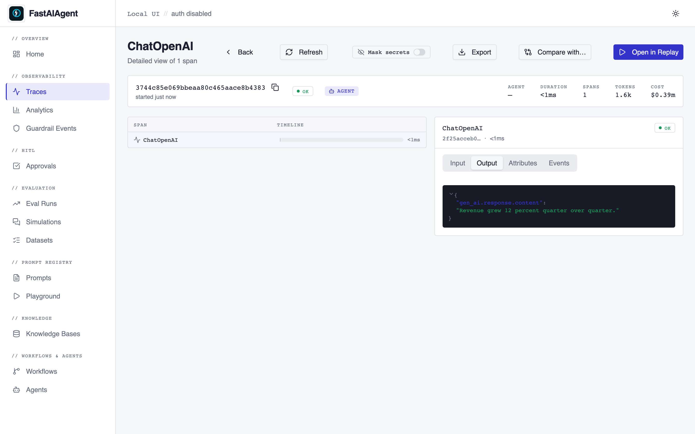

# Capture any OpenTelemetry / OpenInference framework

FastAIAgent's local trace store already captures **every** OpenTelemetry span
emitted in-process — including spans from third-party instrumentors you didn't
write (OpenInference, OpenLLMetry / Traceloop, or your own). The catch is that
those instrumentors use *different attribute conventions* than FastAIAgent's
native spans, so out of the box their tokens / cost / model / input / output
panels render blank and they get no framework label.

`enable_otel_capture()` closes that gap with **one opt-in call**. It is fully
additive — until you call it, nothing changes.

```python
import fastaiagent as fa

fa.enable_otel_capture()
```

That single call does two things:

1. **Ordering** — adaptively attaches FastAIAgent's storage processor to
   whatever global `TracerProvider` is active (or claims the slot if none is),
   so a third-party instrumentor's spans reach the local store regardless of
   import order.
2. **Display** — turns on a write-time normalizer that maps foreign attribute
   conventions onto the canonical `gen_ai.*` / `runner.type` / `framework` keys
   the Local UI, search index, and cost table read.

## End-to-end example (OpenInference + OpenAI)

```python
import fastaiagent as fa
import openai
from openinference.instrumentation.openai import OpenAIInstrumentor

# 1. Turn on a third-party instrumentor on a *non-FastAIAgent* call path.
OpenAIInstrumentor().instrument()

# 2. Opt in to capture + rich rendering.
fa.enable_otel_capture()

# 3. Make a normal OpenAI call — no FastAIAgent agent involved.
client = openai.OpenAI()
client.chat.completions.create(
    model="gpt-4o-mini",
    messages=[{"role": "user", "content": "Summarize the quarterly report."}],
)

# 4. View it in the Local UI — model, tokens, cost, input/output all populated.
#    fastaiagent ui
```

The captured span shows up in the **Traces** list:



…and on the **trace detail** page with tokens, cost, and the normalized
Input / Output content:



## Supported conventions

The normalizer recognizes two convention families and fills the canonical key
**only when it is absent** — originals are always preserved, never overwritten.

| Foreign key (OpenInference / OpenLLMetry) | Canonical key the stack reads |
|---|---|
| `llm.model_name`, `llm.request.model` | `gen_ai.request.model` |
| `llm.token_count.prompt`, `gen_ai.usage.prompt_tokens` | `gen_ai.usage.input_tokens` |
| `llm.token_count.completion`, `gen_ai.usage.completion_tokens` | `gen_ai.usage.output_tokens` |
| `input.value`, `gen_ai.prompt.N.content` | `gen_ai.prompt` **and** `gen_ai.request.messages` |
| `output.value`, `gen_ai.completion.N.content` | `gen_ai.completion` **and** `gen_ai.response.content` |
| `openinference.span.kind` (`LLM`/`CHAIN`/`AGENT`/`TOOL`/…) | `fastaiagent.runner.type` |
| `llm.system` / `llm.provider` | `gen_ai.system` |
| `llm.invocation_parameters` (JSON) | `gen_ai.request.temperature` / `max_tokens` |
| instrumentation scope name (e.g. `openinference.instrumentation.openai`) | `fastaiagent.framework` (root span only) |

Prompt and completion text are written to **both** the search keys
(`gen_ai.prompt` / `gen_ai.completion`, which feed the FTS index) and the UI
panel keys (`gen_ai.request.messages` / `gen_ai.response.content`), so a
captured span is both **searchable** by content and **rendered** in the
Input/Output tabs.

Cost is **not** computed by the normalizer — once the model name and token
counts exist, the UI's existing `compute_cost_usd()` pricing table handles it.

**Unknown keys pass through untouched** and still appear in the span's
**Attributes** tab, so nothing is ever lost.

## Call order

`enable_otel_capture()` is idempotent and robust to import order, but the
cleanest setup is to call it **once at startup**. If a third-party SDK installs
its own `TracerProvider` *after* you call it, just call `enable_otel_capture()`
again — the second call re-attaches and is a safe no-op otherwise.

```python
fa.enable_otel_capture()        # win or join the active provider
SomeInstrumentor().instrument() # if this swaps the global provider...
fa.enable_otel_capture()        # ...re-attach (idempotent)
```

## Disabling

```python
fa.disable_otel_capture()
```

This stops the normalization (subsequent foreign spans are stored raw again).
Note: OpenTelemetry has no API to *detach* a span processor, so a storage
processor previously attached to a foreign provider stays attached — capture
continues, only the enrichment stops. Re-enabling later is cheap.

## Not a goal (yet)

A **network OTLP receiver** (an inbound HTTP `/v1/traces` endpoint for
out-of-process, remote, or polyglot sources) is intentionally out of scope —
`enable_otel_capture()` covers **in-process** instrumentors. A network receiver
is tracked as a future / Platform-side capability.

## Related

- [Integrations](../integrations/index.md) — first-party LangChain / CrewAI / PydanticAI harness + OpenAI / Anthropic SDK auto-tracing
- [Tracing](index.md) — how native spans are captured and stored
- [Local UI](../ui/index.md) — the visual trace explorer
