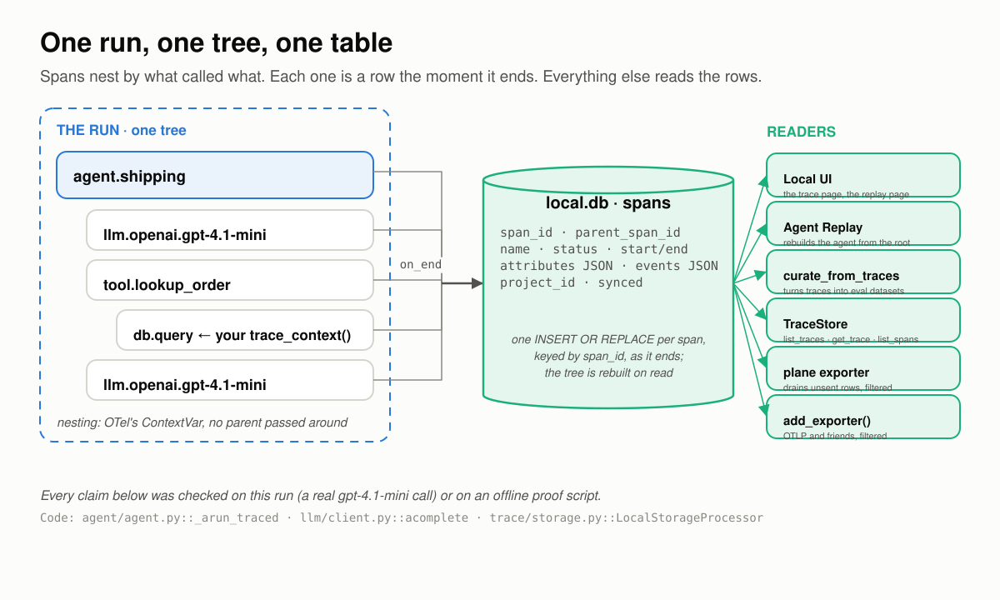
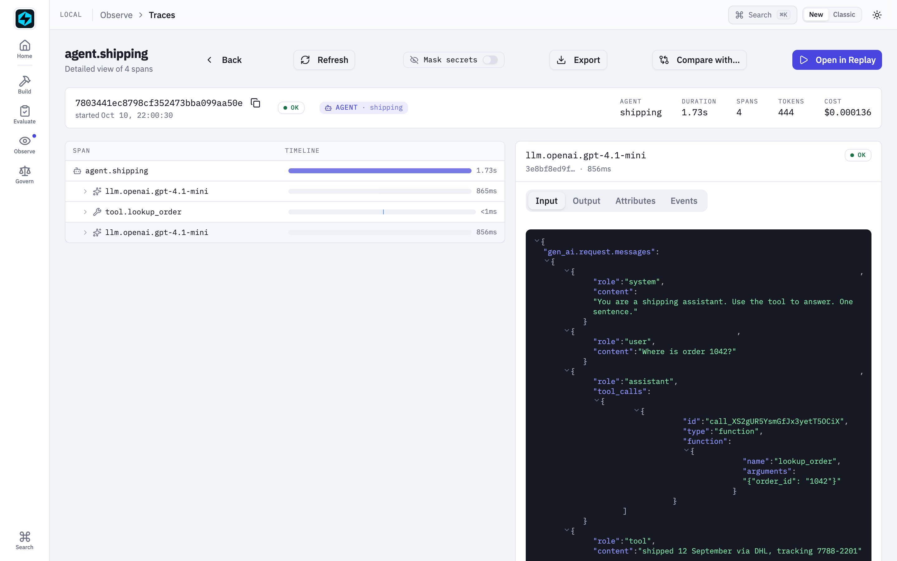

# Where a Trace Has to Hold

*Five places the record of a run goes wrong, how FastAIAgent holds each one, and a run behind every claim.*

*Checked against FastAIAgent 1.87.0 · [Download this page as a PDF](img/trace-boundaries/where-a-trace-has-to-hold.pdf)*

Tracing already lets you *see* a run: every model call, tool call, memory read and guardrail check is a span in a tree, and the Local UI draws it (see the [Tracing reference](index.md)).

Seeing a run is not the same as trusting the record. A trace is the only copy of a run you cannot repeat, and everything downstream reads it: [Agent Replay](../replay/replay-boundaries.md) rebuilds the agent from it, [curation](../evaluation/curation.md) turns it into datasets, evals score it, the plane ingests it. So the record has to be right at the places where it is easiest to be wrong:

- between one call and the next;
- between a span ending and the disk;
- between what is captured and what leaves the machine;
- between your process and the plane;
- between your framework and another.

This page explains how tracing works, one of those places at a time. Each section has a diagram, the rule the SDK follows, a proof, and the code: the SDK source that implements the rule and the script that proves it. The proofs are a real run of a `gpt-4.1-mini` agent, or scripts in [`examples/tracing/proofs/`](https://github.com/fastaifoundry/fastaiagent-sdk/tree/main/examples/tracing/proofs) that run offline against the published SDK, on the SDK's own `FunctionModel`, a throwaway `local.db` and OpenTelemetry's own in-memory exporter. The scripts run in CI, so what this page quotes can't drift from what the SDK does. Every output below came out of one of those runs.

---

## First: one run is a tree, a table, and its readers


*Spans nest by what called what. Each one becomes a row the moment it ends. Everything else reads the rows.*

The vocabulary, in the order it happens:

- **A span** is one unit of work with a start, an end, a status, attributes and events. The agent itself is a span, so is each model call (`llm.<provider>.<model>`), each tool call (`tool.<name>`), each memory read or write, each guardrail check.
- **A trace** is every span that shares one `trace_id`. One `agent.run()` produces exactly one trace, with one parentless **root** named for its runner: `agent.<name>`, `chain.<name>`, `swarm.<name>` or `supervisor.<name>`. The root carries the run's input, output, tokens, latency, and the agent's configuration.
- **Attributes** come in two namespaces. `gen_ai.*` is the OpenTelemetry GenAI convention: model, temperature, token usage, the messages sent, the response. `fastaiagent.*` is the SDK's own: `fastaiagent.runner.type` classifies a span for machines, `fastaiagent.tool.replay_class` says whether a tool may be re-run, `fastaiagent.framework` says which framework produced it.
- **`local.db`** is a SQLite file, `.fastaiagent/local.db` by default, with one flat row per span. It is not a feature you turn on: the storage processor is attached when the tracer provider is built.
- **Readers**: `TraceStore` (`list_traces`, `get_trace`, `list_spans`), the Local UI, Agent Replay, `curate_from_traces`, the plane exporter, and any OTel exporter you add.

You get all of it from one call:

```python
agent = fa.Agent(
    name="shipping",
    system_prompt="You are a shipping assistant. Use the tool to answer. One sentence.",
    llm=fa.LLMClient(provider="openai", model="gpt-4.1-mini"),
    tools=[lookup_order],
)
result = agent.run("Where is order 1042?")

trace = TraceStore().get_trace(result.trace_id)
for span in trace.spans:
    print(span.name, span.parent_span_id, span.attributes.get("gen_ai.usage.input_tokens"))
```

The live run behind this page, printed as a tree:

```
live run : 'Order 1042 was shipped on 12 September via DHL with tracking number 7788-2201.'
trace    : 7803441ec8798cf352473bba099aa50e
    agent.shipping               tokens_used=222 latency_ms=1725
        llm.openai.gpt-4.1-mini      tokens=72+16 finish=tool_calls
        tool.lookup_order            runner.type=tool replay_class=read_only status=ok
        llm.openai.gpt-4.1-mini      tokens=111+23 finish=stop
```

The rest of this page is what that table has to get right.

**Code:** the root span is written in [`agent/agent.py`](https://github.com/fastaifoundry/fastaiagent-sdk/blob/main/fastaiagent/agent/agent.py) (`_arun_traced`), model spans in [`llm/client.py`](https://github.com/fastaifoundry/fastaiagent-sdk/blob/main/fastaiagent/llm/client.py) (`acomplete`), tool spans in [`agent/executor.py`](https://github.com/fastaifoundry/fastaiagent-sdk/blob/main/fastaiagent/agent/executor.py); the table is [`trace/storage.py`](https://github.com/fastaifoundry/fastaiagent-sdk/blob/main/fastaiagent/trace/storage.py). The live run is the agent from [`examples/04_agent_replay.py`](https://github.com/fastaifoundry/fastaiagent-sdk/blob/main/examples/04_agent_replay.py), reduced to one tool.

---

## 1 · Between calls: the tree is discovered, not declared

An agent run is recursive and non-deterministic: the model decides how many turns to take and which tools to call, sometimes several at once, sometimes while another run is in flight in the same process. A flat log tells you what happened. A tree tells you what caused what, and the tree is only trustworthy if nobody has to build it by hand.


*No code passes a parent around. The current span lives in a ContextVar, so whatever opens a span inside a run attaches to it, and two runs at once never share one.*

The rules:

- **Nesting follows the call flow.** A span is opened with `start_as_current_span`, which puts it on OpenTelemetry's context, a ContextVar. Any span opened while it is active becomes its child, including across `await`. A `trace_context("db.query")` opened inside a tool body nests under that tool's span with no plumbing.
- **Two runs at once keep two trees.** The context is per task, so an `asyncio.gather` of two agents produces two traces, each with its own root, and nothing of one lands in the other.
- **One parentless root per run**, named for its runner. That root is what makes a trace a unit you can list, cost, filter and replay.
- **Rows are flat; the tree is rebuilt on read.** Each row carries its `span_id` and `parent_span_id`. `get_trace` returns the rows in start order and the tree is a matter of following the links.
- **`fastaiagent.runner.type` is for machines.** Tool, memory, retrieval, chain, swarm and supervisor spans set it explicitly. A plain agent root and the `llm.*` spans don't carry it, and readers default to `agent`.

Proof 1 runs two agents at the same time, each with a tool that opens its own span:

```
trace of alpha: 5 flat rows, 1 parentless root (agent.alpha)
  agent.alpha                  runner.type=—
      llm.test.function-model      runner.type=—
      tool.lookup_alpha            runner.type=tool
          db.query                     runner.type=—
      llm.test.function-model      runner.type=—
  answer: 'Order 1042 shipped via DHL.'
✓ nothing of beta's run is in alpha's trace
trace of beta: 5 flat rows, 1 parentless root (agent.beta)
  ...
✓ nothing of alpha's run is in beta's trace
```

The span the tool opened sits under the tool. The two runs, interleaved in one event loop, came out as two clean trees.

**Code:** the provider and tracer are [`trace/otel.py`](https://github.com/fastaifoundry/fastaiagent-sdk/blob/main/fastaiagent/trace/otel.py) (`get_tracer_provider`, `get_tracer`); the read is `get_trace` in [`trace/storage.py`](https://github.com/fastaifoundry/fastaiagent-sdk/blob/main/fastaiagent/trace/storage.py). The proof is [`proofs/proof_tree.py`](https://github.com/fastaifoundry/fastaiagent-sdk/blob/main/examples/tracing/proofs/proof_tree.py).

---

## 2 · Between the span and the disk: durable the moment it ends

A trace you only have after the run finishes is a trace you don't have when the run crashes. The write has to happen as each span ends, and it must never take the run down with it.


*The write is one statement inside the span's own end. A tool failure is a result; a model failure is an ERROR root; a store failure is a warning.*

The rules:

- **A span is written when it ends, synchronously.** The storage processor's `on_end` runs one `INSERT OR REPLACE` keyed by `span_id`. Nothing is batched, so a child span is on disk while its parent is still open, and re-writing a span is idempotent.
- **A tool that raises is a result, not a crash.** The error goes back to the model as the tool's result; the tool span carries `tool.status=error` and `tool.error`; the run finishes.
- **A model call that raises ends the run.** The root is written with status `ERROR` and an `exception` event carrying the message, and every span that ended before it is already on disk.
- **The store can never fail the run.** OTel runs `on_end` inside whatever ended the span, so an exception there would surface in your agent. The SDK catches it, drops that span, and logs one warning per error type.
- **A healthy span reads `UNSET`.** OpenTelemetry leaves a status unset unless something sets it; the Local UI shows those as OK.

Proof 2 reads the store from inside a tool, then fails a tool, then fails a model call, then points the store at a path that cannot be created:

```
rows on disk while the tool was running:
    llm.test.function-model [UNSET]
rows on disk after the run:
    agent.shipping            [UNSET]
    llm.test.function-model   [UNSET]
    tool.peek                 [UNSET]
    llm.test.function-model   [UNSET]
tool failed, run finished: 'Order 1042 has shipped.'
    ...
    tool.explode              [UNSET]  tool.status=error  tool.error="Tool 'explode' failed: carrier API returned 503"
    ...
model failed, run raised: provider returned 503
    agent.shipping            [ERROR]  exception: provider returned 503
    llm.test.function-model   [UNSET]
    tool.peek                 [UNSET]
answer with an unwritable store: 'Order 1042 has shipped.'
warning logged once: True — fastaiagent: could not write span 'llm.test.function-model' to /nonexistent-dir/local.db (…
```

While the tool was running, the model call before it was already a row and the root was not yet. The crashed run left an `ERROR` root with the exception on it and the two spans that had finished. The run with no writable store still answered.

**Code:** `LocalStorageProcessor.on_end` and `_write` in [`trace/storage.py`](https://github.com/fastaifoundry/fastaiagent-sdk/blob/main/fastaiagent/trace/storage.py); the tool error path is `execute` in [`tool/function.py`](https://github.com/fastaifoundry/fastaiagent-sdk/blob/main/fastaiagent/tool/function.py). The proof is [`proofs/proof_durable.py`](https://github.com/fastaifoundry/fastaiagent-sdk/blob/main/examples/tracing/proofs/proof_durable.py).

---

## 3 · Between capture and egress: full fidelity in, filtered out

Prompts, tool arguments and answers are the most useful part of a trace and the most sensitive. Two bad designs are common: capture everything and ship it everywhere, or gate capture and lose the ability to debug. FastAIAgent separates the two questions. *May this leave the machine?* is answered on the way out. *Record anything at all?* is a different switch.


*The local copy is always complete, so the UI and Replay work. Every exit runs the same filter. The master switch is the only thing that stops capture.*

The rules:

- **`local.db` is always full fidelity.** The input, the output, the resolved system prompt, the messages sent to the model, tool arguments and results are all captured locally, because Replay reconstructs a run from them. Treat the file as you would any database behind your app: it is created `0600`, and `fastaiagent traces purge` scrubs it.
- **Every exit runs `apply_export_policy`.** The plane exporter and any exporter you register with `add_exporter()` pass each span through the same filter before it leaves. The filter has two steps.
- **Step one, the payload gate.** `FASTAIAGENT_TRACE_PAYLOADS=0` drops the payload-bearing keys (`SENSITIVE_ATTR_KEYS`) from a span's attributes, from exception events, and from the status description. Structure survives: model, tokens, tool names, status code. A misspelled value fails closed.
- **Step two, redaction.** An installed `RedactionPolicy` masks whatever payload remains. In capture mode it also masks before the local write, so `local.db` holds the masked value too; that is the one case where the local copy is not the raw one.
- **The master switch captures nothing.** With `FASTAIAGENT_TRACE_ENABLED=0` the provider is OpenTelemetry's no-op provider: spans never record, `result.trace_id` is `None`, `local.db` gets no row, and `enable_otel_capture()` refuses to attach.

Proof 3 runs the same question four ways, with OpenTelemetry's `InMemorySpanExporter` registered through `add_exporter()` standing in for Datadog or Jaeger:

```
default: payloads exported
  local.db  agent.input = 'Is my card 4111 1111 1111 4242 active?'
  exporter  agent.input = 'Is my card 4111 1111 1111 4242 active?'
FASTAIAGENT_TRACE_PAYLOADS=0
  local.db  agent.input = 'Is my card 4111 1111 1111 4242 active?'
  exporter  agent.input = '(stripped)'
  local.db  gen_ai.request.messages present: True
  exporter  gen_ai.request.messages present: False
  exporter  gen_ai.request.model = 'function-model'
RedactionPolicy(card pattern)
  local.db  agent.input = 'Is my card [CARD] active?'
  exporter  agent.input = 'Is my card [CARD] active?'
  exporter  gen_ai.request.messages carries the card number: False
FASTAIAGENT_TRACE_ENABLED=0
  trace_id on the result: None
  rows in a fresh local.db: 0
```

With payloads off, the exporter received the model name and nothing the user typed, while `local.db` kept the question. With a policy installed, both copies were masked. With tracing off, there was nothing anywhere.

!!! note "This is not what some older pages say"
    Until the egress model, `FASTAIAGENT_TRACE_PAYLOADS=0` gated capture, and a few pages still describe it that way. The code reads the flag only on the way out: `trace_payloads_enabled()` always returns `True`, and `export_payloads_enabled()` is what the exporters check. Proof 3 is the current behaviour.

**Code:** `trace_payloads_enabled` and `export_payloads_enabled` in [`trace/span.py`](https://github.com/fastaifoundry/fastaiagent-sdk/blob/main/fastaiagent/trace/span.py); `apply_export_policy`, `apply_event_export_policy` and `SENSITIVE_ATTR_KEYS` in [`trace/redaction.py`](https://github.com/fastaifoundry/fastaiagent-sdk/blob/main/fastaiagent/trace/redaction.py); `_EgressFilteredExporter`, `_filtered_status` and the master switch in [`trace/otel.py`](https://github.com/fastaifoundry/fastaiagent-sdk/blob/main/fastaiagent/trace/otel.py). The proof is [`proofs/proof_egress.py`](https://github.com/fastaifoundry/fastaiagent-sdk/blob/main/examples/tracing/proofs/proof_egress.py); [`examples/68_trace_redaction.py`](https://github.com/fastaifoundry/fastaiagent-sdk/blob/main/examples/68_trace_redaction.py) walks capture and read mode redaction in full.

---

## 4 · Between your process and the plane: SQLite is the queue

Shipping spans to a server is where traces usually get lost: a batch in memory, a backend that is down, a process that exits first. FastAIAgent makes the local table the queue and treats the OTel batch as nothing more than a doorbell.


*Rows land marked unsent. The exporter drains the table, not the batch, and marks a row sent only after the plane said yes.*

The rules:

- **Rows land unsent.** Every span is written to `local.db` with `synced = 0` before anything else happens.
- **The exporter ignores the batch it is handed.** `PlatformSpanExporter.export()` calls `fetch_unsynced`, runs each span through the egress filter, POSTs to `/public/v1/traces/ingest` with bounded retry, and calls `mark_synced` only after a 2xx. It always returns success to OTel, because the table owns retry, not the processor.
- **An outage loses nothing and blocks nothing.** `connect()` to an unreachable plane warns and keeps the connection; runs proceed; rows wait for the next drain. Re-sends are safe because the plane dedups by `span_id`.
- **The re-send queue is bounded.** Past about 10,000 un-acknowledged spans or 7 days, the oldest are abandoned from re-send only. They stay in `local.db` until you `fastaiagent traces prune`.

Proof 4 connects to an address nothing listens on and runs three times:

```
Could not reach platform at http://127.0.0.1:9. Connection stored — traces will export when platform is reachable.
connect() to a dead plane returned in 0.06s; is_connected=True
3 runs took 0.00s with the plane down
rows in local.db: 6   unsent: 6
fetch_unsynced() hands the exporter 6 spans: ['agent.support', 'llm.test.function-model']
after marking 2 sent: unsent=4  rows=6
```

Six spans, six unsent, none lost, no run delayed. The last line is what the exporter does after a 2xx: mark exactly the spans the plane acknowledged.

**Code:** `PlatformSpanExporter` in [`trace/platform_export.py`](https://github.com/fastaifoundry/fastaiagent-sdk/blob/main/fastaiagent/trace/platform_export.py); `fetch_unsynced`, `mark_synced` and `enforce_buffer_bound` in [`trace/storage.py`](https://github.com/fastaifoundry/fastaiagent-sdk/blob/main/fastaiagent/trace/storage.py); `connect` in [`client.py`](https://github.com/fastaifoundry/fastaiagent-sdk/blob/main/fastaiagent/client.py). The proof is [`proofs/proof_queue.py`](https://github.com/fastaifoundry/fastaiagent-sdk/blob/main/examples/tracing/proofs/proof_queue.py). The platform side is described under [Offline / Disconnected Behavior](../platform/index.md#offline-disconnected-behavior).

---

## 5 · Between frameworks: a foreign span lands in the same shape

Not every span in your process is a FastAIAgent span. A LangChain or LlamaIndex instrumentor, or OpenInference's OpenAI instrumentor, emits OpenTelemetry spans in its own convention. They should land in the same table, in the same shape, without a second pipeline.


*One call joins whatever tracer provider is active. At write time the foreign keys are mapped onto the canonical ones; the originals stay.*

The rules:

- **`enable_otel_capture()` joins the active provider.** If someone else set a real `TracerProvider`, the SDK attaches its storage processor to it; if nothing is set, it claims the global one. Import order stops mattering.
- **Normalisation happens at write time, and only fills gaps.** `openinference.span.kind` becomes `fastaiagent.runner.type`, `llm.model_name` becomes `gen_ai.request.model`, `input.value` and `output.value` become the request messages and response content, token counts map to `gen_ai.usage.*`, and the instrumentation scope names the framework. Original keys are kept. A native span, which already has the canonical keys, is not changed.
- **The master switch wins.** With tracing disabled, `enable_otel_capture()` logs and does nothing, because OTel has no way to detach a processor afterwards.

Proof 5 emits one span through a plain OpenTelemetry tracer with the attributes OpenInference's OpenAI instrumentor sets, then runs a native agent:

```
foreign (OpenInference): ['ChatCompletion']
  the model-call span, ChatCompletion:
    gen_ai.request.model         = 'gpt-4.1-mini'
    gen_ai.usage.input_tokens    = 12
    gen_ai.response.content      = 'Order 1042 has shipped.'
    fastaiagent.runner.type      = 'llm'
    fastaiagent.framework        = 'openai'
    OpenInference keys kept: True
native: ['agent.support', 'llm.test.function-model']
  the model-call span, llm.test.function-model:
    gen_ai.request.model         = 'function-model'
    gen_ai.response.content      = 'Order 1042 has shipped.'
list_traces() shows both: ['ChatCompletion', 'agent.support']
```

The foreign span came back with the canonical keys and its originals; both traces are in one list.

**Code:** [`trace/otel_capture.py`](https://github.com/fastaifoundry/fastaiagent-sdk/blob/main/fastaiagent/trace/otel_capture.py) and `normalize_attributes` in [`trace/normalize.py`](https://github.com/fastaifoundry/fastaiagent-sdk/blob/main/fastaiagent/trace/normalize.py). The proof is [`proofs/proof_foreign.py`](https://github.com/fastaifoundry/fastaiagent-sdk/blob/main/examples/tracing/proofs/proof_foreign.py); the live version, with the real instrumentor and a real OpenAI call, is [`examples/otel-openinference/capture.py`](https://github.com/fastaifoundry/fastaiagent-sdk/blob/main/examples/otel-openinference/capture.py), and [Capture any OTel / OpenInference framework](third-party-otel.md) and [Trace a LangChain agent](../tutorials/trace-langchain.md) cover the setup.

---

## Every span is a row you can open

A record you can't open is a record you have to take on faith. The Local UI reads the same rows as `TraceStore`, and shows, for every model call, exactly what the model was sent.


*The live run in the Local UI. The second model call's Input is the whole conversation the model saw: the system prompt, the question, its own tool call, and the tool's result.*

That is the habit this page recommends: when a run looks wrong, read the prompt on the `llm.*` span, not the answer. The same rows are reachable three other ways:

- `TraceStore.list_spans(since=cursor)` reads across traces in write order, so a long span that ended late is never skipped (see [Tailing spans as they land](index.md#tailing-spans-as-they-land)).
- `fastaiagent traces` lists and exports from the CLI; `store.export(trace_id, format="json")` and the UI's Export button produce the same JSON.
- Agent Replay opens a trace as the agent it came from; that is the [next page](../replay/replay-boundaries.md).

---

## If you build or buy tracing, ask

1. **Who decides the parent?** If instrumentation passes a parent span around, the tree is only as right as every call site.
2. **When is a span durable?** On end, or when a batch flushes? What is on disk when the process dies mid-run?
3. **What happens when the store can't be written?** A lost span, or a failed request?
4. **What leaves the machine, under which switch, through every exporter?** One filter, or one per sink?
5. **What happens when the backend is down?** Is anything lost, and does the run wait?
6. **Does a span from another framework look like one of yours?** In the same store, with the same keys?

FastAIAgent's answers are the five sections above, and each has a run behind it.

---

## What tracing still won't do

- **There is no capture-time payload gate.** `local.db` holds prompts and answers in full; the gate is for egress. If content must never touch disk, turn tracing off with `FASTAIAGENT_TRACE_ENABLED=0`, and lose the UI and Replay with it.
- **A `RedactionPolicy` masks what its patterns match**, nothing more. It is not a PII detector.
- **Exporters you add are batched.** `add_exporter()` goes through a `BatchSpanProcessor`, so an OTLP sink is not written synchronously the way `local.db` is. Flush before exit.
- **An outage longer than the bound is lossy on the plane side.** Spans abandoned from re-send stay local and never reach the plane on their own.
- **`runner.type` is not on model or root spans.** Readers must default to `agent`.
- **Streaming is recorded as its final text.** Chunks are not stored, so the cadence of a streamed answer is not in the trace.
- **Only the SDK's own spans carry a replay blueprint.** A foreign span renders in the UI; it can't be replayed.

---

## The point of all of it

A trace is the one record of a run that nobody can reproduce, so it is written where the run happens, as the run happens, in full, and filtered only where it leaves. That is the whole design: not more instrumentation, but a record you don't have to take on faith.

The split between the SDK and the plane stays the same. Capture, the local table, the queue and the egress filter are all in the open-source SDK, in your process, on your disk. The plane ingests what the edge lets out and never sees what the edge withheld.

Ask your own tracing the six questions. The bugs aren't in the span names; they're on the boundaries.

## See also

- [Concepts & Mental Model](concepts.md): the short version, in prose.
- [Tracing reference](index.md): every attribute, query and switch.
- [Capture any OTel / OpenInference framework](third-party-otel.md): the setup for section 5.
- [Where a Replay Has to Hold](../replay/replay-boundaries.md): what reads these rows back into an agent.
- [Security](../security.md): redaction and the local file in the wider picture.
