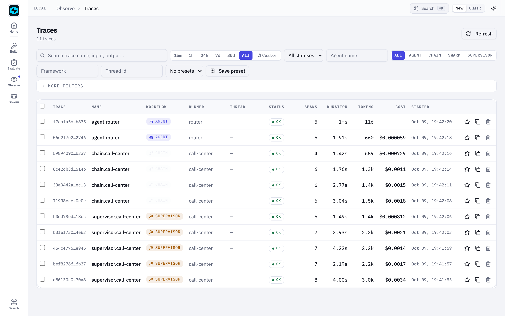
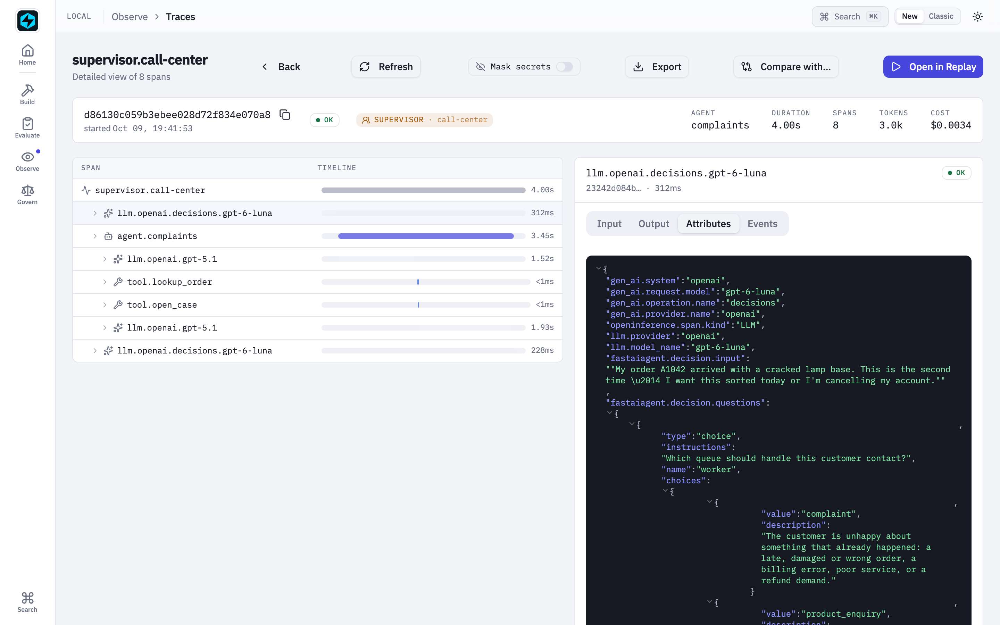
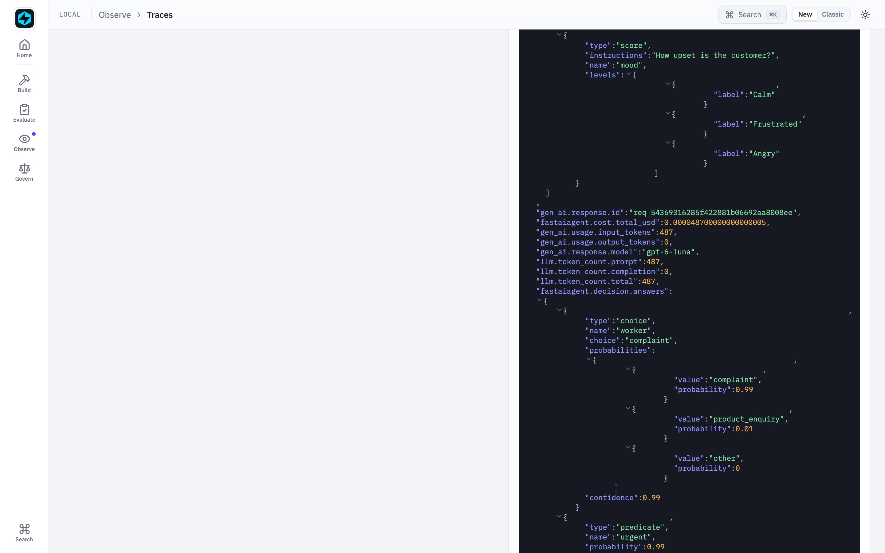
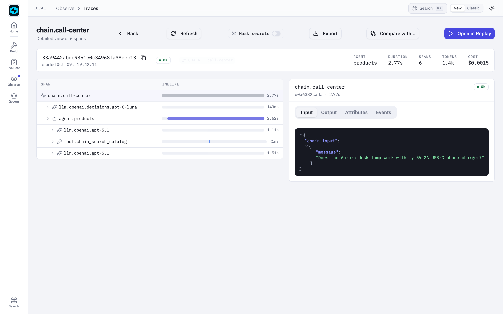
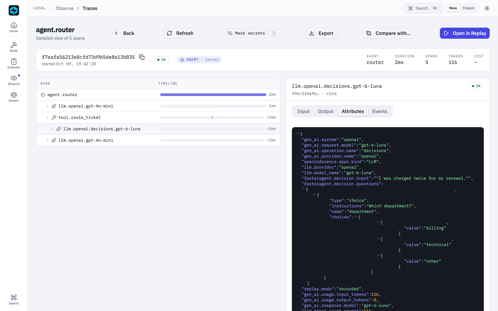
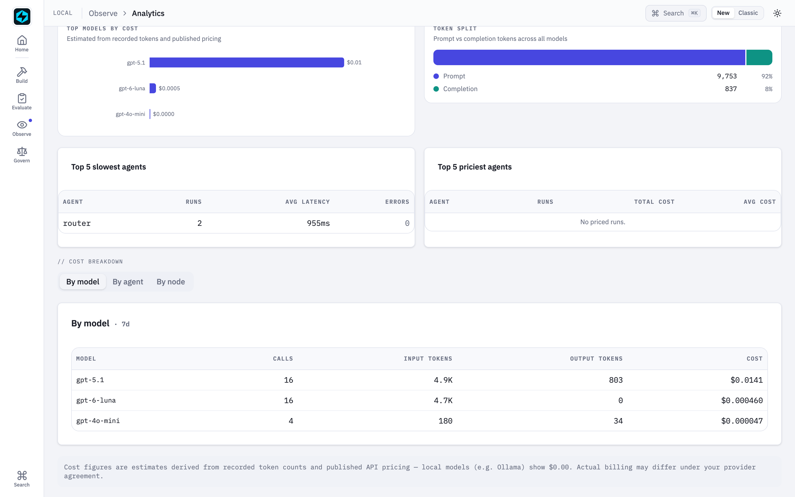

# Route a Call Centre with the Decisions API

*New in 1.84.0.* This walkthrough builds a customer-support desk with three
queues: **complaints**, **product enquiries**, and **everything else**. Every
contact is routed to exactly one of them. The **supervisor routes with OpenAI's
[Decisions API](../llm/decisions.md)**, which serves the model `gpt-6-luna`, and
the **workers are chat agents** (`gpt-5.1`) with back-office tools.

The full scripts are
[`106_call_center_supervisor.py`](https://github.com/fastaifoundry/fastaiagent-sdk/blob/main/examples/106_call_center_supervisor.py)
and [`107_call_center_chain.py`](https://github.com/fastaifoundry/fastaiagent-sdk/blob/main/examples/107_call_center_chain.py).
Every output on this page comes from a live run.

```bash
zsh -lc 'python examples/106_call_center_supervisor.py --compare'   # needs OPENAI_API_KEY
zsh -lc 'python examples/107_call_center_chain.py'
```

## Why the Decisions API, and not a chat call, should route

The first thing a support desk does with any contact is decide **who owns it**.
That's a classification with a fixed set of answers, not a conversation.

A tool-calling supervisor (`Supervisor(routing="tools")`, the default) answers
it with a chat model. The model reads the message, emits a `delegate_to_<queue>`
tool call, waits for the worker, then writes its own final answer. That's the
right shape when a supervisor has to **plan**: split a task, call several
workers, combine the results. For routing it buys two extra chat turns, and
nothing stops the model calling no tool at all.

`Supervisor(routing="decisions")` asks the question as a `Choice` instead. The
answer is one of your queues, with a confidence, in a few hundred milliseconds,
and the worker's reply goes back unchanged.

## 1. The workers

Each `Worker` is an ordinary `Agent`. Its `description` doubles as the
**router's option text**, so write it the way you'd brief a new colleague on
which queue owns what:

```python
from fastaiagent.agent import Agent, Worker
from fastaiagent.llm import LLMClient
from fastaiagent.tool import FunctionTool

llm = LLMClient(provider="openai", model="gpt-5.1")

complaints = Worker(
    role="complaint",
    description=(
        "The customer is unhappy about something that already happened: a late, "
        "damaged or wrong order, a billing error, poor service, or a refund demand."
    ),
    agent=Agent(
        name="complaints",
        llm=llm,
        system_prompt="... apologise once, look up the order, open a case, offer what the returns policy allows ...",
        tools=[FunctionTool(name="lookup_order", fn=lookup_order),
               FunctionTool(name="open_case", fn=open_case)],
    ),
)
# products (search_catalog) and other (store_info, open_case) follow the same shape.
```

## 2. The decision supervisor

```python
from fastaiagent.agent import Supervisor
from fastaiagent.llm import Predicate, Score

decider = LLMClient(model="gpt-6-luna")
desk = Supervisor(
    name="call-center",
    workers=[complaints, products, general],
    routing="decisions",
    router_llm=decider,
    routing_instructions="Which queue should handle this customer contact?",
    fallback_worker="other",        # refused or unsure → never guess a specialist
    routing_min_confidence=0.6,
    routing_questions={             # asked in the SAME request as the route
        "urgent": Predicate(instructions="The customer needs an answer today, or threatens to cancel, leave a bad review, or escalate."),
        "mood": Score(instructions="How upset is the customer?", levels=["Calm", "Frustrated", "Angry"]),
    },
    validate_outputs=True,          # review every reply before it goes out
    validation_mode="decisions",
    validation_llm=decider,
    validation_criteria="The agent's reply directly addresses what the customer asked and tells the customer the next step.",
)

result = desk.run("My order A1042 arrived with a cracked lamp base ... sort it out today or I'm cancelling.")
```

One `decide()` call answers three questions: which queue, is it urgent, and how
upset is the customer. The worker receives the customer's message plus a note,
`[Supervisor routing note] urgent: yes (p=0.99); mood: Angry`, so it can set its
tone and priority. `result.route` records how the run was routed:

```python
result.route.worker                                  # "complaint"
result.route.confidence                              # 0.99
result.route.answers.predicates["urgent"].probability  # 0.99
result.route.answers.scores["mood"].level            # "Angry"
result.route.latency_ms, result.route.cost_usd       # 486, 4.9e-05
result.route.reviews                                 # [0.90]
```

## 3. What it does

```text
> My order A1042 arrived with a cracked lamp base. This is the second time — ...
  → complaint · confidence 0.99 · urgent 0.99 · mood Angry · routed in 486 ms ($0.000049)
  reply (3859 ms end to end, review 0.90):
  I'm really sorry this has happened to you twice ... I've opened a high-priority
  case for you: ID CS-2001 ... you can choose either: 1) A free replacement lamp,
  or 2) A full refund ...
> Does the Aurora desk lamp work with my phone charger? It's a 5V 2A USB-C one.
  → product_enquiry · confidence 0.99 · urgent 0.00 · mood Calm · routed in 164 ms
> What time do your phone lines open on Saturday?
  → other · confidence 1.00 · urgent 0.00 · mood Calm · routed in 170 ms
> Is the Orbit speaker compatible with Google Home, and when can I get one?
  → product_enquiry · confidence 0.99 · urgent 0.10 · mood Calm · routed in 191 ms
> Hi, I need some help please.
  → other · confidence 0.89 · urgent 0.00 · mood Calm · routed in 167 ms
```

The angry repeat complaint is flagged urgent, and its case opens at high
priority. The vague "Hi, I need help" goes to the general queue, which asks a
clarifying question.

## 4. Decisions routing vs tool-call routing

`--compare` runs the same tickets through both modes. Both run without review, so
the comparison is like for like:

| Ticket | `routing="decisions"` | `routing="tools"` (gpt-5.1) |
|---|---|---|
| Cracked lamp, repeat complaint | 3.9 s → complaint | 11.5 s → complaint |
| Lamp + USB-C charger | 2.7 s → product_enquiry | 5.1 s → product_enquiry |
| Saturday phone hours | 2.0 s → other | 5.2 s → other |
| Orbit speaker + Google Home | 2.6 s → product_enquiry | 7.7 s → product_enquiry |
| "Hi, I need some help" | 1.8 s → other | 1.4 s → **answered itself** |

The routes agree, and decision routing is 2–3× faster end to end. The last row
is the other half of the argument: the tool-calling supervisor skipped
delegation and answered itself. A decision router always puts the contact in
exactly one queue.

## 5. Review what the reviewer can judge

The review is one Decisions predicate over the customer's message and the
worker's reply. The reviewer **hasn't seen the order system or the catalogue**,
so don't ask it whether the facts are right. An early run with the criterion
"complete, correct, and on-topic" scored good replies at 0.3–0.5. Each rejection
re-ran the worker, and a re-run worker re-runs its tools: one retry opened a
**duplicate support case**. Ask what can be judged from the two texts ("addresses
what the customer asked and tells them the next step"), and the same replies
score 0.54–0.97 with no retries.

## 6. The same desk as a Chain

When you'd rather draw the flow as a graph you can validate, diff and version,
use a `condition` node with `decision=`:

```python
from fastaiagent.chain import Chain
from fastaiagent.chain.node import NodeType
from fastaiagent.llm import Choice

chain = Chain("call-center", checkpoint_enabled=False)
chain.add_node(
    "triage",
    type=NodeType.condition,
    decision={
        "question": Choice(instructions="Which queue should handle this customer contact?",
                           options={"complaint": "...", "product_enquiry": "...", "other": "..."}),
        "input": "{{input.message}}",
        "llm": {"model": "gpt-6-luna"},
        "min_confidence": 0.6,
    },
)
chain.add_node("complaints", agent=complaints_agent)
chain.add_node("products", agent=products_agent)
chain.add_node("general", agent=general_agent)
chain.connect("triage", "complaints", label="complaint")
chain.connect("triage", "products", label="product_enquiry")
chain.connect("triage", "general", label="other")
chain.connect("triage", "general")   # default: refused or unsure

result = await chain.aexecute({"message": "Does the Aurora desk lamp work with my USB-C charger?"})
result.node_results["triage"]   # {"matched": "product_enquiry", "decision": {"confidence": 1.0, ...}}
```

```text
> My order A1042 arrived with a cracked lamp base. Sort it out today or I'm cancelling.
  triage → complaint (confidence 1.00) → complaints  [3180 ms]
> Does the Aurora desk lamp work with my 5V 2A USB-C phone charger?
  triage → product_enquiry (confidence 1.00) → products  [2660 ms]
> What time do your phone lines open on Saturday?
  triage → other (confidence 0.94) → general  [3152 ms]
> Hi, I need some help please.
  triage → other (confidence 0.93) → general  [2302 ms]
```

`chain.validate()` refuses an option that has no edge, and `chain.to_dict()` is
plain JSON.

| Pick | When |
|---|---|
| `Supervisor(routing="decisions")` | You want urgency and mood handed to the worker, every reply reviewed, and `result.route` for analytics |
| Chain + decision node | The flow is a fixed graph you want to see, validate and version alongside other nodes |
| `Supervisor(routing="tools")` | The work is multi-step: split it, call several workers, combine |

## 7. End to end in the Local UI

```bash
fastaiagent ui
```

Every screenshot below comes from a live run of examples 105–107, captured by
`scripts/capture-decisions-screenshots.sh`.

### Every ticket is one trace

Each contact the desk handles is one `supervisor.call-center` trace (the
`SUPERVISOR` badge), and each run of the Chain version is one `chain.call-center`
trace. The two `agent.router` rows are example 105: a live run, and its recorded
replay.



### A routed ticket: route → worker → review

Open the angry repeat complaint. The tree reads top to bottom in the order the
desk worked:

1. **`llm.openai.decisions.gpt-6-luna`**, the routing call: one Decisions API
   request that answered queue, urgency and mood.
2. **`agent.complaints`**, the `gpt-5.1` worker. You can see its chat turns
   (`llm.openai.gpt-5.1`) and its tool calls (`tool.lookup_order`, `tool.open_case`).
3. **`llm.openai.decisions.gpt-6-luna`** again, the review of the reply.


The route is on the supervisor's root span: `supervisor.routing="decisions"`,
`supervisor.route.worker`, `.confidence` and `.fallback`.


### Inside one Decisions API call

Select the routing span and open **Attributes**. It's a standard OpenTelemetry
GenAI span: `gen_ai.operation.name="decisions"`, `gen_ai.provider.name="openai"`,
and `gen_ai.request.model`, plus the OpenInference keys
(`openinference.span.kind="LLM"`, `llm.model_name`). Below them are the evidence
and the three questions it asked.



Further down the same panel are the answers, each with its probability
distribution, the request id, the input-only token usage, and the call's cost.



### The Chain version

A `chain.call-center` trace has the same shape: the triage decision
(`llm.openai.decisions.gpt-6-luna`), then only the queue it chose, here
`agent.products` with its catalogue lookup.



### Replayed offline

Example 105 reruns a decision-driven agent with `determinism="recorded"`. Every
span in the rerun, the chat turns and the Decisions call alike, carries
`replay.mode="recorded"`: the answers came from the trace, not the network.



### What routing costs

**Analytics → Cost breakdown → By model** puts the Decisions API next to the
chat models. Here 16 Decisions calls (every route and review) cost **$0.000464**
in total, against $0.0152 for the `gpt-5.1` workers. The Decisions API bills
input tokens only, so its output column is 0.


