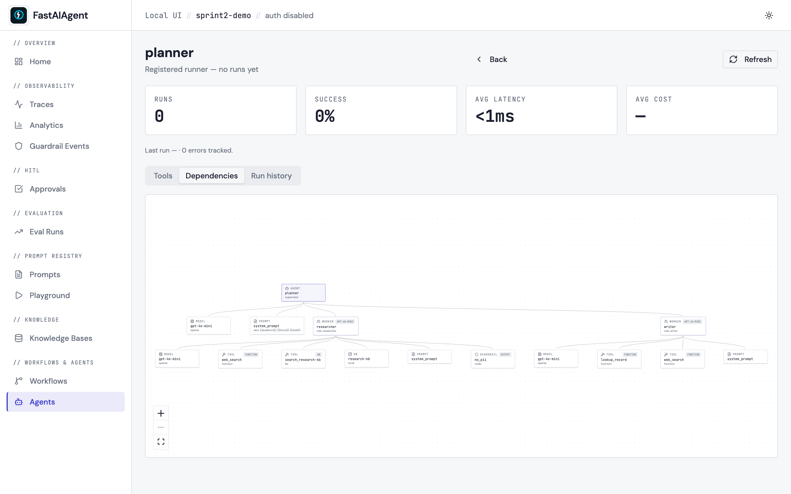
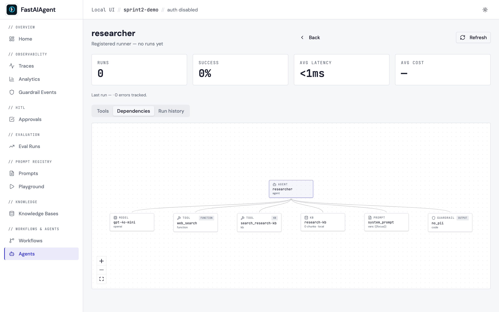

# Agent Dependency Graph

A structural "what is this agent made of" view, complementary to the
workflow visualization (which shows *how the workflow flows*). Find it
under the **Dependencies** tab on any
`/agents/{name}` detail page.



## What it shows

For a single Agent:

- The agent itself at the centre.
- Its **model** (provider + model name) as a directly connected node.
- Every **tool** the agent was constructed with — green when registered,
  amber when the LLM has called a name that wasn't in `tools=[…]`
  (likely hallucination).
- Every **knowledge base** referenced via `LocalKB.as_tool()` — name,
  backend (FAISS / Qdrant / Chroma), chunk count.
- Every **guardrail** with its type (`code` / `regex` / `llm_judge` / …)
  and position (`input` / `output` / `tool_call` / `tool_result`).
- The **system prompt** as a single node, with `{{variables}}` extracted
  off the template so you can see at a glance what the prompt expects to
  be filled with.



For a **Supervisor**, each Worker appears as a sub-agent under the
supervisor centre node, with its own tool / KB / prompt subtree:

```
[Supervisor: planner]
   ├── [Worker: researcher]
   │     ├── [Tool: web_search]
   │     ├── [KB: research-kb]
   │     └── [Model: gpt-4o-mini]
   └── [Worker: writer]
         ├── [Tool: lookup_record]
         └── [Model: gpt-4o-mini]
```

For a **Swarm**, peer agents appear as siblings of the centre node with
**handoff edges** drawn between them:

```
[Agent: triage] ←→ [Agent: billing] ←→ [Agent: support]
```

Click any node to open a side panel with details (call count, success
rate, avg latency for tools; chunk count + backend for KBs; variables +
preview for prompts) plus an **Open** button that navigates to the
dependency's own page.

## Endpoint

```
GET /api/agents/{name}/dependencies
```

Response shape (single agent):

```json
{
  "agent": {
    "name": "support-bot",
    "type": "agent",
    "provider": "openai",
    "model": "gpt-4o-mini"
  },
  "model": {"provider": "openai", "model": "gpt-4o-mini"},
  "tools": [
    {
      "name": "lookup_record",
      "origin": "function",
      "registered": true,
      "calls": 28,
      "success_rate": 1.0,
      "avg_latency_ms": 42.0
    },
    {
      "name": "ghost_tool",
      "origin": "unknown",
      "registered": false,
      "calls": 3,
      "success_rate": 0.66,
      "avg_latency_ms": 0
    }
  ],
  "knowledge_bases": [
    {"name": "support-kb", "backend": "faiss", "chunks": 128}
  ],
  "prompts": [
    {
      "name": "system_prompt",
      "version": null,
      "variables": ["customer_name", "topic"],
      "preview": "You are a friendly support agent…"
    }
  ],
  "guardrails": [
    {"name": "no_pii", "guardrail_type": "regex", "position": "output"}
  ],
  "sub_agents": []
}
```

For Supervisors, `sub_agents[]` carries one fully populated payload per
worker (with an extra `role` field). For Swarms, `peers[]` lists the
other agents and `handoffs[]` lists the allowed source/target pairs.

## Data sources

The endpoint walks the **runtime registry** (`ctx.runners`) populated by
`build_app(runners=[…])`. To get the rich graph, register your top-level
runner there:

```python
from fastaiagent.ui.server import build_app

app = build_app(runners=[supervisor])
```

When no runner is registered, the endpoint reconstructs a degraded view
from `agent.tools` / `agent.guardrails` / `agent.llm.*` span attributes
on the most-recent root agent span — the same data the existing
**Tools** tab uses. The response carries `unresolved: true` and the UI
shows a "register your runner for the full view" callout.

Tool call counts, success rate, and average latency come from the
`tool.*` spans under each `agent.*` span — same aggregation the existing
Tools tab does, kept consistent on purpose.

## Difference vs. Workflow Topology

| Question | Use |
|---|---|
| What's my agent made of? (tools / KBs / model) | Dependency graph |
| How does my chain/swarm/supervisor flow at runtime? | [Workflow visualization](workflow-visualization.md) |
| Which tool was actually called and how often? | Agent → **Tools** tab |

The three views share the same React Flow canvas and visual language.

## Example

[examples/50_agent_dependencies.py](https://github.com/fastaifoundry/fastaiagent-sdk/blob/main/examples/50_agent_dependencies.py)
builds a Supervisor with two Workers (each with a different toolset and
KB), registers them, and prints the URL where the Dependencies tab will
render the graph.
