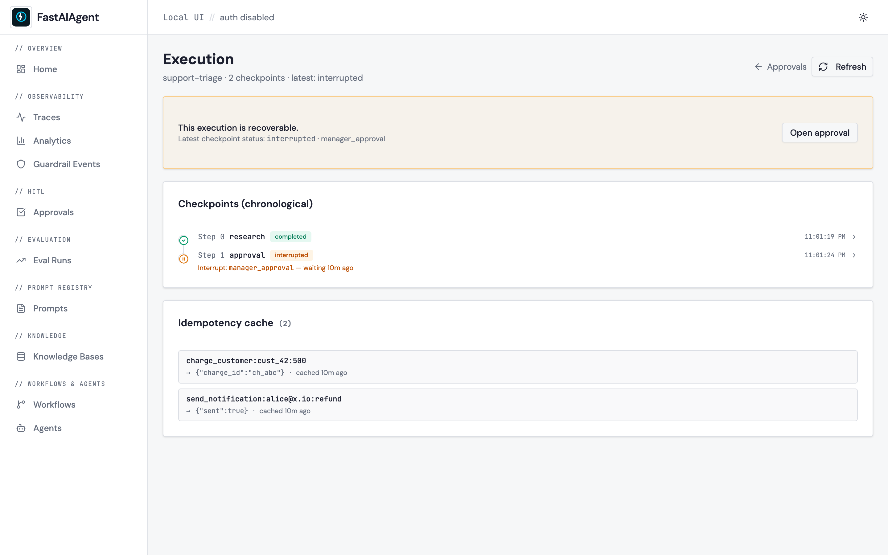
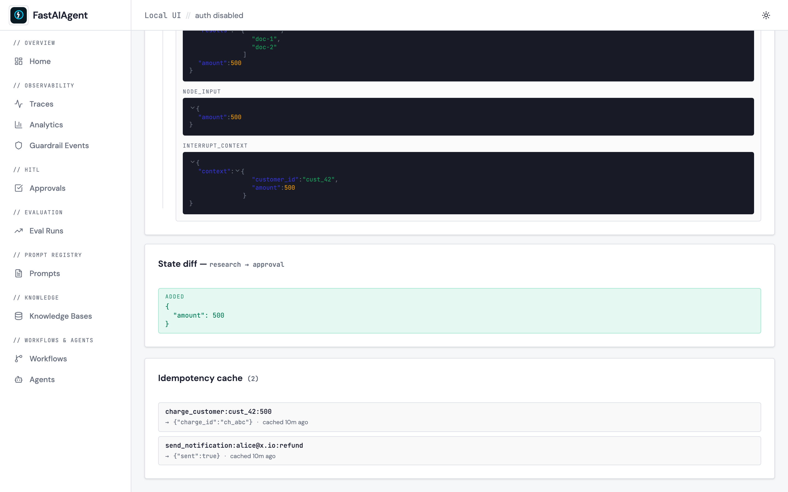

# Checkpoint inspector

The execution detail page (`/executions/{execution_id}`) shows the full
checkpoint history of a durable run as a vertical timeline. Each step
collapses by default; expand any two adjacent rows to see a JSON state
diff between them. A separate card below lists every cached
`@idempotent` result for the execution.



## Timeline anatomy

Each row is one checkpoint:

- **Status icon** — green check (`completed`), amber pause
  (`interrupted`), red ✕ (`failed`), spinning loader (`pending`).
- **Step number + node id** — the chain node this checkpoint was written
  for. ``Step 0 research``.
- **Status pill** — same color as the icon, redundantly text-labelled.
- **Timestamp** — local-time formatted on the right.
- **Interrupt reason** (interrupted only) — printed below the row with
  an "waiting Nm/h/d ago" age.
- **Expand chevron** — click the row to reveal `state_snapshot`,
  `node_input`, `node_output`, and `interrupt_context` panes.

## State diff

When two adjacent rows are expanded simultaneously, a **State diff**
card lights up below the timeline:



The diff is key-level (`Added` / `Changed` / `Removed`) — most
checkpoint state is a flat `dict[str, Any]`, so the colored buckets give
you the full picture without the noise of a structural diff library.

## Resume

When the latest checkpoint is `interrupted` or `failed`, the page shows
an amber **"This execution is recoverable"** callout at the top with an
`Open approval` button that links to the matching `/approvals/:id` page.
That existing page already wires Approve / Reject through
`POST /api/executions/{id}/resume`, so the inspector doesn't reimplement
the action — it just makes the entry point obvious.

## Idempotency cache

Below the timeline, the **Idempotency cache** card lists every cached
`@idempotent` call for the execution:

```
charge_customer:cust_42:500   →  {"charge_id":"ch_abc"}   cached 2h ago
send_notification:alice@x...  →  {"sent":true}            cached 2h ago
```

These are the calls that would be **skipped** on resume. Empty caches
collapse to a one-line note.

## Endpoints

- `GET /api/executions/{id}` — full checkpoint history (all the columns
  the timeline shows).
- `GET /api/executions/{id}/idempotency-cache` — cached
  `@idempotent` rows.
- `POST /api/executions/{id}/resume` — the existing resume endpoint;
  the inspector links to `/approvals/{id}` rather than calling it
  directly.

## Where the screenshot comes from

Both screenshots above are captured by
`scripts/capture-sprint1-screenshots.sh` against the seed in
`scripts/seed_ui_sprint1.py`. The seed lays down a 2-step
`support-triage` chain — `research` (completed) → `approval`
(interrupted, waiting on `manager_approval`) — plus two cached
`@idempotent` rows so the cache card has content. Run the example in
[`examples/42_durability_hitl.py`](https://github.com/fastaifoundry/fastaiagent-sdk/blob/main/examples/42_durability_hitl.py)
to reproduce the same view from a real chain.
