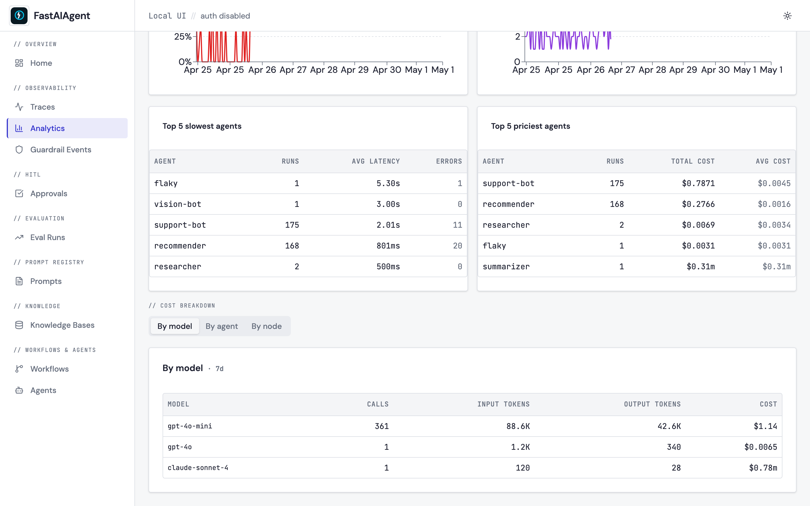
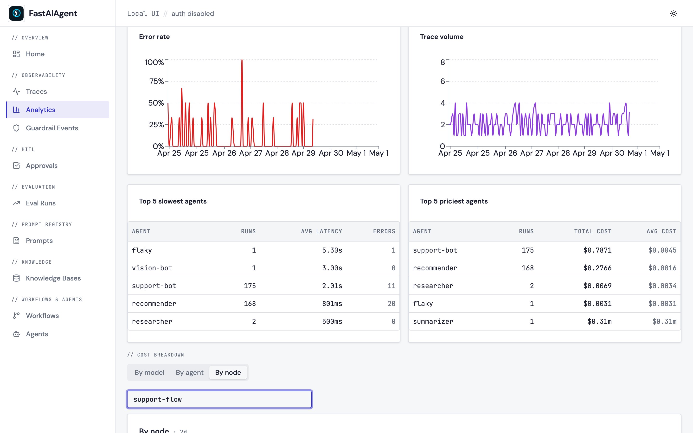

# Cost tracking dashboard

The Analytics page now ships a **// COST BREAKDOWN** section below the
existing latency / cost / error / volume charts. Three tabs slice the
spans table three ways: by LLM model, by agent, and by chain node.
Numbers come from the same `compute_cost_usd()` table that powers the
existing per-trace cost column — no double bookkeeping.



## Three breakdowns

| Tab | What it groups | Useful for |
|---|---|---|
| **By model** | Every LLM span, bucketed by `gen_ai.request.model` | "Which model is most of my spend on?" |
| **By agent** | Root agent spans (run count) plus their LLM children (tokens + cost) | "Which agent is most expensive per run?" |
| **By node** | LLM spans bucketed by `chain.node_id` for one named chain | "Which node in `support-flow` dominates the bill?" |

The **By node** tab requires a chain name — type it into the input
above the table:



## Window picker

The same `24h / 7d / 30d` window picker at the top of the Analytics page
controls the cost-breakdown lookback. The mapping is:

| Page choice | Endpoint param |
|---|---|
| 24h | `period=1d` |
| 7d  | `period=7d` |
| 30d | `period=30d` |

(`period=all` is also accepted by the endpoint — currently bounded to
90 days for safety.)

## Endpoint

```
GET /api/analytics/costs?group_by=model&period=7d
GET /api/analytics/costs?group_by=agent&period=7d
GET /api/analytics/costs?group_by=node&chain_name=support-flow&period=7d
```

Response shape (model mode):

```json
{
  "group_by": "model",
  "period": "7d",
  "rows": [
    {"model": "gpt-4o", "calls": 1240, "input_tokens": 2100000,
     "output_tokens": 340000, "cost_usd": 18.42}
  ]
}
```

For agent mode each row carries `runs`, `avg_tokens`, `avg_cost_usd`,
`total_cost_usd`. For node mode each row carries `executions`,
`avg_duration_ms`, `avg_cost_usd`, `percent_of_total`.

## How cost is computed

For every LLM span the endpoint:

1. Reads `agent.cost_usd` if present (the SDK's preferred field).
2. Falls back to `compute_cost_usd(model, input_tokens, output_tokens)`
   from [`fastaiagent/ui/pricing.py`](https://github.com/fastaifoundry/fastaiagent-sdk/blob/main/fastaiagent/ui/pricing.py)
   when the explicit cost isn't set.
3. Drops to `0.0` only when both paths fail (unknown model + no
   reported cost).

This matches the rule the workflows aggregator uses, so per-workflow
cost cards and the breakdown tables agree by construction.

## Updating prices

The pricing table in `fastaiagent/ui/pricing.py` is a flat dict keyed by
model-name prefix. Longest prefix wins, so adding a new variant is
additive:

```python
"gpt-4.1-nano": _Rate(0.10, 0.40),
```

Bump the rates here whenever a provider changes their per-million
pricing — the dashboards re-aggregate from raw token counts on every
read, so updates apply retroactively.

## Where the screenshots come from

Both screenshots are captured by `scripts/capture-sprint1-screenshots.sh`
against the seed in `scripts/seed_ui_sprint1.py`, which lays down five
LLM spans across three models (gpt-4o, gpt-4o-mini, claude-sonnet-4)
under three agent names and three chain nodes inside `support-flow`.
