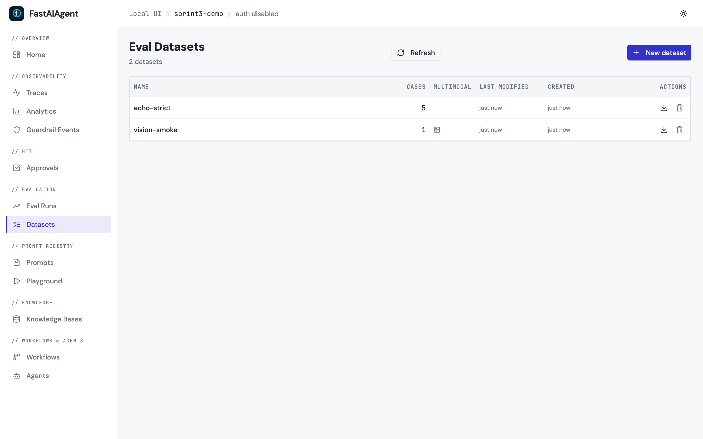
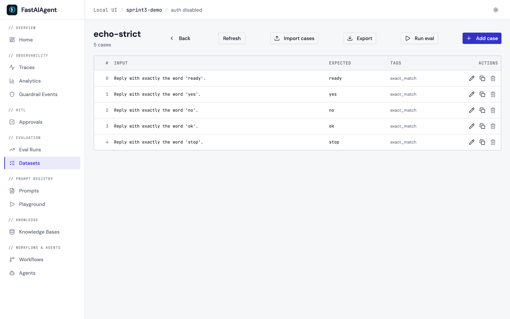
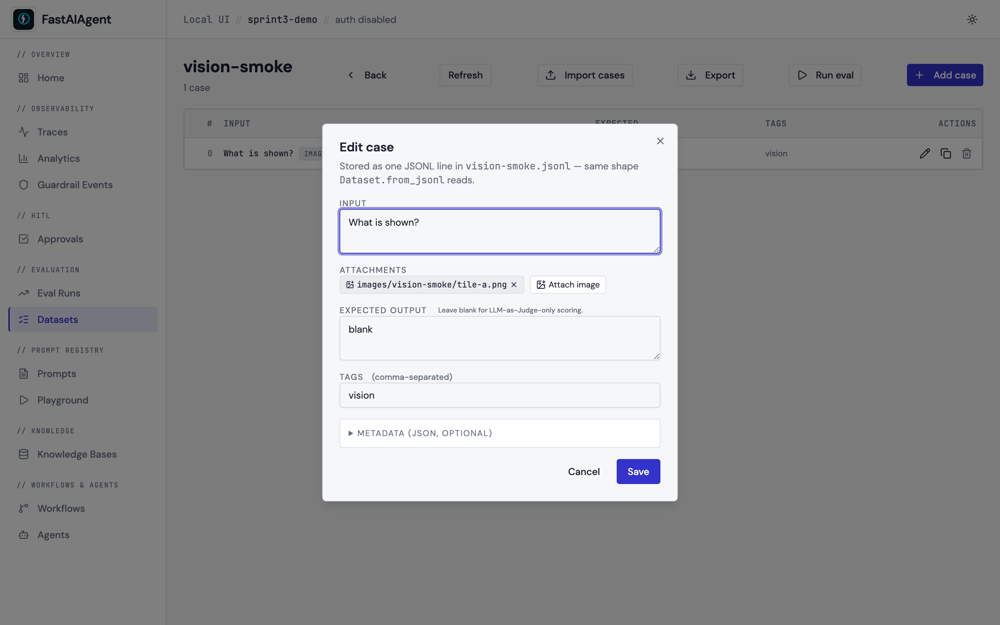
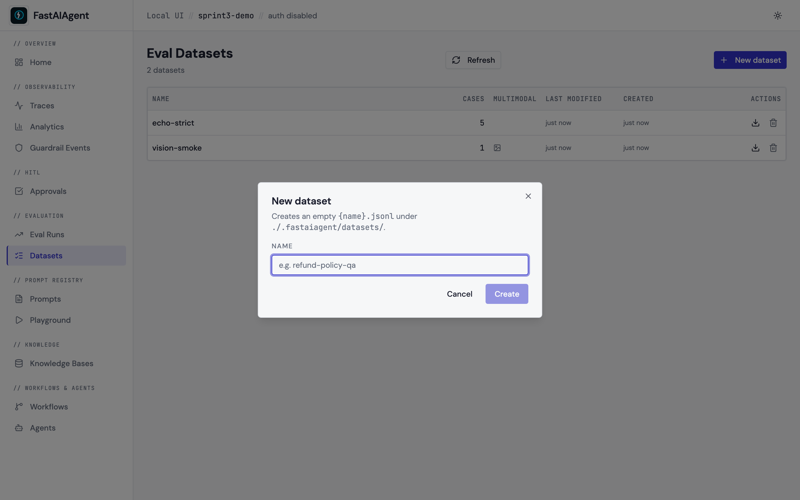

# Eval Datasets

Curate eval cases inside the UI instead of hand-editing JSONL.
Datasets are still the same files `Dataset.from_jsonl()` loads — the
editor just replaces the script-edit-rerun loop with point-and-click
CRUD, multimodal upload, import/export, and a one-click "Run eval"
against the registered agents.

Find it in the sidebar under `// EVALUATION → Datasets`, or save your
first case from the Playground via the **Save as eval case** button.



## What it does

**List page** (`/datasets`) — every `*.jsonl` under
`./.fastaiagent/datasets/` with its case count, last-modified time, and
a multimodal badge if any case has an image or PDF part.

- **New dataset** creates an empty `<name>.jsonl`. Name is restricted to
  `[A-Za-z0-9_-]+` so paths can't escape the datasets directory.
- **Export** downloads the file directly via
  `GET /api/datasets/{name}/export` — no client-side serialization.
- **Delete** removes the JSONL plus the per-dataset image folder
  (`images/{name}/`); persisted eval runs that pointed at this dataset
  keep their snapshots.



**Detail page** (`/datasets/{name}`) — the cases table with row actions
and a header full of bulk affordances:

- **Add case** opens the editor modal; the new line is appended to the
  JSONL atomically (tmp file → `os.replace`).
- **Import cases** uploads a JSONL file, validating each line has an
  `input` field. The first malformed line wins a 400 with the line
  number; nothing partial is written. `mode=append` (default) preserves
  existing cases; `mode=replace` overwrites.
- **Export** downloads the JSONL.
- **Run eval** kicks off the eval framework against the dataset (echo
  agent + `exact_match` scorer by default). The resulting `run_id` is
  the same one Eval Runs would have produced — clicking through deep-
  links into `/evals/{run_id}`.

## Case editor



- **Input** — plain textarea. Attach images via the **Attach image**
  button; the upload lands at `<datasets>/images/<name>/<file>` and the
  case input becomes a typed-parts list:
  ```json
  {"input": [
    {"type": "text", "text": "What animal is this?"},
    {"type": "image", "path": "images/vision/cat.png"}
  ], "expected_output": "cat"}
  ```
  This is exactly the shape `Dataset._resolve_multimodal_part` walks at
  load time, so the case is immediately runnable through the eval
  framework.
- **Expected output** — optional. Leave blank for cases scored by
  LLM-as-Judge only (no exact-match assertion).
- **Tags** — comma-separated. Useful for filtering runs by category
  (`exact_match`, `retrieval`, `edge_case`).
- **Metadata** — collapsible JSON object. The eval framework doesn't
  read it, but the field is preserved on disk so the developer can
  attach provenance (e.g. `{"source": "production_trace_abc"}`).

## "Save as eval case" — Playground bridge



The Playground's **Save as eval case** button now combos over existing
datasets (with a `+ New` escape hatch), so the inner-loop iteration in
the Playground feeds the outer-loop curation in the editor without
copy-pasting a name. The same dialog is used by Replay's *Save as
regression test*.

## JSONL format

Plain text case:

```json
{"input": "Reply with the word 'hello'.", "expected_output": "hello", "tags": ["smoke"], "metadata": {}}
```

Multimodal case:

```json
{"input": [{"type": "text", "text": "What animal is this?"}, {"type": "image", "path": "images/echo/cat.png"}], "expected_output": "cat"}
```

The editor accepts both `expected` and `expected_output` on read (so
hand-edited spec-format files keep working) and writes
`expected_output` on save (matching the Playground's existing
convention so files written by either tool stay consistent).

## Endpoints

```
GET    /api/datasets                          → DatasetSummary[]
POST   /api/datasets                          → 201 DatasetSummary
GET    /api/datasets/{name}                   → DatasetDetail
DELETE /api/datasets/{name}                   → 204
POST   /api/datasets/{name}/cases             → 201 CaseRow (append)
PUT    /api/datasets/{name}/cases/{index}     → 200 CaseRow (in-place)
DELETE /api/datasets/{name}/cases/{index}     → 204 (re-indexes the rest)
POST   /api/datasets/{name}/import            → ImportResult (multipart)
GET    /api/datasets/{name}/export            → JSONL download
POST   /api/datasets/{name}/images            → 201 ImageUploadResult
GET    /api/datasets/{name}/images/{filename} → image bytes
POST   /api/datasets/{name}/run-eval          → RunEvalResult
```

Every endpoint is project-scoped via the standard `AppContext` wiring;
the dataset directory resolves relative to the project's
`.fastaiagent/local.db`, so multi-project setups (Postgres) keep their
cases isolated.

## Integration matrix

| From | Action | Lands in |
|---|---|---|
| Playground | Save as eval case | New row in chosen dataset |
| Replay | Save as regression test | New row in chosen dataset |
| Dataset editor | Add case | Same JSONL the eval framework reads |
| Dataset editor | Run eval | New row in `/evals` |
| Eval Runs | Compare with… | `/evals/compare` (existing) |

Same observability surface throughout — every editor write is
synchronous and the file is the source of truth.

## Example

The example script
[`examples/53_dataset_editor.py`](https://github.com/fastaifoundry/fastaiagent-sdk/blob/main/examples/53_dataset_editor.py)
seeds a dataset with text and image cases and prints the
`/datasets/<name>` URL so you can open the editor against real data.
