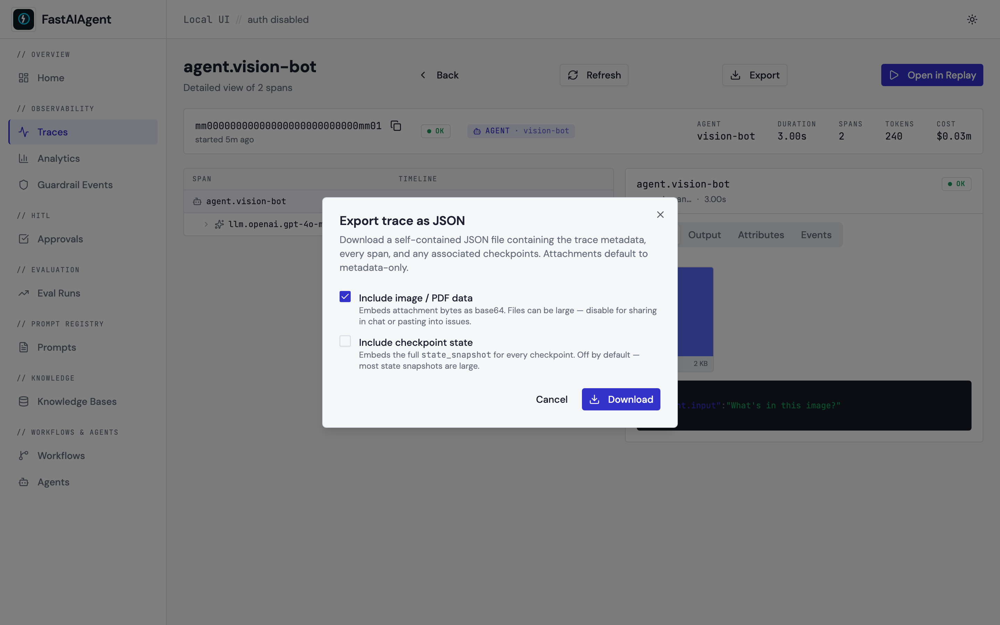

# Export trace as JSON

Every trace can be downloaded as a self-contained JSON file from the
trace detail page or from the CLI. The export captures trace metadata,
every span (with input / output / attributes / events / model / tokens /
cost), checkpoints (when the trace was durable), and attachment metadata.
Image and PDF bytes are referenced by default — opt in to embedding them
inline via a checkbox.



## From the UI

Click **Export** on any trace detail page (top-right action bar). The
dialog gives two opt-in toggles:

- **Include image / PDF data** — base64-embeds attachment bytes in the
  JSON. Default off; files can balloon to many MB.
- **Include checkpoint state** — embeds the full
  `state_snapshot` / `node_input` / `node_output` for every checkpoint.
  Default off; state snapshots are typically large.

Clicking **Download** navigates to the export endpoint with the chosen
flags as query params; the browser handles the file save via the
`Content-Disposition` header.

## From the CLI

`fastaiagent export-trace` reads the local SQLite DB directly — no
running UI server required.

```bash
fastaiagent export-trace \
    --trace-id 3ea7986578bc6e2da8dcca18f5fddb8b \
    --output trace.json

# Embed image bytes too:
fastaiagent export-trace \
    --trace-id 3ea7986578bc6e2da8dcca18f5fddb8b \
    --output trace-full.json \
    --include-attachments \
    --include-checkpoint-state
```

The CLI accepts `--db <path>` to override the default `local.db`
location. By default it resolves the same DB the UI server uses.

## Endpoint

```
GET /api/traces/{trace_id}/export?include_attachments=false&include_checkpoint_state=false
```

The response carries a `Content-Disposition: attachment; filename="trace-{id}.json"`
header so the browser saves it directly. The server caps the response
at 100 MB and returns `413 Payload Too Large` if the export would
exceed that — re-run without `include_attachments=true` or use the CLI
to filter.

## Schema

```json
{
  "export_version": "1.0",
  "exported_at": "2026-04-29T14:30:00+00:00",
  "sdk_version": "1.2.0",
  "trace": {
    "trace_id": "3ea7986578bc6e2da8dcca18f5fddb8b",
    "name": "agent.weather-bot",
    "status": "OK",
    "started_at": "2026-04-29T14:25:00+00:00",
    "duration_ms": 2460,
    "total_tokens": 312,
    "total_cost": 0.0004,
    "workflow_type": "agent",
    "runner": "weather-bot",
    "execution_id": "exec-abc",
    "durable": true
  },
  "spans": [
    {
      "span_id": "5538f703...",
      "name": "llm.openai.gpt-4o-mini",
      "parent_span_id": null,
      "status": "OK",
      "started_at": "...",
      "duration_ms": 2400,
      "input": {"gen_ai.request.messages": [{"role": "user", "content": "..."}]},
      "output": {"gen_ai.response.content": "..."},
      "attributes": {"...": "..."},
      "events": [],
      "model": "gpt-4o-mini",
      "tokens": {"input": 180, "output": 132},
      "cost": 0.0004
    }
  ],
  "checkpoints": [
    {"checkpoint_id": "...", "node_id": "research", "step": 0, "status": "completed", "...": "..."}
  ],
  "multimodal_attachments": [
    {
      "attachment_id": "...",
      "span_id": "...",
      "media_type": "image/jpeg",
      "size_bytes": 145000,
      "metadata": {"width": 320, "height": 200},
      "included": false,
      "note": "Attachment data excluded from export. Use include_attachments=True to embed base64 bytes."
    }
  ]
}
```

When `include_attachments=true` each attachment row also carries
`attachment_data` (base64-encoded bytes); when `include_checkpoint_state=true`
each checkpoint row also carries `state_snapshot`, `node_input`,
`node_output`, and `interrupt_context`.

## Single source of truth

Both the HTTP endpoint and the CLI command are thin wrappers around
[`fastaiagent.trace.trace_export.build_export_payload`](https://github.com/fastaifoundry/fastaiagent-sdk/blob/main/fastaiagent/trace/trace_export.py),
so the JSON shape stays identical regardless of which entrypoint produced
it. Your scripts can call this helper directly:

```python
from fastaiagent._internal.storage import SQLiteHelper
from fastaiagent.trace.trace_export import build_export_payload

with SQLiteHelper(".fastaiagent/local.db") as db:
    payload = build_export_payload(
        db,
        trace_id="3ea7986578bc6e2da8dcca18f5fddb8b",
        include_attachments=True,
    )
```

## Where the screenshot comes from

The dialog screenshot is captured by
`scripts/capture-sprint1-screenshots.sh` against the multimodal trace
seeded by `scripts/seed_ui_sprint1.py`. The trace ID embedded in the
download URL matches the one that page is showing.
