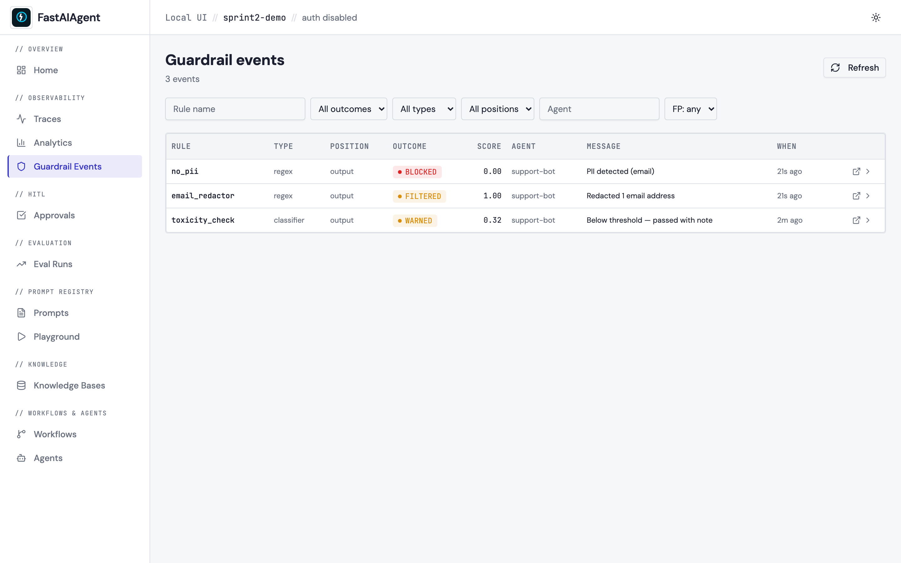
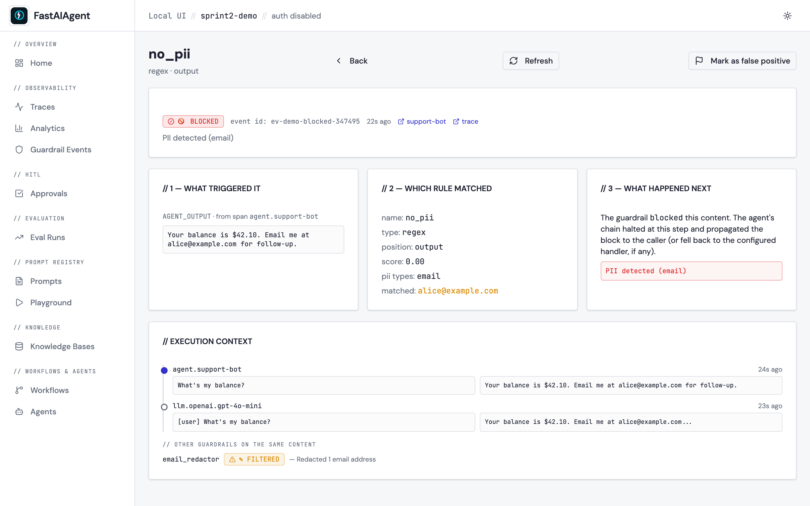
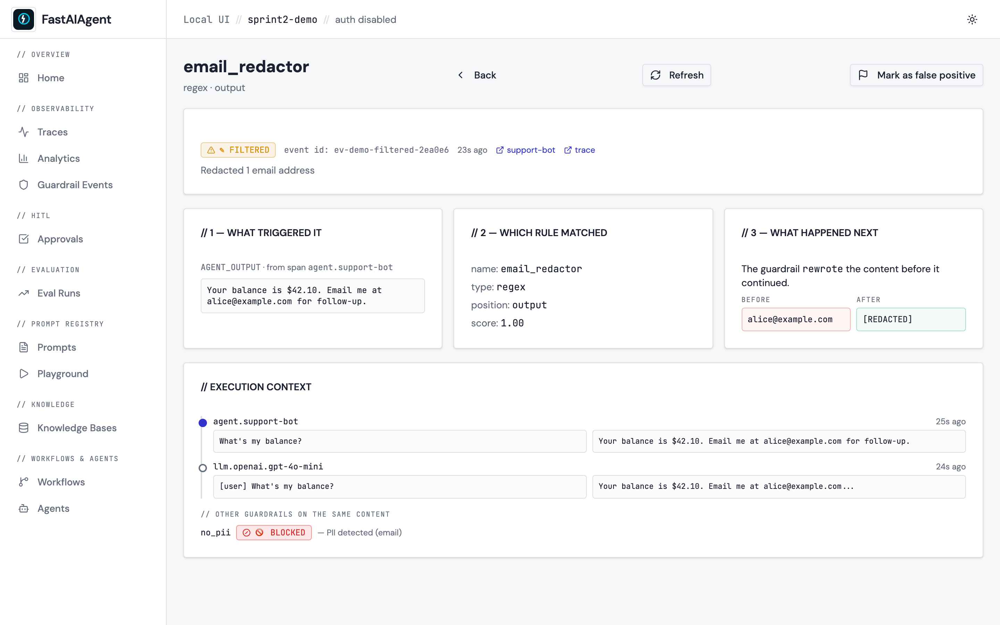
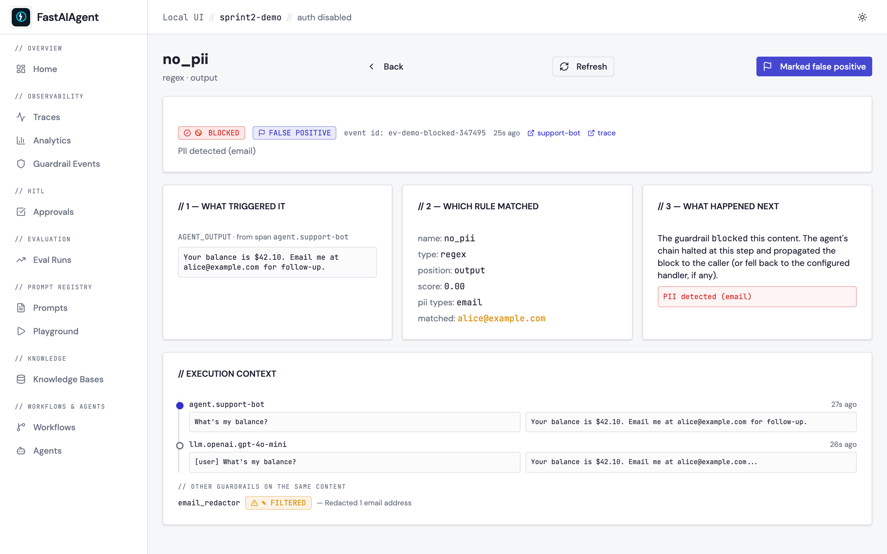

# Guardrail Event Detail

Every guardrail firing produces a row in the `guardrail_events` table.
The list page at [/guardrails](https://github.com/fastaifoundry/fastaiagent-sdk/blob/main/docs/ui/index.md)
has always shown the summary; the **detail page** at
`/guardrail-events/{event_id}` shows the full story behind each event:
*what triggered it*, *which rule matched*, *what happened next*, and the
execution context the rule fired inside.



## Three panels

When you click a row on the Guardrails list (or follow the badge from
the Trace Detail page's *Scores* card), you land on a three-panel layout:



| Panel | Contents |
|---|---|
| **1 — What triggered it** | The exact span content the guardrail evaluated. `position` decides whether this is the agent's input, the agent's output, a tool call, or a tool response. Falls back to a hint when payload tracing is disabled (`FASTAIAGENT_TRACE_PAYLOADS=0`). |
| **2 — Which rule matched** | Guardrail name + type (`code` / `regex` / `llm_judge` / `schema` / `classifier`) + position. Rich metadata: PII categories for `no_pii`, `match` substring for regex rules, `judge_prompt` + `judge_response` for LLM-judge rules. |
| **3 — What happened next** | For `blocked`: the error/fallback the agent received. For `filtered`: a side-by-side **before / after** diff of the rewritten content (set `metadata.before` and `metadata.after` on the result and the UI renders them automatically). For `warned` / `passed`: explanatory text. |



Below the three panels, an **execution context** section shows up to 8
spans from the same trace as a vertical timeline (with the triggering
span highlighted) plus a list of *other guardrails that ran on the same
content*. That sibling list is critical for debugging — it tells you
whether a `blocked` outcome was unanimous across rules or a single
opinionated rule overruling the rest.

## Mark as false positive

Top-right of the detail page is a **Flag · Mark as false positive**
button. Click it and the event row's `false_positive` column flips to
`1` plus a `false_positive_at` timestamp. Refresh the page — the flag
persists. Toggle again to clear.



The flag surfaces in two places after toggling:
- An "FP" badge on the corresponding row of the Guardrails list.
- A new `FP: yes / FP: no / FP: any` filter at the top of the list, so
  you can quickly hide noise once you've curated it.

This flag is intentionally a UI annotation only — agent runtime is
unaware of it. The event still ran, the rule still fired, the trace is
still immutable. What changes is just *your view* of the event.

> **Sprint 3 follow-up.** "Save as guardrail eval case" on the same
> button is deferred — for now, the flag is the bridge.

## Endpoints

```
GET   /api/guardrail-events
        ?rule=...&outcome=...&agent=...&type=...
        &position=...&false_positive=true|false
        &since=...&until=...&page=...&page_size=...
GET   /api/guardrail-events/{event_id}
PATCH /api/guardrail-events/{event_id}/false-positive
        body: {"false_positive": true|false, "note": "optional"}
```

The list endpoint gained four new filters in Sprint 2: `type` and
`position` (existing fields, now surfaced through the API and a pair of
list-page selects), plus `false_positive` to slice annotated rows.

The detail endpoint joins the event row with:
- the triggering span (read by `span_id`)
- up to 8 surrounding spans on the same trace
- every sibling event on the same `(trace_id, span_id)` pair

Every endpoint is project-scoped. Cross-project event ids return 404 so
multi-project Postgres deployments stay isolated.

## Schema

Sprint 2 bumps the local schema to **v5** with two new columns on
`guardrail_events`:

```sql
ALTER TABLE guardrail_events ADD COLUMN false_positive INTEGER DEFAULT 0;
ALTER TABLE guardrail_events ADD COLUMN false_positive_at TEXT;
```

Migrations are idempotent — running an existing v4 DB through `init_local_db()`
adds the columns without backfill (default `0` is correct for historical
events).

## Trace integration

On the [Trace Detail page](index.md#scores-on-a-trace), the existing
*Scores* card now wraps each guardrail row in a link to its detail page.
A click takes you straight from a span tree to the rule that fired on
it — and back — without a search round-trip.

## Example

[examples/51_guardrail_events.py](https://github.com/fastaifoundry/fastaiagent-sdk/blob/main/examples/51_guardrail_events.py)
runs an agent through three different guardrail outcomes (blocked /
filtered / warned) and prints the URL where each detail page renders.
