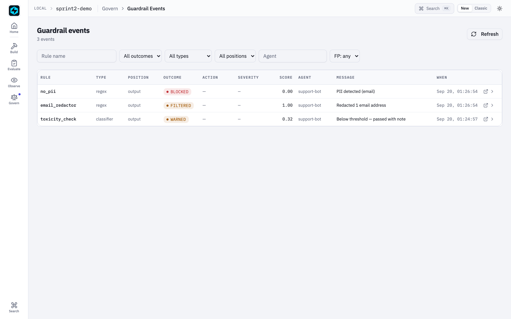
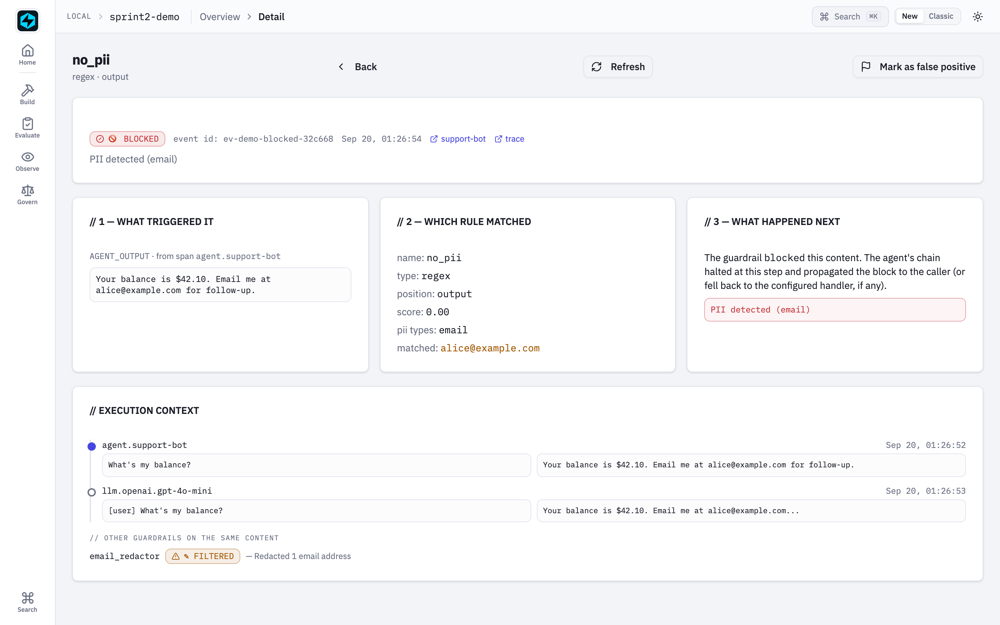
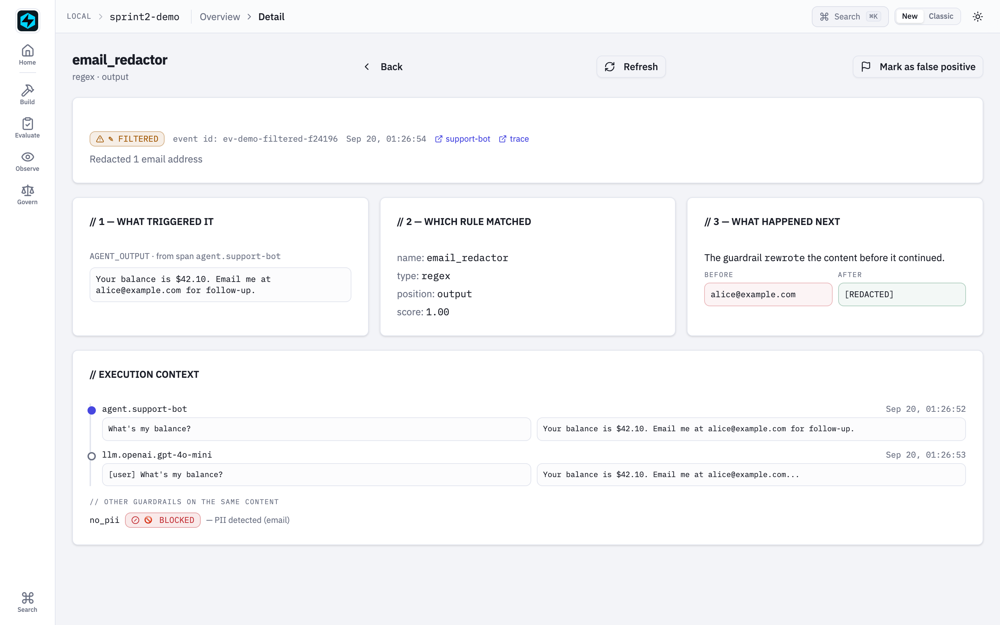
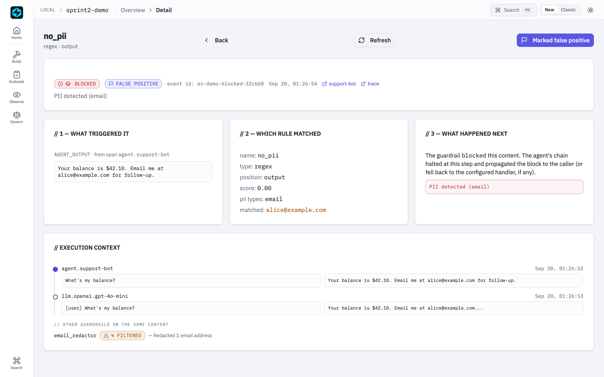

# Guardrail Event Detail

Every guardrail firing produces a row in the `guardrail_events` table.
The list page at [/guardrails](https://github.com/fastaifoundry/fastaiagent-sdk/blob/main/docs/ui/index.md)
has always shown the summary; the **detail page** at
`/guardrail-events/{event_id}` shows the full story behind each event:
*what triggered it*, *which rule matched*, *what happened next*, and the
execution context the rule fired inside.



## Three panels

When you click a row on the Guardrails list (or follow the badge from
the Trace Detail page's *Scores* card), you land on a three-panel layout:



| Panel | Contents |
|---|---|
| **1 — What triggered it** | The exact span content the guardrail evaluated. `position` decides whether this is the agent's input, the agent's output, a tool call, or a tool response. Falls back to a hint when payload tracing is disabled (`FASTAIAGENT_TRACE_PAYLOADS=0`). |
| **2 — Which rule matched** | Guardrail name + type (`code` / `regex` / `llm_judge` / `schema` / `classifier`) + position. Rich metadata: PII categories for `no_pii`, `match` substring for regex rules, `judge_prompt` + `judge_response` for LLM-judge rules. |
| **3 — What happened next** | For `blocked`: the error/fallback the agent received. For `filtered`: a side-by-side **before / after** diff of the rewritten content (set `metadata.before` and `metadata.after` on the result and the UI renders them automatically). For `errored`: an explanation that the check itself couldn't run, and whether the guardrail's [`on_error`](../guardrails/index.md#fail-policy-on_error) policy let the content through (`allow`) or blocked it (`block`). For `warned` / `passed`: explanatory text. |

!!! note "The `errored` outcome"
    A model-judged guardrail whose LLM call fails is logged with an `errored`
    outcome (rather than silently passing), so you can see how often a check is
    degrading instead of guarding. Whether it then allowed or blocked is
    recorded in the result's `on_error` metadata.



Below the three panels, an **execution context** section shows up to 8
spans from the same trace as a vertical timeline (with the triggering
span highlighted) plus a list of *other guardrails that ran on the same
content*. That sibling list is critical for debugging — it tells you
whether a `blocked` outcome was unanimous across rules or a single
opinionated rule overruling the rest.

## Mark as false positive

Top-right of the detail page is a **Flag · Mark as false positive**
button. Click it and the event row's `false_positive` column flips to
`1` plus a `false_positive_at` timestamp. Refresh the page — the flag
persists. Toggle again to clear.



The flag surfaces in two places after toggling:
- An "FP" badge on the corresponding row of the Guardrails list.
- A new `FP: yes / FP: no / FP: any` filter at the top of the list, so
  you can quickly hide noise once you've curated it.

This flag is intentionally a UI annotation only — agent runtime is
unaware of it. The event still ran, the rule still fired, the trace is
still immutable. What changes is just *your view* of the event.

> **Sprint 3 follow-up.** "Save as guardrail eval case" on the same
> button is deferred — for now, the flag is the bridge.

## Endpoints

```
GET   /api/guardrail-events
        ?rule=...&outcome=...&agent=...&type=...
        &position=...&false_positive=true|false
        &since=...&until=...&page=...&page_size=...
GET   /api/guardrail-events/{event_id}
PATCH /api/guardrail-events/{event_id}/false-positive
        body: {"false_positive": true|false, "note": "optional"}
```

The list endpoint gained four new filters in Sprint 2: `type` and
`position` (existing fields, now surfaced through the API and a pair of
list-page selects), plus `false_positive` to slice annotated rows.

`type` accepts the two model-backed types added in 1.57.0 (`content_safety`,
`groundedness`), and `outcome` accepts `filtered` — a rule that rewrote the
payload and let the run continue. Every row also carries `action`,
`action_taken`, `severity` and `floor`.

The detail endpoint joins the event row with:
- the triggering span (read by `span_id`)
- up to 8 surrounding spans on the same trace
- every sibling event on the same `(trace_id, span_id)` pair

Every endpoint is project-scoped. Cross-project event ids return 404 so
multi-project Postgres deployments stay isolated.

## Schema

Sprint 2 bumps the local schema to **v5** with two new columns on
`guardrail_events`:

```sql
ALTER TABLE guardrail_events ADD COLUMN false_positive INTEGER DEFAULT 0;
ALTER TABLE guardrail_events ADD COLUMN false_positive_at TEXT;
```

Migrations are idempotent — running an existing v4 DB through `init_local_db()`
adds the columns without backfill (default `0` is correct for historical
events).

### v18 — what the failure cost (1.57.0)

`outcome` alone can no longer describe what happened. A failure may now warn,
mask, override or re-ask instead of blocking, and two rules with the same outcome
can have arrived there very differently — a `mask` that found nothing to redact
blocks, and so does an errored `warn`:

```sql
ALTER TABLE guardrail_events ADD COLUMN action       TEXT;
ALTER TABLE guardrail_events ADD COLUMN action_taken TEXT;
ALTER TABLE guardrail_events ADD COLUMN severity     TEXT;
ALTER TABLE guardrail_events ADD COLUMN floor        INTEGER DEFAULT 0;
```

`action` is what the rule was configured to cost; `action_taken` is what it
actually did. The pair is what makes an over-blocking rule visible. `severity`
and `floor` change no behaviour — see
[Actions, severity & floor](../guardrails/actions.md).

All four are `NULL` on events recorded before 1.57.0, and the migration is
additive: an older SDK opening a v18 file runs no migration and reads by name.

The events table shows `Action` and `Severity` next to the outcome, with a
`FLOOR` badge on the organisation baseline. An action that **could not be
carried out** is flagged with `*`: an errored check always blocks whatever its
action said, and a `mask` that finds no span to redact degrades to a block. Both
are safety behaviours, not faults — but a rule configured to `mask` that shows
`blocked` is worth seeing at a glance.

!!! note "`filtered` is now produced, not just rendered"
    The detail page has always known the `filtered` outcome and its before/after
    diff. Until the action spectrum shipped, no runtime code could write one —
    every failure was a block. A `mask` or `override` rule now writes
    `outcome="filtered"` with `metadata.before` / `metadata.after` filled in for
    you.

## Trace integration

On the [Trace Detail page](index.md#scores-on-a-trace), the existing
*Scores* card now wraps each guardrail row in a link to its detail page.
A click takes you straight from a span tree to the rule that fired on
it — and back — without a search round-trip.

## Example

[examples/51_guardrail_events.py](https://github.com/fastaifoundry/fastaiagent-sdk/blob/main/examples/51_guardrail_events.py)
runs an agent through three different guardrail outcomes (blocked /
filtered / warned) and prints the URL where each detail page renders.
