# Local UI

A polished, single-user web UI for traces, eval runs, prompts, guardrail events,
and agents — shipped inside the `fastaiagent` wheel. Runs on your laptop, reads
from `./.fastaiagent/local.db`, nothing leaves the machine.

!!! tip "Your project, your UI"
    Zero Docker. Zero Postgres. Zero cloud account.
    `pip install 'fastaiagent[ui]'`, run `fastaiagent ui`, done.

## Install

The UI's web stack (FastAPI, uvicorn, aiosqlite, bcrypt, itsdangerous) lives
behind an optional extra so non-UI users don't pay for it.

```bash
pip install 'fastaiagent[ui]'
```

## First run

```bash
fastaiagent ui
```

First launch prompts for a username and password, saves a bcrypt-hashed
credential to `./.fastaiagent/auth.json`, and opens your browser on
`http://127.0.0.1:7842`.

```text
FastAIAgent Local UI — first run
Set a username: upendra
Set a password: ***
Confirm password: ***
✓ Credentials saved to ./.fastaiagent/auth.json
Starting UI on http://127.0.0.1:7842
Opening browser...
```

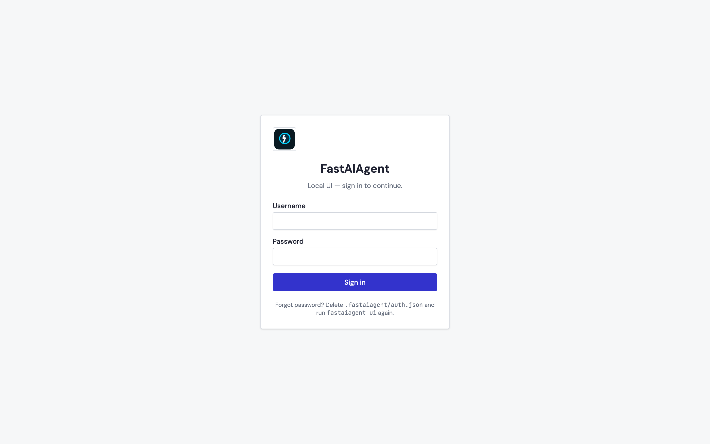

## Flags

| Flag | Default | Effect |
|------|---------|--------|
| `--host` | `127.0.0.1` | Bind address. Keep on loopback unless you really need LAN access. |
| `--port` | `7842` | Pick anything you like. |
| `--no-auth` | off | Skip login entirely. Intended for throwaway containers, not everyday use. |
| `--no-open` | off | Don't launch the browser. |
| `--db PATH` | `./.fastaiagent/local.db` | Override the local DB path. Also settable via `FASTAIAGENT_LOCAL_DB`. |
| `--auth-file PATH` | `./.fastaiagent/auth.json` | Override the credentials file. |

### Forgot password

```bash
fastaiagent ui reset-password
```

Deletes `./.fastaiagent/auth.json`. Next `fastaiagent ui` prompts you to
create new credentials.

---

## Tour

Screenshots below are captured from a real running instance against the
seeded snapshot DB — they stay in sync with the code via
`scripts/capture-ui-screenshots.sh`.

### Home

The overview lands you on "what happened since I last looked": traces in the
last 24 hours, failing traces, eval runs in the last 7 days, and average
pass rate. Two side-panels list the most recent traces and eval runs so you
can jump straight in.

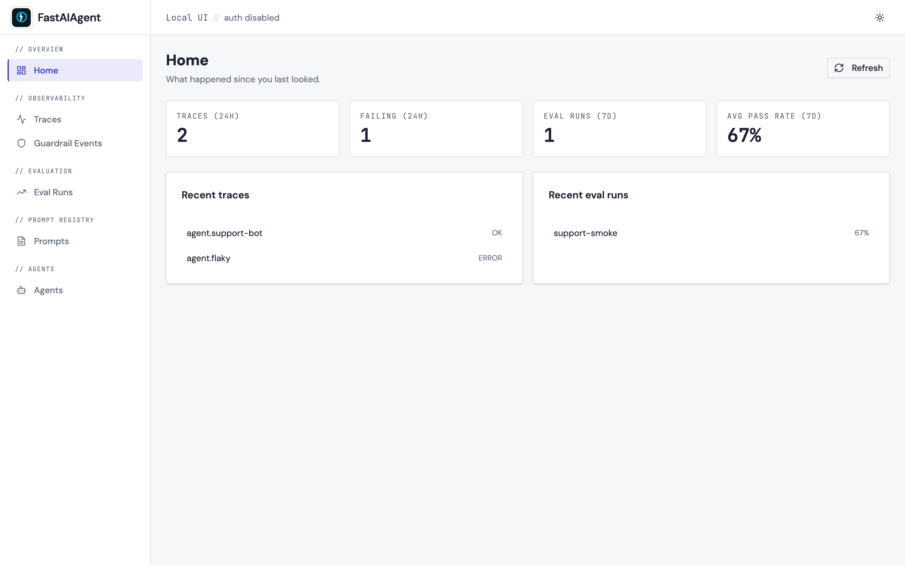

### Traces

Compact, monospace-numeric list with filters on top: search across
name/input/output, time-range pills (15m / 1h / 24h / 7d / All), status
selector, agent name. Per-row copy-trace-id and favorite buttons. Click any
row to open the detail view.

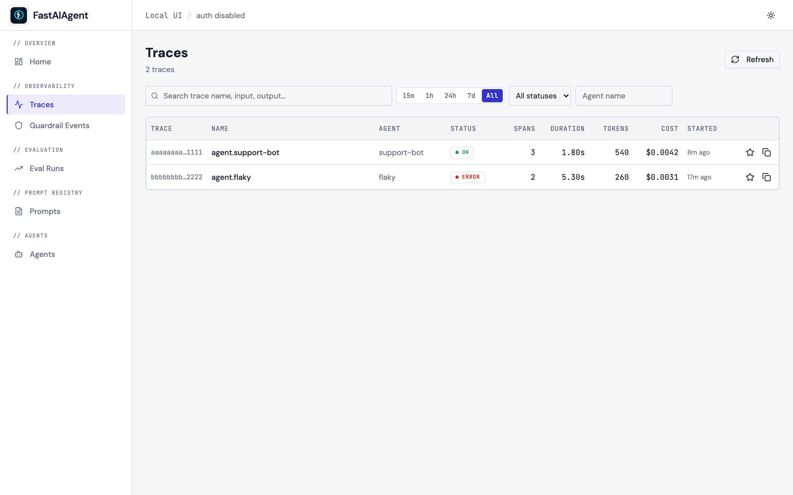

### Trace detail

Summary bar across the top with trace id, agent, duration, span count,
tokens, cost, and status pill. The left pane is a Gantt-style span tree —
icons and colors per span type (agent / LLM / tool / retrieval / guardrail),
indentation reflects the parent→child relationship, error spans are marked.
The right pane is an inspector with four tabs (**Input / Output /
Attributes / Events**); each renders as a JSON viewer with copy-on-hover.

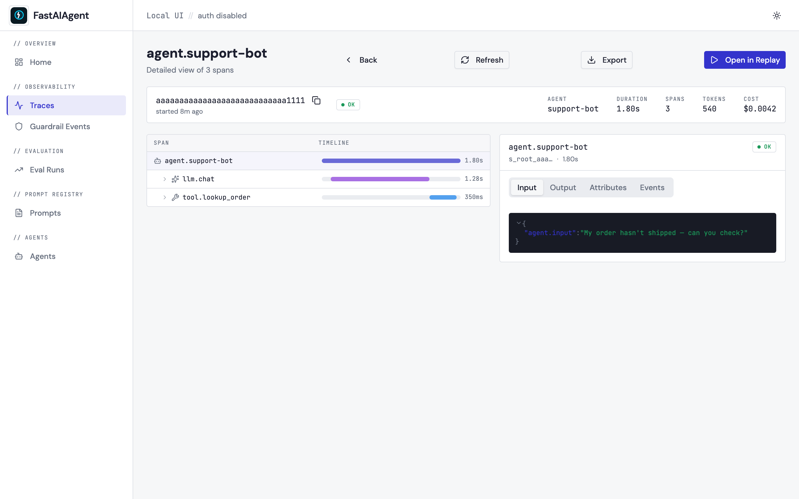

### Agent Replay

The same span tree as Trace Detail, but with a **Fork here** button in the
header. Pick a span on the tree, open the fork dialog.

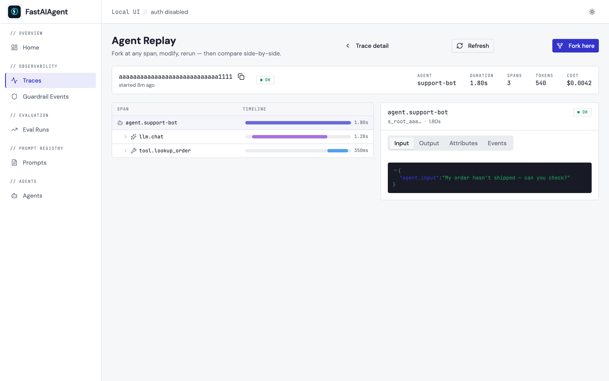

The fork dialog has four tabs for the four kinds of modification:

- **Prompt** — override the system prompt at the forked step.
- **Input** — provide a new input JSON at this span.
- **Tool response** — inject a canned tool return value.
- **LLM params** — change temperature / max tokens.

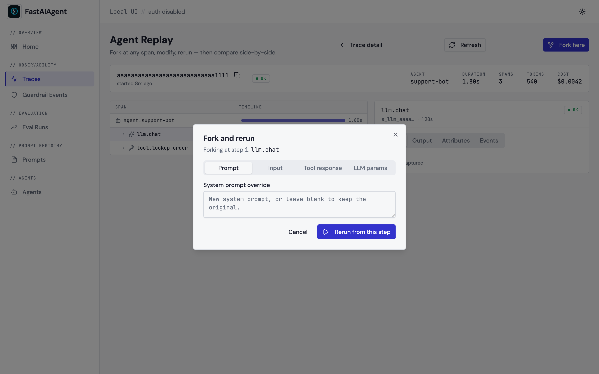

After rerun completes, a side-by-side comparison panel appears below with
the original vs. new output and a step-by-step comparison of both traces,
highlighting where they diverged. A **Save as regression test** button
appends the case to `./.fastaiagent/regression_tests.jsonl` so
`evaluate()` can pick it up.

### Eval runs

A pass-rate trend chart at the top (runs over time, grouped by dataset) plus
a table of every run with dataset, scorers, pass-rate bar, and started-ago.

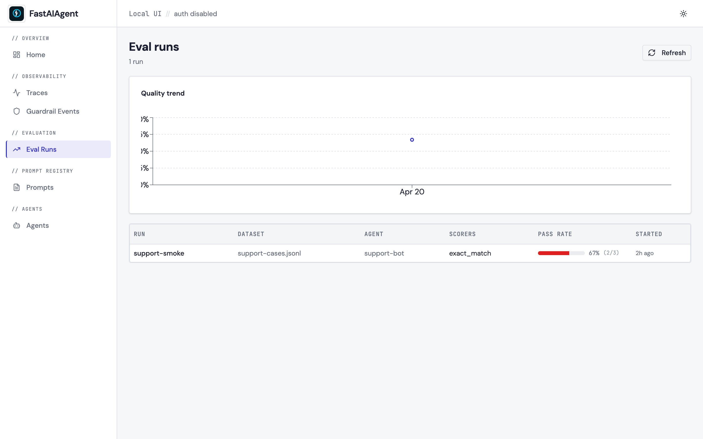

Click a run to see per-case results. Each case shows input / expected /
actual plus a pass/fail chip per scorer. Click the ▶ icon on any row to
open that case's trace in Replay.

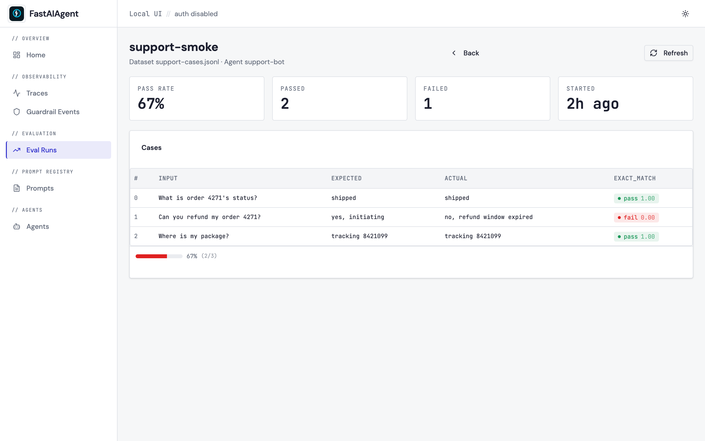

### Prompts

Registry browser — list every prompt with latest version, total versions,
and the number of traces that used it. Click to edit.

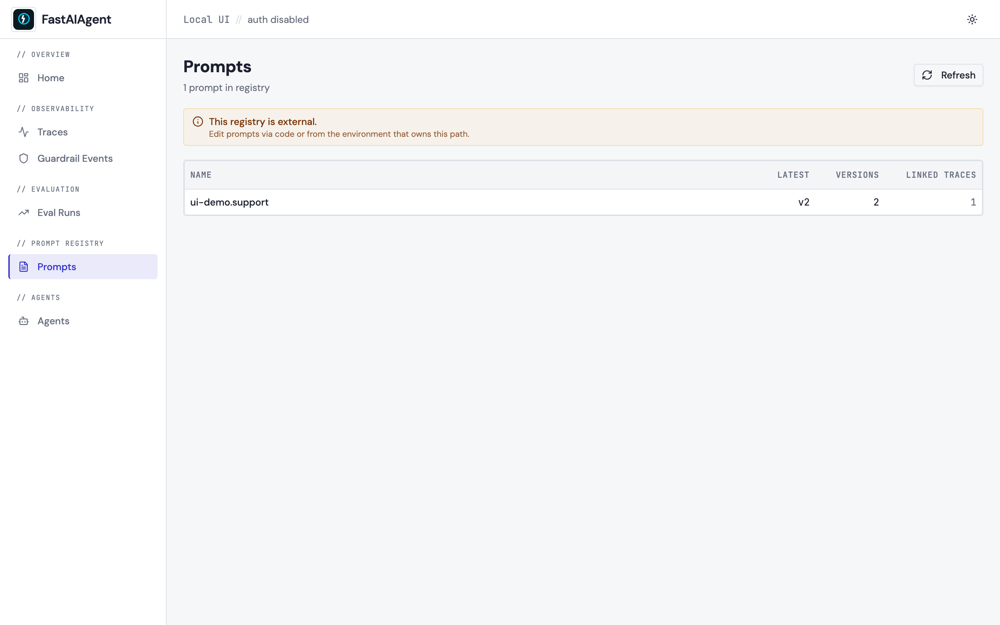

The editor lists versions on the left, with the template on the right
(auto-detected `{{variable}}` placeholders shown in the header). Save
creates a new version; the lineage panel below lists every trace and eval
run using this prompt.

When the registry lives outside the current project folder the editor is
disabled and a banner explains why (the rule is "UI mutates only what's
clearly local and personal"; external paths are owned by whoever runs that
environment).

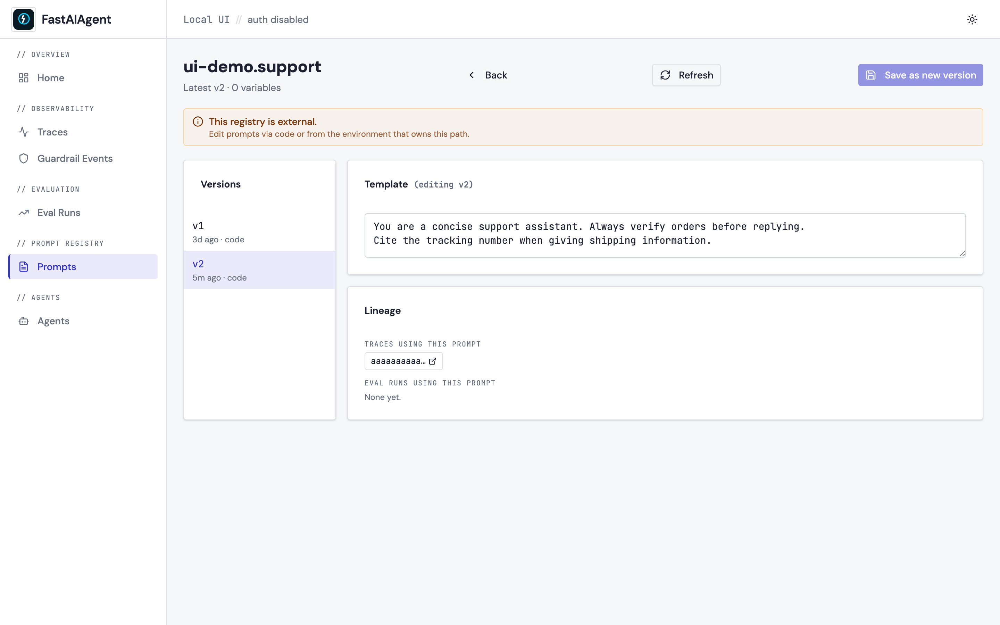

### Guardrail events

Every guardrail firing — name, type, position, outcome pill (passed /
blocked / warned), score, agent, message. Filter by rule / outcome / agent.
Click the ↗ icon to jump to the parent trace.

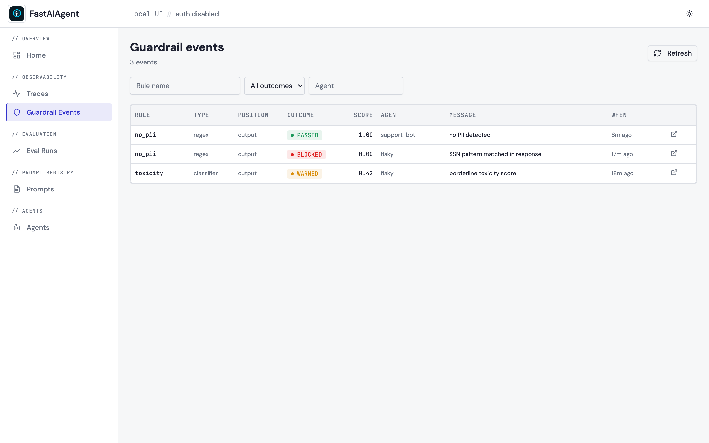

### Agents

Cards summarizing every agent the SDK has seen: run count, success rate
(color-graded), average latency, average cost, last-run time. Click a card
to see the full trace list filtered to that agent.

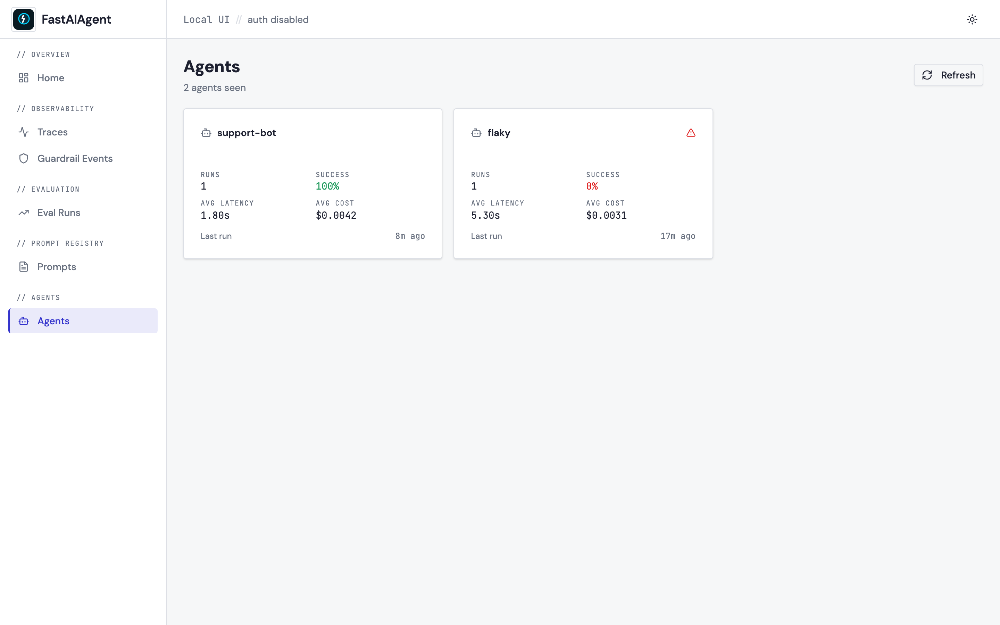

---

## Data

Everything lives in a single SQLite file at `./.fastaiagent/local.db`:

| Category | Tables |
|---|---|
| Traces | `spans` |
| Checkpoints | `checkpoints` |
| Prompts | `prompts`, `prompt_versions`, `prompt_aliases`, `prompt_fragments` |
| Evals | `eval_runs`, `eval_cases` |
| Guardrails | `guardrail_events` |
| UI view-state | `trace_notes`, `trace_favorites`, `saved_filters` |

No cloud dependency. No external service. Copy the file, back it up, or
`rm .fastaiagent/local.db` to start fresh.

## Migration from 0.7.x

0.7.x wrote three locations: `.fastaiagent/traces.db`, `.fastaiagent/checkpoints.db`,
and `./.prompts/*.yaml`. 0.8 unifies them into `./.fastaiagent/local.db`.

```bash
fastaiagent migrate
```

Copies spans, checkpoints, prompts, and fragments from the legacy stores
into `local.db`. Idempotent — safe to run multiple times. Legacy files are
left in place; delete them once you've confirmed the report.

`fastaiagent ui start` invokes `migrate` automatically when it notices
legacy files on first launch.

## Architecture

The UI is a FastAPI server plus a static React SPA:

```
fastaiagent ui  ──►  FastAPI (uvicorn)  ──►  local.db (SQLite)
                      │                      ▲
                      ▼                      │
                    static/index.html        │ writes
                    + assets/                │
                                            agent runs,
                                            guardrail execs,
                                            evaluate() calls
```

The frontend is a plain React 19 + Vite SPA built at release time and bundled
into the wheel under `fastaiagent/ui/static/`. At runtime, FastAPI serves the
bundle and an `/api/*` REST surface. **There is no WebSocket or live stream** —
every page refreshes on user action via React Query.

## Privacy

- Binds to `127.0.0.1` by default — nothing on your LAN can reach it.
- `HttpOnly` + `SameSite=Strict` session cookie.
- No telemetry. No phone-home. No account.
- `--no-auth` is available for throwaway containers but NOT the default.

## Testing

The UI ships with a full test pyramid:

- **Backend (pytest)** — `tests/test_ui_server.py` exercises every REST
  route against a real FastAPI app + real SQLite fixtures + real bcrypt
  auth. `tests/test_ui_events.py`, `tests/test_ui_cli.py`,
  `tests/test_ui_migration.py`, `tests/test_ui_db.py` cover the rest.
- **Frontend unit (Vitest + Testing Library)** — real DOM rendering
  through the Provider stack (`src/test/utils.tsx`). Coverage includes
  format helpers, status badges, pass-rate bar, sidebar routing, traces
  table, span tree interactions, and the login flow.
- **Frontend E2E / screenshots (Playwright)** —
  `ui-frontend/tests/screenshots.spec.ts` drives a real browser against the
  FastAPI server and captures the screenshots shown above. Run it with:

  ```bash
  bash scripts/capture-ui-screenshots.sh
  ```

  The script seeds a snapshot DB, starts the server on `127.0.0.1:7843` in
  `--no-auth` mode, runs every screenshot test, and tears down.

All three layers run against real libraries (real SQLite, real FastAPI,
real browser, real bcrypt) — no mocking of the subject under test.
