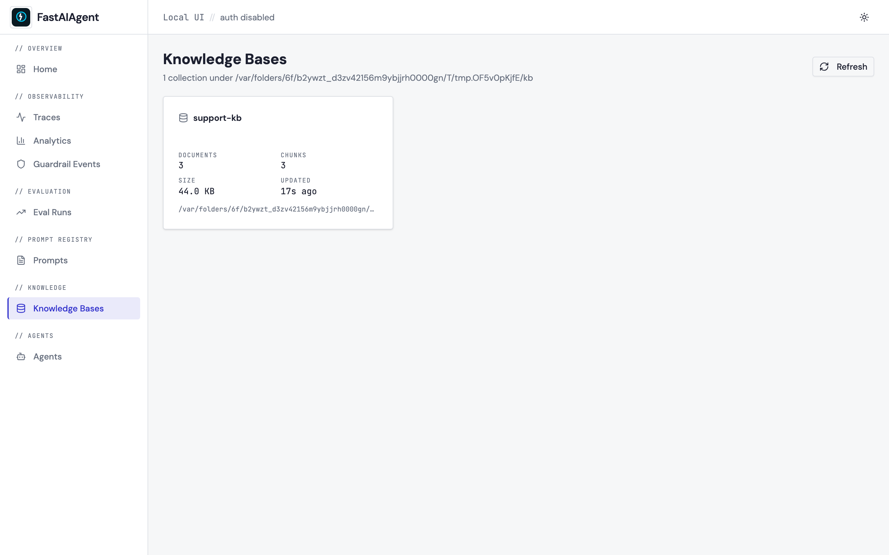
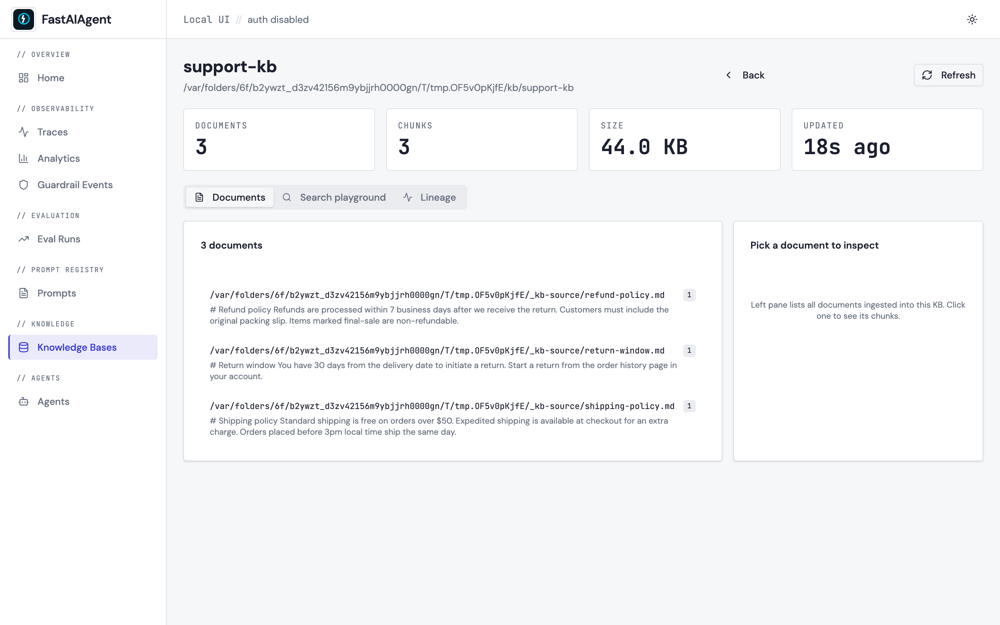
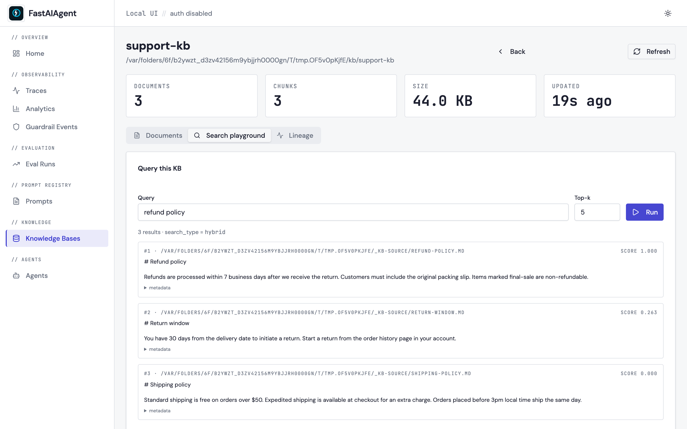
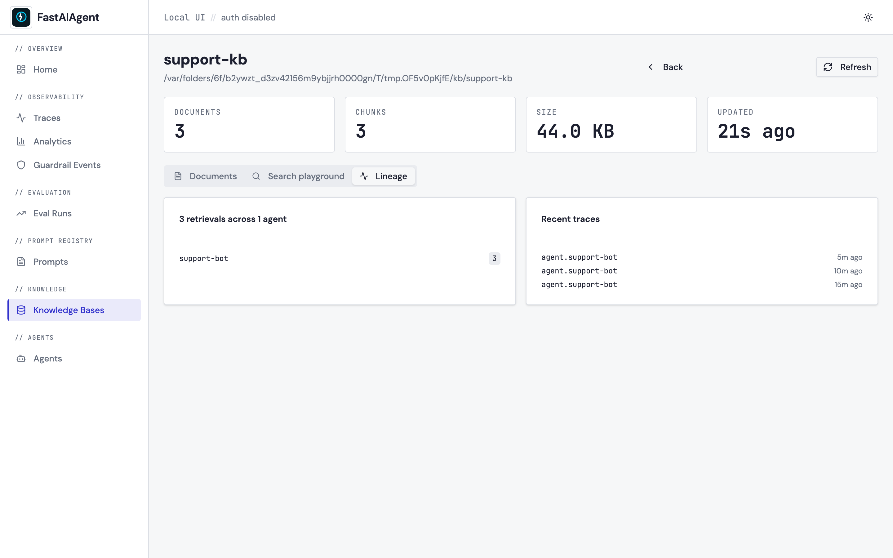

# Knowledge Bases browser

The Local UI ships a read-only browser for every `LocalKB` collection
stored on disk — use it to inspect what's indexed, run ad-hoc searches
without dropping to Python, and trace which agents are pulling which
chunks.

Writes stay in code. The UI never adds, deletes, or re-indexes.



## Where data lives

```text
.fastaiagent/
├── kb/                        ← root, override with FASTAIAGENT_KB_DIR
│   ├── support-docs/
│   │   └── kb.sqlite          ← one file per LocalKB collection
│   └── product-faq/
│       └── kb.sqlite
└── local.db                   ← traces, evals, spans (separate file)
```

The browser scans `kb/`, finds every subdirectory that contains a
`kb.sqlite`, and treats each one as a collection. Counts come from a
read-only SQLite connection — the UI cannot mutate a KB even if it
wanted to.

## Sidebar entry point

```
/ OVERVIEW
/ OBSERVABILITY
/ EVALUATION
/ PROMPT REGISTRY
/ KNOWLEDGE        ← Knowledge Bases
/ AGENTS
```

Click **Knowledge Bases**. You get a card per collection with
documents, chunks, size, and "last updated" (mtime on the sqlite
file).

## Collection detail

Opens on the **Documents** tab. Three tabs total:

### Documents

Left pane lists every document ingested into the KB, grouped by the
`source` field stored on each chunk. Clicking a document loads its
chunks into the right pane — content, char ranges, and chunk index —
so you can verify chunking behavior.



### Search playground

Type a query, pick a `top_k`, click **Run**:

- The UI POSTs to `POST /api/kb/<name>/search` with
  `{"query": "...", "top_k": N}`.
- The server instantiates a real `LocalKB(name, path)` and calls
  `.search()` — the same call your agent makes at runtime.
- Results come back as ranked chunks with scores. Metadata is
  shown in a collapsible JSON viewer.

This is **one request, one response** — no WebSocket, no streaming.
Click **Run** again for a new query; click **Refresh** on the
collection card to re-read doc counts.



### Lineage

Scans the `spans` table for `retrieval.<kb_name>` spans (emitted
automatically by `LocalKB.search()` when used from an agent). Shows:

- A bar chart of which agents hit this KB and how often.
- The most recent traces that touched it, linked to **Trace Detail**.

No retrievals yet? Wire the KB into an agent via `kb.as_tool()`, run
the agent, and refresh.



## Environment

| Variable                 | Default              | Effect                            |
|--------------------------|----------------------|-----------------------------------|
| `FASTAIAGENT_KB_DIR`     | `./.fastaiagent/kb/` | Root directory scanned by the UI. |

The variable is read at request time, so you can point the UI at any
KB directory by setting the env var before starting the server.

## API reference

Every page in the browser is built on five REST endpoints. All require
an authenticated session (unless the server was started with
`--no-auth`).

| Method | Path                                         | Purpose                                      |
|--------|----------------------------------------------|----------------------------------------------|
| GET    | `/api/kb`                                    | List collections + counts                    |
| GET    | `/api/kb/{name}`                             | Collection detail + sample metadata keys     |
| GET    | `/api/kb/{name}/documents?page=&page_size=`  | Paginated document list grouped by source    |
| GET    | `/api/kb/{name}/chunks?source=...`           | All chunks belonging to a source             |
| POST   | `/api/kb/{name}/search`                      | `{query, top_k}` → ranked results            |
| GET    | `/api/kb/{name}/lineage`                     | Agents + recent traces that retrieved        |

## Not in scope (by design)

- **No upload / delete / re-index.** Keep these in code — writes happen
  where agents live, not in the browser.
- **No live streaming.** The Local UI is strictly refresh-based.
- **No embedding-model swap UI.** Change embedders in code and the
  next `LocalKB(...)` instantiation will pick them up.

If you want a managed CRUD admin surface for KBs, that's a feature
of the FastAIAgent Platform — [https://fastaiagent.net](https://fastaiagent.net).
