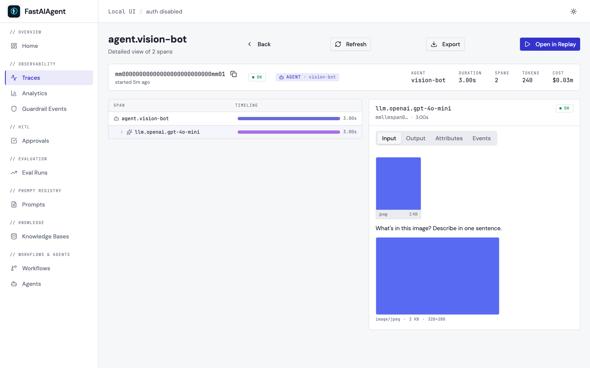

# Multimodal trace rendering

When a span's input or output carries images or PDFs, the Local UI renders
them inline next to the text — no more raw base64 blobs in the JSON. The
same view shows up on trace detail pages, the Replay comparison panes, and
the Fork modal so you can visually inspect the input before forking.



The screenshot above is captured by `scripts/capture-sprint1-screenshots.sh`
against the seeded `agent.vision-bot` trace. The Input tab shows two
multimodal surfaces stacked:

1. The **AttachmentGallery** tile (top) — fetched from the binary
   `GET /api/traces/{tid}/spans/{sid}/attachments/{aid}` endpoint. This is
   the SDK's persisted thumbnail (256 px JPEG, generated when the agent ran).
2. The **MixedContentView** (below) — the inline render of the actual
   `gen_ai.request.messages` content parts: a text block followed by the
   image. The image data is embedded in the message itself, exactly as the
   provider received it.

## What gets detected as multimodal

`MixedContentView` walks the input/output JSON and looks for content parts.
A part is treated as an image if it has any of:

- `type: "image"`, `type: "input_image"`, or `type: "image_url"`
- a `media_type` that starts with `image/`

A part is treated as a PDF if it has any of:

- `type: "input_pdf"`, `type: "pdf"`, or `type: "document"`
- `media_type: "application/pdf"`

Otherwise the JSON falls through to the existing `JsonViewer` so plain
text/JSON traces look identical to before this feature shipped.

## PDF rendering

PDFs render as a card with a paper icon, the filename, a page-count badge,
and the size:

```
📄 contract.pdf · 12 pages · 340 KB
```

Click the card to open the page renders in a modal. If the PDF was
processed in text-only mode (no page renders stored), the card shows a
"Text extracted" tag instead.

## Full-resolution data

By default the SDK stores only the 256-px thumbnail. Click an inline image
to open the full-size modal — when full bytes weren't captured the modal
falls back to the thumbnail and shows:

> Full resolution not stored. Enable `trace_full_images=True` in your SDK
> config to capture full-resolution data.

To capture full bytes set `trace_full_images=True` in your `SDKConfig` (or
via `FASTAIAGENT_TRACE_FULL_IMAGES=1`). The trade-off is database size:
full-res images can be 1–10 MB each.

## Replay & Fork integration

The MixedContentView renders in three places:

| Surface | When |
|---|---|
| Trace detail Input/Output tabs | Always — the primary surface |
| Replay comparison panes | Original vs Rerun, side-by-side, so visual differences are obvious |
| Fork modal Input preview | Inspect the image before forking and re-running |

## Backend test fixture

The screenshot above is captured against a seed function the e2e tests use
too:

```python
from fastaiagent.ui.attrs import extract_content_parts, has_multimodal_part

msg = [{
    "role": "user",
    "content": [
        {"type": "text", "text": "What's in this image?"},
        {"type": "image_url", "image_url": "https://...", "media_type": "image/jpeg"},
    ],
}]
parts = extract_content_parts(msg)
assert has_multimodal_part(msg)
```

The Python helper is the source of truth for which content shapes count
as multimodal — both the e2e tests and the frontend's renderer agree on
the same set of types.
