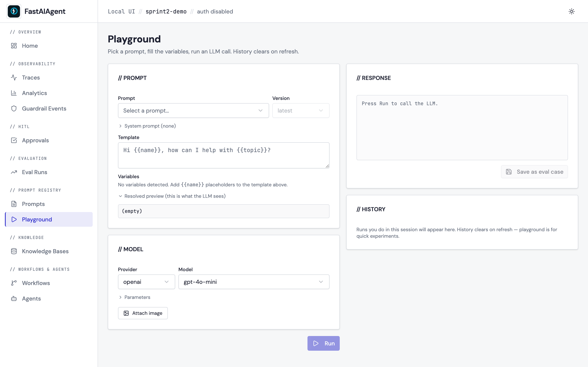
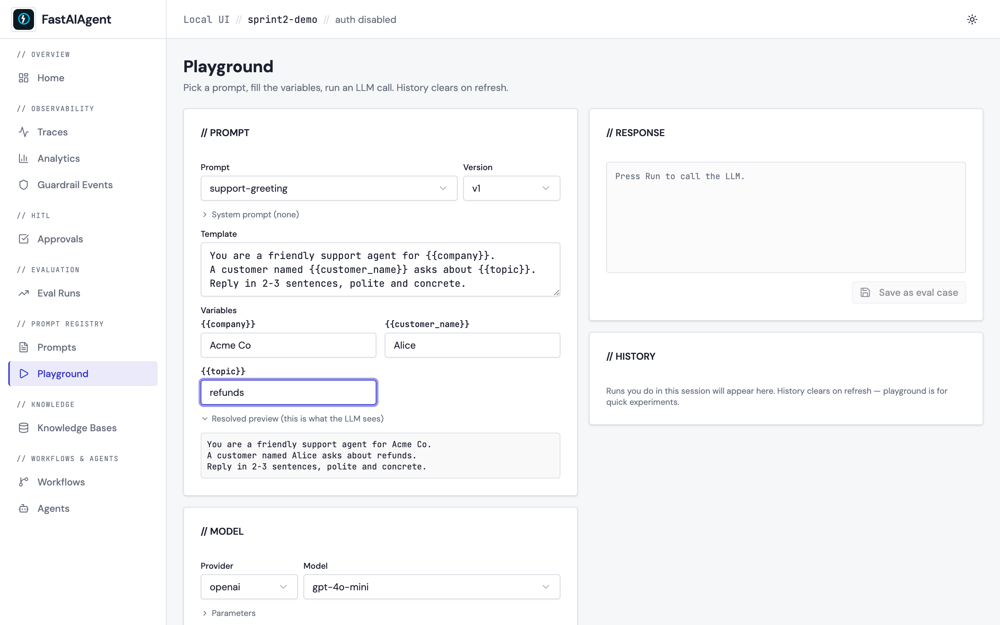
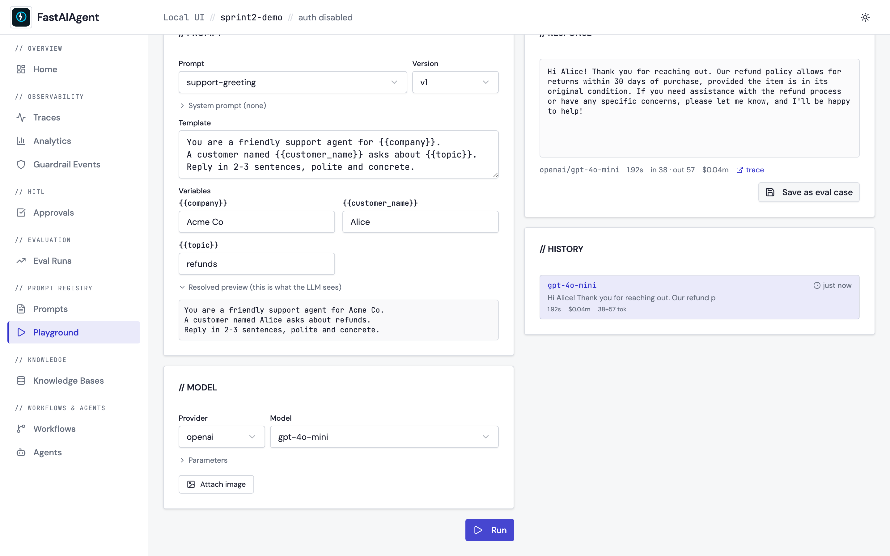

# Prompt Playground

The Playground is the iteration loop for prompts: pick a prompt from the
registry, fill in variables, choose a model, click Run, watch the response
stream back. Same SDK code path as production runs — same providers, same
cost tracking, same trace pipeline — minus writing a script.

Find it in the sidebar under `// PROMPT REGISTRY → Playground`, or jump
directly from any prompt detail page via the **Test in Playground** button.



## What it does

Two-panel layout. Left: configuration. Right: response.



**Configuration** (left)

- **Prompt + version**: dropdowns over your registered prompts. Picking one
  loads its template into the editor below.
- **System prompt**: optional collapsible textarea. When set, sent as a
  system message; when empty, the resolved template is sent on its own.
- **Template**: editable textarea with `{{variable}}` placeholders. Edit it
  in place for one-off experiments — saving a new version still happens
  through the Prompt Editor.
- **Variables**: one input field auto-generated per `{{name}}` detected in
  the template. Updates re-render live.
- **Resolved preview**: collapsible read-only block showing the exact final
  prompt the LLM will see.
- **Provider + model**: populated from the `/api/playground/models`
  endpoint. Providers without an API key in your environment are disabled
  with a tooltip telling you which env var to set.
- **Parameters**: temperature, top_p, max_tokens. These map directly to
  `LLMClient` config.
- **Attach image**: optional file picker (JPEG/PNG/GIF/WebP). The image is
  sent as a multimodal content part alongside the text — choose a vision
  model in the model selector first.



**Response** (right)

- **Streamed response**: tokens appear as they arrive via SSE, fed by
  `LLMClient.astream()`. The Run button becomes a Stop button while
  streaming — clicking it closes the SSE reader and keeps whatever has
  already arrived.
- **Metadata bar**: provider/model · latency · input/output tokens · cost
  (from `compute_cost_usd()`) · trace link.
- **History**: in-memory list of runs from this session. Click a row to
  reload its template + variables + response. Cleared on refresh.
- **Save as eval case**: appends a JSONL line to
  `./.fastaiagent/datasets/{name}.jsonl` so the case is immediately
  loadable via `Dataset.from_jsonl()` for guardrail / scorer evals.

## Tracing

Every Run emits a `playground.run` span tagged with
`fastaiagent.source = "playground"`, with the LLM call as a child span.
Open `/traces/{trace_id}` from the metadata bar (or filter Traces by
`source=playground`) to see the full request/response, token usage, and
provider call.

This means playground experiments share the same observability surface as
production runs — no separate dashboard.

## Endpoints

```
GET  /api/playground/models
POST /api/playground/run
POST /api/playground/stream    (text/event-stream)
POST /api/playground/save-as-eval
```

`/run` is the non-streaming fallback used by tests and any client that
can't read SSE. `/stream` is what the UI uses by default.

`/save-as-eval` body shape:

```json
{
  "dataset_name": "playground",
  "input": "Hi Alice, how can I help with refunds?",
  "expected_output": "I'd be happy to help with your refund request…",
  "system_prompt": "You are a support agent.",
  "model": "gpt-4o-mini",
  "provider": "openai"
}
```

`dataset_name` is restricted to `[A-Za-z0-9_-]+` so the path can't escape
the datasets directory.

## API key handling

API keys are never entered in the UI. The Playground reads them from your
environment (`OPENAI_API_KEY`, `ANTHROPIC_API_KEY`) the same way every
other SDK call does. The provider dropdown disables options with no key
configured and tells you which variable to set.

## When to use which

| Scenario | Use |
|---|---|
| Tweak a prompt, see immediate effect | Playground |
| Compare two prompts on a dataset | Eval Runs |
| Debug a specific failed trace | Trace detail / Replay |
| Try a vision model with one image | Playground (attach image) |
| Stress-test guardrails on many inputs | Custom script + eval framework |

The Playground is for the inner loop. The eval framework is for the
outer loop.
