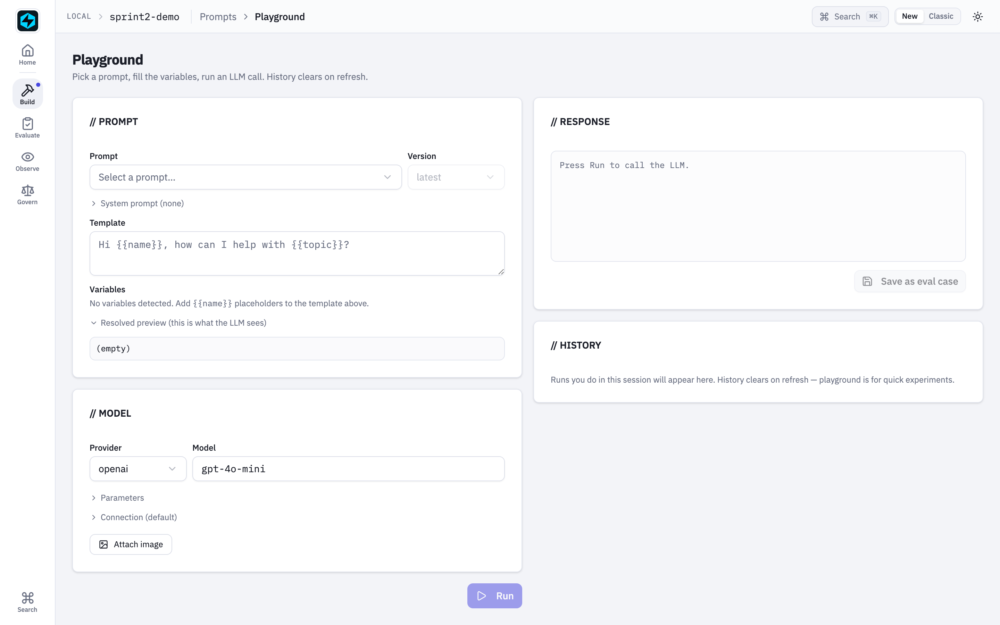
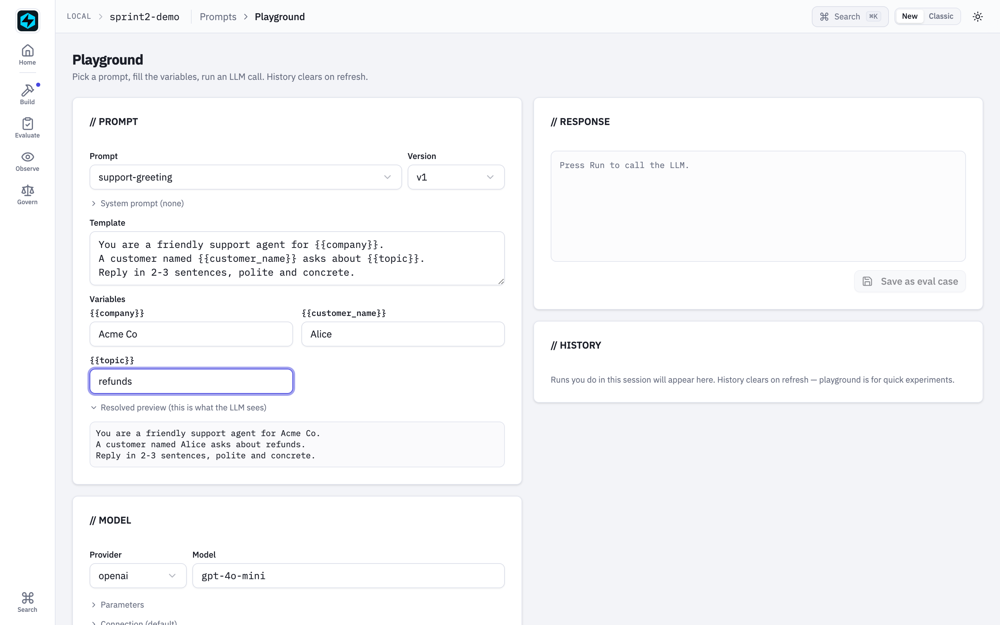
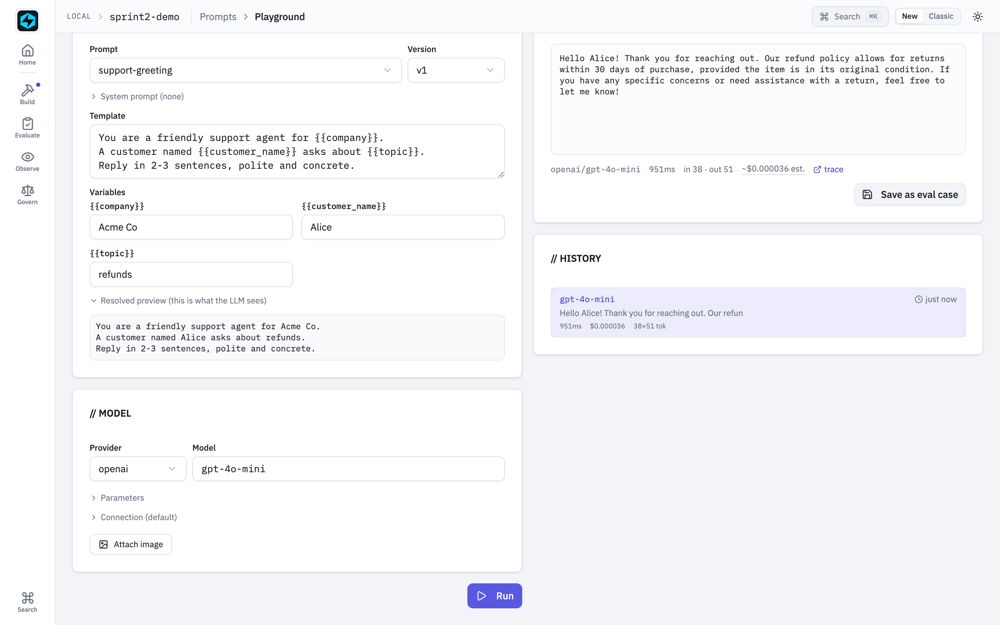

# Prompt Playground

The Playground is the iteration loop for prompts: pick a prompt from the
registry, fill in variables, choose a model, click Run, watch the response
stream back. Same SDK code path as production runs — same providers, same
cost tracking, same trace pipeline — minus writing a script.

Find it in the sidebar under `// PROMPT REGISTRY → Playground`, or jump
directly from any prompt detail page via the **Test in Playground** button.



## What it does

Two-panel layout. Left: configuration. Right: response.



**Configuration** (left)

- **Prompt + version**: dropdowns over your registered prompts. Picking one
  loads its template into the editor below.
- **System prompt**: optional collapsible textarea. When set, sent as a
  system message; when empty, the resolved template is sent on its own.
- **Template**: editable textarea with `{{variable}}` placeholders. Edit it
  in place for one-off experiments — saving a new version still happens
  through the Prompt Editor.
- **Variables**: one input field auto-generated per `{{name}}` detected in
  the template. Updates re-render live.
- **Resolved preview**: collapsible read-only block showing the exact final
  prompt the LLM will see.
- **Provider + model**: populated from the `/api/playground/models`
  endpoint. Providers without an API key in your environment are disabled
  with a tooltip telling you which env var to set. The provider list covers
  every built-in (`openai`, `anthropic`, `ollama`) plus every preset
  registered with `fastaiagent.llm.providers.register_provider` (12 ship
  in the box — Gemini, Groq, OpenRouter, DeepSeek, Together, Fireworks,
  Perplexity, Mistral, LM Studio, vLLM, SambaNova, Cerebras). See
  [LLM providers](../llm/providers.md) for the full table.

    The **model** field is a combobox, not a fixed list: pick a suggestion
    or type any model id the provider accepts. Suggestions are only
    suggestions — `LLMClient` takes whatever the upstream API knows, so a
    model released after your SDK version is always reachable. To change
    the suggestions themselves, see
    [Customising the model list](#customising-the-model-list).

- **Parameters**: temperature, top_p, max_tokens — mapped directly onto
  `LLMClient` config.

    temperature and top_p are **off by default** and read `auto` until you
    switch them on, which means they are not sent at all and the provider
    applies its own default. This is deliberate: Anthropic rejects
    `temperature` and `top_p` together (`400 "cannot both be specified"`),
    and Claude 5 rejects `top_p` outright. Turning both on for an Anthropic
    model will fail — that is the provider's rule, not ours.
- **Attach image**: optional file picker (JPEG/PNG/GIF/WebP). The image is
  sent as a multimodal content part alongside the text — choose a vision
  model in the model selector first.



**Response** (right)

- **Streamed response**: tokens appear as they arrive via SSE, fed by
  `LLMClient.astream()`. The Run button becomes a Stop button while
  streaming — clicking it closes the SSE reader and keeps whatever has
  already arrived.
- **Metadata bar**: provider/model · latency · input/output tokens ·
  estimated cost · trace link.

    Cost is shown as `~$x est.` because it is computed from **public list
    prices** (`compute_cost_usd()`). It cannot know about negotiated or
    committed-use discounts, Amazon Bedrock / Google Vertex partner rates,
    the Batch API's 50% reduction, or prompt-cache multipliers (cache reads
    bill at roughly 0.1x, writes at 1.25–2x, and the token counts here don't
    separate cached from uncached input). Treat it as an order-of-magnitude
    sanity check. If your organisation has its own rates, set them once —
    see [Customising the model list](#customising-the-model-list) — and
    every cost figure in the UI uses them, not just the Playground's.
- **History**: in-memory list of runs from this session. Click a row to
  reload its template + variables + response. Cleared on refresh.
- **Save as eval case**: appends a JSONL line to
  `./.fastaiagent/datasets/{name}.jsonl` so the case is immediately
  loadable via `Dataset.from_jsonl()` for guardrail / scorer evals. It
  appends, so repeated saves build a dataset up; the case also appears
  straight away in the Datasets page.

    !!! warning "**Run eval** on that dataset needs a registered agent"
        With no agent selected, `run-eval` scores each input against an
        *identity function* — it echoes the input back, so a case passes only
        where `expected_output` equals `input`. On a Playground-saved case that
        is never true, and you'll see 0%. That is a dataset sanity check, not a
        model evaluation, and the UI labels the result accordingly.

        `fastaiagent ui` registers no runners, so a real eval means driving the
        app yourself with `build_app(runners=[...])` and passing `agent_name` —
        or running the eval framework directly against the JSONL.

## Tracing

Every Run emits a `playground.run` span tagged with
`fastaiagent.source = "playground"`, with the LLM call as a child span.
Open `/traces/{trace_id}` from the metadata bar to see the full
request/response, token usage, and provider call.

That tag is surfaced on every row of the Traces list as `source`, and
`GET /api/traces?source=playground` filters to just experiments — so a
Playground run is distinguishable from production traffic rather than sitting
anonymously in the same list. `source` is free text: anything stamped on a root
span as `fastaiagent.source` shows up and filters the same way.

This means playground experiments share the same observability surface as
production runs — no separate dashboard.

## Endpoints

```
GET  /api/playground/models
POST /api/playground/run
POST /api/playground/stream    (text/event-stream)
POST /api/playground/save-as-eval
```

`/run` is the non-streaming fallback used by tests and any client that
can't read SSE. `/stream` is what the UI uses by default.

`/save-as-eval` body shape:

```json
{
  "dataset_name": "playground",
  "input": "Hi Alice, how can I help with refunds?",
  "expected_output": "I'd be happy to help with your refund request…",
  "system_prompt": "You are a support agent.",
  "model": "gpt-4o-mini",
  "provider": "openai"
}
```

`dataset_name` is restricted to `[A-Za-z0-9_-]+` so the path can't escape
the datasets directory.

## Customising the model list

Model ids rot on the provider's schedule, not ours — providers decommission
them whenever they like, and a list baked into a released wheel can't keep
up. Two escape hatches, so you're never blocked:

1. **Type it.** The model field accepts free text. Anything the upstream API
   knows will run, listed or not. Nothing to configure.
2. **Change the suggestions** with a `models.json` file, for when you want
   your team to see the right list by default.

The file is read from `$FASTAIAGENT_MODEL_CATALOG` if set, otherwise
`.fastaiagent/models.json` beside your `local.db`:

```json
{
  "anthropic": {
    "models": ["claude-opus-5", "claude-sonnet-5", "claude-haiku-4-5"]
  },
  "openai": ["gpt-5.2", "gpt-4o-mini"],
  "pricing": {
    "claude-opus-5": { "input_per_1m": 4.00, "output_per_1m": 20.00 },
    "gpt-4o-mini":   { "input_per_1m": 0.12, "output_per_1m": 0.48 }
  }
}
```

- A provider's entry may be an object with `models` (and optionally
  `env_var`), or just a bare list of model ids.
- Listed providers **replace** the shipped list; unlisted ones keep theirs.
- `pricing` is a reserved key, not a provider. Keys are model-id prefixes
  matched longest-first, exactly like the built-in table, and they apply to
  **every** cost figure in the UI — traces, analytics, evals, cost breakdown,
  trace export — not only the Playground. This is how you make the numbers
  match your actual contract.
- Only providers the SDK already knows can be overridden. A brand-new
  provider needs a `base_url` and wire format, so it goes through
  `fastaiagent.llm.providers.register_provider` instead.
- A malformed file never breaks the picker: it is logged and ignored, and
  the shipped defaults are used. Same for a single bad entry inside an
  otherwise-valid file.

Restart the UI after editing, the same as for a new API key.

!!! note "Presets registered in your own code aren't visible to the UI"
    `fastaiagent ui` starts a standalone server that does not import your
    project, so a `register_provider(...)` call in your application code
    won't appear in the dropdown. Use `models.json` (or just type the model
    id) to reach it from the Playground.

## Models behind an AI gateway

Most large orgs don't let apps call OpenAI or Anthropic directly — models sit
behind an internal OpenAI-compatible gateway (LiteLLM, a vLLM proxy, an APIM
front door) on a private URL, reached with a bearer token. The **Connection**
panel in the `// MODEL` card covers that:

- **Endpoint** — overrides the provider's base URL. `http`/`https` only; other
  schemes are rejected. Leave empty for the provider default.
- **Token** — a credential for **this run only**.

Pick the `custom` provider for a plain OpenAI-compatible gateway, type the
model id the gateway exposes, and fill both fields.

The three settings do different jobs, and it's worth being precise:

| Setting | Decides |
|---|---|
| **Provider** | the *wire format* — how the request is shaped (OpenAI-compatible, Anthropic Messages, native Gemini) |
| **Endpoint** | *where* the request goes |
| **Token** | *what authenticates* it at that endpoint |

So `provider` still matters when you supply an endpoint — it's how the body is
built — but the credential comes from the Token field, not the provider's env
var.

!!! danger "A custom endpoint must bring its own token"
    Normally the SDK falls back to the provider's env var when no key is
    passed. That is right when the endpoint *is* the provider, and a key-leak
    the moment it isn't: with an Endpoint set and the Token box empty, your
    real `OPENAI_API_KEY` would be sent to whatever host you typed — a typo'd
    or hostile URL is enough.

    The Playground therefore **refuses** a run that overrides the endpoint
    without a token whenever a provider key is configured, and tells you which
    variable was at risk. Enter the endpoint's token, or clear the Endpoint
    field to call the provider directly. (Where no provider key is configured
    there is nothing to leak, so a local server on a custom port works with the
    Token box empty.)

**The token is deliberately transient.** It is not written to `local.db`, not
saved to `localStorage`, not logged (the server logs only provider, model, and
a correlation id), and not echoed in any response — a page reload clears it.
That is the point: gateway tokens are usually short-lived and SSO-issued, so an
env var read once at server start would mean restarting the UI on every
rotation.

It does still travel from your browser to the server in the request body. On
the default loopback bind that never leaves your machine. If you started the UI
with `--insecure-bind` on a non-loopback host, it crosses the network over
plain HTTP — the panel warns you, and an environment variable is the better
choice there.

For a credential you want to persist, use an env var instead, and point the
provider at a different variable name with `env_var` in
[`models.json`](#customising-the-model-list) if the default doesn't suit.

!!! note "Local servers need no token"
    `ollama`, `lmstudio` and `vllm` are never key-gated — you run them, so
    there is usually nothing to authenticate against. (Before 1.53.0 LM Studio
    and vLLM were shown as disabled unless you invented a dummy
    `LMSTUDIO_API_KEY` / `VLLM_API_KEY`.) Point **Endpoint** at the right host
    and port if yours isn't on the default.

## API key handling

API keys are never entered in the UI. The Playground reads them from your
environment (`OPENAI_API_KEY`, `ANTHROPIC_API_KEY`) the same way every
other SDK call does. The provider dropdown disables options with no key
configured and tells you which variable to set.

When a provider call fails, the UI shows a generic `LLM call failed.`
rather than the provider's own error — those can carry request ids, account
ids, and partial key prefixes. The full text is written to the **server
log** under the correlation id shown beneath the error, so grep the terminal
running `fastaiagent ui` for that id to see what actually went wrong.

## When to use which

| Scenario | Use |
|---|---|
| Tweak a prompt, see immediate effect | Playground |
| Compare two prompts on a dataset | Eval Runs |
| Debug a specific failed trace | Trace detail / Replay |
| Try a vision model with one image | Playground (attach image) |
| Stress-test guardrails on many inputs | Custom script + eval framework |

The Playground is for the inner loop. The eval framework is for the
outer loop.
