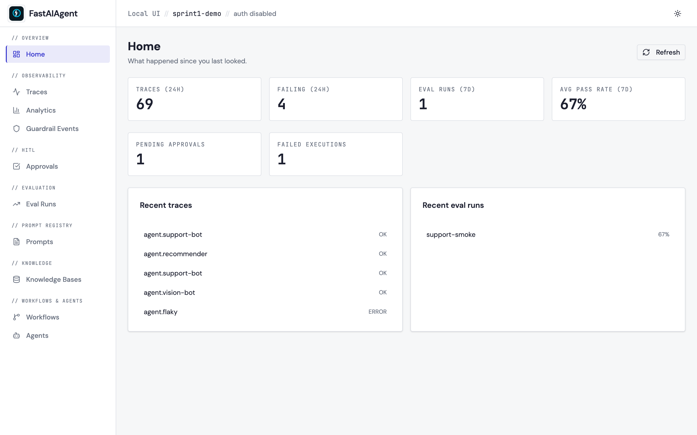

# Project scoping

The Local UI scopes every read and write by a `project_id` so multiple
projects can share the same database (e.g. a Postgres backend) without
cross-contamination. The active project is shown in the header
breadcrumb.



In the screenshot above, the breadcrumb reads
`Local UI // sprint1-demo // auth disabled` — `sprint1-demo` is the
project the UI is scoped to. Every trace, agent, workflow, checkpoint,
prompt, eval run, and guardrail event in the visible cards is stamped
with the same `project_id`.

## Lifecycle

The project_id comes from `./.fastaiagent/config.toml`. It's created
**on first execution** (not on import) — running an Agent or a Chain
in a fresh directory creates:

```
./.fastaiagent/
├── config.toml      # project_id, created_at, sdk_version
├── .gitignore       # ignores local.db so the DB doesn't get committed
└── local.db         # SQLite, the trace + checkpoint store
```

`config.toml` looks like:

```toml
project_id = "my-project"
created_at = "2026-04-29"
sdk_version = "1.2.0"
```

The `project_id` defaults to the current directory's name. Edit
`config.toml` to choose a different one. Multiple project directories
can coexist:

```
/projects/refund-bot/.fastaiagent/config.toml   → project_id = "refund-bot"
/projects/weather-bot/.fastaiagent/config.toml  → project_id = "weather-bot"
```

Both can point at the same Postgres backend; each `fastaiagent ui`
session shows only that project's data.

`import fastaiagent` is **side-effect-free** — it never touches the
filesystem. Folder and config creation happen lazily, on the first
SDK call that actually writes a record.

## Opt out

To skip local storage entirely:

```python
agent = fa.Agent(name="support", llm=llm, trace=False)
```

No spans are written, no `.fastaiagent/` directory is created.

## What gets stamped

Migration v4 (run automatically on `init_local_db`) adds
`project_id TEXT NOT NULL DEFAULT ''` to:

| Table | Stamped by |
|---|---|
| `spans` | `LocalStorageProcessor` (every OTel span export) |
| `checkpoints` | `SQLiteCheckpointer.put` |
| `pending_interrupts` | `SQLiteCheckpointer.record_interrupt` |
| `idempotency_cache` | `SQLiteCheckpointer.put_idempotent` |
| `trace_attachments` | `save_attachment()` |
| `prompts` / `prompt_versions` | `LocalStorageBackend.save_prompt` |
| `eval_runs` / `eval_cases` | `EvalResults.save_to_local_db` |
| `guardrail_events` | `record_guardrail_event` |

Existing rows pre-migration are backfilled with the current
`project_id` so legacy data carries through.

## What gets filtered

**Every** Local UI read endpoint that surfaces project-owned data
filters by `project_id`. The list below is exhaustive — a parameterised
leakage test in
[`tests/e2e/test_project_scoping.py`](https://github.com/fastaifoundry/fastaiagent-sdk/blob/main/tests/e2e/test_project_scoping.py)
asserts that none of these reveal another project's data:

- Traces — `GET /api/traces`, `GET /api/traces/{id}`,
  `GET /api/traces/{id}/spans`, `GET /api/traces/{id}/scores`,
  `GET /api/traces/{id}/spans/{span_id}/attachments` (+ binary stream),
  `GET /api/traces/threads`, `GET /api/threads/{thread_id}`,
  `GET /api/traces/compare`
- Agents — `GET /api/agents`, `GET /api/agents/{name}`,
  `GET /api/agents/{name}/tools`
- Workflows — `GET /api/workflows`, `GET /api/workflows/{type}/{name}`
- Analytics — `GET /api/analytics`, `GET /api/analytics/costs`
- Overview — `GET /api/overview`
- Prompts — `GET /api/prompts`, `GET /api/prompts/{slug}`,
  `GET /api/prompts/{slug}/versions`,
  `GET /api/prompts/{slug}/lineage`
- Evals — `GET /api/evals`, `GET /api/evals/{run_id}`,
  `GET /api/evals/trend`, `GET /api/evals/compare`
- Guardrails — `GET /api/guardrails`
- Executions — `GET /api/pending-interrupts`,
  `GET /api/executions/{id}`,
  `GET /api/executions/{id}/idempotency-cache`,
  `POST /api/executions/{id}/resume`
- KB lineage — `GET /api/kb/{name}/lineage`

Per-id endpoints (single trace, single eval run, single prompt,
single execution) return **404** for cross-project lookups so a
probing caller can't even confirm the resource exists in another
project. List endpoints return 200 with no rows belonging to other
projects.

When `project_id` is the empty string the filter is skipped — this is
the **legacy / unscoped mode** used by tests and pre-v4 databases.
Real users running `fastaiagent ui` always get the strict filter
because `ProjectConfig.get_project_id()` resolves a non-empty id.

## Multiple projects, one Postgres

Two directories pointing at the same Postgres URL with different
`project_id` values:

```bash
# in /projects/refund-bot
$ fastaiagent ui
# Local UI // refund-bot // auth disabled

# in /projects/weather-bot (separate terminal)
$ fastaiagent ui
# Local UI // weather-bot // auth disabled
```

Each UI shows only its own data. Traces, checkpoints, and the
breadcrumb are all scoped.

For teams that want **stricter** isolation (separate Postgres schemas,
separate permissions), the existing
`PostgresCheckpointer(conn, schema="fastaiagent_refund_bot")` option
remains. Project scoping via `project_id` and schema-level isolation
are complementary, not competing.

## Tests

The leakage suite at
[`tests/e2e/test_project_scoping.py`](https://github.com/fastaifoundry/fastaiagent-sdk/blob/main/tests/e2e/test_project_scoping.py)
seeds two projects in one DB and asserts each UI client sees only its
own rows on `/api/traces`, `/api/traces/{id}`, and `/api/agents`. It
also covers:

- the lifecycle (config.toml + .gitignore creation on first call)
- `import fastaiagent` not touching the filesystem
- `set_project_id()` override for tests
- the v4 migration adding columns to all 10 project-scoped tables
- backwards-compat unscoped mode

## API surface

For programmatic use:

```python
from fastaiagent._internal.project import (
    get_project_id,
    set_project_id,
    load_or_create,
)

# Read the active project
print(get_project_id())   # "my-project"

# Override at runtime (tests use this for isolation)
set_project_id("test-fixture")

# Force the .fastaiagent/ lifecycle
config = load_or_create()
print(config.project_id, config.created_at, config.sdk_version)
```

## Verify it end-to-end

[`scripts/verify_project_scoping.py`](https://github.com/fastaifoundry/fastaiagent-sdk/blob/main/scripts/verify_project_scoping.py)
spins up two project directories sharing one SQLite DB, runs a real
``Agent.run()`` in each, then boots two scoped FastAPI servers and
asserts no cross-project string ever appears in the other project's
response. Run it after a fresh checkout:

```bash
python scripts/verify_project_scoping.py
# ✅ ALL VERIFICATIONS PASSED — project scoping holds end-to-end.
```

The script is the canonical "does this actually work?" demo and runs
against the real SDK + real FastAPI + real SQLite (no mocks).
