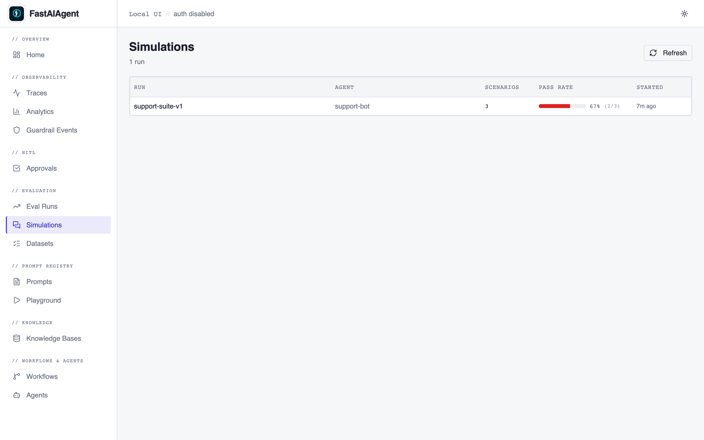
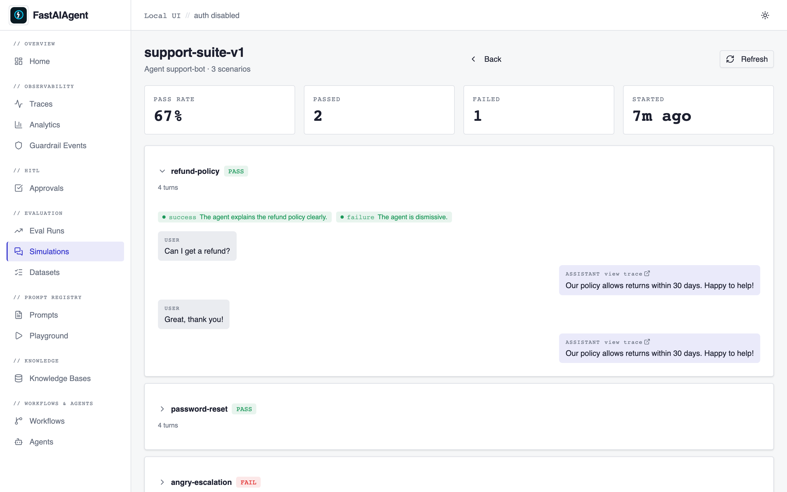

# Simulations

The Simulations surface shows multi-turn [agent simulation](../simulation/index.md)
runs created by `simulate()` — a list of runs with pass-rate, and a per-run
detail view with each scenario's transcript and per-criterion verdicts.

Find it in the sidebar under `// EVALUATION → Simulations`. Runs appear here
automatically whenever you call `simulate()` (persistence is on by default).

## List page (`/simulations`)

Every `simulate()` run, newest first, with:

- the run name (or id) and the agent under test,
- the scenario count,
- a **pass-rate bar** (green ≥ 90%, amber ≥ 70%, red otherwise),
- when it started.

Click a row to open the detail.

## Detail page (`/simulations/{run_id}`)

A header strip with pass rate, passed / failed counts, and start time, then one
**card per scenario**. Each card shows PASS / FAIL at a glance; expand it to see:

- **per-criterion chips** — green when the desired state holds (success
  criterion met, or failure criterion absent), red otherwise; hover for the
  judge's reason;
- the **transcript** as chat bubbles (user on the left, assistant on the right),
  with a **"view trace"** link on each assistant turn that deep-links to the
  full trace at `/traces/{trace_id}`.

Because each agent turn nests under the simulation's trace, you can jump from a
failing scenario straight into the trace — and from there into Agent Replay — to
debug exactly what the agent did.
