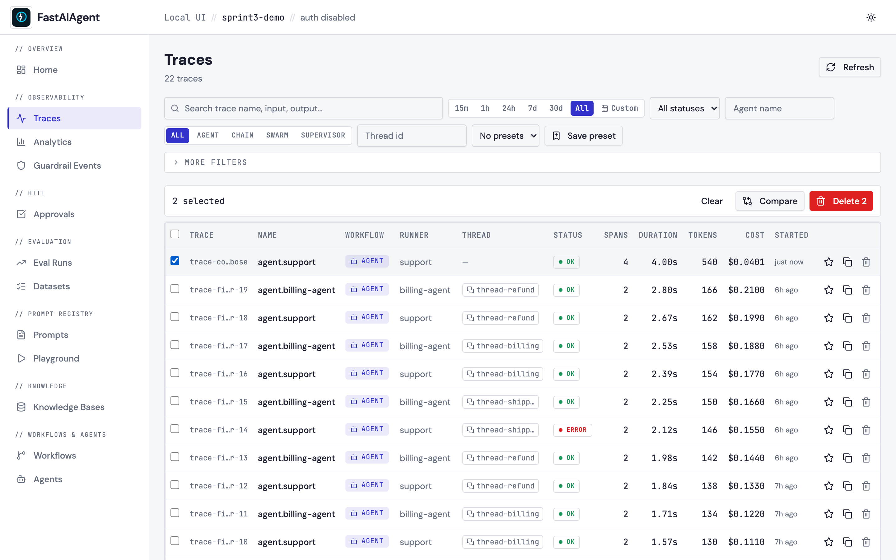
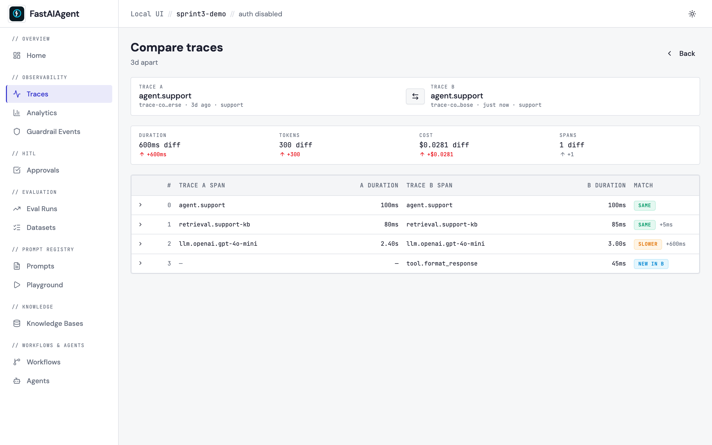
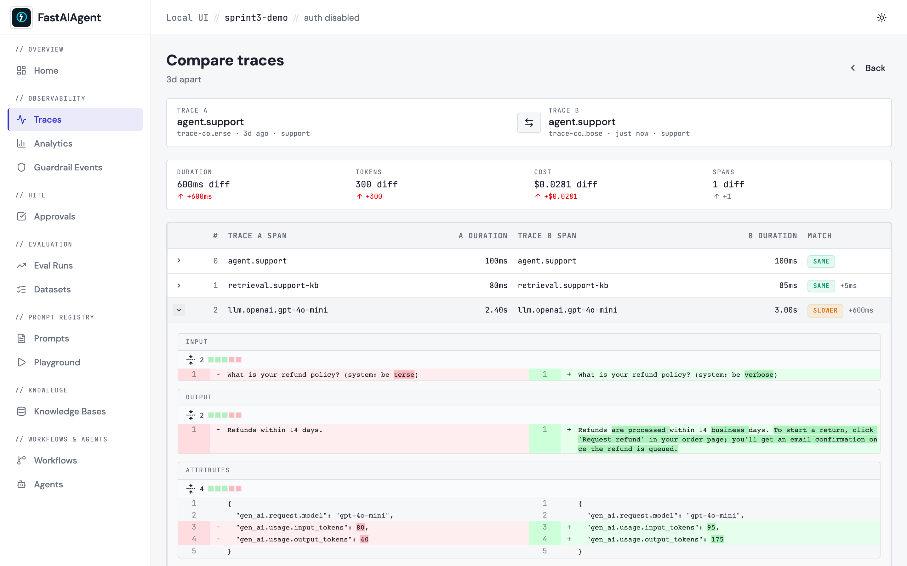
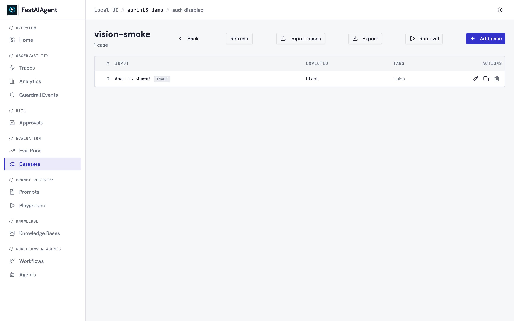

# Trace Comparison

Side-by-side comparison of any two traces, with summary deltas, an
aligned span table, and per-span input/output/attributes diffs. This
generalises Replay's "original vs forked" view so you can compare *any*
two traces — Monday's run vs Friday's run, prompt A vs prompt B, agent
v1 vs agent v2.

Open it via:

- **Traces list** → check two rows → **Compare** appears in the action
  bar.
- **Trace detail** → **Compare with…** → pick a second trace from the
  modal.
- Direct URL: `/traces/compare?a=<trace_id_a>&b=<trace_id_b>` — bookmark
  or share. Refresh, swap, and back/forward all preserve state.



## What you see



**Header**

- Trace A and Trace B labels (id · agent · time-ago) on either side.
- A **Swap** button that flips left/right by toggling the URL query.
- A "*N* apart" badge — the elapsed time between the two trace
  start-times.

**Summary delta cards** — Duration · Tokens · Cost · Spans, each
showing the absolute B − A delta. Lower-is-better metrics turn green
when B is faster/cheaper, red when B is worse. The Spans cell stays
neutral — more spans isn't intrinsically wrong.

**Span alignment table** — one row per pair of spans. Each row is one
of:

| Match | Meaning |
|---|---|
| `same` | Same name, similar duration, identical output. |
| `slower` / `faster` | Same span, duration differs by >500ms or >20%. |
| `different output` | Same name and timing, but the captured output text differs. |
| `new in A` / `new in B` | The span only exists on one side. |

Click any row to expand it.



The expanded view shows three side-by-side diff blocks:

- **Input** — `gen_ai.prompt` (LLM spans), `tool.input` (tool calls),
  or the generic `input` attribute.
- **Output** — `gen_ai.response.text` / `gen_ai.completion`,
  `tool.output`, or the generic `output` attribute.
- **Attributes** — every other key, so metadata changes (model, status,
  custom tags) surface even when payloads match.

All diffs use [`react-diff-viewer-continued`](https://github.com/aeolun/react-diff-viewer-continued)
in word-mode split view, with values JSON-stringified to a canonical form
before diffing — so reordered keys don't trip a false positive.

For multimodal cases (image inputs), the image attachments render
side-by-side rather than text-diffed:



## How alignment works

Two passes, deterministic:

1. **Match by span name first.** If both traces have a span named
   `retrieval.support-kb`, they line up regardless of position. When a
   name appears multiple times on one side, occurrences pair in order
   (first-A with first-B, second-A with second-B, etc).
2. **Surface the rest.** Spans only in A become `new in A` rows; spans
   only in B become `new in B`. They're appended to the table after the
   matched rows, in their original trace order.

The `index` column is the row's position in the alignment table — not
the original span position in either trace.

This handles the common cases cleanly: same agent with a prompt change
(matching spans, different outputs), an agent with an added or removed
tool (extra/missing spans line up correctly), and completely different
agents (mostly unmatched rows).

## Endpoint

```
GET /api/traces/compare?a=<trace_id>&b=<trace_id>
```

Response:

```json
{
  "trace_a": { "trace_id": "...", "name": "...", "duration_ms": 2460, ... , "spans": [...] },
  "trace_b": { ... same shape ... },
  "alignment": [
    {
      "index": 0,
      "span_a": { "span_id": "s1", "name": "retrieval.support-kb", "duration_ms": 5 },
      "span_b": { "span_id": "s2", "name": "retrieval.support-kb", "duration_ms": 5 },
      "match": "same",
      "delta_ms": 0
    },
    {
      "index": 1,
      "span_a": { "span_id": "s3", "name": "llm.openai.gpt-4o", "duration_ms": 2400 },
      "span_b": { "span_id": "s4", "name": "llm.openai.gpt-4o", "duration_ms": 2900 },
      "match": "slower",
      "delta_ms": 500
    }
  ],
  "summary": {
    "duration_delta_ms": 660,
    "tokens_delta": 175,
    "cost_delta_usd": 0.03,
    "spans_delta": 2,
    "time_apart_seconds": 259200
  }
}
```

The alignment is computed server-side, so the frontend never has to
implement matching logic — every client gets the same view.

## When to use which

| Scenario | Use |
|---|---|
| "Why did Monday's run behave differently from Friday's?" | Trace Comparison |
| "How does prompt A compare to prompt B on the same input?" | Trace Comparison |
| "I forked one trace by editing a step — show me the rerun diff" | Replay |
| "Compare aggregate scorer pass-rates across two eval runs" | Eval Runs → Compare |

The Trace Comparison view is the trace-level peer of the existing
Eval Runs Compare and Replay diff — same observability surface, broader
scope.

## Example

The example script [`examples/52_trace_compare.py`](https://github.com/fastaifoundry/fastaiagent-sdk/blob/main/examples/52_trace_compare.py)
runs the same agent twice with two different system prompts (terse vs
verbose), then prints the URL of the resulting comparison view.
