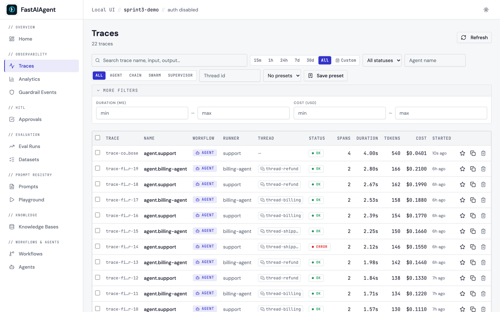
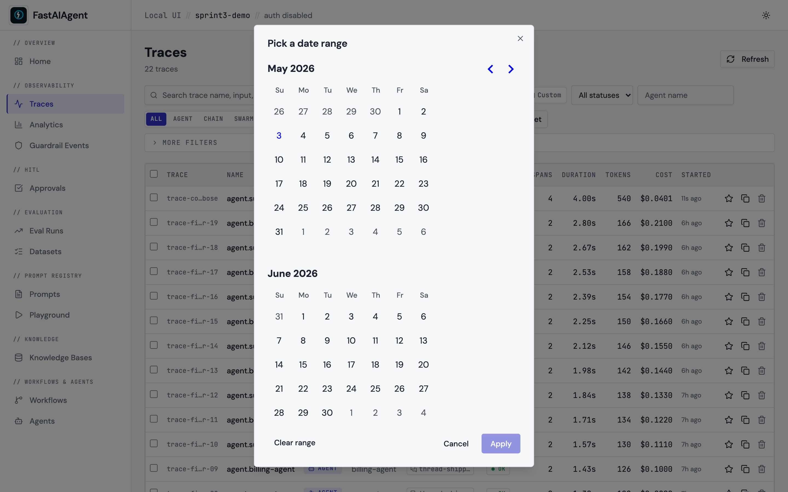
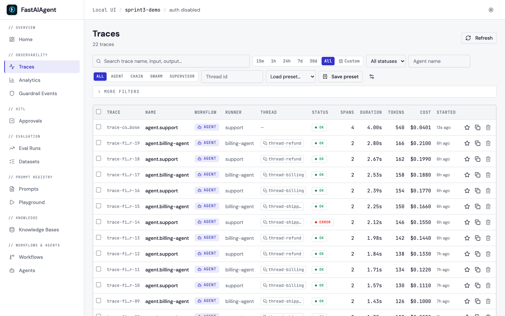

# Richer Trace Filtering

The Traces page filter bar is the entry point for finding any single
trace in a production dataset. Sprint 3 makes it production-grade:
full-text search across LLM prompts and responses (FTS5-indexed), a
custom date range picker on top of the quick-range buttons,
duration/cost range sliders, saved presets, and URL-state filters so
links survive refresh and sharing.



## What's new in Sprint 3

| Enhancement | Where to look |
|---|---|
| **30d** quick-range button | Right of the existing 7d button |
| **Custom** date-range picker | Right of the quick ranges; opens a 2-month calendar |
| **More filters** disclosure | New row below the bar — duration / cost ranges |
| **Save preset** + presets dropdown | Right of the runner-type pills |
| **URL state** | Every active filter mirrors into `?key=value` query params |
| **Full-text search** | Input search now goes through SQLite FTS5 — sub-second on 100k+ spans |

## Full-text search

The search box used to LIKE-match the trace name and the raw span JSON
blob. Sprint 3 routes it through a dedicated `span_fts` virtual table
that indexes two extracted fields per span:

- `gen_ai.prompt` — the LLM input text.
- `gen_ai.response.text` (with `gen_ai.completion` and the
  `fastaiagent.*` namespaced variants as fallbacks) — the LLM output.

The migration creates the table, three triggers (insert / update /
delete) keep it in sync as new spans land, and a one-shot
`INSERT … SELECT` backfills any pre-existing rows. Result: a search for
*"refund policy"* on a 1k-span DB returns in well under a second; the
Sprint 3 test suite enforces a < 1.5 s budget at that scale as a
regression guard.

Multiple tokens AND together (FTS5 default). Apostrophes, asterisks,
and quote characters are escaped so user input can't break the query
parser. If the SQLite build was compiled without FTS5 (rare), the
endpoint falls back to the LIKE-on-JSON path automatically — no
configuration toggle.

## Date range picker



The fixed quick-range buttons (15m, 1h, 24h, 7d, **30d**, All) stay
for the common cases. **Custom** opens a two-month calendar; on
**Apply** the picker sets `since` to the start of the chosen "from"
day and `until` to the end of the chosen "to" day, both as ISO 8601
timestamps. **Clear range** in the picker drops both. Powered by
`react-day-picker`.

## Duration and cost range filters

Folded under **More filters** so the main bar stays clean. The toggle
shows a count of active filters when something is set so you don't
forget about a hidden constraint:

```
▼ More filters (2 active)
   Duration (ms): [min ___] — [max ___]
   Cost (USD):    [min ___] — [max ___]
```

Both ranges are inclusive on both ends. They apply post-aggregation in
the existing `list_traces` route (the per-trace summary is already
computed for the row payload, so adding the cap is free).

## Saved presets



A developer who frequently checks "Agent traces from the last 7 days
with errors" shouldn't have to re-apply those filters every time.

- **Save preset** captures every active filter dimension (search, time
  range, status, agent, runner type, thread id, duration, cost) and
  asks for a name. Pagination is intentionally excluded so loading a
  preset always starts on page 1.
- The **dropdown** to its left lists the project's presets. Picking
  one applies its filters atomically.
- The **gear** icon (visible once you have at least one preset) opens
  the manage dialog where you can delete presets you no longer need.

Presets are project-scoped via `saved_filters.project_id` (added in
the v6 migration on top of the v1 table; no parallel `filter_presets`
table). They're personal local-UI state — not synced to Platform, not
shared across users. The dropdown defaults to "no value" after each
selection so picking the same preset again still triggers a refresh.

## URL state

Every active filter mirrors into the URL query string:

```
/traces?q=refund&status=ERROR&runner_type=agent&since=2026-04-26T00%3A00%3A00.000Z&min_duration_ms=1000&max_cost=0.5
```

This buys you four things at once:

1. **Bookmarkable** — save "error traces this week" as a browser
   bookmark.
2. **Shareable** — paste the URL to a colleague.
3. **Browser navigation** — back/forward preserve filter state.
4. **Refresh-safe** — F5 doesn't lose your filters.

The page uses React Router's `useSearchParams` and writes with
`{ replace: true }` so the URL doesn't accumulate a history entry per
keystroke.

## Endpoints

```
GET  /api/traces?q=…&status=…&since=…&until=…&min_duration_ms=…&max_duration_ms=…&min_cost=…&max_cost=…&min_tokens=…&runner_type=…&thread_id=…&agent=…&page=…&page_size=…
```

`q` uses FTS5 when the v6 schema is present, otherwise falls back to
LIKE-on-JSON. `max_cost` is new in Sprint 3.

```
GET    /api/filter-presets                    → FilterPreset[]
POST   /api/filter-presets                    → 201 FilterPreset
PATCH  /api/filter-presets/{id}               → 200 FilterPreset (rename / replace filters)
DELETE /api/filter-presets/{id}               → 204
```

All preset endpoints are project-scoped via the standard `AppContext`
plumbing — same-Postgres-multi-project setups can't see across
projects.

## Schema additions

v6 migration (run automatically by `init_local_db()`):

```sql
CREATE VIRTUAL TABLE IF NOT EXISTS span_fts USING fts5(
    trace_id, span_id UNINDEXED, name, input_text, output_text,
    tokenize = 'unicode61'
);

CREATE TRIGGER spans_fts_ai AFTER INSERT ON spans BEGIN
    INSERT INTO span_fts(...) VALUES (
        new.trace_id, new.span_id, new.name,
        json_extract(new.attributes, '$."gen_ai.prompt"'),
        json_extract(new.attributes, '$."gen_ai.response.text"')
    );
END;
-- (similar AFTER DELETE / AFTER UPDATE triggers omitted for brevity)

INSERT INTO span_fts(...) SELECT ... FROM spans;  -- bulk backfill

ALTER TABLE saved_filters ADD COLUMN project_id TEXT NOT NULL DEFAULT '';
CREATE INDEX idx_saved_filters_project ON saved_filters(project_id);
```

Postgres parity: the UI's read tables are SQLite-only in this repo.
The Postgres deployment is currently checkpointer-only (see
`checkpointers/migrations/postgres_v1.sql`). When the read side moves
to Postgres, the equivalent index is:

```sql
CREATE INDEX idx_spans_attributes_fts
    ON fastaiagent.spans
    USING gin (to_tsvector('english', attributes::text));
```

## Performance

The FTS5 index is non-negotiable at scale. On a 100 k-span DB, the
LIKE fallback degrades to a table scan; the FTS5 path stays in the
order-of-milliseconds range. The Sprint 3 test suite enforces a
< 1.5 s budget at 1 k spans as a regression guard.

The search input debounces by 300 ms — typing "refund" only fires one
query, not six. The dependency is internal (`useEffect` + `setTimeout`
in `TraceFilters.tsx`); no extra runtime dep.

## Example

The example script
[`examples/54_trace_filters.py`](https://github.com/fastaifoundry/fastaiagent-sdk/blob/main/examples/54_trace_filters.py)
seeds 20 traces (varying topics, agents, costs, durations) and prints
a battery of pre-filtered URLs you can paste into the browser to see
each filter in action.
