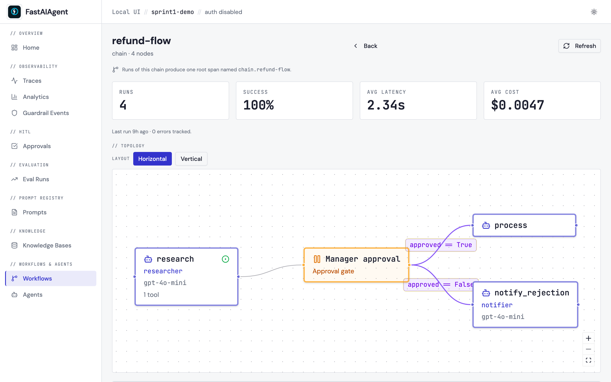
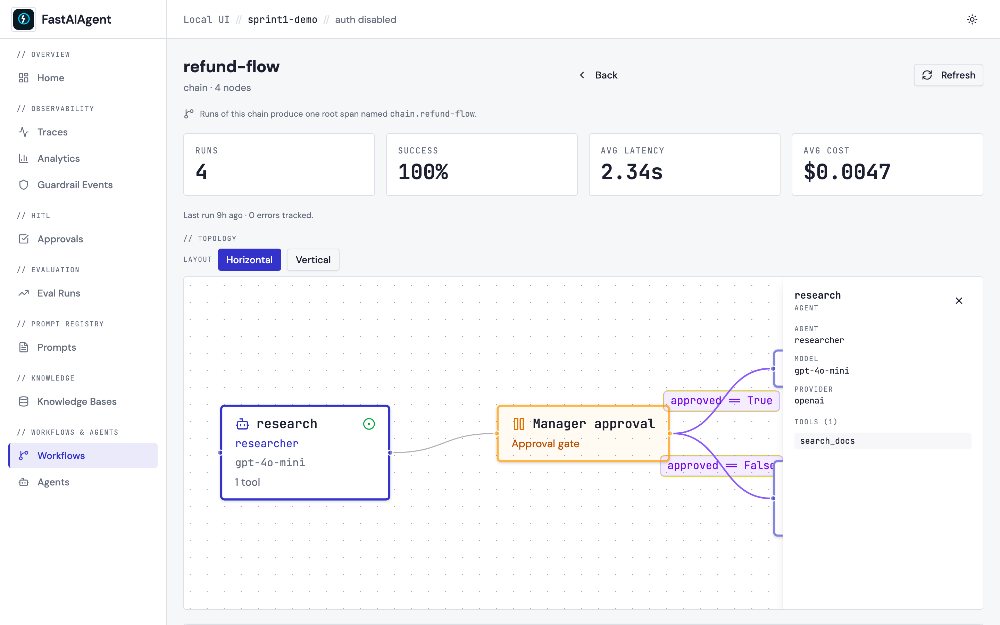

# Workflow visualization

The Local UI renders Chain, Swarm, and Supervisor topologies as an
interactive React Flow canvas. Each node and edge type has a distinct
visual treatment so the structure of your code is obvious at a glance.



The shot above is captured from a real running Local UI by
`scripts/capture-sprint1-screenshots.sh` against the
[`refund-flow` chain](#registering-a-workflow) defined in
[`examples/47_workflow_topology.py`](https://github.com/fastaifoundry/fastaiagent-sdk/blob/main/examples/47_workflow_topology.py).
The agent node `research` carries the green entry-point dot, conditional
edges out of the HITL gate carry their boolean expressions, and the
function node `process` is rendered with the wrench icon.

## Where it appears

- **Workflow detail page** (`/workflows/{runner_type}/{name}`): full
  topology view above the KPI cards and recent traces.
- **Agent detail page** (`/agents/{name}`): one compact preview card per
  registered workflow that contains this agent. Click the card to open
  the full view.

## Registering a workflow

Topology rendering reads from the runtime registry — the workflows you
pass to `build_app(runners=[...])`. Until a runner is registered the UI
shows a "No topology available" callout with a code snippet.

```python
from fastaiagent import Agent, Chain
from fastaiagent.ui.server import build_app

researcher = Agent(name="researcher", llm=llm)
writer     = Agent(name="writer",     llm=llm)

chain = Chain("refund-flow")
chain.add_node("research", agent=researcher)
chain.add_node("write",    agent=writer)
chain.connect("research", "write")

app = build_app(runners=[chain])
```

`Chain`, `Swarm`, and `Supervisor` instances are all accepted. The
registered name comes from `runner.name`.

## Node types

| Type | Visual | Used for |
|---|---|---|
| Agent | Rounded rectangle, primary border, bot icon | Chain agent nodes, Swarm peers, Supervisor workers |
| Supervisor | Rounded rectangle, emerald border, crown icon | The Supervisor itself |
| HITL | Rounded rectangle, amber border, pause icon | `interrupt()` / approval gates |
| Decision | Rounded rectangle, violet border, branch icon | Chain `condition` nodes |
| Function / Start / End | Rounded rectangle, neutral border, wrench / flag / square icon | Chain `tool`, `start`, `end`, `transformer`, `parallel` nodes |

The entry point — the topologically first node — gets a small green dot
indicator on the upper-right corner.

## Edge types

| Type | Style | Label |
|---|---|---|
| Sequential | Solid, default color | (none) |
| Conditional | Solid, violet | The condition expression |
| Handoff | Solid, primary color | `handoff` |
| Delegation | Dashed, emerald | `delegate` |

## Interaction



- **Click a node** to open a slide-out panel with the agent name, model,
  provider, and tool list (shown above).
- **Hover an edge** for a tooltip; conditional edges show their full
  expression on the edge label.
- **Pan and zoom** with standard React Flow controls (mouse drag,
  scroll, pinch).
- **Toggle layout** between horizontal (left-to-right) and vertical
  (top-to-bottom). The choice is persisted in
  `localStorage["fa.workflow.layout"]`.

## Topology JSON

The frontend reads from `GET /api/workflows/{runner_type}/{name}/topology`,
which returns a self-describing JSON document:

```json
{
  "name": "refund-flow",
  "type": "chain",
  "entrypoint": "research",
  "nodes": [
    {"id": "research", "type": "agent", "label": "researcher", "model": "gpt-4o", "tool_count": 2},
    {"id": "approval", "type": "hitl",  "label": "Manager approval"},
    {"id": "process",  "type": "tool",  "label": "process_refund", "tool_name": "process_refund"}
  ],
  "edges": [
    {"from": "research", "to": "approval", "type": "sequential"},
    {"from": "approval", "to": "process",  "type": "conditional", "condition": "approved == True"}
  ],
  "tools": [
    {"owner": "research", "name": "search_docs", "type": "function"}
  ],
  "knowledge_bases": []
}
```

The same endpoint shape works for Swarm (`type: "swarm"`, edges tagged
`handoff`) and Supervisor (`type: "supervisor"`, edges tagged
`delegation`).

## Edit-from-UI?

Topology rendering is **read-only**. Editing a workflow lives in code or
on Platform's visual canvas — not the local UI. The Local UI's job is to
make your code's structure visible, not to fork it.
