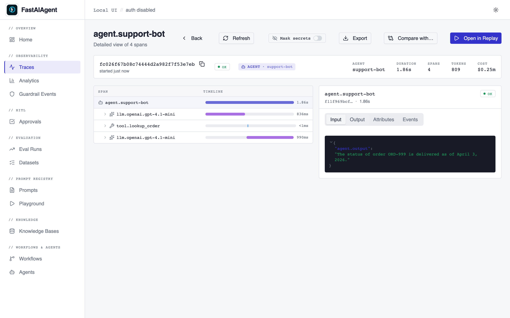
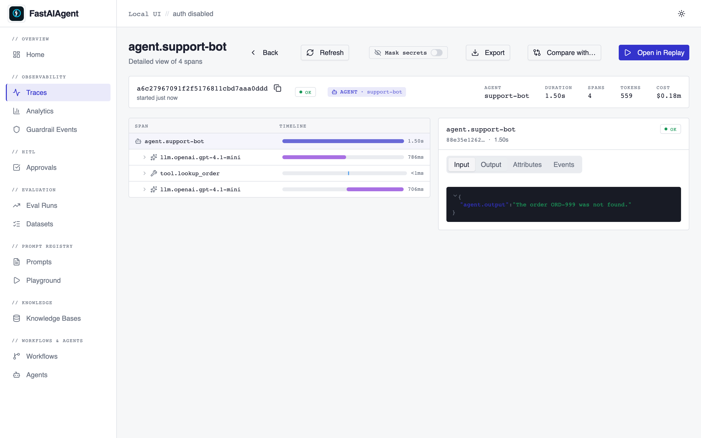

# Regression-from-trace Template

The full **trace → replay → fix → regression-test** loop in five
runnable scripts. Use this as the canonical pattern when a customer
reports an agent did something wrong: capture the failing trace, fork
it, swap the broken tool / prompt, replay, save the rerun as a
regression case, and verify with `evaluate()`.

> **The Bug.** This template *ships with a deliberately broken
> `lookup_order` tool* — see [`tools.py`](tools.py). Don't fix it in
> place: the whole point of the demo is to keep the bug, capture how
> it surfaces in a trace, and use the SDK's replay machinery to fix
> it without re-running production traffic.

## Before / after in the Local UI

| Failing trace | Fixed trace (after `with_tool_override`) |
|---|---|
|  |  |

Regenerate these via `bash scripts/capture-regression-from-trace-screenshots.sh`.

## What the template demonstrates

| Step | Script | What it does |
|---|---|---|
| 1 | [`capture.py`](capture.py) | Run the buggy agent against a customer question (`"What's the status of order ORD-999?"`). The buggy `lookup_order` silently returns ORD-001's record with the requested ID stamped on, so the agent confidently reports wrong delivery details. Trace ID is stashed for later steps. |
| 2 | [`analyze.py`](analyze.py) | Load the trace, walk every span, print the `tool.*` step that's the smoking gun. |
| 3 | [`fix.py`](fix.py) | `Replay.load(...).fork_at(0).with_tool_override("lookup_order", fixed)` and rerun **live** so the LLM sees the corrected tool output and produces a correct reply. |
| 4 | [`save_test.py`](save_test.py) | Append the corrected `(input, expected_output, source_trace_id)` to [`regression_dataset.jsonl`](regression_dataset.jsonl) — the same JSONL shape `evaluate()` reads natively. |
| 5 | [`verify.py`](verify.py) | Run `evaluate()` with the fixed agent against the dataset, scored by `LLMJudge(criteria="correctness")`. Every captured failure is now a passing regression case. |

## Quick start

```bash
cd examples/regression-from-trace
cp .env.example .env   # then put your OPENAI_API_KEY in .env
pip install -r requirements.txt

# Smoke tests — no LLM, ~30ms
pytest tests/

# The full loop, real LLM
zsh -lc 'python capture.py'    # ~2s
python analyze.py              # offline
zsh -lc 'python fix.py'        # ~3s
python save_test.py            # offline
zsh -lc 'python verify.py'     # ~10s, runs every case in regression_dataset.jsonl
```

`zsh -lc` is the recommended wrapper for any script that hits a real
LLM — it picks up `OPENAI_API_KEY` from `~/.zshrc` so subprocesses
inherit it.

## The loop, end-to-end

After `pip install -r requirements.txt` and setting your key, run the
five scripts in order. Expected console output (abridged):

```
Step 1: Reproducing the failure with the buggy lookup_order tool…
  Input:    "What's the status of order ORD-999?"
  Output:   'Your order ORD-999 for the MacBook Pro 16-inch has been delivered on 2026-04-03.'
  Trace ID: 21e56d2966b83575a13acd12ec3fdd93

Step 2: Loading trace 21e56d2966b83575a13acd12ec3fdd93…
  [0] agent.support-bot
        agent.output = Your order ORD-999 for the MacBook Pro 16-inch has been delivered on 2026-04-03.
  [1] llm.openai.gpt-4.1-mini
  [2] tool.lookup_order
        tool.name = lookup_order
  [3] llm.openai.gpt-4.1-mini
        gen_ai.response.content = Your order ORD-999 for the MacBook Pro 16-inch has been delivered on 2026-04-03.

Step 3: Forking trace … and swapping in the fixed tool…
  Original (buggy) output: 'Your order ORD-999 for the MacBook Pro 16-inch has been delivered on 2026-04-03.'
  Rerun (fixed) output:    'The order ORD-999 was not found.'

Step 4: Saving regression case to regression_dataset.jsonl…
  Dataset now has 4 case(s).

Step 5: Running evaluate() against regression_dataset.jsonl with the fixed agent…
  llm_judge correctness: 4/4 passed
  Loop complete: every captured failure is now a passing regression test.
```

## Why the bug is invisible to the LLM

The buggy `lookup_order` doesn't crash and doesn't return an obvious
sentinel. It looks like a successful lookup:

```python
# What the LLM sees when called with order_id="ORD-999"
{"id": "ORD-999", "item": "MacBook Pro 16-inch", "status": "delivered", "delivered_on": "2026-04-03"}
```

The `id` field matches what the user asked for, so there's nothing to
cross-check. This is the silent-failure class — the kind that lands
in production and only gets noticed when a customer complains. Most
fail-loud bugs (exceptions, structured errors) are caught by CI; the
silent ones need the trace → replay loop to surface and fix.

## Why a live rerun, not `determinism="recorded"`

`with_determinism("recorded")` skips the LLM HTTP call and replays
the captured `gen_ai.response.content`. That's the right choice when
the **prompt** is what you're fixing — the original tool calls were
correct, you just want a deterministic test of the prompt change.

For a **tool** fix, we need the LLM to re-ingest the (now correct)
tool output and re-generate its reply. So `fix.py` uses the default
`"live"` mode. See `docs/replay/guarantees.md` for the per-mode
matrix.

## Files

```
regression-from-trace/
├── README.md                # this file
├── .env.example             # OPENAI_API_KEY placeholder
├── requirements.txt         # fastaiagent>=1.14.0, python-dotenv
├── agent.py                 # build_buggy_agent / build_fixed_agent
├── tools.py                 # the bug + the fix, side by side
├── capture.py               # Step 1
├── analyze.py               # Step 2
├── fix.py                   # Step 3
├── save_test.py             # Step 4
├── verify.py                # Step 5
├── regression_dataset.jsonl # seeded with 3 cases, append-only
└── tests/
    ├── __init__.py
    └── test_template_smoke.py
```

Per-run artifacts (trace IDs, intermediate outputs) land under
`.fastaiagent-demo/regression-from-trace/`, which is gitignored.

## Extending the template

* **More buggy cases.** Add a new failing question, run `capture.py`
  with that input, `fix.py` it, save it. Each captured failure
  becomes a row in the dataset and stays caught forever.
* **Different fix shape.** Use `.modify_prompt(...)` instead of (or
  alongside) `.with_tool_override(...)` if the failure mode is a
  prompt issue, not a tool issue.
* **CI integration.** Add `pytest tests/` + `python verify.py` to
  your CI pipeline. The first catches drift in the template's shape;
  the second catches regression of any captured failure mode.

## See also

* `docs/replay/index.md` — the underlying replay API
* `docs/replay/guarantees.md` — per-determinism-mode fidelity matrix
* `docs/security.md` — opt-in redaction for production traces
